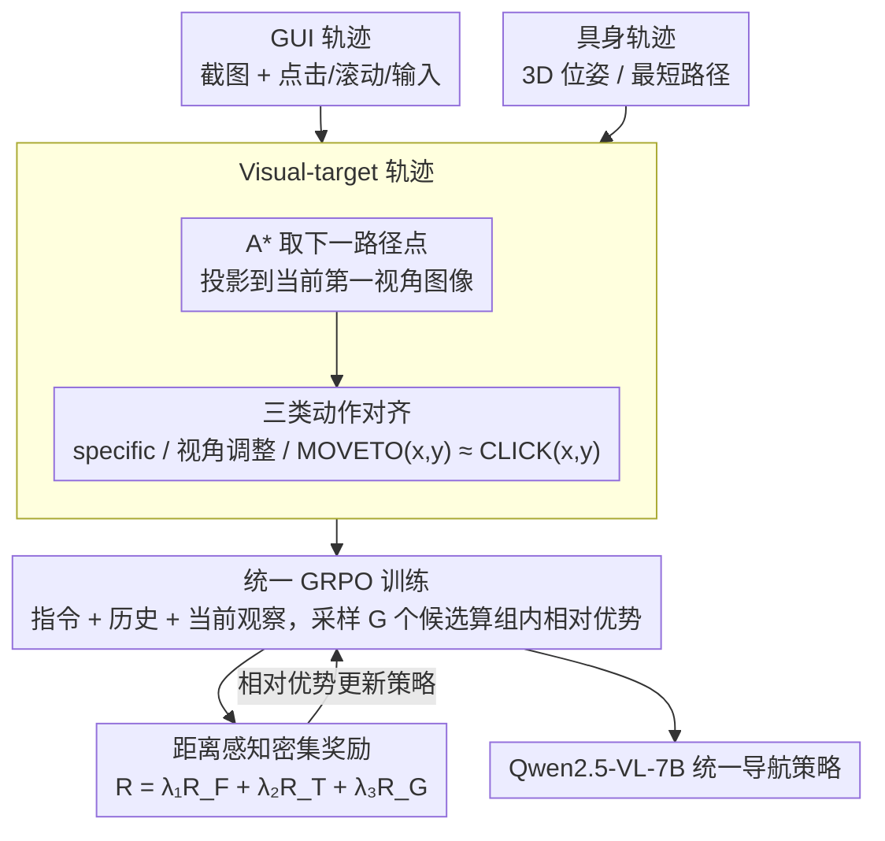

# NaviMaster: Learning a Unified Policy for GUI and Embodied Navigation Tasks

**会议**: ACL2026  
**arXiv**: [2508.02046](https://arxiv.org/abs/2508.02046)  
**代码**: https://iron-boyy.github.io/navimaster-page/  
**领域**: 强化学习 / 多模态智能体 / GUI导航 / 具身导航  
**关键词**: 统一导航策略、GUI智能体、具身导航、GRPO、密集奖励

## 一句话总结
NaviMaster 把 GUI 操作和具身导航都改写成“视觉目标定位 + 动作执行”的统一 MDP，并用混合轨迹上的 GRPO 与距离感知密集奖励训练一个 Qwen2.5-VL-7B 策略，在 OOD GUI、空间可供性预测和 ObjectNav 上都超过单域训练与主流基线。

## 研究背景与动机
**领域现状**：GUI agent 和 embodied navigation agent 都在借助多模态大模型做“看图、理解指令、规划下一步动作”。GUI 侧关注手机、网页、桌面界面中的点击、滚动、输入等操作；具身侧关注机器人或仿真体在 3D 环境中的转向、前进、停止等动作。两类任务表面上很不一样，但底层都需要模型根据当前第一视角观察、历史动作和自然语言指令决定下一步。

**现有痛点**：过去的训练体系基本是分开的。GUI 模型通常在 GUI-Odyssey、AITW、OmniAct 等数据上做 SFT 或 RFT；具身模型则在 Matterport、Habitat、RoboPoint 等数据上学习空间定位和导航。这样会带来两个直接问题：一是训练和部署要维护两套模型，无法复用跨任务的视觉空间能力；二是模型容易学到单一数据集里的快捷相关性，换到 OOD benchmark 后泛化不足。

**核心矛盾**：GUI 与具身导航的最大差异不在“是否需要导航”，而在动作空间的表达方式。GUI 的核心动作是显式坐标，例如点击某个像素点；具身导航的核心动作常常是隐式运动，例如前进、转身、停止。只要动作空间无法对齐，混合训练就会把两个任务当成松散拼盘，而不是同一个策略问题。

**本文目标**：作者希望回答三个问题：能否把 GUI 与具身导航统一成同一种轨迹表示；能否在同一个 RL 框架里同时优化两类任务；能否避免传统二值奖励过于稀疏，给坐标预测错误但接近目标的 rollout 也提供有效学习信号。

**切入角度**：论文从 MDP 视角观察两类任务：状态都是当前第一视角视觉观察，动作都是对界面或环境的交互，下一状态由当前状态和动作决定。进一步说，二者都需要从 egocentric observation 中积累历史信息，形成某种隐式的 allocentric 空间理解。因此作者选择从“视觉目标”入手，把具身前进也改写成对图像中目标点的定位。

**核心 idea**：用显式视觉目标把具身导航的 MOVEFORWARD 改写成 MOVETO(x, y)，从而让 GUI 点击和具身移动共享像素级 grounding 表示，再用混合数据上的 GRPO 与距离感知奖励训练统一导航策略。

## 方法详解
NaviMaster 的核心不是简单把 GUI 数据和机器人数据拼在一起，而是先把两者变成可比较的轨迹，再在同一个强化学习目标下训练。整套方法可以理解为三步：第一步构造 visual-target trajectory，把每一步都写成“观察、思考、动作”；第二步把每个轨迹步当作 GRPO 训练样本，让模型根据指令、历史和当前图像输出下一步动作；第三步用格式、动作类型和坐标距离组成奖励，让模型既能遵守输出协议，又能更精确地落点。

### 整体框架
输入是一条长程任务轨迹，包含用户指令 $I$、每一步观察 $o_i$ 和动作 $a_i$。对 GUI 轨迹，已有数据天然包含截图和点击/滚动/输入动作，因此可以直接转成统一格式。对具身导航，原始数据通常只有起点、终点或最短路径上的 3D 位姿，作者先用 A* 得到路径点，再把下一路径点投影到当前第一视角图像上，生成类似 GUI 点击坐标的视觉目标。

训练时，每个样本由三部分组成：用户指令 $I$，历史 $H_i=\{(t_0,a_0),...,(t_{i-1},a_{i-1})\}$，以及当前观察 $o_i$。模型输出 `<think>...</think><answer>...</answer>` 格式，其中 answer 是可执行 JSON 动作。GUI 图像的深度图设为零矩阵，具身图像则额外使用深度图来约束空间 grounding，避免两个 2D 上相近但深度差很大的点被错误认为等价。

### 关键设计

**1. Visual-target 轨迹：把两类动作空间拉到同一平面**

GUI 点击和具身移动表面上是两回事——前者输出像素坐标，后者输出“前进/转身”这类运动指令，动作空间不对齐，混合训练就只是把两个任务松散拼在一起。NaviMaster 把所有动作归成三类来对齐：语义固定的 specific action（GUI 的 BACK、具身的 STOP）、视角调整动作（GUI 的 SCROLL、具身的 TURN），以及最难统一的 localization action。关键改写就在第三类：GUI 本来就是 $\text{CLICK}(x,y)$，而具身的 MOVEFORWARD 被重写成 $\text{MOVETO}(x,y)$，坐标来自下一 3D 路径点在当前相机图像上的投影。

这一改写的价值在于让两类数据互相喂养：如果具身继续用无坐标的 MOVEFORWARD，模型只学到“运动控制”；如果 GUI 只用坐标点击，模型只学到“像素 grounding”。统一成视觉目标后，具身数据也为 GUI 需要的空间定位提供训练信号，GUI 数据反过来训练具身任务里的可供性定位，比直接拼接动作词表的统一性更强。

**2. 带历史思考的统一 GRPO 训练：在混合 MDP 上学跨任务策略**

单域 RL 容易过拟合某个任务的动作偏置——GUI 数据里 CLICK 占比极高，具身数据里转向和移动模式又很固定，单独训出来的策略换域就崩。NaviMaster 直接在混合 GUI 与具身样本上做强化学习：每一步训练时模型看到当前图像、任务指令和之前的 thought-action 历史，采样 $G$ 个候选响应，用 GRPO 计算组内相对优势 $Adv=(R(i,j)-mean(R))/std(R)$，其中 $R(i,j)$ 是该候选相对当前 ground truth 动作的质量。

整个流程采用 R1-Zero 风格，不靠额外 SFT 阶段蒸馏标准答案，而是直接在采样响应上比好坏。把策略暴露在一组不同 MDP 下，迫使它学习更通用的视觉对象恒存、相对空间关系和 affordance grounding，这正是混合训练能跨任务泛化的根源。

**3. 距离感知密集奖励：缓解二值 grounding 的稀疏性**

UI-R1、GUI-R1 这类方法常用二值奖励——预测点只要不落在目标区域内就一律为 0。但坐标空间是连续的大图像，这样会让大量“差一点点命中”的 rollout 完全没有梯度区分，训练效率很低。NaviMaster 把总奖励写成格式、动作类型和 grounding 三项的加权和 $R=\lambda_1R_F+\lambda_2R_T+\lambda_3R_G$：$R_F$ 检查输出是否可解析，$R_T$ 检查动作类别是否正确，$R_G$ 则按预测点与真实点的距离衰减，形式为 $R_G=(1-d_j/\theta_d)[d_j<\theta_d,p_j<\theta_h]$，其中 $d_j$ 是像素距离、$p_j$ 是深度差。

密集化的好处是给失败样本排了序——告诉模型“离目标近比离目标远更好”，让 GRPO 的组内相对优势更有信息量，训练曲线上升更快。深度项也很关键：GUI 没有深度时填零矩阵，具身任务则用深度避免两个 2D 投影相近、实际深度差很大的点被错误地当作等价。

### 损失函数 / 训练策略
实验基座是 Qwen2.5-VL-7B，训练框架使用 EasyR1。主实验训练 3 个 epoch，8 张 NVIDIA A800，global batch size 为 128，学习率从 $1e-6$ 线性降到 0，KL coefficient 为 0.01，`num_generations=5`，最大 prompt 长度 7000，最大 response 长度 1024。奖励权重设为 $\lambda_1=0.1,\lambda_2=1,\lambda_3=1$。

训练数据总量为 20k，其中 10k GUI 样本来自 GUI-Odyssey，10k embodied 样本来自 Matterport 3D 与 RoboPoint。GUI 子采样保留原始 173k GUI-Odyssey 的动作类型分布，避免因为抽样改变 CLICK、SCROLL、TYPE 等动作比例。若轨迹拼接后超过 7000 token，作者会从最早的历史步骤开始删除，直到 prompt 回到长度限制内。

## 实验关键数据
实验覆盖三类能力：GUI navigation、spatial affordance prediction 和 embodied navigation。GUI 侧主要看 grounding rate (GR) 与 step success rate (SR)；空间可供性预测看预测点是否落在 ground-truth mask 内；ObjectNav 看 SR 与 SPL。

### 主实验
下面只摘出最能体现结论的子集：GUI 表格覆盖 mobile、web、desktop 和 in-domain Odyssey；具身表格覆盖空间定位和完整导航。

| 任务 / 数据集 | 指标 | NaviMaster | 强基线 | 提升 / 观察 |
|--------|------|------|----------|------|
| GUI AC-Low | SR | 69.46 | UI-Shift 73.38 / GUI-R1 66.52 | 略低于 UI-Shift，但在 OOD 混合泛化下超过 GUI-R1 |
| GUI AC-High | SR | 55.89 | UI-Shift 52.16 / GUI-R1 51.56 | OOD 设置下高于主流 RL GUI agent |
| GUI AITW | SR | 59.72 | GUI-R1 55.31 / UI-Shift 54.38 | 在手机任务上保持较强泛化 |
| GUI Llamatouch | SR | 67.39 | UI-AGILE 66.10 / GUI-R1 61.27 | 高级操作成功率最高 |
| GUI GuiAct-W | SR | 86.17 | UI-Shift 79.43 / GUI-R1 74.54 | Web grounding 与动作成功率优势明显 |
| GUI OmniAct-D | SR | 62.47 | UI-AGILE 59.35 / GUI-R1 57.70 | 桌面任务上也能迁移 |
| Odyssey in-domain | SR | 48.35 | Ours w/o Embodied 46.38 | 加入具身数据没有损害 GUI 源域，反而略有提升 |

| 任务 / 数据集 | 指标 | NaviMaster | 对比方法 | 结论 |
|--------|------|------|----------|------|
| RoboReflT | SR | 77.34 | RoboPoint-13B 49.82 | 物体指代表现大幅领先 |
| Where2Place | SR | 52.97 | RoboPoint-13B 46.77 | free-space referring 受益于混合 grounding |
| RoboSpatial | SR | 21.65 | RoboPoint-13B 19.70 | 空间关系场景小幅领先 |
| RefSpatial | SR | 19.49 | Ours w/o GUI 18.19 / RoboPoint-13B 8.40 | GUI 数据对空间关系泛化有帮助 |
| ObjectNav unseen validation | SR | 33.20 | Qwen2.5-VL-7B 27.23 | 完整导航成功率提升 5.97 点 |
| ObjectNav unseen validation | SPL | 12.60 | Qwen2.5-VL-7B 9.68 | 路径效率也同步提升 |

### 消融实验

| 配置 | AC-High SR | AC-Low SR | Where2Place SR | RefSpatial SR | 说明 |
|------|---------|---------|---------|---------|------|
| NaviMaster | 55.89 | 69.46 | 52.97 | 19.49 | 主设置，GUI 与具身 1:1 混合，dense reward |
| hard / sparse reward | 54.07 | 68.39 | 44.01 | 14.28 | 稀疏奖励显著伤害具身 grounding |
| 7k samples | 52.66 | 70.41 | 41.07 | 18.19 | 少量数据下仍可训练，但空间可供性下降明显 |
| 仅 affordance 数据 | 52.34 | 68.94 | 52.04 | 19.67 | RoboPoint 类数据对空间定位强，但 GUI 略弱 |
| 仅 trajectory 数据 | 52.44 | 69.37 | 47.99 | 16.49 | 轨迹数据有利于导航流程，但不如混合完整 |
| $\lambda=(1,1,1)$ | 53.20 | 69.31 | 49.96 | 20.14 | 提高格式奖励权重没有带来整体最好结果 |
| $\lambda=(0.1,1,2)$ | 54.98 | 69.19 | 47.06 | 22.14 | grounding 权重更高时 RefSpatial 好，但整体不稳 |
| $\lambda=(0.1,2,1)$ | 54.10 | 70.72 | 46.06 | 23.34 | 类型奖励更高改善部分 GUI，但损伤 Where2Place |

| 奖励 / 阈值设置 | AC-High SR | AC-Low SR | Where2Place SR | RefSpatial SR | 说明 |
|------|---------|---------|---------|---------|------|
| 主设置，绝对阈值 | 55.89 | 69.46 | 52.97 | 19.49 | $\theta_d=200$ pixels，整体最好 |
| 相对阈值 | 53.61 | 67.56 | 51.99 | 18.48 | 容易随分辨率放宽，效果下降 |
| $\theta_d=100$ | 55.06 | 69.85 | 48.88 | 19.48 | 过严会减少有效奖励 |
| $\theta_d=300$ | 55.77 | 69.60 | 48.14 | 16.88 | 过宽会削弱定位监督 |
| $\theta_d=400$ | 53.61 | 68.58 | 51.06 | 16.68 | 定位奖励变得不够精细 |
| w/o format reward | 54.02 | 68.95 | 52.02 | 20.77 | 格式奖励对可执行输出有稳定作用 |
| w/o type reward | 55.66 | 70.60 | 48.99 | 18.18 | 类型奖励尤其影响具身空间定位 |

### 关键发现
- 混合训练是主要收益来源。完整 NaviMaster 在 GUI、空间可供性和 ObjectNav 上整体优于 w/o GUI 或 w/o Embodied，说明 GUI 的像素 grounding 与具身的空间 affordance 不是互相干扰，而是能提供互补监督。
- 奖励密集化对具身 grounding 特别关键。hard reward 在 Where2Place 上从 52.97 掉到 44.01，在 RefSpatial 上从 19.49 掉到 14.28，说明简单二值命中无法有效训练大范围坐标搜索。
- 1:1 数据比例最好。论文比较 0:10、1:9、3:7、5:5 等混合比例后发现 5:5 的平均 SR 最高，极端偏向单域会降低跨任务泛化。
- 绝对阈值比相对阈值更稳。作者选择 200 pixels 是为了避免大分辨率图像中的 reward hacking；在 1280x720 最低 GUI 分辨率下，半径 200 像素约等于 14% 面积比例，也和 GUI 社区常用评估口径接近。

## 亮点与洞察
- 最巧妙的点是把具身导航中的“前进”变成“朝当前图像上的某个点移动”。这个改写看似简单，但它把 3D 导航和 2D GUI 点击放进同一类 grounding 问题里，统一性比直接拼接动作词表更强。
- 论文没有把跨任务统一停留在 prompt 层，而是给出了轨迹构造、动作空间、RL 奖励和评估 benchmark 的完整闭环。这让 NaviMaster 更像一个训练范式，而不是单个模型 trick。
- 密集奖励的价值在这里非常直观：GUI 和具身任务都存在巨大连续坐标空间，二值奖励会浪费大量“差一点点”的样本。距离感知奖励把失败样本排序，让 GRPO 的组内相对优势更有信息量。
- 混合训练带来的提升不只是数据量增加。作者还构造了 visual-relation benchmark，要求模型根据“某个按钮上方第二个按钮”这类相对关系定位目标，结果混合模型明显更好，说明具身数据可能真的强化了空间关系推理。
- 这个思路可以迁移到其他 agent 任务。例如网页自动化、桌面软件操作、移动机器人抓取都可以被写成“视觉观察 + 历史 + 目标点/离散动作”的统一策略，再通过任务特定 reward 做联合 RFT。

## 局限与展望
- 作者承认当前轨迹数据仍然把 GUI 与 embodied 作为两类不同任务处理，没有包含同一条轨迹中同时穿插 GUI 操作和物理导航的真实样本。因此 NaviMaster 还不是完整的 physical-digital hybrid agent。
- 具身动作被改写成 MOVETO(x, y) 后，依赖投影和深度估计质量。若路径点不可见、遮挡严重、相机姿态噪声大，视觉目标可能不稳定，训练标签也会变得含噪。
- ObjectNav 结果虽然有提升，但 SR 仍只有 33.20、SPL 12.60，说明统一 VLM policy 离强具身导航系统还有距离，尤其缺少长期地图记忆、探索策略和闭环运动控制。
- 实验主要在虚拟环境和离线 benchmark 中进行，真实 OS 与真实机器人中的安全约束、执行延迟、失败恢复还没有充分验证。GUI agent 若直接操作真实系统，也可能触发隐私泄露或危险操作。
- 后续可以考虑收集真正跨域的任务，例如机器人先在网页上查找目标信息，再在房间里导航到对应物体；也可以把低层控制器、地图构建和安全过滤器接入 NaviMaster，让统一策略负责高层 grounding 与决策。

## 相关工作与启发
- **vs OS-Atlas / UI-TARS**: 这些 GUI agent 强调大规模 GUI SFT 与界面动作建模，主要解决 2D UI grounding。NaviMaster 的区别是把 GUI 数据与具身数据放进同一 RL 框架，优势是跨域空间泛化更强，劣势是 GUI 专项最强 benchmark 上未必全面超过专门调优模型。
- **vs UI-R1 / GUI-R1 / infiGUI-R1**: 这些方法把 R1 风格强化学习引入 GUI action prediction，奖励通常围绕点击坐标准确性设计。NaviMaster 继承了 RFT 思路，但用距离感知密集奖励替代纯二值命中，并把 embodied navigation 纳入同一动作-奖励体系。
- **vs RoboPoint / SpaceLLaVA**: RoboPoint 和 SpaceLLaVA 更关注机器人空间可供性或特定具身场景的视觉语言适配。NaviMaster 不只做空间点预测，还将其纳入长程导航策略，并利用 GUI 数据反向提升空间关系定位。
- **vs Embodied Web Agent / OmniActor**: 这些工作同样尝试连接数字界面和物理环境。NaviMaster 的启发在于它没有只做 zero-shot/few-shot 任务编排，而是明确设计可训练的统一轨迹、统一 RL 目标和统一 reward，因此更适合作为 general navigation agent 的训练底座。

## 评分
- 新颖性: ⭐⭐⭐⭐⭐ 将 GUI 点击与具身移动统一为 visual-target navigation 的 formulation 很清晰，且奖励设计和混合训练配套完整。
- 实验充分度: ⭐⭐⭐⭐ 覆盖 GUI、空间可供性、ObjectNav、数据比例、奖励、阈值和超参消融，但真实跨域混合轨迹和真实系统验证仍不足。
- 写作质量: ⭐⭐⭐⭐ 主线明确，方法和实验闭环完整；不足是部分表格很大，正文对少数分析图只给趋势没有展开具体数值。
- 价值: ⭐⭐⭐⭐⭐ 对通用多模态 agent 很有启发，尤其是把不同交互范式压到同一 grounding 表示再统一做 RL 的路线，后续可扩展空间很大。

<!-- RELATED:START -->

## 相关论文

- [\[ICCV 2025\] Embodied Navigation with Auxiliary Task of Action Description Prediction](../../ICCV2025/reinforcement_learning/embodied_navigation_with_auxiliary_task_of_action_description_prediction.md)
- [\[ACL 2026\] Targeted Exploration via Unified Entropy Control for Reinforcement Learning](targeted_exploration_via_unified_entropy_control_for_reinforcement_learning.md)
- [\[ACL 2026\] KASER: Knowledge-Aligned Student Error Simulator for Open-Ended Coding Tasks](kaser_knowledge-aligned_student_error_simulator_for_open-ended_coding_tasks.md)
- [\[ACL 2026\] Visually-Guided Policy Optimization for Multimodal Reasoning](visually-guided_policy_optimization_for_multimodal_reasoning.md)
- [\[AAAI 2026\] InfiGUI-G1: Advancing GUI Grounding with Adaptive Exploration Policy Optimization](../../AAAI2026/reinforcement_learning/infigui-g1_advancing_gui_grounding_with_adaptive_exploration_policy_optimization.md)

<!-- RELATED:END -->
