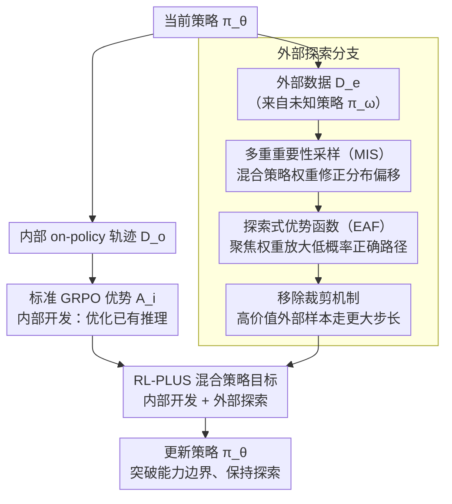

# RL-PLUS: Countering Capability Boundary Collapse of LLMs in Reinforcement Learning with Hybrid-policy Optimization

**会议**: ACL 2026  
**arXiv**: [2508.00222](https://arxiv.org/abs/2508.00222)  
**代码**: [GitHub](https://github.com/YihongDong/RL-PLUS)  
**领域**: LLM推理 / 强化学习  
**关键词**: 能力边界坍塌, 混合策略优化, 多重重要性采样, 探索优势函数, RLVR

## 一句话总结

RL-PLUS 提出混合策略优化方法，通过多重重要性采样（MIS）解决外部数据分布不匹配问题，以及探索式优势函数（EAF）引导模型学习低概率但正确的推理路径，成功突破 RLVR 导致的能力边界坍塌，在六个数学推理基准上达到 SOTA（平均 53.4），且跨模型一致提升最高达 69.2%。

## 研究背景与动机

**领域现状**：基于可验证奖励的强化学习（RLVR，如 GRPO/DAPO）已显著提升 LLM 的复杂推理能力，通过在正确答案上给予奖励来优化长链推理。

**现有痛点**：RLVR 本质上是 on-policy 策略——模型只能从自己生成的轨迹中学习。这导致了"能力边界坍塌"问题：虽然 pass@1 提升了，但 pass@128 反而低于基座模型。也就是说，RLVR 让模型更善于选择已知的正确路径（inward exploitation），但缩小了可解决问题的范围（capability boundary）。同时，策略熵急剧下降（entropy collapse），模型变得过于确定性。

**核心矛盾**：RLVR 在 LLM 巨大的动作空间和稀疏奖励下，无法有效引导模型探索新的推理路径（outward exploration）。SFT 可以引入外部知识但不善于内化推理原则。两者的简单组合（如 GRPO w/ SFT Loss）反而性能下降。

**本文目标**：设计一种有效融合外部数据和内部探索的 RLVR 方法，打破基座模型的能力上限。

**切入角度**：从孔子"学而不思则罔，思而不学则殆"出发——当前 RLVR 是"思而不学"（只靠自己推理），需要在 RL 过程中有效"学习"外部知识。关键挑战是：(1) 外部数据的分布不匹配如何处理？(2) 如何从外部数据中高效提取新知识？

**核心 idea**：用混合策略（内部 on-policy 轨迹 + 外部数据）进行强化学习，通过 MIS 稳定off-policy 更新，通过 EAF 放大低概率正确路径的学习信号。

## 方法详解

### 整体框架

RL-PLUS 的训练目标融合两部分：$\mathcal{J}_{\text{RL-PLUS}} = \underbrace{\mathbb{E}_{(o_i, A_i) \sim \mathcal{D}_o}[r_{i,t}(\theta) A_i]}_{\text{内部开发}} + \underbrace{\mathbb{E}_{(e_i, A_{i,t}^c) \sim \mathcal{D}_e}[r_{i,t}^m(\theta) A_{i,t}^c]}_{\text{外部探索}}$。第一项是标准 GRPO（优化已有推理能力），第二项是核心创新（从外部数据学习新知识），使用 MIS 修正分布偏移，用 EAF 聚焦低概率正确路径。整体上，当前策略同时跑出内部 on-policy 轨迹与采样外部数据，前者走标准 GRPO 通道开发已有能力，后者经 MIS、EAF、移除裁剪三道处理后注入外部知识，两条路汇成统一目标更新策略。

### 关键设计

**1. 多重重要性采样（Multiple Importance Sampling）：让外部数据稳定地参与 off-policy 更新**

外部数据来自某个未知策略 $\pi_\omega$，和当前策略 $\pi_\theta$ 分布不匹配——标准 on-policy IS 对它有系统偏差（Lemma A.5），直接 off-policy IS 又方差过大（Lemma A.7），两条路都走不通。MIS 的做法是不去直接估计 $\pi_\omega$，而把外部样本看成来自混合策略 $\pi_\omega+\pi_{\theta_{old}}$，重要性权重写成 $r_{i,t}^m(\theta)=\frac{2\pi_\theta(e_{i,t}|q,e_{i,<t})}{\pi_\omega(e_{i,t}|q,e_{i,<t})+\pi_{\theta_{old}}(e_{i,t}|q,e_{i,<t})}$。对未知的 $\pi_\omega$，采用贝叶斯最优估计 $\hat{\pi}_\omega^*=\frac{1}{2}\pi_{\theta_{old}}+\frac{1}{2}\mathcal{U}$（旧策略与均匀分布等权混合），在最大不确定性下最小化 L2 风险。

这样得到的是低偏差、低方差的折中：即使 $\pi_\omega$ 与 $\pi_\theta$ 差异很大，分母里 $\pi_{\theta_{old}}$ 的存在也能托住权重、防止它爆炸，外部数据因此能稳定地注入梯度而不让训练崩掉。

**2. 探索式优势函数（Exploration-Based Advantage Function）：放大正确但低概率的推理路径**

新知识往往藏在模型自己不敢走的低概率 token 上，而模型天然倾向高概率（已有知识），所以光把外部数据稳定引入还不够，得显式逼模型“看见”这些被忽略的路径。EAF 在标准归一化优势上乘一个聚焦权重：$A_{i,t}^c=\frac{R_i-\text{mean}(R)}{\text{std}(R)}\cdot C_{i,t}$，其中 $C_{i,t}=(1-\text{detach}(\pi_\theta(e_{i,t}|q,e_{i,<t})))^\gamma$。

这一项受 Focal Loss 启发——当模型给某个正确 token 的概率很低（说明它不善于探索这条路）时，$C_{i,t}$ 变大，把该路径的优势信号放大，迫使模型重点学习这些新推理方式；反之对已经掌握的高概率 token 则不额外加权。

**3. 移除裁剪机制：让高价值外部数据走更大步长**

标准 GRPO 用 $\text{clip}(r_t,1-\epsilon,1+\epsilon)$ 限制单步更新幅度，但这恰好和外部探索的目标冲突——低概率事件（新知识）正是最该大步优化的对象，裁剪会把这些高信息量路径的学习信号压下去。因此 RL-PLUS 对外部数据项移除裁剪，允许策略对高价值外部样本做更大胆的更新。

### 损失函数 / 训练策略

基于 Qwen2.5-Math-7B 训练，使用 NuminaMath-1.5 作为训练数据（含外部数据）。省略 KL 正则项（长 CoT 推理场景中策略需要大幅偏离初始策略）。

## 实验关键数据

### 主实验

**六个数学推理基准 (Qwen2.5-Math-7B)**

| 方法 | AIME24 | AIME25 | AMC | MATH-500 | Minerva | Olympiad | 平均 |
|------|--------|--------|-----|----------|---------|----------|------|
| Base Model | 11.5 | 4.9 | 31.3 | 43.6 | 7.4 | 15.6 | 19.0 |
| GRPO | 25.1 | 15.3 | 62.0 | 84.4 | 39.3 | 46.8 | 45.5 |
| LUFFY | 29.4 | 23.1 | 65.6 | 87.6 | 37.5 | 57.2 | 50.1 |
| SFT+GRPO | 25.8 | 23.1 | 62.7 | 87.2 | 39.7 | 50.4 | 48.2 |
| **RL-PLUS** | **33.4** | **25.9** | **68.1** | **90.2** | **43.8** | **58.8** | **53.4** |

**OOD 任务（编程+科学QA）**

| 方法 | HumanEval | LeetCode | LiveCodeBench | ARC-c | GPQA | MMLU-Pro | 平均 |
|------|-----------|----------|---------------|-------|------|----------|------|
| GRPO | 63.4 | 21.1 | 15.3 | 81.7 | 40.4 | 47.5 | 44.9 |
| SFT+GRPO | 59.8 | 8.3 | 9.7 | 72.4 | 24.2 | 37.7 | 35.4 |
| **RL-PLUS** | **68.3** | **27.8** | **19.2** | **82.3** | **40.4** | **54.7** | **48.8** |

### 消融实验

| 方法 | AIME24 | AIME25 | AMC | MATH-500 | Minerva | Olympiad | 平均 |
|------|--------|--------|-----|----------|---------|----------|------|
| RL-PLUS (完整) | **33.4** | **25.9** | **68.1** | **90.2** | **43.8** | **58.8** | **53.4** |
| - EAF | 28.3 | 24.1 | 67.8 | 88.8 | 40.4 | 56.0 | 50.9 |
| - MIS | 25.1 | 15.3 | 62.0 | 84.4 | 39.3 | 46.8 | 45.5 |

### 关键发现

- MIS 是更关键的组件（去掉后下降 7.9 分 vs EAF 的 2.5 分），说明稳定引入外部数据是基础
- RL-PLUS 在 LLaMA-3.1-8B 上实现了绝对 11.9 分的提升（GRPO 在该模型上几乎无效），展现强泛化性
- Pass@k 曲线显示 RL-PLUS 在所有 k 值上持续超越基座模型，证明真正突破了能力边界
- GRPO w/ SFT Loss 反而比单独 GRPO 差（40.1 vs 45.5），说明简单融合外部知识是困难的
- 训练动态显示 RL-PLUS 的策略熵不降为零，保持了探索能力

## 亮点与洞察

- "能力边界坍塌"问题的形式化和实验验证非常有说服力——pass@k 曲线是直观且有力的证据
- 理论分析严谨：MIS 的方差有界性证明、贝叶斯最优策略估计都有完整的数学推导
- 解决了一个实际难题：如何在 RL 训练中有效使用外部数据而不导致分布不匹配或训练崩溃
- OOD 表现优异说明 RL-PLUS 学到的是通用推理能力而非任务特定的技巧

## 局限与展望

- 外部数据来源（NuminaMath-1.5）的质量和覆盖范围会影响效果，对外部数据的选择策略未深入探讨
- 贝叶斯策略估计中的等权假设（$\pi_{\theta_{old}}$ 和 $\mathcal{U}$ 各 50%）可能不是最优的
- 仅在数学推理任务上验证，代码生成等其他推理任务的效果需进一步验证
- $\gamma$ 超参数的敏感性分析不够充分

## 相关工作与启发

- **vs LUFFY**: LUFFY 选择性模仿高质量外部轨迹，但使用混合策略的方式较粗糙；RL-PLUS 通过 MIS 提供了理论上更优的分布修正
- **vs ReLIFT**: ReLIFT 交替 RL 和在线微调，RL-PLUS 在统一框架中同时进行
- **vs GRPO w/ SFT Loss**: 直接加 SFT loss 反而有害，说明外部数据的融合方式至关重要
- **启发**：Focal Loss 思想在 RL 优势函数中的应用是一个有趣的跨领域迁移

## 评分

- 新颖性: ⭐⭐⭐⭐⭐ 问题定义、MIS 方案和 EAF 设计都具有原创性和理论深度
- 实验充分度: ⭐⭐⭐⭐⭐ 六个基准、六个 OOD 任务、四种基座模型、pass@k 分析、完整消融
- 写作质量: ⭐⭐⭐⭐ 理论推导扎实，实验全面，论文结构清晰
- 价值: ⭐⭐⭐⭐⭐ 解决了 RLVR 的核心限制，方法通用性强，对 LLM 推理训练有重要参考价值

<!-- RELATED:START -->

## 相关论文

- [\[ACL 2026\] HEALing Entropy Collapse: Enhancing Exploration in Few-Shot RLVR via Hybrid-Domain Entropy Dynamics Alignment](healing_entropy_collapse_enhancing_exploration_in_few-shot_rlvr_via_hybrid-domai.md)
- [\[ACL 2026\] EvoCoT: Overcoming the Exploration Bottleneck in Reinforcement Learning for LLMs](evocot_overcoming_the_exploration_bottleneck_in_reinforcement_learning.md)
- [\[ICLR 2026\] Controllable Exploration in Hybrid-Policy RLVR for Multi-Modal Reasoning](../../ICLR2026/reinforcement_learning/controllable_exploration_in_hybrid-policy_rlvr_for_multi-modal_reasoning.md)
- [\[ACL 2026\] Bridging SFT and RL: Dynamic Policy Optimization for Robust Reasoning](bridging_sft_and_rl_dynamic_policy_optimization_for_robust_reasoning.md)
- [\[ICML 2026\] Metis: Learning to Jailbreak LLMs via Self-Evolving Metacognitive Policy Optimization](../../ICML2026/reinforcement_learning/metis_learning_to_jailbreak_llms_via_self-evolving_metacognitive_policy_optimiza.md)

<!-- RELATED:END -->
