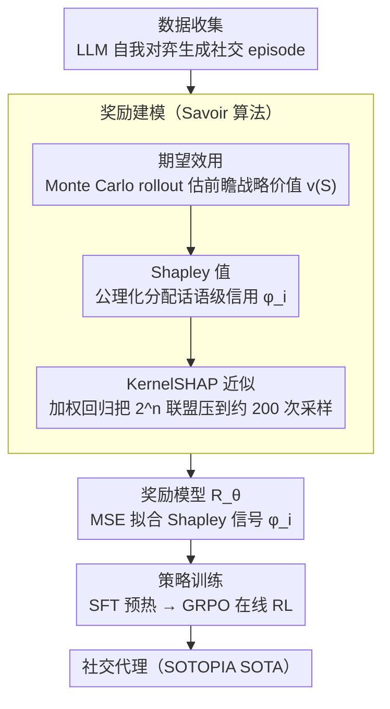

# Savoir: Learning Social Savoir-Faire via Shapley-based Reward Attribution

**会议**: ACL 2026 Findings  
**arXiv**: [2604.18982](https://arxiv.org/abs/2604.18982)  
**代码**: 无  
**领域**: 社交智能 / 强化学习  
**关键词**: 社交智能, Shapley值, 信用分配, 合作博弈论, 期望效用

## 一句话总结

本文提出 Savoir，一个基于合作博弈论的社交 RL 框架，结合期望效用（前瞻性评估话语的战略潜力）和 Shapley 值（公理化公平信用分配）解决多轮对话中的信用分配问题，在 SOTOPIA 基准上以 7B 模型达到 SOTA 性能（Hard 设置 Goal 7.18），匹配或超越 GPT-4o 和 Claude-3.5-Sonnet，且大型推理模型（o1、DeepSeek-R1）在社交任务上系统性欠佳。

## 研究背景与动机

**领域现状**：社交智能——驾驭复杂人际交互的能力——是 LLM 应用于谈判、协作和说服场景的核心需求。近期研究通过 RL 方法训练社交代理：SOTOPIA-π 结合行为克隆和自我强化，Sotopia-RL 用 LLM 启发式地将 episode 级奖励分配到话语级。

**现有痛点**：(1) Sotopia-RL 的信用分配缺乏理论基础——LLM 直接分配奖励，没有公平性或准确性的原则性保证；(2) 更根本的是，现有奖励模型执行**回顾性归因**（这句话对已发生结果贡献了多少），而非**前瞻性估值**（这句话为后续有利交互创造了多少战略潜力）。一些话语即时贡献看起来很小，但其战略定位为后续成功解锁了关键路径。

**核心矛盾**：社交交互本质是多轮、多目标、涉及竞争的，个体话语的价值不仅在于当前贡献，更在于它为未来创造的可能性空间。回顾性归因无法捕捉这种前瞻性的战略价值。

**本文目标**：(1) 用博弈论公理化解决多轮对话的信用分配问题；(2) 区分话语的回顾性贡献和前瞻性战略价值；(3) 在小模型上实现超越大模型的社交智能。

**切入角度**：将每次社交对话视为合作博弈，每句话语是一个玩家，联合贡献于最终结果。用 Shapley 值的数学保证（效率、对称、边际贡献公理）替代 LLM 的启发式分配。

**核心 idea**：期望效用定义"衡量什么"（通过 rollout 评估话语的前瞻性战略价值），Shapley 值定义"如何分配"（公理化保证的公平信用分布），两者结合将信用分配从启发式转变为原则性计算。

## 方法详解

### 整体框架

Savoir 的训练管道分三个阶段：(1) 数据收集——LLM 自我对弈生成社交交互 episode；(2) 奖励建模——用 Savoir 算法将 episode 级结果归因到话语级，训练奖励模型；(3) 策略训练——SFT 预热后用 GRPO 在线 RL。核心创新在阶段 (2)：给定对话 $\tau$ 中代理的 $n$ 句话语 $N = \{a_1, \ldots, a_n\}$，计算每句话语的 Shapley 值 $\phi_i$ 作为奖励信号——这一步内部又拆成"用期望效用衡量价值、用 Shapley 值公平分配、用 KernelSHAP 把计算压可行"三层。

### 关键设计

**1. 期望效用（Expected Utility）：把话语评估从"过去贡献了什么"换成"为未来创造了什么"**

现有奖励模型做的是回顾性归因——一句话对已经发生的结果贡献了多少；但社交里一句精心设计的提案即时贡献往往看起来很小，真正价值在于它为后续有利轨迹解锁的战略空间，回顾性视角恰恰看不到这一层。Savoir 改用前瞻性的价值函数 $v(S)=\mathbb{E}_{\tau'\sim\mathcal{R}(H(S))}[U(\tau')]$，其中 $H(S)$ 是只保留子集 $S$ 中话语及其伙伴回应后重构的对话历史，$\mathcal{R}(H(S))$ 是从该状态出发的未来轨迹分布。

由于这个期望无法解析求出，论文用 Monte Carlo 模拟近似：$v(S)=\frac{1}{J}\sum_{j=1}^J U(\tau_j)$，让代理策略 $\pi_A$ 和伙伴策略 $\pi_B$ 交替补完整段对话，再按 SOTOPIA 七个维度加权聚合效用 $U(\tau)=\sum_d w_d\cdot G_d(\tau)$。只有真正 rollout 走一遍未来，才能把“这句话埋下的后手”量化成价值。

**2. Shapley 值：用公理化分配替代 LLM 的启发式归因**

Sotopia-RL 直接让 LLM 把 episode 级奖励拆到话语级，没有任何公平性保证——某些话语可能被过度或不足归因。Savoir 把一次对话当成合作博弈，每句话语是一个玩家，用 Shapley 值衡量它在所有可能排列中的平均边际贡献：$\phi_i=\sum_{S\subseteq N\setminus\{i\}}\frac{|S|!(n-|S|-1)!}{n!}[v(S\cup\{i\})-v(S)]$。

这么做的底气在于 Shapley 值是唯一同时满足效率（所有话语 Shapley 值之和等于总价值）、对称性、零贡献者和可加性四条公理的分配方案——把“怎么分才公平”从拍脑袋变成有数学保证的计算，得到的话语级奖励信号也因此更可靠。

**3. KernelSHAP 近似：把指数级计算压成可行的加权回归**

精确算 Shapley 值要枚举 $2^n$ 个联盟、每个还要 $J$ 次 rollout，话语一多就完全不可行。Savoir 借 KernelSHAP 把它重构成加权最小二乘问题 $\phi^*=\arg\min_\phi\sum_k w_k(v(S_k)-\sum_i\phi_i\cdot z_{ki})^2$，其中 SHAP 核权重 $w_k$ 对极端大小（非常小或非常大）的联盟赋予更高权重，因为这些联盟提供的边际贡献信息量最大。

配合优先采样极端大小联盟的智能采样策略，原本需要 $2^n$ 次价值评估的计算被压到约 200 次联盟采样就能高精度逼近，让 Shapley 归因在实际训练里跑得动。

### 损失函数 / 训练策略

奖励模型训练用 MSE 损失 $\mathcal{L}_\text{RM} = \mathbb{E}[(R_\theta(c,a) - \hat{\phi})^2]$；策略训练分两阶段：先在 GPT-4o 自我对弈 episode 上 SFT 预热，再用 GRPO（Group Relative Policy Optimization）在线 RL。Savoir 的 rollout 使用 $J=2$ 次模拟，联盟采样上限为 200。

## 实验关键数据

### 主实验

**SOTOPIA 基准主要结果（Goal 指标，0-10 分）**

| 模型/方法 | Self-Play All | Self-Play Hard | GPT-4o Partner All | GPT-4o Partner Hard |
|---------|-------------|-------------|-------------------|-------------------|
| GPT-4o | 8.19 | 6.97 | 8.19 | 6.97 |
| Claude-3.5-Sonnet | 8.29 | 6.33 | 8.42 | 6.64 |
| OpenAI-o1 | 7.93 | 5.69 | 8.09 | 6.65 |
| DeepSeek-R1 | 7.97 | 5.86 | 7.92 | 6.20 |
| o3-mini | 7.38 | 5.14 | 7.96 | 6.33 |
| Sotopia-RL (7B) | 7.80 | 7.81 | 8.31 | 6.68 |
| **Savoir (7B)** | **8.43** | **7.93** | **8.42** | **7.18** |

### 消融实验

**EU 与 Shapley 的组件解耦（SOTOPIA-Hard, GPT-4o Partner）**

| 变体 | EU | Shapley | Goal | Avg |
|------|-----|---------|------|-----|
| 基线 (Sotopia-RL) | × | × | 6.68 | 3.29 |
| EU-only | ✓ | × | 6.89 | 3.38 |
| Shapley-only | × | ✓ | 6.96 | 3.42 |
| **Savoir (Full)** | ✓ | ✓ | **7.18** | **3.51** |

### 关键发现

- 7B Savoir 超越所有大模型：在 Self-Play All 上 8.43 vs GPT-4o 的 8.19，在 Hard 设置上 7.93 vs 6.97（+13.8%）
- **大型推理模型系统性欠佳**：o3-mini 在 Self-Play Hard 上仅 5.14 vs Savoir 7.93（差距 54.3%），说明社交智能需要直觉式响应而非深思熟虑的推理链
- EU 和 Shapley 解决正交问题：EU 单独提升 3.1%（更好的价值估计），Shapley 单独提升 4.2%（更公平的分配），组合提升 7.5%——两者互补而非重叠
- 人工评估中策略性评分 4.06 vs Sotopia-RL 的 3.41（+19.1%，$p<0.01$），奖励公平性偏好 67.1% vs 15.7%
- 训练数据从 2K 到 7.5K episode 持续提升，最大增益在 3K-5K 之间（Goal +8.6%）

## 亮点与洞察

- 将 Shapley 值引入社交对话的信用分配是理论优雅和实践有效的完美结合——四个公理保证的公平性直接转化为更好的奖励信号
- "推理模型不擅长社交"的发现非常有洞察力——o1、R1 等模型的"过度思考"可能反而损害需要直觉和灵活性的社交交互
- 期望效用的 rollout 机制捕捉了"战略定位"的价值——某些看似无关紧要的话语可能是后续成功的关键铺垫

## 局限与展望

- Rollout 和联盟采样的计算成本高（每个 episode 约 200 次联盟 × 2 次 rollout），限制了大规模应用
- 评估依赖 GPT-4o 作为 evaluator，可能引入评估偏差
- 面对越来越强的对话伙伴性能下降：vs Gemini-3-Pro Goal 降低 17.8%，说明泛化能力有限
- 仅在 SOTOPIA 基准上评估，真实世界社交场景的复杂度可能更高

## 相关工作与启发

- **vs Sotopia-RL**: Sotopia-RL 用 LLM 启发式分配奖励，Savoir 用 Shapley 值公理化分配，后者在所有设置上提升 1.3-8.1%
- **vs SOTOPIA-π**: SOTOPIA-π 用行为克隆 + 过滤，信号粒度为 episode 级；Savoir 提供话语级细粒度奖励
- **vs DSI**: DSI 在 Self-Play Hard 达 7.31，Savoir 达 7.93（+8.5%），且在 GPT-4o Partner 设置上优势更大

## 评分

- 新颖性: ⭐⭐⭐⭐⭐ Shapley 值 + 期望效用在社交 RL 中的应用具有理论深度和实践创新
- 实验充分度: ⭐⭐⭐⭐⭐ 主实验 + 组件消融 + 人工评估 + 数据规模分析 + 对手强度分析，极为全面
- 写作质量: ⭐⭐⭐⭐⭐ 理论推导清晰，动机到方法的逻辑链完整，案例分析生动
- 价值: ⭐⭐⭐⭐⭐ 7B 模型超越 GPT-4o 的社交智能具有重要实践意义，推理模型欠佳的发现有深远影响

<!-- RELATED:START -->

## 相关论文

- [\[NeurIPS 2025\] Approximating Shapley Explanations in Reinforcement Learning](../../NeurIPS2025/reinforcement_learning/approximating_shapley_explanations_in_reinforcement_learning.md)
- [\[ICLR 2026\] Efficient Estimation of Kernel Surrogate Models for Task Attribution](../../ICLR2026/reinforcement_learning/efficient_estimation_of_kernel_surrogate_models_for_task_attribution.md)
- [\[ICML 2026\] Shapley Neuron Values for Continual Learning: Which Neurons Matter Most?](../../ICML2026/reinforcement_learning/shapley_neuron_values_for_continual_learning_which_neurons_matter_most.md)
- [\[ACL 2026\] The Stackelberg Speaker: Optimizing Persuasive Communication in Social Deduction Games](the_stackelberg_speaker_optimizing_persuasive_communication_in_social_deduction_.md)
- [\[ACL 2026\] Breaking the Impasse: Dual-Scale Evolutionary Policy Training for Social Language Agents](breaking_the_impasse_dual-scale_evolutionary_policy_training_for_social_language.md)

<!-- RELATED:END -->
