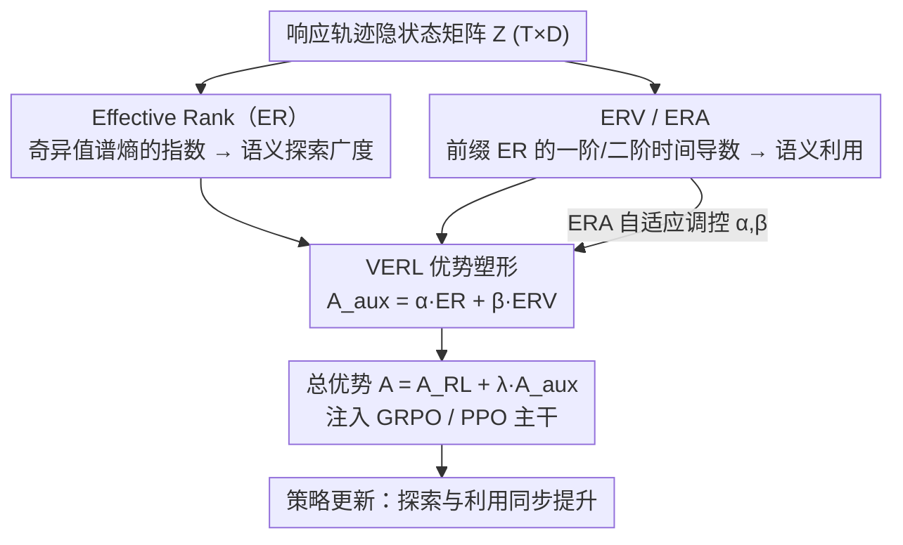

# Semantic-Space Exploration and Exploitation in RLVR for LLM Reasoning

**会议**: ACL 2026 Findings  
**arXiv**: [2509.23808](https://arxiv.org/abs/2509.23808)  
**代码**: [https://github.com/hf618/VERL](https://github.com/hf618/VERL)  
**领域**: 强化学习 / LLM 推理  
**关键词**: RLVR, 探索-利用, 隐状态语义空间, Effective Rank, 推理增强

## 一句话总结

本文指出 RLVR 中传统的 token 级探索-利用权衡是测量方式的伪象，提出在隐状态语义空间中用 Effective Rank (ER) 和其时间导数 (ERV/ERA) 来解耦探索与利用，并据此设计 VERL 方法实现两者的同步提升，在高考数学等基准上获得高达 21.4% 的提升。

## 研究背景与动机

**领域现状**：RLVR（带可验证奖励的强化学习）已成为提升 LLM 推理能力的主流范式。当前主流叙事将训练进展解释为探索（寻找多样化推理路径）与利用（精炼已知最优策略）的平衡。

**现有痛点**：探索和利用几乎完全通过 token 级动作空间的代理指标来操作化——探索对应高熵的下一 token 分布，利用对应高置信度分布。但 token 级统计量衡量的是下一 token 的不确定性，而非推理如何在多 token 语义结构上推进。这导致两种失效模式：高熵可能只是放大了词汇多样性而未触及新的语义方向；低熵可能过早将轨迹收敛到熟悉的语义区域。

**核心矛盾**：广泛讨论的"探索-利用权衡"可能不是推理行为的内在属性，而是在 token 级动作空间中测量的伪象。

**本文目标**：(1) 在语义空间而非动作空间中定义和度量探索与利用；(2) 证明两者在语义空间中可以解耦并同步提升；(3) 设计利用此解耦的实用训练方法。

**切入角度**：利用 Transformer 隐状态自然编码丰富语义结构的先验知识，将隐状态序列视为语义轨迹，用有效秩（Effective Rank）及其时间导数来刻画语义层面的探索和利用。

**核心 idea**：探索-利用在 token 级呈负相关是代理指标的局限，在隐状态语义空间中两者近乎零相关，因此可以通过辅助优势信号同时增强两者。

## 方法详解

### 整体框架

VERL 是一个即插即用的优势塑形方法，可集成到 GRPO 或 PPO 等 RL 算法中。核心流程：对每个响应轨迹，计算隐状态矩阵的 ER（探索度量）和 ERV（利用度量），用 ERA 作为元控制变量自适应调节两者的激励强度，将辅助信号注入标准 RL 优势函数。

### 关键设计

**1. Effective Rank（ER）—— 语义空间里的探索度量**

token 级的熵衡量的是下一个 token 的不确定性，并不能反映推理在多 token 语义结构上铺开了多少方向。本文转而看隐状态：给定响应的隐状态矩阵 $Z \in \mathbb{R}^{T \times D}$，对其奇异值 $\{\sigma_j\}$ 归一化成概率分布 $p_j = \sigma_j / \sum_k \sigma_k$，把有效秩定义为谱熵的指数 $\text{ER}(Z) = \exp(-\sum_j p_j \log p_j)$。ER 越大表示轨迹在语义空间中跨越的方向越多（探索更广），越小则集中在少数方向。相比离散且对谱集中度不敏感的传统秩，ER 是连续的有效维度——当奇异谱变平坦时它会增长，从而捕捉到传统秩看不见的语义层面精化。

**2. ERV 与 ERA —— 语义利用的一阶与二阶度量**

光看 ER 这个"广度"还不够，利用体现在语义复杂度沿轨迹是怎么精化的，于是引入 ER 的时间导数。ERV（一阶）定义为前缀 ER 相对于历史均值偏差的时间平均 $\Delta^{(1)}_{\text{ER}} = \frac{1}{K-1}\sum_{j=2}^K \delta_{j \cdot s}$，其中 $\delta_{j \cdot s} = m_{j \cdot s} - \frac{1}{j-1}\sum_{k=1}^{j-1} m_{k \cdot s}$；ERA（二阶）则是 $\delta$ 自身的变化率 $\Delta^{(2)}_{\text{ER}} = \frac{1}{K-2}\sum_{j=3}^K [\delta_{j \cdot s} - \delta_{(j-1) \cdot s}]$，刻画精化是在加速还是已经饱和。两个关键性质支撑了整套设计：ER 与 ERV 在语义空间中近乎零相关（这正是"探索-利用权衡是测量伪象"论点的来源），而 ERA 在短期波动下理论上更稳定、不随语义方向数 $k$ 线性增长。经验上正确轨迹的特征不是更高的 ER 或 ERV，而是更高的 ERA——即"精化在持续加速"，这使 ERA 成为比零阶/一阶量更可靠的推理质量信号。

**3. VERL 优势塑形：把语义信号注入标准 RL 训练**

有了解耦的探索/利用度量，就能在不改动 RL 主干的前提下同时激励两者。对每个响应，构造辅助优势 $A_{\text{aux}} = \alpha \cdot \hat{\text{ER}} + \beta \cdot \hat{\text{ERV}}$（$\hat{\text{ER}}$、$\hat{\text{ERV}}$ 为标准化后的值），其中权重 $\alpha,\beta$ 由 ERA 自适应调控：ERA 高（精化加速）时调小利用激励以防过拟合，ERA 低（饱和）时加大利用激励。最终优势为 $A = A_{\text{RL}} + \lambda A_{\text{aux}}$，$\lambda$ 控制辅助信号整体强度。之所以两路信号不会互相抵消，正是因为 ER 与 ERV 近零相关；而 ERA 的 $O(1)$ 稳定性又让它适合当元控制变量。该模块即插即用，可挂到 GRPO 或 PPO 上。

### 损失函数 / 训练策略

在 GRPO 或 PPO 的标准目标上增加辅助优势信号，总优势为 $A_{\text{total}} = A_{\text{RL}} + \lambda A_{\text{aux}}$。训练配置使用 8K 难度 MATH 问题（Level 3-5），配合可验证参考答案。

## 实验关键数据

### 主实验

**数学推理基准 Pass@1（部分）**

| 模型 | AIME24 | Gaokao 2024_I | GSM8K | Avg (15 benchmarks) |
|------|--------|--------------|-------|---------------------|
| Llama-3.2-3B-Instruct | 0.0 | 14.3 | 66.6 | 31.0 |
| + GRPO | 3.3 | 21.4 | 80.7 | 41.4 |
| + GRPO w/ VERL | **13.3** | **14.3→22.0** | **82.2** | **44.3** |
| Qwen2.5-7B + GRPO | — | — | — | — |
| + GRPO w/ VERL | — | — | — | +2.9 avg |

### 消融实验

| 配置 | 关键指标 | 说明 |
|------|---------|------|
| VERL (ER+ERV+ERA) | 最优 | 完整方法 |
| 仅 ER (探索) | 次优 | 缺少利用信号 |
| 仅 ERV (利用) | 次优 | 缺少探索信号 |
| 固定 α,β (无 ERA) | 下降 | 缺乏自适应调节 |
| Token-level 替代 | 明显下降 | 验证语义空间的优势 |

### 关键发现

- ER 和 ERV 的经验相关性接近零，为"探索-利用权衡是测量伪象"的论点提供了有力证据
- 错误轨迹往往具有更高的 ER 和 ERV，但正确轨迹具有更高的 ERA——说明"大且快"不如"持续精化"重要
- VERL 在 Gaokao 2024 上提升 21.4%（绝对准确率），显示在挑战性任务上特别有效
- 传统秩在训练后期趋于平稳，而 ER 仍在增长——说明模型在利用现有语义方向方面更均匀而非发现新方向

## 亮点与洞察

- 将"探索-利用权衡是伪象"这一反直觉论点通过理论（近零相关性证明）和实验（ER/ERV 的解耦可视化）双重验证，是本文最核心的贡献
- ERA 作为二阶信号区分正确/错误轨迹的发现很深刻——正确推理的特征不是"探索得广"或"精化得快"，而是"精化在持续加速"
- VERL 的即插即用设计使其可以轻松集成到 GRPO、PPO 等不同 RL 算法中

## 局限与展望

- 需要提取隐状态并做 SVD 计算，增加了训练开销
- 理论分析依赖"语义因素可从隐状态线性解码"的假设，这在所有模型上可能不完全成立
- 仅在数学推理基准上验证，未测试代码生成或自然语言推理等其他推理任务
- ERA 的元控制策略中的超参数可能对不同模型/数据需要调整

## 相关工作与启发

- **vs 传统 entropy-based 方法**: 传统方法在 token 级操作，面临探索-利用负耦合；VERL 在语义空间操作，实现正向解耦
- **vs Effective Rank 相关工作**: 先前工作用 ER 分析模型表示质量，本文首次将 ER 的时间导数用于 RL 训练信号

## 评分

- 新颖性: ⭐⭐⭐⭐⭐ 从全新视角（语义空间 vs 动作空间）重新理解 RLVR 中的探索利用，理论洞察深刻
- 实验充分度: ⭐⭐⭐⭐ 多模型多算法验证，但仅限数学推理任务
- 写作质量: ⭐⭐⭐⭐⭐ 理论推导严谨，动机阐述清晰，图表直观有力
- 价值: ⭐⭐⭐⭐⭐ 挑战了 RLVR 领域的主流叙事，并提供了实用的解决方案

<!-- RELATED:START -->

## 相关论文

- [\[ICLR 2026\] Exploration vs Exploitation: Rethinking RLVR through Clipping, Entropy, and Spurious Reward](../../ICLR2026/reinforcement_learning/exploration_vs_exploitation_rethinking_rlvr_through_clipping_entropy_and_spuriou.md)
- [\[ICLR 2026\] Controllable Exploration in Hybrid-Policy RLVR for Multi-Modal Reasoning](../../ICLR2026/reinforcement_learning/controllable_exploration_in_hybrid-policy_rlvr_for_multi-modal_reasoning.md)
- [\[ACL 2026\] Targeted Exploration via Unified Entropy Control for Reinforcement Learning](targeted_exploration_via_unified_entropy_control_for_reinforcement_learning.md)
- [\[ACL 2026\] HEALing Entropy Collapse: Enhancing Exploration in Few-Shot RLVR via Hybrid-Domain Entropy Dynamics Alignment](healing_entropy_collapse_enhancing_exploration_in_few-shot_rlvr_via_hybrid-domai.md)
- [\[AAAI 2026\] Reasoning with Exploration: An Entropy Perspective](../../AAAI2026/reinforcement_learning/reasoning_with_exploration_an_entropy_perspective.md)

<!-- RELATED:END -->
