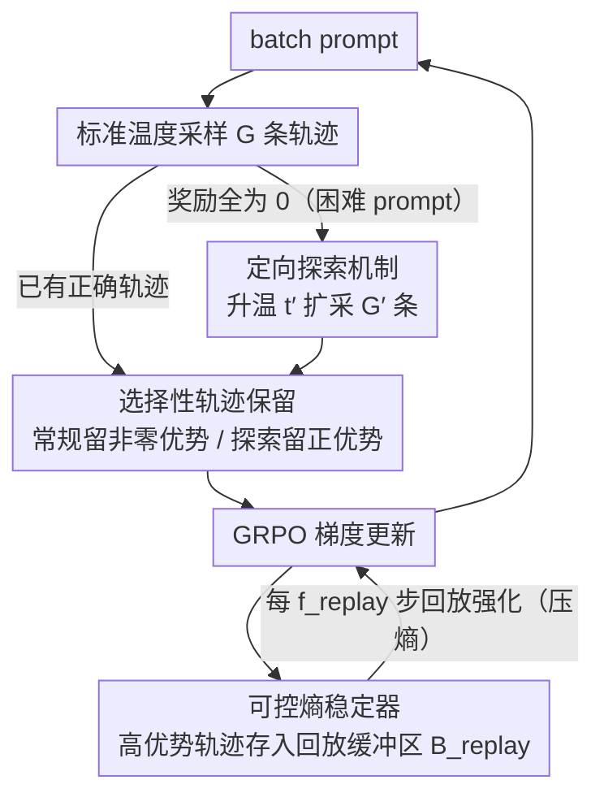

# Targeted Exploration via Unified Entropy Control for Reinforcement Learning

**会议**: ACL 2026 Findings  
**arXiv**: [2604.14646](https://arxiv.org/abs/2604.14646)  
**代码**: [GitHub](https://github.com/597358816/UEC-RL)  
**领域**: 多模态VLM  
**关键词**: 熵控制, GRPO, 探索策略, 强化学习, 推理增强

## 一句话总结

本文提出 UEC-RL，一个统一的双向熵控制框架，通过对困难 prompt 进行高温定向探索（增大熵）和通过经验回放稳定器巩固高质量轨迹（减小熵），解决 GRPO 中普遍存在的熵坍塌和训练不稳定问题，在 Geometry3K 上实现 37.9% 的相对提升。

## 研究背景与动机

**领域现状**：强化学习（RL）已成为 LLM/VLM 后训练的核心范式，GRPO 作为轻量级 PPO 替代方案被广泛采用——去掉 critic 网络，通过组内归一化奖励估计优势，计算效率高且推理性能有竞争力。

**现有痛点**：GRPO 在复杂推理任务上存在两个突出问题：(1) **熵坍塌**——策略熵快速下降，模型过早收敛到低多样性行为，无法发现低概率但有价值的推理路径；(2) **训练不稳定**——在多模态推理等复杂场景中，采样输出的正确性差异大，GRPO 的组归一化奖励无法提供充分的方差缩减，导致梯度更新脆弱。

**核心矛盾**：GRPO 缺乏双向熵调节机制——既不能主动增大熵来增强探索，也不能在高方差环境中稳定熵来保证收敛。现有补救方法要么引入更新方差（DAPO 的 clip-higher），要么引入优化偏差（熵奖励/熵整形优势优化的是熵相关目标而非任务奖励）。

**本文目标**：设计一个统一框架，在需要时增大熵以深度探索，在探索变得无效时减小熵以保证收敛。

**切入角度**：基于自然策略梯度的熵变定理——当高优势动作在当前策略下概率低时（负协方差），策略更新会增大熵；反之减小熵。因此可以通过提高采样温度来放大负协方差效应，选择性地对困难 prompt 增大探索。

**核心 idea**：用两个协同组件实现双向熵控制——定向探索机制（对难 prompt 升温采样+筛选有价值轨迹）和可控熵稳定器（通过经验回放反复强化高质量轨迹以减小熵），在训练全程动态平衡探索与利用。

## 方法详解

### 整体框架

UEC-RL 建立在 GRPO 之上。对每个 batch 的 prompt，先用标准温度采样 $G$ 条轨迹。如果某个 prompt 所有 $G$ 条轨迹的奖励都为 0（标记为"困难"），则额外用升高温度 $t' > 1$ 扩展采样 $G'$ 条轨迹。筛选有价值的轨迹用于梯度更新，同时将高质量轨迹存入回放缓冲区。定期从缓冲区回放以稳定训练。

### 关键设计

**1. 定向探索机制：只对"卡住"的 prompt 升温扩搜**

GRPO 的熵坍塌根源在于：模型一旦在某些难题上反复采不到正确答案，组归一化优势就全为 0，这些 prompt 不再贡献梯度，模型只能在已会的简单题上越收越窄。UEC-RL 用一个零成本的信号判断"困难"——标准温度采样的 $G$ 条轨迹奖励全为 0（$\max_i R_i = 0$）即判定该 prompt 卡住，此时改用软化分布（温度 $t' > 1$）额外采样 $G'$ 条。升温的作用可由熵变定理解释：当高优势动作在当前策略下概率偏低时会出现负协方差，进而推高策略熵；而 $t'$ 缩小了高低概率动作之间的差距，正是放大了这种负协方差，等于"有控制地"把熵往上抬。因为只在困难 prompt 上激活，简单 prompt 的采样开销和分布完全不受影响，探索预算被精准投到最需要的地方。

**2. 可控熵稳定器：用经验回放把好轨迹"焊死"，反向压熵**

光升温会让熵无止境地涨，训练同样发散，所以需要一个反向的收敛力。稳定器把探索阶段挖到的高优势轨迹（优势 $> A_0$）存进固定大小的回放缓冲区 $\mathcal{B}_{replay}$，只保留最新的 $s'$ 条，并每 $f_{replay}$ 步从中采样做一次回放更新。这一步的关键在于它的熵效应正好和探索相反：反复强化高优势轨迹会把概率质量搬到正确推理模式上，根据定理 4.2 这会产生正协方差从而减小熵。换句话说，探索负责"开口子放熵进来"，回放负责"把找到的好答案焊死、顺带把熵压回去"，两者一推一拉，让训练从探索阶段自然过渡到收敛阶段。回放还顺带解决了"好轨迹初始概率太低、只用一次梯度信号太弱"的样本效率问题。

**3. 选择性轨迹保留：探索不等于无差别鼓励随机性**

并非升温采出来的所有轨迹都该进梯度——低优势的探索样本本质是噪声，直接喂进去会污染优化和泛化。所以保留规则按来源区分：常规样本保留全部非零优势轨迹（$\hat{A}_{i,t} \neq 0$，正负都要，提供完整的对比信号），扩展采样的探索样本则只留正优势轨迹（$\hat{A}_{i,t} \geq 0$）。这条规则把"有效探索"落到实处——强调的是有信息量、高质量的多样性，而不是为了多样性而注入随机噪声。

### 损失函数 / 训练策略

基于 GRPO 目标函数，使用 clipped surrogate 目标 + KL 散度正则化。超参数包括探索温度 $t'$、探索组大小 $G'$、回放大小 $s'$、回放频率 $f_{replay}$。

## 实验关键数据

### 主实验（文本推理，Qwen2.5-math-7B）

| 方法 | AIME24 | MATH | GSM8K | MMLU | 平均 |
|------|--------|------|-------|------|------|
| GRPO | 25.8 | 77.6 | 87.1 | 45.0 | 50.34 |
| DAPO | 24.3 | 78.3 | 87.6 | 48.5 | 51.77 |
| **UEC-RL** | **28.5** | **80.4** | **87.9** | **50.2** | **53.62** |

Geometry3K 多模态推理（Qwen2.5-VL-7B）：

| 方法 | 准确率 | vs UEC-RL |
|------|--------|-----------|
| 基线 | 38.44 | -16.97 |
| GRPO | 50.75 | -4.66 |
| **UEC-RL** | **55.41** | - |

### 消融实验

| 配置 | Geometry3K | 说明 |
|------|-----------|------|
| UEC-RL (full) | 55.41 | 完整模型 |
| w/o 探索 | ~50 | 回到 GRPO 水平 |
| w/o 回放 | ~52 | 训练不稳定 |
| w/o 选择性保留 | ~51 | 噪声样本影响优化 |

### 关键发现
- UEC-RL 在文本和多模态推理上一致超过所有 RL 基线，平均提升 +2.88%（Qwen2.5-math-7B）和 +1.07%（VLM）
- 在 Geometry3K 上实现 37.9% 的相对提升（38.44→55.41），同时训练效率更高（每步时间仅 GRPO 的 0.79×）
- Pass@k 评估中 UEC-RL 也一致领先，说明不仅 top-1 准确率高，生成多样性也更好
- 探索和稳定两个组件都是必要的：单独使用任何一个都无法达到最佳效果

## 亮点与洞察
- **双向熵控制的思路**很巧妙：不是简单地"减缓熵下降"（如 DAPO），而是在需要时主动增大熵、在需要收敛时主动减小熵。这种基于熵变定理的理论指导使得设计更加 principled
- **"困难 prompt 检测→定向探索"**的策略很实用：零成本判断困难程度（所有采样失败 = 困难），然后只对困难样本增加计算预算，资源利用效率高
- **经验回放在 LLM RL 中的应用**：将经典 RL 中的回放思路引入 GRPO 训练，不仅提高了样本效率，还通过反复强化提供了理论上有保证的熵稳定效果

## 局限与展望
- 仅在 7B/8B 规模模型上验证，更大模型的效果未知
- 探索温度 $t'$、回放频率 $f_{replay}$ 等超参数需要调优
- 困难 prompt 的检测（所有采样失败）是二值化的，可能遗漏"部分困难"的样本
- 理论分析基于自然策略梯度的近似，与实际 clipped 目标之间存在 gap
- 回放缓冲区可能引入分布偏移问题，虽然只保留最新轨迹可以缓解

## 相关工作与启发
- **vs GRPO**: GRPO 缺乏熵调节，UEC-RL 添加双向熵控制。两者使用相同的基础目标函数
- **vs DAPO**: DAPO 通过 clip-higher 减缓熵下降但引入更新方差，UEC-RL 通过定向探索+回放稳定器更精细地控制熵
- **vs 熵奖励/KL-cov**: 这些方法通过优化熵相关项引入偏差，UEC-RL 通过调节采样策略间接影响熵，不改变优化目标

## 评分
- 新颖性: ⭐⭐⭐⭐ 双向熵控制框架理念清晰，理论支撑扎实
- 实验充分度: ⭐⭐⭐⭐ 覆盖文本+多模态、多基准、Pass@1 和 Pass@k
- 写作质量: ⭐⭐⭐⭐ 结构清晰，理论推导和实验分析连贯
- 价值: ⭐⭐⭐⭐ 对 GRPO 训练的改进有实际指导意义，代码开源

<!-- RELATED:START -->

## 相关论文

- [\[AAAI 2026\] Reasoning with Exploration: An Entropy Perspective](../../AAAI2026/reinforcement_learning/reasoning_with_exploration_an_entropy_perspective.md)
- [\[ACL 2026\] HEALing Entropy Collapse: Enhancing Exploration in Few-Shot RLVR via Hybrid-Domain Entropy Dynamics Alignment](healing_entropy_collapse_enhancing_exploration_in_few-shot_rlvr_via_hybrid-domai.md)
- [\[ACL 2026\] NaviMaster: Learning a Unified Policy for GUI and Embodied Navigation Tasks](navimaster_learning_a_unified_policy_for_gui_and_embodied_navigation_tasks.md)
- [\[ACL 2026\] Semantic-Space Exploration and Exploitation in RLVR for LLM Reasoning](semantic-space_exploration_and_exploitation_in_rlvr_for_llm_reasoning.md)
- [\[ICLR 2026\] Entropy-Preserving Reinforcement Learning (REPO / ADAPO)](../../ICLR2026/reinforcement_learning/entropy-preserving_reinforcement_learning.md)

<!-- RELATED:END -->
