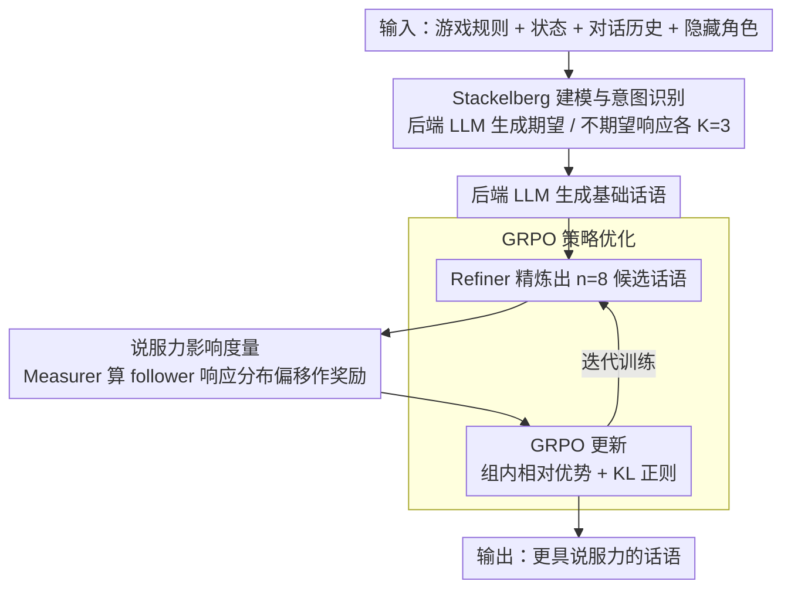

# The Stackelberg Speaker: Optimizing Persuasive Communication in Social Deduction Games

**会议**: ACL 2026  
**arXiv**: [2510.09087](https://arxiv.org/abs/2510.09087)  
**代码**: [https://3dagentworld.github.io/leader_follower](https://3dagentworld.github.io/leader_follower)  
**领域**: 强化学习 / 社交推理游戏  
**关键词**: 说服性通信, 社交推理游戏, Stackelberg博弈, GRPO, LLM智能体

## 一句话总结

本文将社交推理游戏中的回合制对话建模为 Stackelberg 博弈，当前玩家作为 leader 通过度量下一玩家的响应分布来优化话语的说服力影响，使用 GRPO 训练 Refiner 模型在狼人杀、阿瓦隆等四个游戏基准上显著超越基线。

## 研究背景与动机

**领域现状**：LLM 智能体在社交推理游戏（SDGs）如狼人杀、阿瓦隆等中取得了显著进展。现有方法主要聚焦信息处理（推断其他玩家角色）和策略选择（选择最优行动）。

**现有痛点**：现有方法忽视了说服性通信的核心作用——在 SDGs 中，成功不仅取决于做出正确推断，更取决于说服他人按照自己的意图行动。现有 RL 方法（如 SLA、LSPO）将丰富的自然语言空间简化为有限动作分类问题，无法在连续语言空间中优化话语。

**核心矛盾**：SDGs 的核心挑战不是"知道什么是对的"，而是"让别人相信自己是对的"。说服性维度是游戏成功和真实人类交互的核心，但在当前研究中几乎未被触及。

**本文目标**：显式建模和优化社交推理游戏中的说服性通信，使智能体能主动引导对话流向有利结果。

**切入角度**：借用博弈论中的 Stackelberg 博弈框架——如果 leader 充分理解 follower 对不同行动的响应分布，就可以选择最大化自身效用的行动。在回合制对话中，当前说话者就是 leader。

**核心 idea**：训练一个 Refiner 模型将基础话语精炼为更具说服力的版本，奖励信号基于该话语对下一玩家响应概率分布的偏移量（增加期望响应概率、减少不期望响应概率）。

## 方法详解

### 整体框架

分三步：(1) 意图识别——API LLM 分析当前局势，生成期望/不期望的 follower 响应各 K=3 组；(2) 影响度量——API LLM 生成基础话语，Refiner 将其精炼为多个候选，Measurer 计算每个候选对 follower 响应分布的偏移作为奖励；(3) 策略优化——用 GRPO 优化 Refiner 使其最大化说服力影响。

### 关键设计

**1. Stackelberg 建模与意图识别：把"说服"翻译成可优化的目标**

社交推理游戏里最难量化的就是"说服力"——它既不是胜率（太滞后、太稀疏），也不是简单的动作分类（SLA、LSPO 那样把丰富的自然语言压成有限候选，等于把说服这一维度直接抹掉）。本文借 Stackelberg 博弈给它一个清晰的载体：每个说话回合中，当前玩家 $p_t$ 是 leader、下一玩家 $p_{t+1}$ 是 follower，leader 的目标就是"知道 follower 会怎么反应，然后挑最有利的话来说"。落地时，后端 LLM 综合游戏规则 $\mathcal{R}$、状态 $G_t$、对话历史 $D_t$ 和隐藏角色 $r_t$，生成各 $K=3$ 组的期望响应 $\hat{u}_{t+1}^{+,(k)}$ 和不期望响应 $\hat{u}_{t+1}^{-,(k)}$。这一步把模糊的"我想让他相信我"具象成一组明确的目标响应，为后面用概率偏移来打分铺好了路。

**2. 说服力影响度量：在 follower 的概率空间里给每句话打分**

有了目标响应，还得有个客观的标尺衡量"某句话到底有多说服人"——人工标注主观又贵，启发式评估又不可靠。本文的做法是用 Qwen2.5-72B 作为 Measurer 去模拟 follower 的响应模式，直接在它的概率空间里度量：对候选话语 $u_t^{(i)}$，奖励为期望响应的对数概率之和减去不期望响应的对数概率之和

$$R(u_t^{(i)}) = \sum_k \log P_\mathcal{F}(\hat{u}_{t+1}^{+,(k)} | \text{ctx} \cup \{u_t^{(i)}\}) - \sum_k \log P_\mathcal{F}(\hat{u}_{t+1}^{-,(k)} | \text{ctx} \cup \{u_t^{(i)}\})$$

也就是说，一句话越能抬高对方说出"我们想要的话"的概率、越能压低"我们不想要的话"的概率，分数就越高。用一个独立可访问概率的大模型来当 follower，还顺手绕开了 GPT-4o 这类 API LLM 拿不到 token 概率的限制。

**3. GRPO 策略优化：让小模型专做"话术增强"**

有了奖励信号，就用它来训练 Refiner——一个 Qwen2.5-7B + LoRA（rank 16）的小模型，职责单一：把后端强 LLM 生成的基础话语精炼成更有说服力的版本。每条基础话语采样 $n=8$ 个候选，用 GRPO 算组内相对优势做策略更新，并加 KL 散度正则防止跑偏。选 GRPO 是因为它不需要额外的 critic，直接拿这一批 8 个候选的奖励分布算相对优势就能更新。这种"强 API LLM 管语义理解、小 Refiner 管说服力增强"的分工，让方法可以叠加在任意现有策略之上而非取而代之。

### 损失函数 / 训练策略

GRPO 目标函数：$\mathcal{J}(\theta) = \mathbb{E}_c[\frac{1}{n}\sum_i \mathcal{L}_i - \beta D_{KL}(\pi_\theta || \pi_{ref})]$，n=8, ε=0.2, β=0.04。每游戏 500 局自对弈，选 4000 实例训练。后端 LLM 随机选自 GPT-4o/Gemini-2.5-Flash/Claude-3.5-Haiku。学习率 $1 \times 10^{-6}$，4×A800 训练 3 epochs 约 50 小时。

## 实验关键数据

### 主实验

| 游戏 | 方法 | 总体胜率 |
|------|------|---------|
| 狼人杀 | LSPO | 38.6% |
| 狼人杀 | **Ours + LSPO** | **44.7%** |
| 阿瓦隆 | Strategist | 57.4% |
| 阿瓦隆 | **Ours + Strategist** | **61.3%** |
| ONUW | RL-ins. | 48.5% |
| ONUW | **Ours + RL-ins.** | **51.5%** |

### 消融实验

| 奖励变体 | 狼人杀 Avg | 阿瓦隆 Avg | ONUW Avg |
|---------|-----------|-----------|---------|
| ReAct (基线) | 49.0 | 44.0 | 48.0 |
| Pos-Only + ReAct | 64.0 | 58.0 | 60.0 |
| Neg-Only + ReAct | 49.0 | 46.0 | 47.0 |
| **Ours + ReAct** | **70.0** | **61.0** | **61.0** |

### 关键发现

- 正向奖励（增加期望响应概率）比负向奖励（减少不期望响应概率）贡献大得多
- Refiner 与强基线结合效果更好，说明方法是补充而非替代现有策略
- 在欺骗角色上提升尤为显著——狼人杀中狼人胜率从 79% 提升到 84.2%
- 方法成功泛化到 Sotopia 社交模拟环境，不限于 SDGs

## 亮点与洞察

- Stackelberg 博弈建模回合制对话非常自然——将说服力量化为"对方响应概率偏移"比直接优化胜率更精细
- 用独立大模型模拟 follower 响应分布巧妙绕过了 API LLM 无法获取概率的限制
- Refiner 作为"话语精炼器"的定位很实用——保留强 API LLM 语义理解，小模型做说服力增强

## 局限与展望

- Measurer 用固定大模型模拟 follower，实际对手行为可能不同
- 训练时使用完整信息（对手角色已知），推理时不可用
- 每个游戏需单独训练 checkpoint，跨游戏迁移未探索

## 相关工作与启发

- **vs SLA/LSPO**: 它们将语言简化为有限候选选择，本文直接在连续语言空间优化。Refiner 可叠加使用
- **vs Cicero**: Cicero 在外交游戏中寻全局均衡，本文用局部 Stackelberg 优化避免计算不可行

## 评分

- 新颖性: ⭐⭐⭐⭐⭐ Stackelberg 建模+说服力奖励的组合新颖
- 实验充分度: ⭐⭐⭐⭐⭐ 三个 SDGs + Sotopia、多基线叠加、消融完整
- 写作质量: ⭐⭐⭐⭐ 理论清晰但部分公式密集
- 价值: ⭐⭐⭐⭐ 为 LLM 智能体说服性通信提供可行框架

<!-- RELATED:START -->

## 相关论文

- [\[ICML 2026\] Learning in Structured Stackelberg Games](../../ICML2026/reinforcement_learning/learning_in_structured_stackelberg_games.md)
- [\[ICLR 2026\] Learning to Play Multi-Follower Bayesian Stackelberg Games](../../ICLR2026/reinforcement_learning/learning_to_play_multi-follower_bayesian_stackelberg_games.md)
- [\[ICLR 2026\] Nearly-Optimal Bandit Learning in Stackelberg Games with Side Information](../../ICLR2026/reinforcement_learning/nearly-optimal_bandit_learning_in_stackelberg_games_with_side_information.md)
- [\[NeurIPS 2025\] Learning in Stackelberg Mean Field Games: A Non-Asymptotic Analysis](../../NeurIPS2025/reinforcement_learning/learning_in_stackelberg_mean_field_games_a_non-asymptotic_analysis.md)
- [\[ACL 2026\] Breaking the Impasse: Dual-Scale Evolutionary Policy Training for Social Language Agents](breaking_the_impasse_dual-scale_evolutionary_policy_training_for_social_language.md)

<!-- RELATED:END -->
