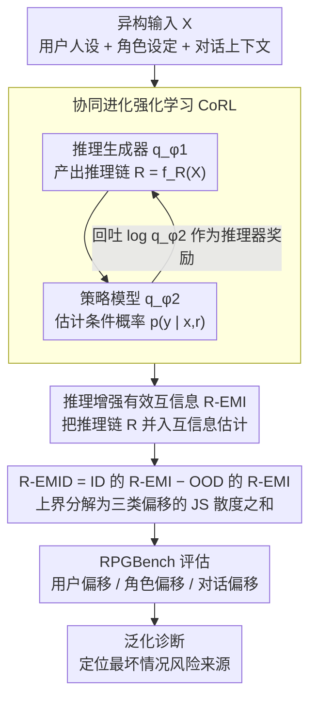

# Understanding Generalization in Role-Playing Models via Information Theory

**会议**: ACL 2026 Findings  
**arXiv**: [2512.17270](https://arxiv.org/abs/2512.17270)  
**代码**: [GitHub](https://github.com/AlibabaResearch/DAMO-ConvAI/tree/main/RPM-Generalization)  
**领域**: 强化学习 / 角色扮演模型  
**关键词**: 角色扮演模型, 泛化性, 信息论, 分布偏移, 强化学习

## 一句话总结

本文提出首个信息论框架 R-EMID 来量化角色扮演模型（RPM）在用户/角色/对话分布偏移下的性能退化，通过引入推理过程和协同进化强化学习（CoRL）实现准确估计，发现用户偏移是最大的泛化风险，且强化学习是唯一一致有效的改进方法。

## 研究背景与动机

**领域现状**：角色扮演模型（RPM）是 LLM 的重要应用方向，已在娱乐、教育和情感陪伴等领域广泛部署。Character.AI 等平台服务全球用户，RPM 需要处理来自不同语言文化背景的用户、模拟从未见过的角色、应对越来越复杂的多轮对话。

**现有痛点**：(1) RPM 在实际部署中经常出现文化不当响应和角色不一致等失败，但缺乏系统性理解这些失败的理论框架；(2) LLM-as-a-judge 等经验评估方法无法提供细粒度诊断——它只能告诉你性能下降了，但不知道哪种偏移导致了退化；(3) 没有形式化框架将分布偏移与性能退化联系起来，无法做最坏情况风险分析。

**核心矛盾**：RPM 输入本质上是异构的（用户人设、角色设定、对话上下文），直接估计条件响应生成概率 $p(y|x)$ 非常困难，而这正是基于信息论的泛化度量所必需的。

**本文目标**：(1) 定义 RPM 中的三类分布偏移；(2) 提出信息论度量来量化性能退化；(3) 导出上界以预测最坏情况；(4) 系统评估各种训练方法的泛化效果。

**切入角度**：在现有 EMID 框架基础上引入中间推理过程 $R = f_R(X)$，将异构输入的复杂依赖关系转化为推理链中的显式连接，使条件概率估计变得更可行。

**核心 idea**：通过推理增强的有效互信息差（R-EMID）量化 RPM 性能退化，并用协同进化强化学习训练推理生成器和策略模型来准确估计这一度量。

## 方法详解

### 整体框架

R-EMID 框架包含三个层次：(1) 理论度量层——定义 R-EMI 和 R-EMID 来量化模型在给定分布上的表现和跨分布性能退化；(2) 估计层——用两个 LLM（推理生成器 $q_{\phi_1}$ 和策略模型 $q_{\phi_2}$）通过 CoRL 来准确估计条件概率；(3) 应用层——用 R-EMID 及其上界评估各种 RPM 训练方法的泛化性。

### 关键设计

**1. 推理增强的有效互信息差 (R-EMID)：给"性能退化"一个可算的标尺**

要量化 RPM 跨分布的退化，最自然的工具是信息论里的有效互信息差（EMID），但它要直接估计 $p(y|x)$——而 RPM 的输入 $x$ 是用户人设、角色设定、对话上下文三者纠缠的异构体，直接估概率几乎不可行。R-EMID 的破局点是塞进一个中间推理变量 $R = f_R(X)$，把 $I(P_{XY})$ 扩展成 $I(P_{X_R Y})$（其中 $X_R = (X, R)$），让用户/角色/对话之间隐含的依赖在推理链里被显式写出来，概率估计随之变得可做。R-EMID 本身定义为 ID 分布上的 R-EMI 与 OOD 分布上的 R-EMI 之差，并能进一步上界分解成三类偏移的 JS 散度之和：

$$\sqrt{2/3}\,\hat{H} \sum_{z} D_{JS}^{1/2}(P_{X_z} \| Q_{X_z}) + 8\Delta^{1/4}$$

这个上界的价值在于它把"总退化"拆成了用户、角色、对话三项各自的贡献，让最坏情况风险分析有据可依，而不是只能笼统地说"性能掉了"。

**2. 协同进化强化学习 (CoRL)：让推理器和策略模型互相喂奖励**

R-EMID 要算得准，依赖两个量都靠谱：推理过程要有用、条件概率要估得对——而这两件事互相牵制，单独训会出现分布不匹配。CoRL 让两个模型协同进化：推理生成器 $q_{\phi_1}(r|x)$ 产出推理过程帮策略模型挑出有用信息，策略模型 $q_{\phi_2}(y|x,r)$ 则把它的对数概率回吐给推理器当奖励。两者交替优化——推理器的奖励是 $\log q_{\phi_2}(y|x,r_i)$，策略模型的奖励是与参考模型的概率比，都基于 GRPO。这样"推理质量↑→概率估计↑→推理奖励信号↑"形成正循环，避免了各自为政时谁也对不上谁的尴尬。

**3. RPGBench 评估基准：把三类偏移一次性摆上台面**

要验证 R-EMID 真能诊断泛化、要比较各种训练方法，前提是有一个能同时考三类偏移的数据集——而现有基准没有。RPGBench 用 17k 样本补上这个空缺：5k ID 样本（英文用户、真实角色、4 轮对话）作基准，OOD 部分则分别针对三个维度构造——用户偏移（5 种非英语文化背景）、角色偏移（虚构角色）、对话组合偏移（8 轮长对话或词级重组）。这种"控制变量式"的偏移设计，正好对应 R-EMID 上界里那三项 JS 散度，使理论度量和实证评估能一一对上。

### 损失函数 / 训练策略

CoRL 基于 GRPO 优化，两个模块先用 SFT 初始化再交替 RL。训练模型为 Qwen3-4B 和 LLaMA-3-8B。评估使用 11 个 LLM 在 11 种偏移场景下的 121 对相关性分析。

## 实验关键数据

### 主实验

| 训练方法 | ID R-EMI | OOD-ZH R-EMI | OOD-虚构角色 R-EMI | 最大风险↓ |
|---------|---------|-------------|------------------|---------|
| SFT | 基准 | 显著下降 | 中等下降 | 高 |
| Data Aug | 不稳定 | 不稳定 | 不稳定 | 不稳定 |
| **RL** | **改善** | **改善** | **改善** | **最低** |
| ThinkingSFT | 下降 | 下降 | 下降 | 较高 |
| ThinkingRL | 下降 | 下降 | 下降 | 较高 |

### 消融实验

| 配置 | ID 困惑度 | 用户偏移 | 角色偏移 | 对话偏移 |
|------|---------|---------|---------|---------|
| Full (CoRL+推理) | 4.852 | 4.525 | 5.048 | 5.469 |
| w/o CoRL | 5.457 | 5.108 | 5.779 | 5.988 |
| w/o 推理 | 6.266 | 5.596 | 6.413 | 6.846 |

### 关键发现

- **发现1**：用户偏移带来最大的泛化风险——因为用户背景变化会级联影响角色选择和对话内容
- **发现2**：RL 是唯一一致有效的方法——SFT 基线在所有偏移场景下均优于数据增强和思维链训练
- **发现3**：天真地加入推理轨迹反而有害——ThinkingSFT 和 ThinkingRL 表现不如标准 SFT
- R-EMID 与 LLM-as-a-judge 指标的 Pearson 相关系数达到强水平，验证了度量的有效性

## 亮点与洞察

- 首次将信息论泛化理论应用于角色扮演模型——提供了超越经验评估的理论工具
- R-EMID 上界的分解形式直接揭示了三类偏移的各自贡献，可指导针对性改进
- "推理轨迹不一定改善泛化"这一发现挑战了"加推理就能提升"的直觉

## 局限与展望

- 推理过程增加了计算开销，虽然可以预缓存推理轨迹，但仍不够高效
- R-EMID 上界在理论上不够紧致，有改进空间
- 仅在 Qwen3-4B 和 LLaMA-3-8B 上验证，更大模型的泛化行为可能不同
- RPGBench 的 OOD 构建方式可能不完全覆盖真实部署中的分布偏移

## 相关工作与启发

- **vs EMID (Oh et al.)**: 原始 EMID 在异构输入上相关性弱（与 LLM-as-a-judge 相关性低）；R-EMID 通过推理变量显著改善
- **vs LLM-as-a-judge**: LLM-as-a-judge 是经验度量，无法提供理论上界和风险预测；R-EMID 提供了可证明的泛化保证
- **vs 数据增强方法**: DA 依赖对目标分布的先验知识，在 RPM 场景中通常不可获得

## 评分

- 新颖性: ⭐⭐⭐⭐⭐ 首个信息论 RPM 泛化框架，理论和实证都有创新
- 实验充分度: ⭐⭐⭐⭐ 11个模型×11种偏移的大规模验证，但训练实验仅两个模型
- 写作质量: ⭐⭐⭐⭐ 理论推导清晰，但符号较多需要仔细阅读
- 价值: ⭐⭐⭐⭐⭐ 为 RPM 泛化提供了理论基础和实践指导

<!-- RELATED:START -->

## 相关论文

- [\[ICML 2026\] Game of Thought: Robust Information Seeking with Large Language Models Using Game Theory](../../ICML2026/reinforcement_learning/game_of_thought_robust_information_seeking_with_large_language_models_using_game.md)
- [\[ICLR 2026\] Unveiling the Cognitive Compass: Theory-of-Mind-Guided Multimodal Emotion Reasoning](../../ICLR2026/reinforcement_learning/unveiling_the_cognitive_compass_theory-of-mind-guided_multimodal_emotion_reasoni.md)
- [\[ICLR 2026\] Understanding and Improving Hyperbolic Deep Reinforcement Learning](../../ICLR2026/reinforcement_learning/understanding_and_improving_hyperbolic_deep_reinforcement_learning.md)
- [\[ICML 2026\] Safety Generalization Under Distribution Shift in Safe Reinforcement Learning: A Diabetes Testbed](../../ICML2026/reinforcement_learning/safety_generalization_under_distribution_shift_in_safe_reinforcement_learning_a_.md)
- [\[ICLR 2026\] MergeMix: A Unified Augmentation Paradigm for Visual and Multi-Modal Understanding](../../ICLR2026/reinforcement_learning/mergemix_a_unified_augmentation_paradigm_for_visual_and_multi-modal_understandin.md)

<!-- RELATED:END -->
