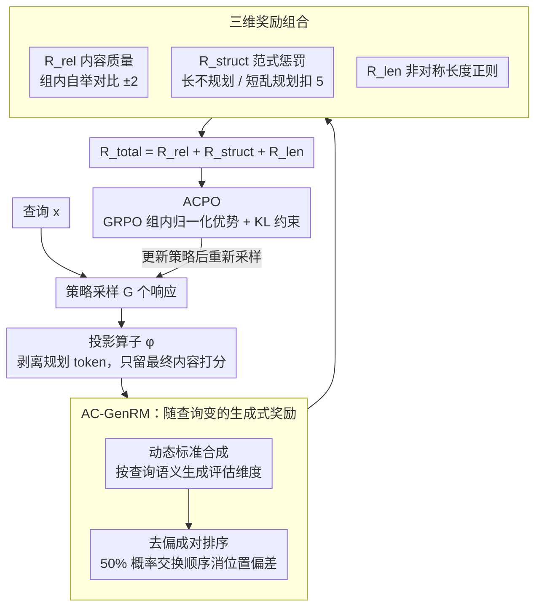

# UniCreative: Unifying Long-form Logic and Short-form Sparkle via Reference-Free Reinforcement Learning

**会议**: ACL 2026  
**arXiv**: [2604.05517](https://arxiv.org/abs/2604.05517)  
**代码**: [https://github.com/weixiaolong94-hub/UniCreative](https://github.com/weixiaolong94-hub/UniCreative)  
**领域**: 强化学习/创意写作  
**关键词**: 创意写作, 无参考强化学习, 偏好优化, 生成式奖励模型, 元认知

## 一句话总结

本文提出 UniCreative 框架，通过自适应约束偏好优化（ACPO）和自适应标准生成式奖励模型（AC-GenRM），在无需 SFT 和参考答案的条件下统一长文本（规划→写作）和短文本（直接生成）两种创意写作模式，模型涌现出自主区分任务类型的元认知能力。

## 研究背景与动机

**领域现状**：LLM 在通用文本生成上表现出色，但创意写作仍受到两个根本性挑战的困扰：长文本（如小说、剧本）需要全局结构连贯性，容易出现主题漂移和重复；短文本（如诗歌、祝福语、广告文案）需要语言表达的灵动感，但自回归模型倾向于高概率"安全"token，导致输出平庸。

**现有痛点**：(1) 长文本仅增大上下文窗口无法解决结构退化问题，需要显式规划；(2) 短文本若强加规划机制反而会过度限定，扼杀创作中的灵感火花；(3) 现有对齐方法（RLHF/DPO）严重依赖高质量标注数据和参考答案，在开放式创作任务中成本极高且难以扩展。

**核心矛盾**：长文本的"近视症"（缺乏全局规划导致结构崩塌）与短文本的"过度确定"（过多结构约束压制表达多样性）是两种对立的失败模式，不能用统一的生成策略解决。

**本文目标**：构建一个统一框架，让模型自主判断何时需要规划、何时应直接生成，且不依赖任何人工标注的完成文本。

**切入角度**：将规划视为"可动态调用的计算资源"而非固定前置步骤，通过强化学习让模型学会在两种模式间自适应切换。

**核心 idea**：跳过 SFT 阶段，直接通过无参考的强化学习（ACPO）训练模型，利用自适应标准的生成式奖励模型（AC-GenRM）提供细粒度偏好信号。

## 方法详解

### 整体框架

UniCreative 想做的是：让一个模型既能写好需要全局规划的长文本，又能写好讲究灵动的短文本，且全程不依赖 SFT 和参考答案。它由两个组件咬合而成——一个负责"打分"，一个负责"学习"。打分端是 AC-GenRM，它根据查询语义临时生成评估标准，再对模型的多个候选输出做去偏的成对排序；学习端是 ACPO，它在 GRPO 框架上把内容质量、结构范式、输出长度三个奖励信号叠在一起优化策略。训练时模型对每个查询采样 $G$ 个响应，AC-GenRM 在这组响应内部做自我竞争产生相对奖励，再驱动策略更新。

### 关键设计

**1. AC-GenRM：让奖励标准随查询语义变，而不是一把尺子量到底**

创意写作没有标准答案，悬疑小说和情诗的"好"维度完全不同，用一套固定评估标准必然抓不住差异；同时 LLM 当评委时存在公认的位置偏差。AC-GenRM 用两步解决这两个问题。第一步是动态标准合成：给定查询 $x$，评论模型 $\pi_{critic}$ 先自动生成针对该查询的评估维度——恐怖故事就侧重"情节反转"和"氛围"，贺卡就侧重"温暖"和"简洁"。第二步是去偏成对排序：训练时用对称数据增强，以 50% 概率交换两个响应的呈现顺序，强制奖励模型不去记位置而是真正比较内容，使偏好信号严格对齐前一步生成的动态标准。

**2. 三维奖励组合：内容、结构、长度三个正交信号一起拉策略**

只奖励内容质量教不会模型"什么时候该规划""该写多长"，所以总奖励拆成三项相加 $R_{total} = R_{rel} + R_{struct} + R_{len}$。$R_{rel}$ 来自 AC-GenRM 的自举对比，即同组响应互相竞争、赢家 $+2$ 输家 $-2$；$R_{struct}$ 是范式感知惩罚，当长文本没有使用规划、或短文本反而套了规划时扣 $\beta_s=5.0$ 分，用这个简单的二元信号逼模型自己选认知模式；$R_{len}$ 是非对称长度正则化，对长文本惩罚过短、对短文本惩罚过长，并设上限 $\gamma=5.0$ 防止异常长度样本产生过大梯度。三个信号正交，分别管住质量、结构选择和长度控制。

**3. ACPO：在无 SFT、无参考答案下直接优化策略，且只为最终内容买单**

传统 SFT 需要标注完成文本，在开放式创作上既贵又难扩展，因此 ACPO 直接跳过 SFT、基于 GRPO 做策略优化。每个查询采样 $G$ 个响应，计算组内归一化优势 $A_i$，用裁剪重要性比率加 KL 散度约束更新策略，避免维护一个训练不稳定的价值网络——这对长文本生成中的高方差梯度尤其友好。一个关键细节是：送入 AC-GenRM 打分前，先用投影算子 $\phi$ 把规划 token 剥掉，确保奖励只反映最终生成内容的质量，而不会因为模型"规划写得长"被误奖励。

### 损失函数 / 训练策略

使用 GRPO 目标函数，最大化裁剪优势减去 KL 惩罚。训练 Qwen3 系列（1.7B、4B、8B）在 8 块 H800 GPU 上进行，直接从 thinking 模型开始 RL，无需 SFT 中间步骤。

## 实验关键数据

### 主实验

| 模型 | WritingBench 均分 | Blessing 优秀率 |
|--------|------|------|
| Qwen3-8B-Thinking | 77.11 | 68.0% |
| Qwen3-8B-Thinking + RL | 82.42 | 93.6% |
| Qwen3-4B-Thinking + RL | 77.36 | 91.4% |
| Claude-Sonnet-3.7 | 78.48 | - |
| DeepSeek-R1-0528 | 83.22 | - |
| Claude-Sonnet-4.5 | - | 93.2% |

Qwen3-8B + RL 在 WritingBench 上接近 DeepSeek-R1-0528（83.22），Blessing 短文本上超越 Claude-Sonnet-4.5。

### 消融实验

| 配置 | WritingBench | Blessing | 说明 |
|------|---------|------|------|
| Qwen3-8B Base | 70.75 | 43.6% | 无思考无 RL |
| + Thinking | 77.11 | 68.0% | 思考模式 |
| + Thinking + RL | 82.42 | 93.6% | 完整方法，提升 +25.6% |

### 关键发现

- **RL 增益巨大**：仅 RL 训练（无 SFT）就能在 WritingBench 上带来 5-10 分提升，在 Blessing 上从 68% 提升到 93.6%。
- **AC-GenRM 对齐度高**：Qwen3-8B AC-GenRM 在 LitBench 上与专家判断的一致率达 0.807，在 Blessing 上达 0.994，超过 Claude-Sonnet-3.7（0.731）和 GPT-4.1（0.702）。
- **涌现元认知能力**：训练后的模型自主学会了在长文本任务中使用 Plan-then-Write 模式、在短文本任务中使用直接生成模式，无需显式的任务类型标签。
- **小模型也受益**：1.7B 模型通过 RL 从 64.2% 提升到 90.0%（Blessing），接近大模型水平。

## 亮点与洞察

- **无参考 RL 的可行性**：首次证明在创意写作领域可以完全跳过 SFT 阶段，仅用 RL + 自适应奖励模型就能达到或超越 SFT+RLHF 的效果，大幅降低数据标注成本。
- **结构范式惩罚的巧妙设计**：通过简单的二元惩罚（长文本不规划扣分/短文本规划扣分）就能教会模型自主选择认知模式，设计极其简洁但效果显著。
- **动态标准合成**：AC-GenRM 根据查询语义自动生成评估维度的思路，可推广到所有开放式生成任务的评估中。

## 局限与展望

- 评估仍依赖 LLM 评委（WritingBench 用 GPT-4o 评分），主观创作的自动评估本身是开放问题。
- 仅在 Qwen3 系列上验证，未测试在其他基座模型上的泛化性。
- 任务类型分类（长/短）较为粗粒度，中等长度任务（如邮件、报告）的最优策略不确定。
- 结构范式惩罚需要预定义任务类型标签（Long/Short），限制了完全自主的模式选择。

## 相关工作与启发

- **vs Writing-Zero/LongWriter-Zero**: 这些方法专注于长文本 RL 优化，UniCreative 统一了长短文本两种模式，且无需 SFT 阶段。
- **vs DPO/RLHF**: 传统方法依赖参考答案和标注偏好对，UniCreative 通过自举对比完全免除参考依赖。
- **vs GRPO (DeepSeek-R1)**: UniCreative 在 GRPO 基础上增加了结构范式约束和自适应长度正则化，使其适用于创意写作场景。

## 评分

- 新颖性: ⭐⭐⭐⭐ 统一长短文本创作的框架设计和无参考 RL 训练思路有新意
- 实验充分度: ⭐⭐⭐⭐ 多尺寸模型对比，WritingBench 和 Blessing 双基准评测充分
- 写作质量: ⭐⭐⭐⭐ 问题动机和方法设计清晰
- 价值: ⭐⭐⭐⭐ 为开放式创作任务的 RL 优化提供了实用范式

<!-- RELATED:START -->

## 相关论文

- [\[ACL 2026\] LoVeC: Reinforcement Learning for Better Verbalized Confidence in Long-Form Generations](lovec_reinforcement_learning_for_better_verbalized_confidence_in_long-form_gener.md)
- [\[ICLR 2026\] Safe Continuous-time Multi-Agent Reinforcement Learning via Epigraph Form](../../ICLR2026/reinforcement_learning/safe_continuous-time_multi-agent_reinforcement_learning_via_epigraph_form.md)
- [\[ACL 2026\] Free Energy-Driven Reinforcement Learning with Adaptive Advantage Shaping for Unsupervised Reasoning in LLMs](free_energy-driven_reinforcement_learning_with_adaptive_advantage_shaping_for_un.md)
- [\[ACL 2026\] A Goal Without a Plan Is Just a Wish: Efficient and Effective Global Planner Training for Long-Horizon Agent Tasks (EAGLET)](a_goal_without_a_plan_is_just_a_wish_efficient_and_effective_global_planner_trai.md)
- [\[ICLR 2026\] SPELL: Self-Play Reinforcement Learning for Evolving Long-Context Language Models](../../ICLR2026/reinforcement_learning/spell_self-play_reinforcement_learning_for_evolving_long-context_language_models.md)

<!-- RELATED:END -->
