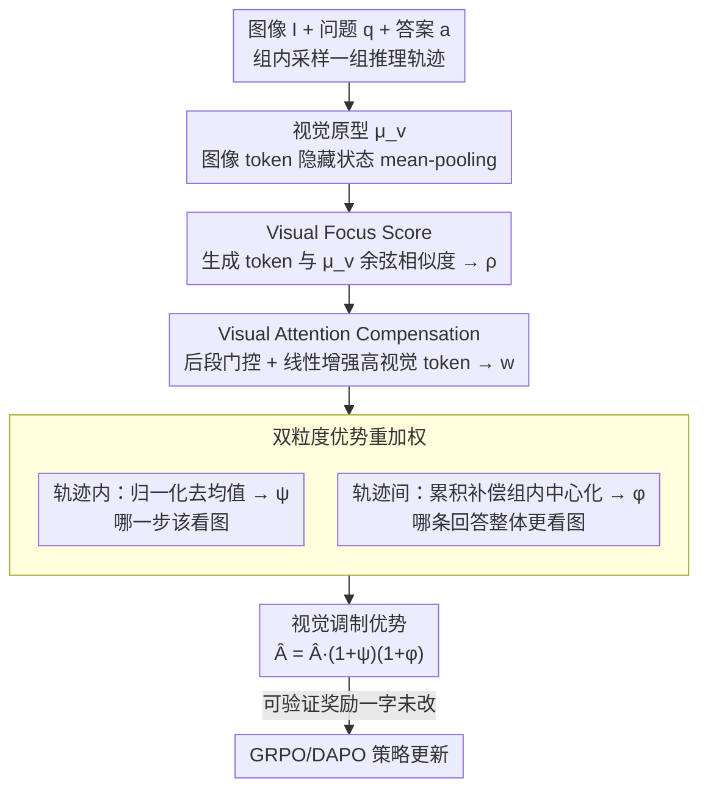

# Visually-Guided Policy Optimization for Multimodal Reasoning

**会议**: ACL2026  
**arXiv**: [2604.09349](https://arxiv.org/abs/2604.09349)  
**代码**: https://github.com/wzb-bupt/VGPO  
**领域**: reinforcement_learning  
**关键词**: 多模态推理, 强化学习, GRPO, 视觉注意力, 视觉遗忘

## 一句话总结
VGPO 在 RLVR 训练中用隐藏状态相似度定位视觉相关 token，再通过后段视觉补偿和轨迹内/轨迹间优势重加权强化视觉关注，使 Qwen2.5-VL-7B 在数学多模态推理和视觉依赖任务上超过 GRPO/DAPO 及已有视觉增强 RL 方法。

## 研究背景与动机
**领域现状**：RLVR 和 GRPO/DAPO 等方法显著提升了 VLM 的逐步推理能力，尤其是在可验证答案的数学、几何和视觉问答任务上。当前多模态 reasoning 研究通常把重点放在最终答案奖励、rollout 多样性、KL/entropy regularization 或外部视觉验证器上。

**现有痛点**：VLM 的推理过程仍然带有强烈文本主导倾向。模型在生成长推理链时，初期可能短暂关注图像，但后续越来越依赖问题文本和已生成文本，视觉 token 激活变稀疏，最终出现视觉事实遗忘、幻觉或基于语言先验的错误推理。

**核心矛盾**：多模态推理需要模型在长链条中持续使用图像证据，而常规 RL 只奖励最终答案正确，不管模型是否忠实看图。已有视觉增强方法往往引入特殊 token、额外 forward、噪声图像对比或辅助模型，训练成本和系统复杂度较高。

**本文目标**：作者希望在不引入额外模型和额外视觉验证过程的前提下，把“推理时是否持续关注图像”直接纳入 policy optimization，让模型既追求答案正确，也追求视觉证据使用充分。

**切入角度**：论文观察到生成 token 的隐藏状态与图像 token 隐藏状态之间的相似度，可以作为内生的 Visual Focus Score。当模型真正使用视觉信息时，这个相似度会上升，并且对应的图像注意区域通常语义合理。

**核心 idea**：用模型自身隐藏状态构造视觉关注信号，再把它变成 RL 优势函数的重加权因子，让正确答案奖励沿着更视觉忠实的推理轨迹传播。

## 方法详解
VGPO 可以理解为在 DAPO/GRPO 类 RL 框架上加了一层“视觉忠实度调制器”。原始 RLVR 只看每条 rollout 的最终 reward，比如答案是否 exact match。VGPO 不改变可验证奖励本身，而是在 token 和 trajectory 两个粒度上重新分配优势：视觉相关 token 的更新权重更高，整体视觉关注更强的轨迹也得到更高权重。

### 整体框架
给定图像 $I$、文本问题 $q$ 和答案 $a$，策略模型采样一组推理轨迹。首先，VGPO 从图像 token 的隐藏状态中得到视觉原型，并计算每个生成 token 与视觉原型的相似度，形成 Visual Focus Score。然后，Visual Attention Compensation 会在推理后段对高视觉相似 token 做线性增强，用来抵消 temporal visual forgetting。最后，双粒度优势重加权（Dual-Grained Advantage Re-Weighting）将这种视觉补偿信号嵌入到 policy objective 中：轨迹内区分 token 级视觉重要性，轨迹间区分整条回答的视觉累积程度。

### 关键设计
**1. Visual Focus Score：用隐藏状态相似度判断每个 token 是否真在"想图像"**

要强化视觉忠实性，先得知道长推理链里哪些 token 真正在用图像证据——但靠外部标注或辅助模型成本高。VGPO 把输入图像 token 的隐藏状态聚合成视觉原型 $\mu_v$（默认用 mean-pooling），再算当前生成 token 隐藏状态 $h_{i,t}$ 与 $\mu_v$ 的余弦相似度，归一化成视觉关注分数 $\rho_{i,t}=0.5(\mathcal{S}(h_{i,t},\mu_v)+1)\in[0,1]$。当模型真在用视觉信息时这个相似度会上升，且对应的图像注意区域通常语义合理。这个信号廉价、内生、可端到端接入训练，不需要任何额外 forward 或评审模型。

**2. Visual Attention Compensation：专治后段视觉关注衰减，且只在该补的地方补**

直接用 $\rho_{i,t}$ 会系统性低估后段视觉 token，因为视觉注意力天然随生成推进而衰减——这正是 temporal visual forgetting 的来源。VGPO 构造补偿权重 $w_{i,t}=\rho_{i,t}[1+G_i(\rho_{i,t})\beta t/T_i]$：其中 $t/T_i$ 让补偿随生成位置线性增强，把力气压在更容易遗忘视觉的后段；门控 $G_i$ 只在轨迹后段、且属于 top-$\kappa$ 视觉分数的 token 上打开，避免把所有 token 都当视觉 token 强行加强。默认超参 $\beta=0.3$、$\gamma=0.5$、$\kappa=0.2$。这样早期理解题意的阶段不被干扰，补偿精准对准真正的 visual forgetting。

**3. 双粒度优势重加权：token 级管"哪一步该看图"，trajectory 级管"哪条回答整体更看图"**

只看 token 局部会忽略整条回答是否持续看图，只看轨迹整体又没法把奖励准确分给关键视觉步骤，所以 VGPO 在两个粒度同时调制优势。轨迹内先对 $w_{i,t}$ 做 min-max 归一化、再减去轨迹均值得到 $\psi_{i,t}$，让高于本轨迹平均视觉激活的 token 拿到更高优势；轨迹间则累积整条轨迹的补偿分数 $s_i=\sum_t w_{i,t}$，在 rollout group 内归一化并中心化得到 $\phi_i$。最终把可验证奖励的标准优势替换成 $\hat{A}^{\mathcal{V}}_{i,t}=\hat{A}_i(1+\psi_{i,t})(1+\phi_i)$——正确答案的奖励由此沿着更视觉忠实的 token 和轨迹传播，而可验证奖励本身一字未改。

### 损失函数 / 训练策略
基础优化沿用 GRPO/DAPO 风格的 group-relative policy optimization：每个问题采样一组回答，按 exact match 得到二值 reward，再在组内标准化为优势，VGPO 只是把标准优势换成视觉调制优势 $\hat{A}^{\mathcal{V}}_{i,t}$。实验使用 Qwen2.5-VL 3B、7B、32B，训练数据为 ViRL39K、Geo3K 和 MMK12；默认训练 2 个 epoch，学习率 $1\times 10^{-6}$，rollout batch size 512，最大回答长度 2,048，评测 temperature 为 0。

## 实验关键数据

### 主实验
主实验比较了 Qwen2.5-VL-7B 基础模型、GRPO、DAPO、VGPO 以及已有 7B 多模态 reasoning 方法。VGPO 在 general mathematical/geometric reasoning 和 vision-dependent multimodal reasoning 两组任务上都取得最好平均性能。

| 方法 | Avg-Math↑ | Avg-Vision↑ | 相对基础模型提升 | 说明 |
|--------|------|------|----------|------|
| Qwen2.5-VL-7B | 50.0 | 48.7 | - | 未经 RL 后训练 |
| + GRPO | 62.6 | 58.8 | Math +25.2%，Vision +20.7% | 只用 group-relative 答案奖励 |
| + DAPO | 63.8 | 59.6 | Math +27.6%，Vision +22.4% | 更强 RL baseline |
| PAPO-D-7B | 65.5 | 60.4 | - | 视觉增强 RL 方法 |
| VPPO-RL-7B | 65.7 | 61.3 | - | KL 感知类视觉增强方法 |
| + VGPO | 66.6 | 63.3 | Math +33.2%，Vision +30.0% | 本文方法，两个平均指标最佳 |

| 设置 | Avg-Math↑ | Avg-Vision↑ | 说明 |
|------|---------|------|------|
| Qwen2.5-VL-3B + DAPO | 55.3 | 48.3 | 小模型 baseline |
| Qwen2.5-VL-3B + VGPO | 57.7 | 53.6 | 视觉任务提升尤其明显 |
| Qwen2.5-VL-32B + DAPO | 68.4 | 64.8 | 大模型 baseline |
| Qwen2.5-VL-32B + VGPO | 70.7 | 66.7 | 32B 上仍有增益 |
| 7B + DAPO w/ Geo3K 2.1K | 57.4 | 54.8 | 小训练集场景 |
| 7B + VGPO w/ Geo3K 2.1K | 60.4 | 55.8 | 数据较少时仍优于 DAPO |
| 7B + DAPO w/ MMK12 6.4K | 60.8 | 58.8 | 中等训练集场景 |
| 7B + VGPO w/ MMK12 6.4K | 62.4 | 60.3 | 泛化到不同训练数据 |

### 消融实验

| 配置 | Avg-Math↑ | Avg-Vision↑ | Overall↑ | 说明 |
|------|---------|------|------|------|
| DAPO baseline | 63.8 | 59.6 | 62.2 | 无视觉优势重加权 |
| + Intra-trajectory | 66.1 | 62.5 | 64.6 | token 级视觉重加权有效 |
| + Inter-trajectory | 65.3 | 62.0 | 64.0 | 轨迹级视觉累积也有帮助 |
| + Intra & Inter | 66.6 | 63.3 | 65.3 | 两者互补，效果最好 |

| 补偿策略 | Avg-Math↑ | Avg-Vision↑ | Overall↑ | 说明 |
|------|---------|------|------|------|
| DAPO baseline | 63.8 | 59.6 | 62.2 | 不做视觉补偿 |
| Step-Function | 64.7 | 60.7 | 63.1 | 突变补偿带来不稳定 |
| Exponential | 65.1 | 61.0 | 63.5 | 容易过度强调最后 token |
| Linear (VGPO) | 66.6 | 63.3 | 65.3 | 最符合渐进视觉遗忘 |
| Full-trajectory compensation | 53.0 | 54.2 | 53.5 | 全程补偿显著伤害性能 |
| Late-trajectory compensation | 66.6 | 63.3 | 65.3 | 只补后段视觉衰减最有效 |

### 关键发现
- 文本主导推理是真实存在的。论文在 Qwen2.5-VL-7B 上观察到，视觉 attention 在早期有短暂峰值，随后随生成步骤逐步下降。
- correct samples 的 late/early visual accumulation ratio 高于 incorrect samples，平均约 0.680 vs 0.532，说明后段持续看图与答对有关。
- VGPO 的提升不是单一尺度或单一数据集特例：3B、7B、32B 和 Geo3K/MMK12/ViRL39K 设定下都比 DAPO 更强。
- 视觉补偿必须“晚而准”。Full-trajectory compensation 让 overall 从 62.2 降到 53.5，说明过早强迫模型看图会妨碍文本题意解析。

## 亮点与洞察
- VGPO 的核心亮点是把视觉忠实性从外部监督转成内部信号。它不需要额外 GPT 评审、不需要噪声图像双 forward，也不需要特殊视觉回看 token。
- 双粒度 advantage 设计很自然。token 级解决“哪一步该看图”，trajectory 级解决“哪条回答整体更看图”，比单一正则项更贴合长链推理。
- Late compensation 的消融很有启发：视觉 grounding 不是越多越好，而是要在模型最容易遗忘视觉证据的阶段补上。
- 这篇论文也提醒我们，RLVR 只看最终答案可能会奖励错误的推理路径。即使答案正确，模型也可能是靠语言先验猜中；视觉过程信号能让训练目标更接近多模态任务本质。

## 局限与展望
- Visual Focus Score 假设隐藏状态与图像原型相似就代表视觉 grounding，但这种相似度不一定总能区分真实视觉证据和与图像语义相关的语言概念。
- 方法需要访问模型内部 hidden states 和 image token，对闭源 VLM 或 API-only 模型不易使用。
- 超参数 $\beta$、$\gamma$、$\kappa$ 对训练稳定性有影响，虽然论文给出敏感性分析，但迁移到其他架构和任务仍需重新校准。
- 评测主要集中在可验证答案的数学、几何和视觉依赖任务，尚不清楚对开放式视觉问答、captioning、agent 规划或真实世界长程交互是否同样有效。
- 视觉 attention ratio 提升并不自动等于因果忠实性提升。未来可以加入 counterfactual image editing、evidence attribution 或遮挡实验来验证模型是否真的依赖正确视觉区域。

## 相关工作与启发
- **vs GRPO/DAPO**: GRPO/DAPO 主要优化最终可验证 reward，VGPO 在此基础上把视觉关注加入优势分配，解决多模态任务中的视觉遗忘。
- **vs PAPO/VPPO**: PAPO 和 VPPO 通过噪声图像或 KL 差异突出视觉 token，VGPO 则利用隐藏状态相似度，避免额外 forward 和外部视觉对比。
- **vs Look-Back / latent visual tokens**: 这类方法引入特殊 token 触发重新看图，VGPO 不改变生成格式，而是在训练目标中鼓励持续视觉关注。
- **对后续工作的启发**: 多模态 RL 不应只设计 outcome reward，还可以加入过程级的 modality-use reward，让模型学会在合适时间使用合适模态。

## 评分
- 新颖性: ⭐⭐⭐⭐ 用 hidden-state visual focus 调制 RL 优势很巧妙，但整体仍建立在 GRPO/DAPO 框架上。
- 实验充分度: ⭐⭐⭐⭐⭐ 主结果、尺度扩展、数据扩展、重加权消融、补偿策略消融和超参分析都比较完整。
- 写作质量: ⭐⭐⭐⭐ 公式链条清楚，方法部分稍密集但整体叙事顺畅。
- 价值: ⭐⭐⭐⭐⭐ 对多模态 RLVR、视觉忠实推理和减少视觉幻觉都有直接参考价值。

<!-- RELATED:START -->

## 相关论文

- [\[ICLR 2026\] From Narrow to Panoramic Vision: Attention-Guided Cold-Start Reshapes Multimodal Reasoning](../../ICLR2026/reinforcement_learning/from_narrow_to_panoramic_vision_attention-guided_cold-start_reshapes_multimodal_.md)
- [\[ICLR 2026\] Unveiling the Cognitive Compass: Theory-of-Mind-Guided Multimodal Emotion Reasoning](../../ICLR2026/reinforcement_learning/unveiling_the_cognitive_compass_theory-of-mind-guided_multimodal_emotion_reasoni.md)
- [\[ACL 2026\] Bridging SFT and RL: Dynamic Policy Optimization for Robust Reasoning](bridging_sft_and_rl_dynamic_policy_optimization_for_robust_reasoning.md)
- [\[ICLR 2026\] FAPO: Flawed-Aware Policy Optimization for Efficient and Reliable Reasoning](../../ICLR2026/reinforcement_learning/fapo_flawed-aware_policy_optimization_for_efficient_and_reliable_reasoning.md)
- [\[ICML 2026\] Perceptual Flow Network for Visually Grounded Reasoning](../../ICML2026/reinforcement_learning/perceptual_flow_network_for_visually_grounded_reasoning.md)

<!-- RELATED:END -->
