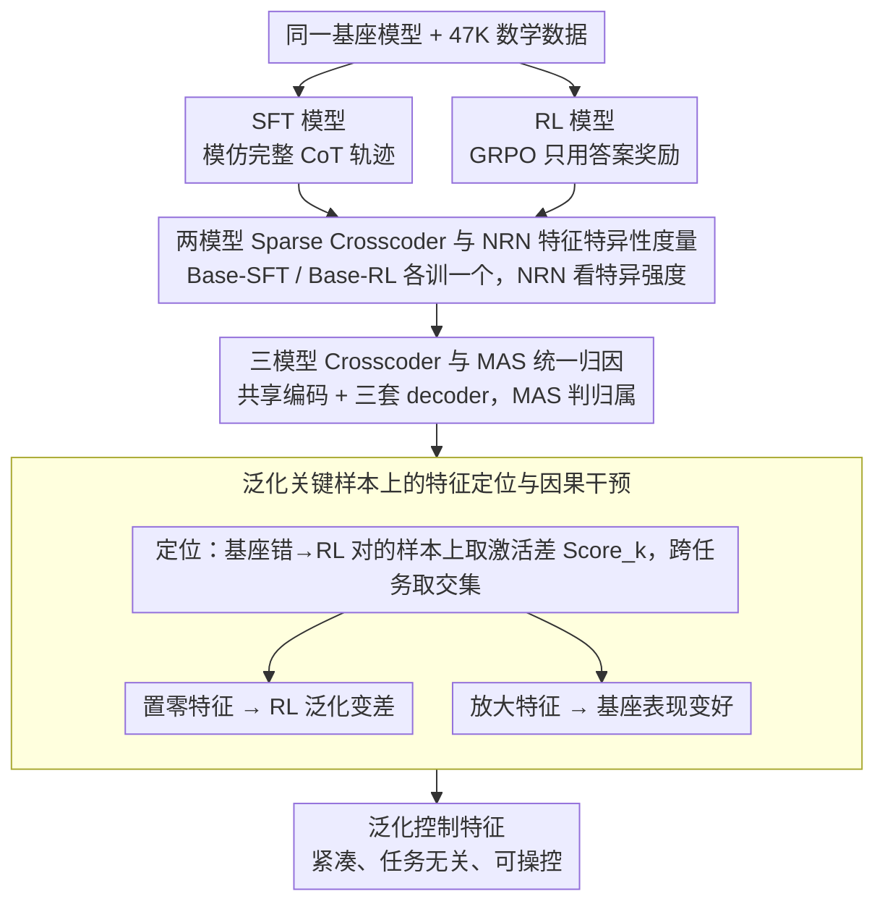

# Why Does Reinforcement Learning Generalize? A Feature-Level Mechanistic Study of Post-Training in Large Language Models

**会议**: ACL2026  
**arXiv**: [2604.25011](https://arxiv.org/abs/2604.25011)  
**代码**: https://github.com/danshi777/RL-generalization  
**领域**: 强化学习后训练 / 机制可解释性  
**关键词**: 强化学习泛化、SFT遗忘、Sparse Crosscoder、特征干预、LLM后训练

## 一句话总结
本文用严格受控的 SFT/RL 后训练对比和 Sparse Crosscoder 特征对齐发现：SFT 会快速形成大量专门化特征，而 RL 更像是在保留基座表示的同时逐步增强少量跨任务泛化特征，且这些特征被置零会显著伤害 RL 泛化、被放大则能提升基座模型表现。

## 研究背景与动机
**领域现状**：LLM 后训练里，SFT 和 RL 都常用于提升推理能力。SFT 通常模仿强教师的完整 CoT 轨迹，RL 则只根据最终答案正确性给奖励；经验上，RL 在数学训练之外常能迁移到常识、科学问答等任务，而 SFT 有时会牺牲通用能力。

**现有痛点**：已有工作多停留在行为层面：看到 RL 泛化更好、SFT 遗忘更明显，却很难说明内部表示到底发生了什么。若只看输出分布或整体隐藏状态漂移，也只能给出粗粒度解释，无法回答“哪些内部特征真的在控制泛化”。

**核心矛盾**：RL 的监督信号更弱，只看结果不看完整推理轨迹，但它反而更容易保留和扩展通用能力；SFT 的监督更密集，却更容易把模型推向训练分布和教师风格。这说明“监督强度”并不等同于“泛化机制”，关键可能在于后训练如何改写模型已有特征空间。

**本文目标**：作者希望在排除数据、基座模型和训练规模干扰后，回答三个问题：SFT 和 RL 分别引入了哪些模型特异特征？这些特征在训练过程中如何形成和稳定？RL 中是否存在一组可被定位、可被干预的跨任务泛化特征？

**切入角度**：论文采用 Sparse Crosscoder 把基座模型、SFT 模型和 RL 模型的残差流激活映射到同一个稀疏特征空间。这样一来，不再只比较整体向量距离，而是可以逐个特征分析“它更属于基座、SFT 还是 RL”。

**核心 idea**：用跨模型稀疏特征对齐和因果干预，把“RL 为什么泛化”从行为观察转化为“RL 是否增强了一组紧凑、任务无关、可操控的泛化特征”的机制问题。

## 方法详解
本文的方法可以分成两层：第一层是构造公平的后训练对照实验，让 SFT 和 RL 只在训练范式上不同；第二层是用 Sparse Crosscoder 对齐内部激活，并通过特征归因、训练动态分析和干预实验找出真正控制泛化的特征。

### 整体框架
输入是同一基座模型在相同数学训练数据上得到的两个后训练版本：SFT 模型和 RL 模型（主实验在 Qwen3-4B-Base、Qwen2.5-7B 上做，并在 Llama3.1-8B-Instruct 上验证趋势）。作者先训两个 pairwise Sparse Crosscoder（Base-SFT、Base-RL）看每种范式相对基座引入了多少特异特征，再训一个三模型 Crosscoder 把 Base、SFT、RL 放进同一稀疏空间统一归因，最后聚焦"基座答错、RL 答对"的泛化关键样本，定位 RL 显著激活的特征并用置零/放大做因果验证。整条线把"RL 为什么泛化"从行为观察一步步逼到可干预的内部特征上。

### 关键设计
**1. 两模型 Sparse Crosscoder 与 NRN 特征特异性度量：直接比隐藏状态看不清，先把激活拆成可归属的稀疏特征**

直接比较两个模型的隐藏状态会把各种功能混在一起，看不出后训练到底改了什么。Crosscoder 同时重建基座和某个后训练模型的同层残差流激活，让稀疏向量里的每个维度对应一个共享或特异的功能特征。作者用 NRN 度量特征归属：$NRN=||W^{T}_{dec,k}||_1/(||W^{O}_{dec,k}||_1+||W^{T}_{dec,k}||_1)$，接近 1 表示该特征属于后训练模型特异，接近 0 属于基座特异，接近 0.5 为共享。这个度量直接揭示了改写强度——SFT 的 NRN 有明显右尾、产生大量强特异特征，而 RL 的极端特征少得多，说明它主要保留并轻微重排基座表示。

**2. 三模型 Crosscoder 与 MAS 统一归因：让 Base、SFT、RL 的特征索引可比**

两个 pairwise Crosscoder 的麻烦在于它们各自的稀疏基底不对齐——Base-SFT 空间里的"第 2026 个特征"和 Base-RL 空间里的并不是同一个，没法直接比。三模型 Crosscoder 用一套共享编码同时重建三种模型的激活，配三套 decoder，再把每个特征的三个 decoder norm 归一化成 $MAS_O$、$MAS_S$、$MAS_R$（三者相加为 1），谁最大就表示该特征最强归属于哪个范式。有了统一基底，作者才能公平地判断某个特征到底是 SFT 独有、RL 独有还是三者共享。

**3. 泛化关键样本上的特征定位与因果干预：从"谁不一样"走到"谁在起作用"**

描述性的特征差异还不足以说明因果，所以作者把范围收窄到每个非数学任务上"基座失败但 RL 成功"的样本，比较 RL 与基座在 Crosscoder 特征上的平均激活差 $Score_k=E[f_k^{RL}(x)-f_k^{Base}(x)]$，每个任务保留超阈值特征再取跨任务交集，得到任务无关的 generalization-controlling features。这样定位避免了被"Wait""However"等表面词触发的伪特征——只有在模型真正从错变对的样本上体现功能差异才算数。验证则是双向的：置零这组特征会让 RL 回答明显变差，放大它们又能让基座模型变好，证明它们是有因果作用的内部控制点而非相关性噪声。

### 损失函数 / 训练策略
SFT 和 RL 都从相同基座模型出发，使用同一 47K 高质量数学问题数据。SFT 的监督目标是 Qwen3-32B-Instruct 生成且最终答案正确的完整 CoT 轨迹，使用交叉熵训练；RL 采用 GRPO，只根据最终答案是否正确给奖励，不暴露中间推理轨迹。

RL 使用 verl 框架，整体 batch size 为 128，学习率 $1e-6$，每个 prompt 采样 8 条 rollout，最大生成长度 16K，训练 1 个 epoch；SFT 使用 LLaMA-Factory，batch size 128，学习率 $5e-5$，同样训练 1 个 epoch。Crosscoder 训练使用 32,768 个稀疏特征，在 OpenThoughts-114k 与 RedPajama 样本混合出的 4 亿 token 上训练，重建各模型中间层残差流，batch size 1024，学习率 $1e-4$，稀疏正则系数为 2。

## 实验关键数据

### 主实验
作者首先在数学与非数学任务上比较 Base、SFT、RL。最关键的现象是：RL 不只提升数学任务，在 CommonsenseQA、SciQ、ARC-Challenge 等非训练域任务上也明显优于 SFT；SFT 虽然数学提升大，但在通用任务上经常遗忘。

| 模型 | MATH500 | AIME24 | AIME25 | OpenBookQA | CommonsenseQA | SciQ | ARC-Challenge |
|------|---------|--------|--------|------------|----------------|------|---------------|
| Qwen3-4B-Base | 26.0 | 13.3 | 0.0 | 23.6 | 20.1 | 78.5 | 36.0 |
| Qwen3-4B-SFT | 68.4 | 13.3 | 13.3 | 25.8 | 19.6 | 51.8 | 34.4 |
| Qwen3-4B-RL | 77.0 | 26.7 | 20.0 | 27.2 | 50.5 | 89.5 | 39.3 |
| RL - SFT | +8.6 | +13.4 | +6.7 | +1.4 | +31.0 | +37.7 | +4.9 |
| Qwen2.5-7B | 40.0 | 10.0 | 3.3 | 28.4 | 77.6 | 86.9 | 41.9 |
| Qwen2.5-7B-SFT | 69.2 | 13.3 | 10.0 | 26.4 | 30.1 | 79.4 | 37.0 |
| Qwen2.5-7B-RL | 71.4 | 20.0 | 13.3 | 32.8 | 76.1 | 90.7 | 42.5 |
| RL - SFT | +2.2 | +6.7 | +3.3 | +6.4 | +46.0 | +11.3 | +5.5 |

### 消融实验
特征干预是本文最有说服力的实验。作者先找出跨任务重叠的泛化特征，Qwen3-4B 得到 50 个，Qwen2.5-7B 得到 16 个；不同任务间特征重叠甚至超过 80%。然后分别在 RL 模型中置零这些特征，在基座模型中放大这些特征。

| 干预 | 模型 | OpenBookQA | CommonsenseQA | HeadQA | SciQ | ARC-Challenge | 说明 |
|------|------|------------|----------------|--------|------|---------------|------|
| 置零泛化特征 | Qwen3-4B-RL | -46.2 | -43.9 | -21.2 | -14.0 | -33.3 | RL 原本答对的关键样本大量变错 |
| 置零泛化特征 | Qwen2.5-7B-RL | -21.9 | -24.4 | -23.8 | -44.4 | -20.0 | 说明这些特征对 RL 泛化是必要的 |
| 放大泛化特征 | Qwen3-4B-Base | +36.3 | +36.0 | +21.2 | +38.0 | +33.3 | 基座模型被注入同类特征后显著变好 |
| 放大泛化特征 | Qwen2.5-7B | +12.5 | +24.4 | +14.3 | +55.6 | +40.0 | 说明知识可能已存在，只是缺少激活机制 |

作者还在未参与特征筛选的 LogiQA 和 PIQA 上测试泛化。置零 RL 泛化特征会让 Qwen3-4B-RL 在 LogiQA/PIQA 上下降 24.5/17.6，Qwen2.5-7B-RL 下降 24.0/11.8；放大基座模型特征则让 Qwen3-4B-Base 提升 23.3/28.2，Qwen2.5-7B 提升 24.0/32.9。

### 关键发现
- SFT 的特征更早稳定：每 1/5 epoch 保存 checkpoint 后，SFT 的 top-50 特异特征跨 checkpoint 重叠很高，说明它快速形成一套固定的教师轨迹特征；RL 相邻 checkpoint 的 top 特征重叠低，说明它持续探索并重排哪些特征对正确答案有用。
- RL 的改写更“克制”：NRN 和 MAS 分布都显示 SFT 有大量强模型特异特征，RL 的极端特征更少，更多是在保留基座表示基础上进行重加权。
- 泛化不是散乱现象：跨 OpenBookQA、CommonsenseQA、HeadQA、SciQ、ARC-Challenge 的泛化特征高度重叠，且能迁移到 LogiQA/PIQA，支持“少量任务无关特征控制泛化”的解释。

## 亮点与洞察
- 最有价值的设计是把“RL 泛化”转成可干预的特征机制问题。论文没有停在 RL 比 SFT 分数更高，而是用置零和放大实验建立因果链，这比单纯表示距离分析更有解释力。
- 论文给了一个很直观的后训练图景：SFT 像是在模型内部刻入教师轨迹模板，RL 则像是在已有能力上调节结果导向的控制特征。这解释了为什么 SFT 可快速提升训练域表现，却可能牺牲通用能力。
- “基座模型不缺知识，只是缺少激活泛化特征”这个观察很有启发。它提示后续训练目标也许不必一味灌入更多 CoT，而可以显式鼓励某些可迁移内部特征的稳定激活。
- 三模型 Crosscoder 比 pairwise 对齐更适合分析多种训练范式。这个工具可以迁移到 DPO、RLHF、RLAIF、拒答安全训练等场景，用来比较不同对齐方法到底在内部改写了哪些特征。

## 局限与展望
- Sparse Crosscoder 本身是分析工具，学到的稀疏特征不保证覆盖所有功能机制。若某些机制不是线性可重构、不是中层残差流可见，本文方法可能漏掉。
- 干预实验证明这些特征有因果作用，但还没有给出如何在训练目标中稳定诱导这些特征。下一步可以把 generalization-controlling features 作为奖励 shaping、特征正则或 checkpoint 选择信号。
- 实验主要围绕数学训练后的跨任务 QA 泛化，尚不清楚在代码、长程规划、多轮交互、安全对齐等场景中是否也存在类似紧凑泛化特征。
- 特征阈值设为每个任务最大分数的 20%，这个选择合理但仍偏经验。未来可以研究更稳健的特征选择准则，例如基于 bootstrap、跨随机种子或跨 Crosscoder 重训练的一致性。

## 相关工作与启发
- **vs 行为层 SFT/RL 对比**: 既有工作报告 RL 泛化更好、SFT 遗忘更明显，本文进一步定位到特征形成动态和可干预特征，解释粒度更细。
- **vs 整体表示漂移分析**: Huan 等工作把 SFT 泛化差归因于更大的表示或输出分布漂移，本文则说明具体是哪些稀疏特征出现、稳定、消失或被激活。
- **vs SAE 特征解释工作**: SAE 常用于单模型内部功能定位，Sparse Crosscoder 更适合跨模型比较。本文的三模型扩展尤其适合后训练机制研究。
- **启发**: 如果 RL 泛化来自少量跨任务特征，那么可以尝试设计“特征保持型 SFT”或“泛化特征增强型 RL”，在不牺牲基座表示的情况下提升目标任务。

## 评分
- 新颖性: ⭐⭐⭐⭐⭐ 从特征级机制和因果干预解释 RL 泛化，问题切得很准，工具组合也有新意。
- 实验充分度: ⭐⭐⭐⭐☆ 受控训练、两种 Qwen、额外 Llama 验证和未见任务干预都很扎实，但任务类型仍以 QA/推理为主。
- 写作质量: ⭐⭐⭐⭐☆ 逻辑线清晰，表格和图能支撑核心结论；公式和 Crosscoder 细节稍密，需要读者有可解释性背景。
- 价值: ⭐⭐⭐⭐⭐ 对理解 RL 后训练、SFT 遗忘和可解释训练目标设计都有直接启发，是一篇机制导向很强的后训练分析论文。

<!-- RELATED:START -->

## 相关论文

- [\[ACL 2026\] Scaling Behaviors of LLM Reinforcement Learning Post-Training: An Empirical Study](scaling_behaviors_of_llm_reinforcement_learning_post-training_an_empirical_study.md)
- [\[ICLR 2026\] Post-training Large Language Models for Diverse High-Quality Responses](../../ICLR2026/reinforcement_learning/post-training_large_language_models_for_diverse_high-quality_responses.md)
- [\[ICML 2026\] Can Large Language Models Generalize Procedures Across Representations?](../../ICML2026/reinforcement_learning/can_large_language_models_generalize_procedures_across_representations.md)
- [\[ACL 2026\] A Survey of Reinforcement Learning for Large Language Models under Data Scarcity: Challenges and Solutions](a_survey_of_reinforcement_learning_for_large_language_models_under_data_scarcity.md)
- [\[ACL 2025\] MAPoRL: Multi-Agent Post-Co-Training for Collaborative Large Language Models with Reinforcement Learning](../../ACL2025/reinforcement_learning/maporl_multi-agent_post-co-training_for_collaborative_large_language_models_with.md)

<!-- RELATED:END -->
