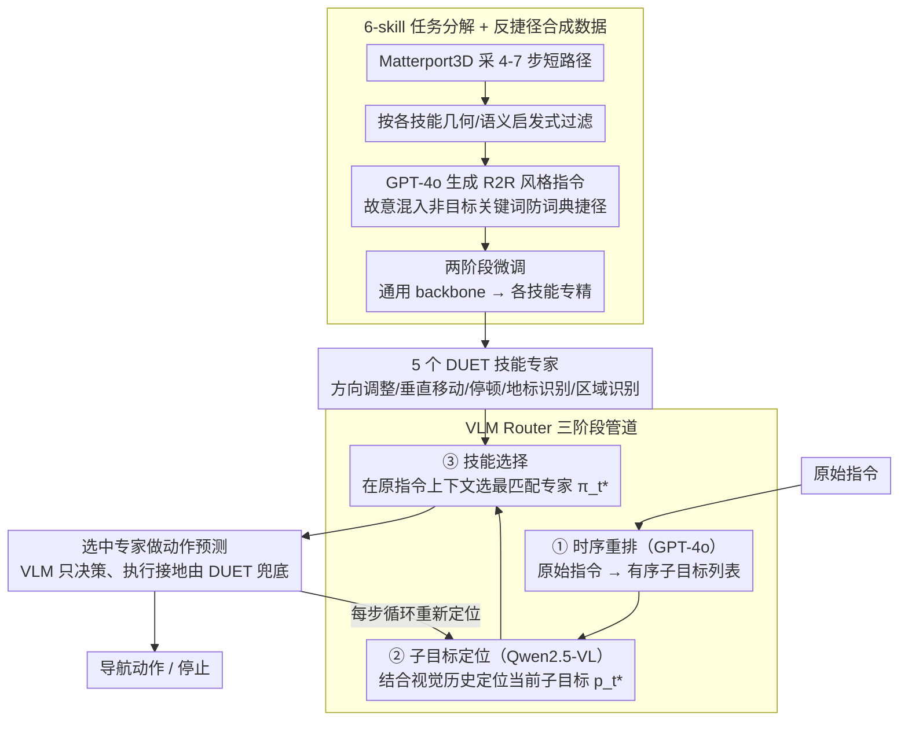

# Breaking Down and Building Up: Mixture of Skill-Based Vision-and-Language Navigation Agents

**会议**: ACL 2026  
**arXiv**: [2508.07642](https://arxiv.org/abs/2508.07642)  
**代码**: https://github.com/HLR/SkillNav  
**领域**: 机器人 / 视觉语言导航 / 模块化 agent  
**关键词**: VLN、技能分解、VLM router、合成数据、GSA-R2R 泛化

## 一句话总结
SkillNav 把视觉语言导航任务拆解成 5 个原子技能（方向调整、垂直移动、停顿、地标识别、区域识别）+ 1 个时序规划技能，每个技能用合成数据微调一个 DUET 子 agent，再用 training-free 的 VLM router 做时序重排 + 子目标定位 + 技能选择，在 GSA-R2R 上取得 SOTA 泛化能力（Test-N-Scene SPL 48% vs. 之前最高 43%）。

## 研究背景与动机

**领域现状**：VLN 主流路线两极分化——(1) 监督式黑盒 agent（DUET / BEVBERT / ScaleVLN / SRDF），在大规模合成数据上端到端训练，R2R in-domain 强但容易记忆训练轨迹；(2) zero-shot LLM/VLM agent（MapGPT / NavGPT / DiscussNav），泛化稳定但缺乏 fine-grained 视觉接地，与监督模型相比 SR 差距高达 ~36 个百分点。

**现有痛点**：监督模型在 GSA-R2R 这种「新建筑类型 + 新指令风格」场景下表现急剧下降；LLM 模型缺少 embodied grounding，无法精确选择 viewpoint。多 agent 协作工作（DiscussNav / FlexVLN / CLASH）虽然组合多模型，但常常每步激活多个模型造成冗余，且冲突时退回 zero-shot LLM 决策，又把 in-domain precision 牺牲掉了。

**核心矛盾**：「广泛泛化（需要 LLM 的世界知识）」与「精确执行（需要 fine-tune 的视觉接地）」之间的 trade-off。端到端 agent 偏后者，LLM agent 偏前者，二者无法兼得。

**本文目标**：(1) 找到「执行原子化的最小技能集」让每个技能可以单独训练到精；(2) 让 VLM 只在「技能选择 + 时序规划」这种高层决策上发挥推理优势，避免它直接接管低层动作；(3) 不依赖人工标注，用合成数据闭环训练每个技能 agent。

**切入角度**：作者复用 NavNuances 提出的 4 个原子技能（DC / VM / LR / RR）+ 自己加的 Stop 和 Temporal Order Planning 2 个技能，模仿人类「先把任务拆成可复用子动作，再按需调度」的思维方式。

**核心 idea**：用「skill decomposition + skill-specific synthetic data + VLM router」替代「monolithic end-to-end policy」，把高层规划与低层执行解耦，让 LLM 推理与 fine-tune 视觉接地各自发挥所长。

## 方法详解

### 整体框架
SkillNav 想解决的问题是：端到端导航 agent 在 in-domain 上很精、但换到新建筑/新指令风格就崩，而纯 LLM agent 泛化稳但接不上 fine-grained 的视觉接地。它的思路是把这两种能力解耦——先把"导航"拆成 5 个原子技能 $\mathcal{S} = \{\pi_{da}, \pi_{vm}, \pi_{sp}, \pi_{ld}, \pi_{ar}\}$（方向调整 / 垂直移动 / 停顿 / 地标识别 / 区域识别），每个技能用合成数据各自 fine-tune 成一个 DUET 专家，专门负责低层视觉接地与动作预测；再用一个 training-free 的 VLM router 负责高层推理，把原始指令重排成有序子目标、定位当前该执行哪个子目标、然后从 5 个专家里挑一个执行。整条 pipeline 里 LLM 只做"派谁去"的离散决策，真正预测动作的始终是 fine-tune 好的专家。

### 关键设计

**1. 6-skill 任务分解 + 反捷径合成数据 pipeline：把导航拆成能被单独训精的最小单元**

监督模型在 GSA-R2R 上崩，很大原因是单一巨型 policy 把所有子能力混在一起学、又容易记忆训练轨迹。SkillNav 复用 NavNuances 的 4 个原子技能（DC / VM / LR / RR）再补上 Stop 和 Temporal Order Planning，把任务切成 6 个语义独立的单元，让每个 agent 只专注学一件事。数据靠合成而非人工标注：从 Matterport3D 随机采 4-7 步短路径，按每个 skill 的几何/语义启发式过滤（如 Direction 要求频繁转向、Vertical 要求高度差 $>2$ 单位且必经楼梯），再让 GPT-4o 根据轨迹观测生成 R2R 风格指令，每个 skill 产 450 条（Temporal 单独 2,000 条）。关键是这套数据刻意"反捷径"——Vertical Movement 的数据里故意混入大量非垂直关键词（Landmark 18.72% + Direction 8.05%），逼模型从视觉上下文而非词典学习，因为同一个 "down" 在不同 dataset 里含义不同，靠关键词必然学歪。

**2. VLM Router 三阶段管道：让 LLM 只在该切换技能时介入，而不是每步都跑**

把高层规划交给 VLM 的难点是开销和时序推理——如果每步都让 VLM 接管低层动作，既慢又容易把推理错误和接地错误耦在一起。SkillNav 的 router 拆成三阶段流水：先用 GPT-4o 把"先 X 然后 Y 再 Z"这类带时序词的原始指令显式重排成有序子目标列表，把隐式的时序推理外化成结构脚手架；再用 Qwen2.5-VL-7B 结合视觉历史和已执行子目标，定位当前应执行的子目标 $p_t^*$ 并给出 reasoning trace $r_t$；最后由 Skill Router 在原指令上下文里选最匹配的专家 $\pi_t^* = \arg\max_{\pi \in \mathcal{S}} \text{Router}(I, p_t^*, r_t)$。三阶段分工让每次 VLM 调用任务专一、错误可定位，消融也证实显式时序重排是必要的——禁用它会让 Test-N-Scene SPL 掉 2.5%。

**3. VLM 推理与 fine-tune 执行的彻底解耦：让错误被局部化在"派错专家"而非"动作错"**

端到端 VLM agent 的通病是把推理和视觉接地的错误全耦合在一起，一处出错就整步崩。SkillNav 把 VLM 严格限制在"选哪个 skill"这个离散决策上，不让它直接预测动作；被选中的专家用自己的 DUET 权重 + 原始指令 + 当前观测 + 拓扑图做最终动作预测。这样 VLM 即使判断失误，最坏也只是"派错专家"，执行接地仍由训练好的 DUET 兜底，错误被限制在一个可解释的环节里。专家激活频次也印证了这种 precision-first 策略：控制类技能（$\pi_{sp}$ 34.42% + $\pi_{da}$ 23.61% = 58%）被频繁调用，而语义类技能（$\pi_{ld}$ 14.23% + $\pi_{ar}$ 18.75%）只在需要识别特定物体时才激活，说明导航里"持续状态校验"比"稀疏语义锚定"发生得更频繁。

### 损失函数 / 训练策略
两阶段 fine-tuning：Stage 1 在 ScaleVLN 增强数据 + R2R + Temporal 合成上 50,000 iter（batch 32, lr 5e-5）训出 skill-agnostic backbone；Stage 2 在每个 skill 专属数据集上 30,000 iter（batch 16）各自专精成 5 个专家。Router 用 vLLM + greedy decoding（temperature 0, max length 40,960），每步 top-1 选一个 skill。

## 实验关键数据

### 主实验：R2R + GSA-R2R 对比

| 方法 | R2R Val-Unseen SPL | R2R Test-Unseen SPL | GSA-R2R Test-R-Basic SPL | GSA-R2R Test-N-Basic SPL | GSA-R2R Test-N-Scene SPL |
|------|--------------------|---------------------|---------------------------|---------------------------|---------------------------|
| DUET | 60 | 59 | 47 | 37 | 30 |
| BEVBERT | 64 | 62 | 45 | 35 | 27 |
| ScaleVLN † | 70 | 68 | 67 | 57 | 43 |
| SRDF † | 78 | 77 | 63 | 49 | 43 |
| MapGPT (LLM) | 35 | — | 30 | 23 | 23 |
| NavGPT-2 (FlanT5-5B) | 61 | 60 | 45 | 35 | 43 |
| **SkillNav (ScaleVLN-Aug) †** | 77 (+6.54) | 70 (+1.80) | **69** (+2.18) | **61** (+4.18) | **48** (+5.26) |
| **SkillNav (SRDF-Aug) †** | **78** | **77** | 64 | 50 | 45 |

†=用大规模合成数据增强。GSA-R2R 上 SkillNav 把 SPL 推上了新 SOTA，Test-N-Scene SPL 比 ScaleVLN 涨 5.26 个百分点。

### 消融：Action Router 的两个机制

| Reorder | Router | Test-R-Basic SPL | Test-N-Basic SPL | Test-N-Scene SPL |
|---------|--------|------------------|------------------|------------------|
| ✗ | Qwen | 67.80 | 59.62 | 45.43 |
| ✔ | Qwen | **68.88** | **61.34** | **47.96** |
| ✗ | GLM | 66.27 | 58.63 | 42.64 |
| ✔ | GLM | 67.93 | 59.73 | 46.51 |
| Random skill (no router) | — | 67.46 | 59.71 | 43.17 |
| ✔ | GPT-4o | **69.18** | **62.48** | **48.96** |

### NavNuances 单技能评估（skill-based agents 各自在 own skill 上最强）

| Method | DC SR | VM SR | LR SR | RR SR |
|--------|-------|-------|-------|-------|
| ScaleVLN | 68.39 | 81.76 | 28.32 | 82.91 |
| SRDF | 59.93 | 82.94 | 26.28 | 77.09 |
| Direction Adjustment agent | **70.81** | 81.76 | 31.39 | 81.82 |
| Vertical Movement agent | 70.68 | **87.65** | 30.22 | 82.18 |
| Landmark Detection agent | 70.29 | 82.35 | **31.53** | 83.64 |
| Area and Region Ident. agent | 67.53 | 84.12 | 29.20 | **85.09** |

### 关键发现
- **去掉 Temporal Reordering** → Test-N-Scene SPL 掉 2.5%，证明显式时序结构脚手架不可或缺。
- **5-skill 子集消融**：用 2-4 个 skill 的所有组合都比 5 个 skill 差（如 4 skill 最佳 80.80 SR，5 skill 82.59 SR），证明分解的"完备性"重要。
- **专家激活频次**：控制类（$\pi_{sp}$ 34.42% + $\pi_{da}$ 23.61% = 58%）远高于语义类，说明"continuous state verification"比"sparse semantic anchoring"在 navigation 里更频繁。
- **Inference 开销**：SkillNav 9.69s/case，比 NavGPT/FlexVLN 快 2-4×，但仍比 ScaleVLN (28 inferences/s) 慢约 50×。

## 亮点与洞察
- **「skill 是高层语义概念，不是低层动作」的精确定位**：作者在附录 A.1 明确说原子 skill 定义在 semantic intent 层面，而非 motor execution 层面（如 "walk to the far end of the room" 是一个 Region Identification skill，即使底层执行多个 forward + 转向）。这种分层避免了"过度拆解"和"拆解过粗"两个极端。
- **VLM 只决策不执行**：把 VLM 限制在"选 skill"这一离散决策上，错误被局部化，而执行接地交给 fine-tune 好的 DUET。这种"high-level reasoning + low-level grounding"解耦是泛化的关键。
- **two-stage 微调防止 catastrophic forgetting**：Stage 1 先用大规模通用数据训得 backbone，Stage 2 再分支到 skill 专精，相比单阶段直接训 5 个 skill 更稳定。
- **合成数据的"反捷径"设计**：Vertical Movement 数据里故意包含大量非垂直关键词（Landmark 18.72% + Direction 8.05%），强迫模型从视觉而非词典学习；这种 anti-shortcut 数据构造值得借鉴。

## 局限与展望
- **只在离散 viewpoint 模拟器上评估**：未在 VLN-CE / Habitat 连续控制 / 真实机器人上验证，连续动作空间需要新的 skill executor。
- **Inference 开销仍较高**：比纯监督模型慢 50×，部署到 latency-constrained 场景需要 router 蒸馏或缓存。
- **技能库不完备**：未涵盖 object manipulation / 透明材质 / 人类感知导航等更专业场景，需要按需扩展。
- **GPT-4o + Qwen2.5-VL 闭源/开源混搭**：复现成本较高；如果 GPT-4o API 停用会影响 Temporal Reordering 质量。
- **错误分析揭示瓶颈在视觉接地**：作者人工分析 17 个失败案例发现，主要不是 router 推理错，而是 VLM 在杂乱场景里把"sink"绑定到错误物体——这暗示下一步要强化视觉 grounding 模块。

## 相关工作与启发
- **vs DUET (backbone)**：本文以 DUET 为基础，但把单个 DUET 拆成 5 个 skill-specific DUET + 一个 VLM router，泛化能力大幅提升。
- **vs ScaleVLN / SRDF**：同样用大规模合成数据增强，但本文进一步按 skill 分桶 + Stage 2 专精，比单一巨型 model 强。
- **vs MapGPT / NavGPT / DiscussNav**：纯 LLM 路线，零样本但缺乏视觉接地；本文用 VLM 只决策不执行，融合两边长处。
- **vs FlexVLN / CLASH (planner-executor)**：同样有 hierarchical 思想，但他们每步可能激活多个模型造成冗余，且冲突时退回 zero-shot；SkillNav 总是 top-1 选一个 best-fit specialist。
- **vs SAME (state-adaptive MoE)**：类似 MoE 思想，但 SAME 是隐式专家路由，SkillNav 是显式 skill semantic 路由，可解释性更强。

## 评分
- 新颖性: ⭐⭐⭐⭐ 「skill 分解 + VLM router + 合成数据闭环」组合，每个组件不算全新，但组合 + 跨 R2R/GSA-R2R 的稳定泛化收益是真实的
- 实验充分度: ⭐⭐⭐⭐⭐ R2R / GSA-R2R / RxR / NavNuances 4 个 benchmark + skill subset 消融 + temporal 消融 + router VLM 对比 + 失败案例分析 + leakage 分析 + inference 开销分析
- 写作质量: ⭐⭐⭐⭐ 附录极其详尽（Skill 定义 / Data 构造 / 偏见检查 / Hyperparams 全公开）
- 价值: ⭐⭐⭐⭐ 代码开源 + 项目页 + 合成数据 pipeline 都可复用；为 VLN 社区提供了一条「模块化 + LLM 推理」的可行路径

<!-- RELATED:START -->

## 相关论文

- [\[ACL 2026\] VLN-NF: Feasibility-Aware Vision-and-Language Navigation with False-Premise Instructions](vln-nf_feasibility-aware_vision-and-language_navigation_with_false-premise_instr.md)
- [\[ICML 2026\] Dive into the Scene: Breaking the Perceptual Bottleneck in Vision-Language Decision Making via Focus Plan Generation](../../ICML2026/robotics/dive_into_the_scene_breaking_the_perceptual_bottleneck_in_vision-language_decisi.md)
- [\[ICLR 2026\] Test-Time Mixture of World Models for Embodied Agents in Dynamic Environments](../../ICLR2026/robotics/test-time_mixture_of_world_models_for_embodied_agents_in_dynamic_environments.md)
- [\[CVPR 2026\] ProFocus: Proactive Perception and Focused Reasoning in Vision-and-Language Navigation](../../CVPR2026/robotics/profocus_proactive_perception_and_focused_reasoning_in_vision-and-language_navig.md)
- [\[CVPR 2026\] MergeVLA: Cross-Skill Model Merging Toward a Generalist Vision-Language-Action Agent](../../CVPR2026/robotics/mergevla_cross-skill_model_merging_toward_a_generalist_vision-language-action_ag.md)

<!-- RELATED:END -->
