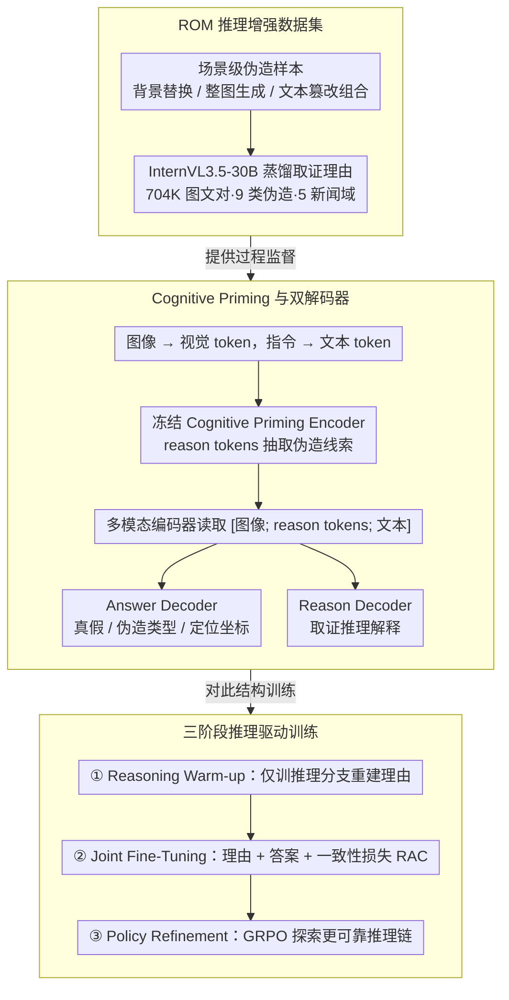

# Cultivating Forensic Reasoning for Generalizable Multimodal Manipulation Detection

**会议**: ACL2026  
**arXiv**: [2603.01993](https://arxiv.org/abs/2603.01993)  
**代码**: https://github.com/YcZhangSing/REFORM  
**领域**: 多模态取证 / AIGC检测  
**关键词**: 多模态伪造检测, 取证推理, GRPO, 伪造定位, ROM数据集

## 一句话总结
这篇论文提出 REFORM，把多模态伪造检测从“直接拟合标签”改成“学习可验证的取证推理过程”，并通过 ROM 推理标注数据集、双解码器和 GRPO 训练，在 ROM、DGM4 与 MMFakeBench 上取得更强的跨域泛化和可解释检测结果。

## 研究背景与动机
**领域现状**：多模态媒体伪造已经从局部人脸编辑扩展到整张新闻图像、背景、标题和正文之间的复杂组合伪造。已有 DGM4 系列方法、知识增强方法和视觉语言模型方法通常把任务建模为检测、分类或定位，输入图文新闻，输出真假、伪造类型和区域。

**现有痛点**：主流方法大多依赖结果导向监督，只要求模型从训练样本映射到最终标签。这样做在闭集数据上有效，但容易让模型记住特定数据集里的统计伪影，例如某类生成模型的纹理、某个新闻域的语言分布或某种编辑模式，而不是学会“为什么这里不一致”。一旦测试域、生成器或伪造方式变化，检测器就容易失效。

**核心矛盾**：多模态取证真正需要的是可迁移的逻辑证据链，而训练信号却常常只有最终答案。标签监督能告诉模型“这是假”，但很少约束模型必须找到可信的视觉证据、文本证据以及二者之间的矛盾。

**本文目标**：作者希望同时解决三个子问题：构造覆盖面更广且带推理标注的基准；让模型显式生成取证理由并保持理由与答案一致；在 SFT 之后继续用强化学习约束推理链的格式、准确性、定位和一致性。

**切入角度**：论文的核心观察是，泛化能力不应只来自更大的视觉语言模型或更多外部知识，而应来自对“取证思维过程”的优化。只要训练目标能奖励正确、连贯且可定位的推理链，模型就更可能抓住跨域稳定的伪造逻辑。

**核心 idea**：用推理驱动优化代替单纯结果拟合，让检测器先学会解释伪造证据，再用一致性损失和 GRPO 将解释、分类和定位绑在一起。

## 方法详解

### 整体框架
REFORM 想解决的问题是：现有多模态伪造检测靠结果导向监督，只把样本映射到最终标签，于是模型记住的是某个数据集的统计伪影，换域/换生成器就失效。它的思路是把检测改写成"学习可验证的取证推理过程"，从数据、结构、训练三处闭环。输入一条多模态新闻样本（图像 + 文本提示 + 待判断图文内容），模型先把图像编码成视觉 token、把任务指令编码成文本 token，再通过冻结的 Cognitive Priming Encoder 让一组可学习的 reason tokens 从视觉与文本上下文中抽取伪造线索；编码后并行接入两个解码器——Answer Decoder 输出真假/伪造类型/定位坐标，Reason Decoder 输出解释性取证推理。训练分三阶段：先单训推理分支让 reason tokens 对齐蒸馏理由，再解冻整体同时生成理由和答案并加一致性约束，最后用 GRPO 从多条候选推理里学更可靠的路径。

### 关键设计

**1. ROM 推理增强数据集：把训练信号从"短答案"换成"覆盖更广的场景级伪造 + 取证理由"**

传统 DGM4 偏人脸编辑，模型很容易只学局部伪影、跨域就崩。ROM 在 MDSM 的人脸类别上继续扩展，加入 BackgroundReplacement、FullGeneration 以及与 TextFabrication 组合的场景级伪造类别，规模达 704,456 个图文对，覆盖 5 个新闻域、9 类伪造，并用 InternVL3.5-30B 为每个样本蒸馏出约 130 token 峰值长度的文字推理说明。把伪造范围扩到整图生成和背景替换，迫使模型关注跨模态逻辑矛盾而非人脸纹理；而每条样本带的取证理由，则比单一标签提供了远更丰富的过程监督，是后续推理训练的原料。

**2. Cognitive Priming 与双解码器：把"找证据"和"给答案"拆成相关但不互相拖累的两个生成任务**

如果共用一个解码器，答案生成和理由生成的梯度会互相冲突。REFORM 让冻结的 Cognitive Priming Encoder 处理 $S_{inp}=[T_i;T_r;T_t]$ 后只保留更新过的 reason tokens $\hat{T}_r$，随后多模态编码器读取 $S_p=[T_i;\hat{T}_r;T_t]$，分别交给 Answer Decoder 输出结构化预测、Reason Decoder 输出取证解释。两个解码器各自优化，避免梯度打架，还顺带支持推理模式和快速答案模式切换——Fast Mode 可以直接跳过理由生成而预测不变，部署时按需取舍。

**3. 三阶段推理驱动训练：让模型从"会说理由"过渡到"理由支撑答案"，再到"主动探索更可靠的理由"**

纯 SFT 只模仿标注理由，容易曝光偏差、出现"理由说 A、答案判 B"的自洽断裂。REFORM 分三阶段递进：Reasoning Warm-up 冻结其余模块、只用理由语言建模损失 $\mathcal{L}_{LM_r}$ 训练推理分支重建取证理由；Joint Fine-Tuning 解冻整体，加上答案损失 $\mathcal{L}_{LM_a}$ 和理由-答案一致性损失 $\mathcal{L}_{RAC}=\max\{0,\eta-\cos(\mathbf{v}^R,\mathbf{v}^A)\}$，整体目标 $\mathcal{L}_{RJF}=\mathcal{L}_{LM_r}+\mathcal{L}_{LM_a}+\mathcal{L}_{RAC}$，用余弦间隔强约束理由向量和答案向量对齐；Policy Refinement 用 GRPO，让模型在候选理由之间比较，奖励那些既符合格式、又能被验证器支持、且与最终答案一致的推理链。消融显示这一阶段对跨域增益最大。

### 损失函数 / 训练策略
重点不是加一个分类头，而是把推理链纳入优化目标。Warm-up 阶段冻结多模态编码器、答案解码器和 Cognitive Priming Encoder，只更新 reason tokens 与 Reason Decoder；Joint Fine-Tuning 同时优化理由与答案，并用 $\mathcal{L}_{RAC}$ 防止语义断裂；Policy Refinement 用 GRPO，其 Consistency Verifier 由 TinyBERT + 两个分类头构成，在理由-标签对上达到 >99% 分类准确率，用来判断生成理由能否推出模型自己的伪造类型预测。

## 实验关键数据

### 主实验
| 数据集 / 设置 | 指标 | REFORM | 对比对象 | 结果解读 |
|--------|------|------|----------|------|
| ROM 跨域设置 | AVG ACC | 88.22 | AMD 85.92 / HAMMER 72.41 / MMD-Agent-34B 57.45 | 在新新闻域上明显优于特征对齐、传统检测和检索式 agent pipeline |
| ROM Guardian 测试域 | ACC / mAP / mIoU | 81.52 / 67.75 / 81.64 | 缓存表格给出 REFORM 具体值 | 说明推理监督在跨域域外测试中仍能维持较高检测和定位质量 |
| MMFakeBench 零样本二分类 | F1 | 74.9 | 多种 7B/13B LVLM baseline | 面对未见过的手工 PS 等类型，小模型仍能靠取证推理获得强零样本泛化 |
| DGM4 | ACC / AVG mAP | 76.65 / 65.72 | fine-tuned LVLMs 的 mAP 低于 47 | 在人脸中心的 DGM4 上也优于更专门的检测器，说明方法不是只服务 ROM |
| 效率 | 参数量 / 吞吐 | 376M / Fast Mode 13.17 pairs/s | FKA-Owl 6.7B，MMD-Agent 34B | 双解码器使解释模式和快速筛查模式可分离，参数量远小于大模型 agent |

### 消融实验
| 配置 | NYT ACC | NYT mAP | NYT mIoU | Guardian ACC | Guardian mAP | Guardian mIoU | 说明 |
|------|---------|---------|----------|--------------|--------------|---------------|------|
| $\mathcal{L}_{LM_a}$ | 84.88 | 66.16 | 75.98 | 72.18 | 45.86 | 78.72 | 只训练答案，仍是结果导向学习 |
| $\mathcal{L}_{LM_a}+\mathcal{L}_{LM_r}$ | 87.76 | 73.01 | 77.68 | 74.74 | 53.65 | 79.59 | 加入理由监督后检测和定位同步提升 |
| + $\mathcal{L}_{RAC}$ | 87.84 | 73.25 | 78.00 | 75.71 | 54.11 | 79.58 | 理由-答案一致性带来进一步增益 |
| + GRPO | 88.22 | 76.08 | 78.48 | 81.52 | 67.75 | 81.64 | 强化学习阶段贡献最大，尤其提升 Guardian mAP |

### 关键发现
- 推理分支不是装饰性解释。单独加入 $\mathcal{L}_{LM_r}$ 就把 NYT ACC 从 84.88 提到 87.76，把 Guardian mAP 从 45.86 提到 53.65。
- GRPO 对跨域泛化尤其关键。完整模型在 Guardian 上从 SFT+RAC 的 75.71 ACC / 54.11 mAP 提升到 81.52 ACC / 67.75 mAP。
- 理由 token 长度存在甜点。缓存中写明 32 token 达到最优 ACC 88.22，过短会丢失细节，过长则可能增加生成负担。
- 教师质量不是唯一来源。把 InternVL3.5-30B 教师换成 Qwen2.5-VL-3B 后，Guardian 上仅下降 0.84 ACC、1.46 mAP 和 0.33 mIoU。
- 解释模式有成本。Explainable Mode 只有 1.03 pairs/s，而 Fast Mode 有 13.17 pairs/s；好在答案解码器不依赖生成理由，所以快速模式不损失预测精度。

## 亮点与洞察
- 最有价值的设计是把可解释性从“事后展示”变成“训练约束”。很多检测论文也能输出解释，但 REFORM 让理由在训练目标和 RL 奖励中持续发挥作用。
- ROM 的重要性不只是规模大，而是类别边界更接近真实伪造生态。背景替换、整图生成和文本篡改组合能迫使模型关注跨模态逻辑矛盾，而不是只盯人脸纹理。
- 双解码器是一个实用的工程折中。训练时保留解释监督，部署时可以选择 Fast Mode，这让“可解释”和“实时筛查”不再互相排斥。
- TinyBERT verifier 的使用很巧妙。它不直接替代主模型，而是给 GRPO 一个可计算的一致性信号，使理由生成不至于变成不可控的长文本奖励问题。

## 局限与展望
- 作者承认 REFORM 依赖蒸馏理由。虽然人工审计显示理由能召回 83.7% 视觉证据和 82.2% 文本证据，但理由本身没有被显式质量优化，教师幻觉或模板化解释仍可能传导给学生模型。
- 解释模式延迟较高。1.03 pairs/s 适合审计或复核，但不适合所有实时场景；未来可以研究非自回归理由生成、理由缓存或先筛查后解释的两阶段部署。
- ROM 有双重用途风险。论文选择不公开生成 pipeline、详细 prompts 和 prompt-response pairs，这是必要的伦理控制，但也会影响外部复现实验的完整性。
- 目前的取证理由主要是文本链路。未来可以考虑把理由和可视化证据、区域轨迹、反事实编辑结合起来，让解释更接近人类取证流程。

## 相关工作与启发
- **vs HAMMER / HAMMER++**: HAMMER 系列强调视觉和文本伪造特征对齐，以及多分支 transformer 检测与定位。REFORM 不只对齐特征，而是把取证推理链作为可优化对象，跨域 ACC 和 mAP 更强。
- **vs FKA-Owl**: FKA-Owl 用 LVLM 和伪造知识增强泛化，但本质仍偏知识增强检测。REFORM 的优势在于即使没有外部检索式 agent，也能通过推理训练内化更稳定的判断逻辑。
- **vs AMD**: AMD 引入 artifact tokens 和 Manipulation-Oriented Reasoning，是最接近本文的取证推理 baseline。REFORM 更进一步加入理由-答案一致性和 GRPO 策略精炼，实验中 ROM AVG ACC 达到 88.22，高于 AMD 的 85.92。
- **vs MMD-Agent**: MMD-Agent 用外部知识和多步骤 agent 分解检测任务，参数和推理开销更大。REFORM 用 376M 参数模型达到更强 ROM 跨域表现，提示“训练时学推理”可以替代一部分“测试时搭 agent”。

## 评分
- 新颖性: ⭐⭐⭐⭐⭐ 把多模态伪造检测明确改写为推理驱动优化，并用数据、结构、损失和 RL 奖励完整闭环。
- 实验充分度: ⭐⭐⭐⭐⭐ 覆盖 ROM、MMFakeBench、DGM4、组件消融、效率、教师鲁棒性和理由可信度审计。
- 写作质量: ⭐⭐⭐⭐☆ 主线清楚，表格很全，但公式和表格抽取文本较密，部分附录细节读起来负担较重。
- 价值: ⭐⭐⭐⭐⭐ 对 AIGC 取证、可解释检测和小模型泛化都有直接启发，尤其适合后续做可验证推理监督。

<!-- RELATED:START -->

## 相关论文

- [\[ACL 2026\] GoViG: Goal-Conditioned Visual Navigation Instruction Generation via Multimodal Reasoning](govig_goal-conditioned_visual_navigation_instruction_generation_via_multimodal_r.md)
- [\[CVPR 2026\] FantasyVLN: Unified Multimodal Chain-of-Thought Reasoning for Vision-and-Language Navigation](../../CVPR2026/robotics/fantasyvln_unified_multimodal_chain-of-thought_reasoning_for_vision-and-language.md)
- [\[CVPR 2026\] AdaDexTrack: Dynamic Modulation for Adaptive and Generalizable Dexterous Manipulation Tracking](../../CVPR2026/robotics/adadextrack_dynamic_modulation_for_adaptive_and_generalizable_dexterous_manipula.md)
- [\[CVPR 2026\] AffordGen: Generating Diverse Demonstrations for Generalizable Object Manipulation with Affordance Correspondence](../../CVPR2026/robotics/affordgen_generating_diverse_demonstrations_for_generalizable_object_manipulatio.md)
- [\[ACL 2025\] SELF-PERCEPT: Introspection Improves LLMs' Detection of Multi-Person Mental Manipulation in Conversations](../../ACL2025/robotics/self_percept_manipulation_detection.md)

<!-- RELATED:END -->
