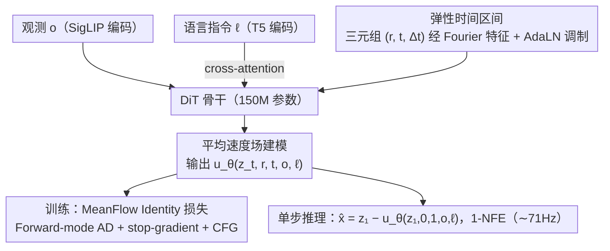

# ElasticFlow: One-Step Physics-Consistent Policy with Elastic Time Horizons for Language-Guided Manipulation

**会议**: ACL 2026 Findings  
**arXiv**: [2605.08799](https://arxiv.org/abs/2605.08799)  
**代码**: 待确认  
**领域**: 具身智能 / 扩散策略 / 流匹配 / 机器人操作  
**关键词**: 单步扩散、平均速度场、弹性时间、流匹配、VLA

## 一句话总结
提出 ElasticFlow：用平均速度场 (MeanFlow) 取代瞬时速度场学习语言条件机器人动作，配合 "弹性时间区间 $\Delta t=t-r$" 显式编码控制粒度，实现 1-NFE 单步推理 (∼71Hz)，在 LIBERO-Long、CALVIN ABC-D 等长程任务上超过 OpenVLA 与 $\pi_0$。

## 研究背景与动机

**领域现状**：在具身智能里，将视觉观测 + 语言指令映射到连续动作的 generalist policy 主要走两条路：扩散策略 (Diffusion Policy / $\pi_0$ 等) 因强多模态建模能力成为主流；自回归 VLA (OpenVLA / RT-2) 则靠 token 离散化做语言-动作对齐。

**现有痛点**：扩散策略的迭代去噪需要十几次 NFE (Network Function Evaluation)，延迟 > 100ms，控制频率只有 8–12Hz，无法响应快速变化的物理环境 (如截击滚动物体)；现有加速方案 (Consistency Model / Progressive Distillation) 又要复杂的师生 pipeline，且常常牺牲 "物理一致性"——动作出现高频抖动 (Jerk) 或路径不光滑。自回归 VLA 因 token-by-token 生成更慢 (∼5Hz) 且离散化引入量化误差。

**核心矛盾**：(1) 推理速度与物理一致性此消彼长，单纯压步数会让轨迹失去几何平滑性；(2) 机器人任务的 "时间异质性" 被忽略——短程反应控制要毫秒级 jitter 抑制，长程任务要秒级 trajectory planning，传统固定 horizon 网络陷入 Spectral Bias，无法同时建模高频和低频信号。

**本文目标**：(1) 跳过 distillation 直接做 1-NFE 推理；(2) 让单步预测在几何上仍然光滑、符合物理；(3) 让同一套权重既能做毫秒级 reactive control，又能做长程 multi-stage 规划。

**切入角度**：Geng 等 (2025) 在生成式建模里提出的 MeanFlow——直接学习时间区间 $[r,t]$ 上的 "平均速度" 而非瞬时速度，单次前向即可得到从噪声到数据的整体位移。作者把这个思路嫁接到机器人动作流，再把 $\Delta t=t-r$ 暴露给网络作为 "控制粒度旋钮"。

**核心 idea**：在动作生成里用平均速度场 $u(z_t,r,t)$ 代替瞬时速度 $v(z_t,t)$，并以 $\Delta t$ 作为 "频谱缩放镜头" (Spectral Zoom Lens) 同时统一短程反应和长程规划。

## 方法详解

### 整体框架
ElasticFlow 想同时解决两件事：让语言条件动作策略做到 1-NFE 单步推理却不丢物理一致性，并让同一套权重既能毫秒级反应控制、又能秒级长程规划。整体流程是：观测 $o$ 经 SigLIP 编码、语言指令 $\ell$ 经 T5 编码，通过 cross-attention 注入一个 150M 参数的 DiT 骨干；Elastic Time Horizon 模块把时间三元组 $(r,t,\Delta t)$ 用 Fourier 特征编码后经 AdaLN 调制注入；网络输出的不是瞬时速度而是平均速度场预测 $u_\theta(z_t,r,t,o,\ell)$。训练用 MeanFlow Identity Loss 配 Forward-mode AD 监督；推理时给定 $z_1\sim\mathcal{N}(0,I)$，单次前向即得动作块 $\hat{x}=z_1-u_\theta(z_1,0,1,o,\ell)$，全程无迭代、无蒸馏。

### 关键设计

**1. 平均速度场建模（MeanFlow Identity）：把动作生成从"多步 ODE 积分"改成"学一个一步映射"**

扩散策略推理慢的根因是它学的是瞬时速度——瞬时速度只描述局部切向，必须靠十几步 ODE 积分才能恢复全局位移，所以多步是"必须的代价"，而硬压步数又会让轨迹失去几何光滑性、出现高频抖动。ElasticFlow 改学时间区间上的平均速度 $u(z_t,r,t)\triangleq\frac{1}{t-r}\int_{r}^{t}v(z_\tau,\tau)d\tau$，由微积分基本定理推出恒等式 $u(z_t,r,t)=v(z_t,t)-(t-r)\frac{d}{dt}u(z_t,r,t)$（其中 $\frac{d}{dt}$ 是含 $v\cdot\nabla_z u$ 与 $\partial_t u$ 的全导数），训练时把网络预测往这个恒等式右端拉，瞬时速度 ground truth 用最优传输路径 $v(z_t,t)=x_{\text{target}}-x_{\text{noise}}$ 构造。这样单步预测就内含整个时间区间的几何信息，而 $(t-r)\frac{d}{dt}u$ 这一项天然就是"流形曲率修正"，从公式层面抑制了抖动——实验里单步 ElasticFlow 的 Jerk（$1.1\times 10^{-3}$）比 10 步标准 CFM（$3.2\times 10^{-3}$）还低。

**2. 弹性时间区间（Elastic Time Horizon）：用一个连续参数 $\Delta t$ 让同一网络在高频反应与低频规划间无缝切换**

机器人任务有"时间异质性"——短程反应控制要毫秒级 jitter 抑制，长程任务要秒级 trajectory planning，而神经网络存在 Spectral Bias，固定 horizon 难以同时拟合高频和低频信号。ElasticFlow 除了绝对时间 $t$，把区间长度 $\Delta t=t-r$ 也送进网络，二者一起经高斯傅里叶特征 $\text{Emb}(r,t)=\text{MLP}([\text{FF}(t),\text{FF}(t-r)])$ 编码后由 AdaLN 调制 DiT。推理时按任务粒度选 $\Delta t$：小 $\Delta t$ 聚焦局部姿态调整，大 $\Delta t$ 做长程轨迹规划，单一权重空间内动态切换，执行时再按目标控制频率把连续流离散成 $N$ 步、物理步长 $\delta t=T/N$。显式注入 $\Delta t$ 等于告诉网络"现在该看多大尺度"，相当于一个 spectral zoom lens；Mismatch 测试（强制错配 $\Delta t$）把这层物理意义验证得很直接——强迫长程任务用小 $\Delta t$ 就"近视"掉到 45.3%，强迫短程用大 $\Delta t$ 就"迟钝"掉到 55.7%。

**3. Forward-mode AD + Stop-gradient + CFG 训练：稳定地把 MeanFlow Identity 当训练目标，并支持语言条件引导**

直接对这个带自引用（bootstrapped）的目标求梯度会发散，二阶项算力也吃不消。损失写作 $\mathcal{L}(\theta)=\mathbb{E}_{t,r,x_1,\epsilon,c}[\|u_\theta(z_t,r,t,o,c)-\text{sg}(\mathcal{T}_{\text{target}})\|_2^2]$，其中 $\mathcal{T}_{\text{target}}=v(z_t,t)-(t-r)(v(z_t,t)\cdot\nabla_z u_\theta+\partial_t u_\theta)$。这里 stop-gradient $\text{sg}(\cdot)$ 把自引用项隔离开来稳定优化，雅可比-向量积 $\nabla_z u_\theta$ 用前向模式自动微分高效算掉、避开 Hessian 开销；同时把条件 $c\in\{\ell,\emptyset\}$ 以概率 $p_{\text{drop}}$ 替换为空做联合训练，推理时用 $\hat{x}=z_1-(u_\theta(\cdot,\emptyset)+w(u_\theta(\cdot,\ell)-u_\theta(\cdot,\emptyset)))$ 实现 Classifier-Free Guidance，让单步推理也能调节语义对齐强度。

### 损失函数 / 训练策略
最小化到 MeanFlow Identity 目标 $\mathcal{T}_{\text{target}}$ 的均方误差（loss 形式见上）；$\text{sg}(\cdot)$ stop-gradient 稳定 bootstrap；CFG drop 概率 $p_{\text{drop}}$，推理 guidance scale $w\in[1.5,2.5]$ 内稳定；DiT 骨干仅 150M 参数，比 Diffusion Policy 的 300M UNet 还轻。

## 实验关键数据

### 主实验
**LIBERO 四套件 + CALVIN ABC-D**：

| Benchmark / 指标 | ElasticFlow | 之前 SOTA | 关键基线 |
|---|---|---|---|
| LIBERO-Spatial (SR ↑) | 98.4 | 98.8 (HiF-VLA) | $\pi_0$ 96.8 |
| LIBERO-Object (SR ↑) | 99.3 | 99.4 (HiF-VLA) | $\pi_0$ 98.8 |
| LIBERO-Goal (SR ↑) | **98.7** | 97.9 (OpenVLA-OFT) | $\pi_0$ 95.8 |
| LIBERO-Long (SR ↑) | **97.6** | 96.4 (HiF-VLA) | $\pi_0$ 85.2 |
| LIBERO 平均 | **98.5** | 98.0 (HiF-VLA) | Octo 75.1 |
| CALVIN ABC-D 第三人称 (Avg.Len. ↑) | **4.15** | 4.08 (HiF-VLA) | $\pi_0$ 3.65 |
| CALVIN ABC-D 多视角 (Avg.Len. ↑) | **4.37** | 4.35 (HiF-VLA) | $\pi_0$ 3.92 |
| RoboTwin Long & Extra Long (SR ↑) | **71.1** | 69.0 (SimpleVLA-RL) | $\pi_0$ 43.3 / RDT 27.8 |

LIBERO-Long 的 12 个百分点跃升 (从 $\pi_0$ 的 85.2 到 97.6) 最值钱——长程任务恰好是扩散策略最容易失效的场景。

**推理延迟 (RTX 4090, batch=1)**：

| 方法 | NFE | 时延 (ms) ↓ | 频率 (Hz) ↑ |
|------|-----|-----------|------------|
| OpenVLA (7B Transformer) | Auto-reg. | 200.0 | ∼5 |
| Diffusion Policy (300M UNet) | 16 (DDIM) | 120.0 | ∼8 |
| $\pi_0$ (300M DiT) | 10 (Euler) | 85.0 | ∼12 |
| Consistency Policy | 2 | 28.0 | ∼35 |
| **ElasticFlow (150M DiT)** | **1** | **14.0** | **∼71** |

相比 Diffusion Policy 5×、相比 OpenVLA 14× 的加速。

### 消融实验

| 配置 | Long Horizon SR | Short Horizon SR | 说明 |
|------|----------------|----------------|------|
| w/o Horizon Input | 52.7% | 61.5% | 去掉 $\Delta t$，掉 18.4 个点 |
| Fixed $\Delta t=10$ | 58.2% | 94.5% | 短程强长程弱 |
| Fixed $\Delta t=50$ | 62.1% | 55.4% | 长程稍强短程崩 |
| Mismatch Force $\Delta t=10$ on Long | 45.3% | — | 近视：只看眼前 |
| Mismatch Force $\Delta t=50$ on Short | — | 55.7% | 迟钝：反应不过来 |
| **ElasticFlow (Dynamic $\Delta t$)** | **71.1%** | **98.2%** | 完整模型 |

| 训练目标 | 步数 | 成功率 | Jerk ↓ | 时延 |
|---------|------|-------|-------|------|
| 标准 CFM ($v_t$) | 1-NFE | 12.4% | $8.5\times 10^{-2}$ | 14ms |
| 标准 CFM ($v_t$) | 10-NFE | 68.5% | $3.2\times 10^{-3}$ | 140ms |
| **ElasticFlow ($u_t$)** | **1-NFE** | **71.1%** | $\mathbf{1.1\times 10^{-3}}$ | **14ms** |

### 关键发现
- $\Delta t$ 模块是 ElasticFlow 的最大功臣：去掉它直接掉 18.4 个点，Mismatch Test (强制错配 $\Delta t$) 在长程任务上跌到 45.3%、在短程上跌到 55.7%，从两个方向证伪了 "固定 horizon 也行" 的偷懒方案。
- 平均速度场建模带来的最直接好处是 1-NFE 还能保持高物理一致性：单步 ElasticFlow 的 Jerk ($1.1\times 10^{-3}$) 比 10 步 CFM ($3.2\times 10^{-3}$) 还低，证明曲率修正项确实从公式层面抑制了抖动。
- 标准 Flow Matching 在单步下基本崩 (SR 12.4%)，但 ElasticFlow 单步 71.1%——说明速度不是 "更小的模型 + 更多步" 能换的，关键是建模对象本身要变。
- ElasticFlow 在 CALVIN 第 4、5 条指令上仍保持 83.6% / 72.7% 成功率，长程指令链稳定性显著优于易在前几任务后衰减的 baseline，验证了 MeanFlow Identity 强制的全局一致性。
- CFG guidance scale $w$ 在 $[1.5, 2.5]$ 区间内稳定，对超参不敏感。

## 亮点与洞察
- "学平均速度而非瞬时速度" 是一次思维范式的转换：把 ODE 积分这个推理瓶颈从 "运行时计算" 移到了 "训练时表征"，1-NFE 不再是工程妥协而是数学等价。
- 弹性时间区间 $\Delta t$ 的设计极其经济：只多输入一维参数 + Fourier 编码，却让一个网络同时拿下高频反应控制和长程规划，等于把 "需要训几个不同 horizon 网络再级联" 的问题彻底压平。
- "Spectral Zoom Lens" 的隐喻不只是说法漂亮——Mismatch Test 直接做了物理意义的实验验证，把谱偏置 (Spectral Bias) 这个抽象问题落到了可观察的机器人行为上，这种 "用 mismatched 输入做反事实分析" 的实验范式值得借鉴。
- Distillation-free 是一个被低估的工程价值：现有 Consistency Policy / Progressive Distillation 都要先训教师再蒸馏，工程链长且容易模式崩塌；ElasticFlow 直接一阶段训练就能 1-NFE，落地成本骤降。

## 局限与展望
- 数据规模仅到百万级交互，未在 Open X-Embodiment 这类十亿级跨本体数据上验证 scaling law，能否成为通用机器人基础模型的生成头还需进一步证明。
- Forward-mode AD 计算雅可比向量积虽然比 Hessian 便宜，但相比标准训练仍有显著额外开销；作者没有给训练 wall-clock 详尽对比。
- $\Delta t$ 的选择当前还是任务先验，没有一个学习器自动决定 "现在该用多大 horizon"；理想情况是 $\Delta t$ 由策略本身根据上下文自适应选出。
- 语言条件只通过 cross-attention 注入，对长 / 多阶段复杂指令的语义解析能力仍受限于 T5 编码器；未来若与 MLLM 做更深层 latent 融合可能进一步突破。
- 高频 (71Hz) 单步推理也意味着模型对策略错误的纠错时间极短，与 MPC / 在线 RL 结合做 closed-loop correction 是自然方向。
- Sim-to-Real 仅在 xArm6 上做了 7 个任务的定性 + 部分定量评估，跨平台真实部署可靠性尚未充分论证。

## 相关工作与启发
- **vs Diffusion Policy (Chi 2023) / $\pi_0$**：本质都是 flow / diffusion，但 DP / $\pi_0$ 学瞬时速度需要多步积分；ElasticFlow 直接学平均速度场，1 步即可且物理更光滑。
- **vs Consistency Policy (Prasad 2024) / Progressive Distillation**：那些方案要先训扩散教师再蒸馏，pipeline 复杂且常牺牲多样性；ElasticFlow 是 distillation-free 的一阶段训练。
- **vs OpenVLA / CogACT / OpenVLA-OFT**：自回归 VLA 走 token 离散化，频率低且量化误差大；ElasticFlow 直接在连续动作空间生成，频率高一个数量级。
- **vs MeanFlow (Geng 2025)**：思想直接来自 MeanFlow 的图像生成版本，本文把它落到机器人动作 + 加上 Elastic Time Horizon + 语言条件 CFG，是 MeanFlow 思想在具身控制场景的首次工程实现。
- **vs ACT (Zhao 2023)**：ACT 用 action chunking + 启发式时间集成减轻推理压力，但容易过平滑；ElasticFlow 在公式层面强制物理一致，且 $\Delta t$ 可动态调整 chunk 长度。

## 评分
- 新颖性: ⭐⭐⭐⭐ MeanFlow 思想在机器人控制的首次落地 + 弹性时间区间机制是清晰的创新组合。
- 实验充分度: ⭐⭐⭐⭐ LIBERO / CALVIN / RoboTwin / RoboCasa 仿真 + xArm6 真机 + 推理延迟扫描覆盖全面；Mismatch Test 设计巧妙。
- 写作质量: ⭐⭐⭐⭐ 公式推导清晰，"Spectral Zoom Lens" 类比 + Figure 2 几何解释易懂；正文偏密但结构紧凑。
- 价值: ⭐⭐⭐⭐⭐ 给 VLA / 机器人扩散策略提供了一个真正可上车的 1-NFE 范式，工程价值与方法价值兼具。

<!-- RELATED:START -->

## 相关论文

- [\[ICML 2026\] Mixture of Horizons in Action Chunking](../../ICML2026/robotics/mixture_of_horizons_in_action_chunking.md)
- [\[ICLR 2026\] VLBiMan: Vision-Language Anchored One-Shot Demonstration Enables Generalizable Bimanual Robotic Manipulation](../../ICLR2026/robotics/vlbiman_vision-language_anchored_one-shot_demonstration_enables_generalizable_bi.md)
- [\[CVPR 2026\] SRPO: Self-Referential Policy Optimization for Vision-Language-Action Models](../../CVPR2026/robotics/srpo_self-referential_policy_optimization_for_vision-language-action_models.md)
- [\[ICLR 2026\] Real-Time Robot Execution with Masked Action Chunking](../../ICLR2026/robotics/real-time_robot_execution_with_masked_action_chunking.md)
- [\[ICLR 2026\] MoMaGen: Generating Demonstrations under Soft and Hard Constraints for Multi-Step Bimanual Mobile Manipulation](../../ICLR2026/robotics/momagen_generating_demonstrations_under_soft_and_hard_constraints_for_multi-step.md)

<!-- RELATED:END -->
