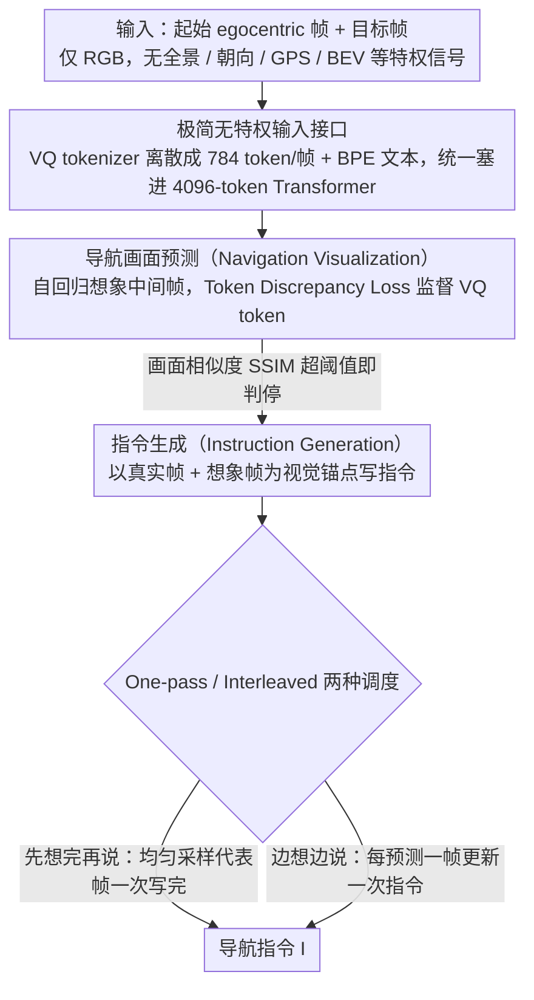

# GoViG: Goal-Conditioned Visual Navigation Instruction Generation via Multimodal Reasoning

**会议**: ACL 2026 Findings  
**arXiv**: [2508.09547](https://arxiv.org/abs/2508.09547)  
**代码**: https://github.com/F1y1113/GoViG (有)  
**领域**: 机器人 / 视觉语言导航 (VLN)  
**关键词**: 导航指令生成、egocentric、世界模型、多模态推理、Anole-7B

## 一句话总结
GoViG 提出一个**只靠第一视角初始与目标观测**就能生成导航指令的新任务，并把它拆成"先想象中间画面再写指令"两步，用 Anole-7B 在 token 级 MSE + 标签平滑 CE 双目标下联合训练，配合 one-pass / interleaved 两种多模态推理策略，把 BLEU-4 从基线 0.08 推到 0.32 并在跨域真实视频上保持 0.27。

## 研究背景与动机

**领域现状**：VLN 主流研究是"读指令做导航"，反向的"看画面写指令"主要被用来做数据增广。代表方法（Speaker-Follower、LANA、C-Instructor、BEV-Instructor、NavRAG、MapInstructor）几乎都依赖**特权输入**——全景图、动作历史、朝向、GPS、3D bbox、BEV map、scene graph 等。

**现有痛点**：(1) 这些特权信号在真实部署（盲人辅助、家用机器人、未知环境救援）里根本拿不到；(2) 即便把视觉先压成 landmark / 文本摘要再交给 LLM，关键的**空间和语义细节**就丢了；(3) 通用 MLLM (GPT-4o, Gemini, Claude) 缺乏"心理预演"机制——人类规划路线时会先脑补中间画面，模型直接从两端观测跳到自然语言指令，结果出现时序断裂和方位错误。

**核心矛盾**：想要泛化就必须扔掉特权输入只用 egocentric RGB；但只给两端画面信息量极稀疏，直接生成长指令会"幻觉"——必须**显式地把中间状态生成出来**作为指令的视觉锚点。

**本文目标**：(1) 形式化定义 GoViG 任务——输入只有 $\mathcal{O}=\{o_1,\dots,o_n\}$ 和 $o_g$，输出自然语言指令 $I$；(2) 设计一个能同时做"画面预测 + 指令生成"的统一自回归 MLLM；(3) 构造真实+合成混合 benchmark 验证跨域泛化。

**切入角度**：借鉴 world model 思想——既然指令本质上是对"未来观测序列"的语言描述，那就让模型像人一样"先想象 → 再说话"。把任务分解为 Navigation Visualization (预测下一帧) 和 Instruction Generation with Visual Cues (基于真实+预测帧写指令)。

**核心 idea**：在 Anole-7B（基于 Chameleon 的统一图文自回归模型）上**用同一 Transformer 联合学习视觉 token 预测和文本 token 预测**，再用 one-pass / interleaved 两种推理策略选择"一次想完再说" vs "想一步说一步"。

## 方法详解

### 整体框架

GoViG 要解决的是一个信息极稀疏的任务：只给起点附近的几张第一视角 RGB 帧和一张目标帧，要写出能指引人走过去的自然语言指令。它的核心想法是模仿人"先在脑里预演路线、再开口描述"——先用统一的自回归 MLLM 把中间会经过的画面一帧帧想象出来，再以真实帧 + 想象帧为视觉锚点生成指令。整条 pipeline 建立在 Anole-7B（基于 Chameleon 的统一图文自回归模型）上：训练时把每条轨迹拆成"预测下一帧"（Navigation Visualization）和"看一串帧写指令"（Instruction Generation）两类样本在同一 Transformer 上联合学习；推理时用图像相似度判停，迭代生成预测帧后再生成指令，并提供 one-pass / interleaved 两种调度。数据上构造了 R2R-Goal（74,737 合成轨迹 + 1080 真实视频），每条保留 6 个起始 egocentric 帧 + 1 个 goal 帧 + 指令。

### 关键设计

**1. Egocentric-only 的极简无特权输入接口**

要泛化到盲人辅助、家用机器人这类真实场景，就不能依赖全景图、朝向、动作历史、GPS、BEV、3D bbox 这些部署时根本拿不到的特权信号。GoViG 把输入收窄到只有一组 RGB 帧 $\{o_1,\dots,o_n, o_g\}$：视觉走 Chameleon VQ tokenizer 离散成 784 token/帧（256×256），文本走 BPE，统一塞进 4096-token 的 causal Transformer，不接任何外部 landmark vocab、scene graph 或 BEV encoder。受总 token 预算所限，作者发现 context size 2 + 784 token/帧 是最佳 trade-off——历史拉太长就得把每帧压到 400 token，反而掉点，说明单帧信息密度比帧数更重要。这种"零特权 + 零额外预处理"的接口也让跨域迁移不用换任何模块：零样本迁到 GO Stanford / ReCon / HuRoN 真实视频上 BLEU-4 仍能保持 0.27，而其他方法多在 0.05–0.09。

**2. VQ-token 级 Token Discrepancy Loss：让"几乎对的画面"少挨罚**

输入帧编码进来后，"导航画面预测"这一步要自回归地把中间帧一帧帧想象出来，而怎么监督这些预测的 VQ 图像 token 直接决定了想象画面的质量。直接用交叉熵有个隐患——它把每个视觉 token 当成互不相关的离散类别，于是把"棕色门"预测成"深棕色门"和预测成"红色椅子"挨一样的罚，模型学不到图像 token 之间的语义连续性。作者改成对相近 codebook 项给部分信用的损失：对位置 $i$ 的真实 token 嵌入 $\text{emb}_i$，先算它与整个 codebook $\mathcal{C}=\{\text{emb}_1,\dots,\text{emb}_N\}$ 的 MSE 向量 $\text{MSE}(\text{emb}_i, \mathcal{C}) \in \mathbb{R}^{1\times N}$（距离越小越相似），再与预测分布 $P(t_i) \in \mathbb{R}^{1\times N}$ 做内积求和：

$$\mathcal{L}_{\text{vis}} = \sum_{i=1}^n \text{MSE}(\text{emb}_i, \mathcal{C}) \cdot P(t_i)$$

含义是只要模型把概率压在与真值嵌入相似的 token 上，loss 就小。这个改动不加任何网络结构或第二阶段训练，却是画面质量的命门：消融里把它换回 label smoothing CE，SSIM 从 0.69 掉到 0.52、PSNR 从 20.02 掉到 15.35。

**3. One-Pass 与 Interleaved 两种"想象-表达"调度**

中间帧想出来之后怎么转成指令，作者给了两种推理调度，对应"先想完再说"和"边想边说"。One-pass 先迭代预测帧直到画面足够接近目标（$\text{SSIM}(\hat{o}_{k+t}, o_g) > \tau$），再从 $\{o_2,\dots,o_k,\hat{o}_{k+1},\dots,\hat{o}_{k+t}\}$ 里均匀采样 $m-1$ 个代表帧，一次性写出完整指令 $I = F_\Theta(\{o_1, \hat{o}_{i_1},\dots,\hat{o}_{i_{m-1}}, o_g\})$，强调全局视图、速度快（约 1.2× 于 interleaved），适合室内已知场景。Interleaved 则每预测一个新帧 $\hat{o}_{k+t}$ 就立刻拿上一轮指令当上下文更新一次 $I_t = F_\Theta(\{o_t,\dots,o_k,\hat{o}_{k+1},\dots,\hat{o}_{k+t},o_g,I_{t-1}\})$，直到画面收敛到目标，更贴近人"边走边在脑里改计划"的认知，精度更高（unseen BLEU-4 0.32 vs 0.29、用户评分 4.85 vs 4.52），适合未知/真实场景。关键是两种调度共用同一个训练好的模型，靠 prompt 编排切换，无需重训。

### 损失函数 / 训练策略
- 联合目标：$\mathcal{L} = \mathcal{L}_{\text{vis}}$（visualization 样本）+ $\mathcal{L}_{\text{ins}}$（instruction 样本，label smoothing CE）。
- input-label concatenation 把输入部分的 label 置 $-100$，loss 只在预测目标上计算。
- AdamW lr=$2\times 10^{-4}$，20 epoch，4× A100 80GB，global batch size 8（per-gpu 1 + grad accum 2）。
- tokenizer 冻结，只更新 Transformer 中的 LoRA 适配器（rank=16, qkv-projection）。

## 实验关键数据

### 主实验

R2R-Goal 三 split 上的指令生成质量（BLEU-4 / CIDEr，BLEU-4 越高越好）：

| 方法 | Val Seen BL-4 | Val Seen CI | Val Unseen BL-4 | Val Unseen CI | Test BL-4 | Test CI |
|---|---|---|---|---|---|---|
| Speaker-Follower | 0.10 | 0.08 | 0.09 | 0.06 | 0.09 | 0.06 |
| LANA | 0.05 | 0.05 | 0.05 | 0.06 | 0.05 | 0.03 |
| C-Instructor (SOTA 之前) | 0.21 | 0.19 | 0.22 | 0.19 | 0.22 | 0.18 |
| GPT-4o + CoT | 0.08 | 0.17 | 0.09 | 0.16 | 0.08 | 0.17 |
| Gemini 3.0 | 0.09 | 0.13 | 0.09 | 0.14 | 0.08 | 0.12 |
| Claude 4 Opus | 0.10 | 0.15 | 0.09 | 0.13 | 0.09 | 0.14 |
| Anole-7B + CoT | 0.10 | 0.14 | 0.09 | 0.13 | 0.09 | 0.10 |
| **Anole-7B + One-pass (ours)** | 0.34 | 0.20 | 0.29 | 0.18 | 0.29 | 0.19 |
| **Anole-7B + Interleaved (ours)** | **0.36** | **0.22** | **0.32** | **0.20** | **0.33** | 0.18 |

Navigation Visualization 质量（val unseen）：

| 方法 | SSIM ↑ | PSNR ↑ | LPIPS ↓ | DreamSim ↓ |
|---|---|---|---|---|
| GPT-4o + DALL·E | 0.29 | 9.57 | 0.72 | 0.61 |
| Anole-7B (Direct) | 0.50 | 14.98 | 0.39 | 0.27 |
| **Ours** | **0.69** | **20.02** | **0.27** | **0.13** |

Practical Usability（用真实 VLN 导航器跟随生成的指令，看成功率）：

| Instruction Generator | ETPNav SR | ETPNav SPL | BEVBert SR | BEVBert SPL |
|---|---|---|---|---|
| Human Annotation | 0.36 | 0.28 | 0.34 | 0.27 |
| GPT-4o + CoT | 0.25 | 0.17 | 0.24 | 0.17 |
| C-Instructor | 0.29 | 0.19 | 0.27 | 0.18 |
| Anole-7B + One-pass | 0.31 | 0.20 | 0.29 | 0.21 |
| **Anole-7B + Interleaved** | **0.34** | **0.25** | **0.33** | 0.25 |

### 消融实验

| 配置 | SSIM | PSNR | LPIPS | DreamSim | 说明 |
|---|---|---|---|---|---|
| w/o $\mathcal{L}_{\text{vis}}$（改用 label smoothing CE） | 0.52 | 15.35 | 0.36 | 0.23 | 视觉 token 当离散类别 |
| **w/ $\mathcal{L}_{\text{vis}}$（Token Discrepancy Loss）** | **0.69** | **20.02** | **0.27** | **0.13** | +17 个 SSIM 点 |

Context-size / token-length 权衡（val unseen）：context 1→2 时随帧数变多 BLEU/CIDEr 都涨；继续扩到 context 4-5 但被迫把每帧从 784 压到 400 token 后两个指标都掉头向下，说明**单帧信息密度比帧数更关键**。

跨域零样本（R2R-Goal 真实子集 GO Stanford+ReCon+HuRoN）：

| 方法 | BLEU-4 | CIDEr | METEOR | ROUGE-L |
|---|---|---|---|---|
| C-Instructor | 0.15 | 0.08 | 0.12 | 0.15 |
| GPT-4o + CoT | 0.09 | 0.13 | 0.16 | 0.18 |
| Gemini 3.0 | 0.08 | 0.11 | 0.15 | 0.14 |
| Claude 4 Opus | 0.09 | 0.13 | 0.16 | 0.16 |
| **Anole-7B + Interleaved (ours)** | **0.27** | **0.15** | **0.19** | **0.20** |

### 关键发现
- **Interleaved 全面胜过 one-pass**：BLEU-4 +3 个点，用户评分 4.85 vs 4.52，跟随成功率 +3 个点，证明"边想边说"比"想完再说"更贴近人类导航认知。
- **Token Discrepancy Loss 是图像质量的核心**：单独把 CE 换成 token-similarity-weighted loss 就能拿 17 点 SSIM 提升，揭示了"视觉 token 不该当独立类别"的重要性。
- **Context size 不是越大越好**：在固定 4096 总 token 预算下，单帧分辨率比上下文长度更重要——这是部署到长视频时一个非常实用的工程结论。
- **跨域稳定碾压所有闭源大模型**：在没在真实视频上训练的情况下 BLEU-4 (0.27) 比 GPT-4o+CoT (0.09)、Claude 4 Opus (0.09) 高 3 倍，说明显式 visualization 是泛化的关键。
- **生成指令逼近人类标注**：在下游真 VLN agent 跟随测试中，interleaved 生成的指令让 ETPNav 达到 0.34 SR，几乎追平人工标注的 0.36 SR。

## 亮点与洞察
- **"world model 化"指令生成**：把"生成 instruction"重新定义为"先用世界模型预测未来观测序列，再对序列做语言摘要"，这一框架把 VLN 的"输出"映射到一个比文本更 grounded 的中间表征上，理论上可以扩展到任何"看一段视觉前提写文字解释"的任务（视频字幕、监控告警、手术报告）。
- **Token-similarity loss 的简洁性**：只在 loss 里加一个 MSE-加权项就把图像生成质量从勉强可看 (SSIM 0.5) 推到很可用 (0.69)，没有额外网络结构或第二阶段训练，这是一个非常 portable 的 trick，可直接迁移到任何用 VQ tokenizer 的 LM。
- **One-pass / Interleaved 都来自同一个模型**：训练时不区分两种调度，推理时通过 prompt 编排选择，证明 MLLM 的"调度策略"是可以从能力里解耦出来的——意味着未来可以根据延迟预算动态切换。
- **SSIM 当 stop signal**：用图像相似度而非 step counter / action 当停止条件，跨域时不需要重设步数预算——这也是另一个"扔掉特权输入"思路的体现。

## 局限与展望
- **只有起止两端 + 中间想象，没有真实环境反馈**：作者在 Conclusion 明确点出"future direction includes real-time environmental feedback"——一旦中间画面预测错了，后续指令会沿着错路径累积偏差。
- **上下文长度被 Chameleon 4096 token 限制**：长走廊或多楼层场景中，6 帧 + 1 goal 已经接近上限，扩展到 10+ 步导航会被迫压缩单帧 token 进而降低生成质量。
- **真实场景训练数据极少**：1080 条真实视频只用于测试，没有 fine-tune，进一步的现实部署需要主动建大规模真实 egocentric+指令数据集。
- **生成画面仍不真实**：DreamSim 0.13 已大幅好于基线，但仍远低于真实视频生成模型的标准，画面用作"语义锚点"够用，但若直接展示给人会感到模糊/扭曲。
- **改进思路**：(i) 引入轻量 online correction——每走几步把真实新观测拼到 history 里重跑一次推理；(ii) 用更长上下文的 MLLM (e.g., 32K) 撑开 context size；(iii) 把世界模型预测从"下一帧"换成"未来 latent trajectory"以减少图像生成开销。

## 相关工作与启发
- **vs C-Instructor**：C-Instructor 用 LLM + 全景图 + landmark vocabulary + CoT，BLEU-4 在 unseen 上 0.22；GoViG 不用全景不用 landmark，BLEU-4 0.32，证明"显式 visualization"比"显式 landmark"更有效。
- **vs BEV-Instructor**：BEV-Instructor 是少数 ego-centric 方法但仍依赖 multi-view + 3D bbox + BEV encoder；GoViG 完全去掉这些，把所有空间推理塞进同一个 MLLM 的隐藏态里。
- **vs Anole-7B + CoT**：相同 backbone 下，naïve CoT 推理 BLEU-4 0.09，加上 visualization 阶段后跳到 0.32，说明纯文本 CoT 不足以编码空间关系，必须显式生成视觉中间步骤。
- **vs GPT-4o + DALL·E（解耦式图文生成）**：DALL·E 生成的中间画面 SSIM 0.29 远低于 GoViG 的 0.69，原因是 DALL·E 不知道导航上下文；GoViG 在单个自回归模型里做端到端预测，画面才能与历史保持 spatial coherence。
- **vs World Models (Dreamer 系列)**：传统 world model 在 latent 空间预测，目标是控制；GoViG 在 RGB token 空间预测，目标是语言生成——可以视为 world model 的"语言化变体"，给了"用世界模型做语言任务"的新范式。

## 评分
- 新颖性: ⭐⭐⭐⭐ 任务定义新（egocentric-only）+ "先想象再说话"的统一 MLLM 框架是 fresh combination，但每个独立模块都有先例（Chameleon, world models, CoT）。
- 实验充分度: ⭐⭐⭐⭐⭐ 对比覆盖 9+ baseline 含 GPT-4o/Claude/Gemini/Anole，4 指标 + 用户研究 + 下游 agent 跟随测试 + 跨域零样本，消融把 Token Discrepancy Loss、context size、推理策略都拆透。
- 写作质量: ⭐⭐⭐⭐ 任务定义清晰，pipeline 图解可读，但 method 部分公式排版略乱，部分实验表（Table 4-5）的数字布局不够易读。
- 价值: ⭐⭐⭐⭐ 释放了 R2R-Goal 数据 + 代码，对盲人辅助 / 家用机器人 / 应急导航有直接落地潜力，是 instruction generation 方向第一个"完全无特权输入"的强 baseline。

<!-- RELATED:START -->

## 相关论文

- [\[ACL 2026\] GROKE: Vision-Free Navigation Instruction Evaluation via Graph Reasoning on OpenStreetMap](groke_vision-free_navigation_instruction_evaluation_via_graph_reasoning_on_opens.md)
- [\[CVPR 2026\] Materialistic RIR: Material Conditioned Realistic RIR Generation](../../CVPR2026/robotics/materialistic_rir_material_conditioned_realistic_rir_generation.md)
- [\[CVPR 2025\] Robotic Visual Instruction](../../CVPR2025/robotics/robotic_visual_instruction.md)
- [\[CVPR 2026\] FantasyVLN: Unified Multimodal Chain-of-Thought Reasoning for Vision-and-Language Navigation](../../CVPR2026/robotics/fantasyvln_unified_multimodal_chain-of-thought_reasoning_for_vision-and-language.md)
- [\[ACL 2026\] Cultivating Forensic Reasoning for Generalizable Multimodal Manipulation Detection](cultivating_forensic_reasoning_for_generalizable_multimodal_manipulation_detecti.md)

<!-- RELATED:END -->
