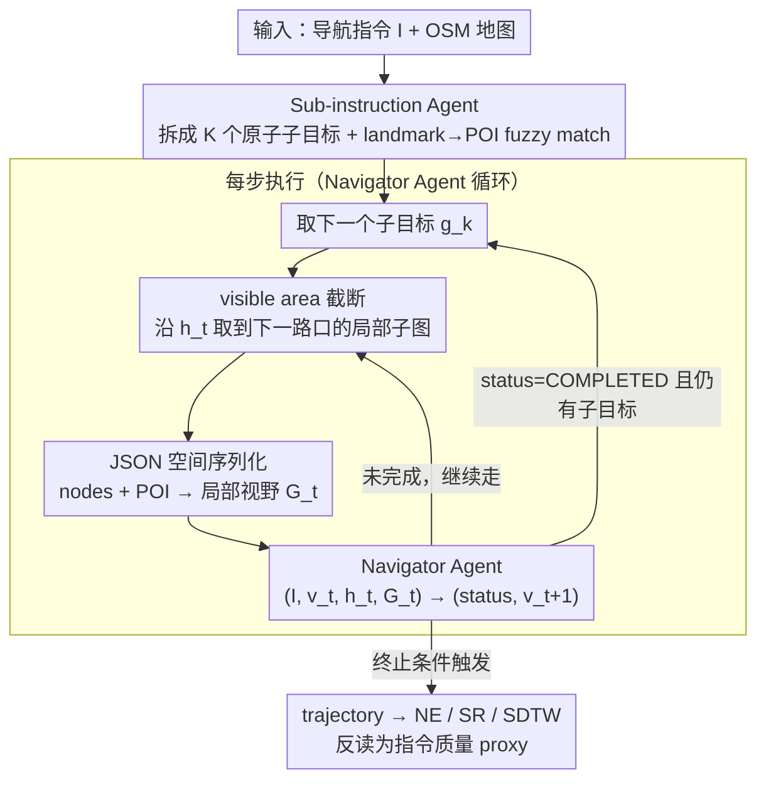

# GROKE: Vision-Free Navigation Instruction Evaluation via Graph Reasoning on OpenStreetMap

**会议**: ACL 2026  
**arXiv**: [2601.07375](https://arxiv.org/abs/2601.07375)  
**代码**: https://anonymous.4open.science/r/groke (匿名)  
**领域**: 机器人 / VLN 导航指令评测  
**关键词**: Map2Seq、OpenStreetMap、LLM agent、graph reasoning、agent-as-judge

## 一句话总结
GROKE 提出**完全不用视觉**就评测导航指令好不好——把 OSM 地图序列化成 JSON，让 Gemini-3 Pro 当 follower agent 沿图执行指令，用 Navigation Error / SR / SDTW 反过来当指令质量的 proxy；相比启发式 baseline 在 Map2Seq 上降低 navigation error 68.5%，且 NE 与人类对"指令清晰度"的判断显著相关 ($r = -0.31, p < 0.01$)。

## 研究背景与动机

**领域现状**：导航指令评测（"这条指令好不好"）传统上沿用机器翻译的 BLEU / ROUGE / METEOR / CIDEr。VLN 社区也越来越倾向"agent-as-judge"——训一个 follower agent 在 Matterport3D / Touchdown 这种高保真视觉模拟器里跟着指令走，根据 success rate 判断指令质量。

**现有痛点**：(1) **n-gram 指标致命缺陷**——"在银行处左转"和"在银行处右转"BLEU 几乎满分但功能完全相反；反过来"看到红色建筑后左转"和"经过砖结构往西"BLEU 为 0 但描述同一动作。(2) **视觉 follower 把语言质量和视觉识别混淆**——agent 失败究竟是因为指令含糊还是因为它把"灰泥墙"看成"砖墙"？(3) Google Street View / Matterport3D 有 license + TB 级数据 + 算力门槛，让 evaluation 只对豪华实验室可达。

**核心矛盾**：指令的"meaning"由它的**compliance condition**（满足该指令的物理轨迹集合）定义，与视觉无关；但所有现有 pragmatic evaluation 都把视觉感知耦合进来，导致指标里既有 NLG 噪声也有 CV 噪声。

**本文目标**：(1) 找到一种不依赖视觉、仅靠 OSM 符号信息就能 follow 指令的 agent；(2) 比较多种空间表示（textual / JSON / graphviz / grid）哪种最适合 LLM 推理；(3) 把 agent 的 SR/NE 作为指令 navigability 的 proxy 并和人类判断对齐验证。

**切入角度**：Map2Seq 数据集独特之处——它的指令对齐了 OSM 节点 / 边 / POI，可以**剥离视觉模态**。换句话说，可以构造一个完全 symbolic 的 follower agent，专门测指令的"结构/语义可执行性"。

**核心 idea**：把 LLM 当 follower，把 OSM 地图序列化成 **JSON 局部视野**喂进去，用层次化两 agent 架构（Sub-instruction Agent + Navigator Agent）执行导航；agent 的 trajectory metric 反过来当"指令质量分"，零视觉零训练。

## 方法详解

### 整体框架

GROKE 想解决的是"怎么评一条导航指令好不好"——传统做法要么用 BLEU 这种会把"左转"和"右转"判成几乎满分的 n-gram 指标，要么训一个视觉 follower 在模拟器里走、却把语言含糊和视觉误识混在一起。它的思路是反转评测对象：固定一个 vision-free 的 LLM follower（Gemini-3 Pro），让它只靠 OSM 符号信息沿图执行指令，再把 agent 走出来的 Navigation Error / SR / SDTW 反过来读作"这条指令有多可执行"。整个系统是 training-free 的两 agent 层次化架构：Sub-instruction Agent 先把整条指令 $I$ 拆成 $K$ 个原子子目标 $\{g_1,\dots,g_K\}$（MOVE_FORWARD / TURN_LEFT / TURN_RIGHT 加 NL 描述）并把 landmark 用 fuzzy match 接到 OSM POI 上；之后进入逐步执行循环，每步先用 visible area 截断把视野收到下一个路口、再把局部子图序列化成 JSON 局部视野 $\mathcal{G}_t$，Navigator Agent 拿 $(I, v_t, h_t, \mathcal{G}_t)$ 输出 $(\text{status}_k, v_{t+1})$，status 标 COMPLETED 就推进下一个子目标。终止条件为：所有子目标完成、总步数 > 100、或单子目标重试 > 15。

### 关键设计

**1. Sub-instruction Agent：把长指令拆成原子动作的状态机**

一条指令往往有 50 多个 token、含多步空间推理，直接整条喂给 navigator 会让模型在中间步迷失。Sub-instruction Agent 让 LLM 当 parser 直接做 $I \xrightarrow{\text{parse}} \{g_1,\dots,g_K\}$，每个子目标形如 `("MOVE_FORWARD", "Go straight to the bank", TODO)`，带 TODO/IN_PROGRESS/COMPLETED 状态。这样 Navigator 一次只看当前 $g_k$ 而非整条指令，把"长程规划"切成"短程执行 + 状态推进"，把 LLM 从"同时记忆 5 步指令 + 推理空间"的双重负担里解放出来，一次只对一个原子目标做反应。消融（Appendix A.2）证明去掉这一阶段、整条指令直接喂 navigator 会让 SR 显著下跌。

**2. 基于 intersection 的 visible area 截断：把视野收到下一个路口**

进入逐步执行后，第一件事是决定"这一步给 LLM 看多大范围的地图"。把整张图（数千节点）塞进 prompt 既会 token 爆炸又会让模型被远处无关街道淹没、产生 hallucination。GROKE 用 Algorithm 1 模拟人站在路口的视野：从 $v_t$ 出发沿 $h_t$ 方向，每步在邻居里选 $\arg\min_{v'} \Delta h(h_{\text{curr}}, h_{v'})$ 且 $\Delta h < 100^\circ$ 的节点继续走，碰到 $\text{degree}(v) > 2$ 的 intersection 就计数 +1，直到走过 $u$ 个 intersection 再多取 3 节点 lookahead；POI 则用 50 米阈值 + Haversine 距离挂到 path node 上。这样 LLM 看到的"地图"既保留下一步决策需要的全部信息，又把 token 从全图压到几十节点，和人类站在路口实际能看到的范围差不多。

**3. Vision-free JSON 空间序列化：用 LLM 最读得懂的格式喂局部地图**

截好的局部子图还要序列化成 LLM 能读懂的文本，这一格式选择直接决定成败。GROKE 把局部 OSM 子图拆成两部分组织：nodes 部分含 id、类型（intersection/waypoint）、heading $h \in [0,360)$、连接列表（每条带目标 id 和方位角），其中相对方位用球面 bearing 公式 $h = \text{atan2}(\sin\Delta\lambda \cos\phi_2, \cos\phi_1\sin\phi_2 - \sin\phi_1\cos\phi_2\cos\Delta\lambda)$ 算；POI 部分含每个 landmark 的字母 ID、最近节点引用、相对方向（用 $\delta = (h_{v\to p} - h_{\text{curr}} + 180) \mod 360 - 180$ 离散成 Forward / Left / Right / Back）和 Haversine 距离。作者系统比了纯文本叙述、JSON、Graphviz DOT、ASCII grid 四种表示，结果很悬殊：JSON SR 63% / NE 68m，Textual 61% / 70m，Graphviz 40% / 96m，Grid 仅 10% / 175m——grid 里大量空白格 '0' 会被 LLM 当成合法路径选，几乎失效。JSON 的层级嵌套让模型从局部偏离里"找路回来"的能力更强（OSR 74% vs Textual 67%），在 Hard 难度上 SR 53.8% 比 Textual 38.5% 高 15 个点，说明结构化对长程推理是质变。

### 损失函数 / 训练策略
- **完全 training-free**：用 Gemini-3 Pro 默认 temperature 1.0 + 高 reasoning 等级，无任何微调。
- 平均每条 trajectory 5.91 步 / 44k 总 token / 23k thinking token，成本高但作者认为是 case-study 价值的合理代价。
- 工程上跑在 Google Agent Development Kit (ADK) + 批 API。

## 实验关键数据

### 主实验

Map2Seq 两个 split（700 条/split）上的整体表现：

| 方法 | TestSetA NE↓ | TestSetA SR↑ | TestSetA OSR↑ | TestSetA SDTW↑ | TestSetB NE↓ | TestSetB SR↑ | TestSetB OSR↑ | TestSetB SDTW↑ |
|---|---|---|---|---|---|---|---|---|
| Random Walker | 259.0 | 4.4% | 5.7% | 0.026 | 244.3 | 6.1% | 7.1% | 0.029 |
| Action Sampling (无文本) | 250.1 | 5.1% | 6.0% | 0.037 | 241.6 | 7.4% | 8.1% | 0.039 |
| Heuristic Agent (regex+角度) | 180.6 | 18.0% | 18.9% | 0.155 | 173.0 | 17.9% | 19.1% | 0.159 |
| **GROKE (ours)** | **56.8** | **66.4%** | **78.4%** | **0.634** | **59.8** | **63.3%** | **78.0%** | **0.609** |

人类基线 SR = 0.86 / 0.84（Street View 环境），GROKE vision-free 已经追到 ~74-77% of human。

人类相关性分析（n=100，人工标注 navigability 二值）：

| Metric | Pearson $r$ | $p$ | Spearman $\rho$ | $p$ |
|---|---|---|---|---|
| SR | 0.2865 | 0.0039** | 0.2865 | 0.0039** |
| OSR | 0.1860 | 0.0639 | 0.1860 | 0.0639 |
| SDTW | 0.2799 | 0.0048** | 0.2860 | 0.0039** |
| nDTW | 0.2457 | 0.0138* | 0.2895 | 0.0035** |
| **NE** | **-0.3096** | **0.0017**\*\* | **-0.3184** | **0.0012**\*\* |

NE 是与人类判断最强相关的指标。

### 消融实验

四种空间表示在不同难度上的对比（n=100 Map2Seq seen val）：

| 表示 | Easy NE | Easy SR | Medium NE | Medium SR | Hard NE | Hard SR | 总评 |
|---|---|---|---|---|---|---|---|
| **JSON** | 62.1 | 61.2% | 61.2 | 68.4% | **112.9** | **53.8%** | 最佳，hard 上大幅领先 |
| Textual | 71.3 | 61.2% | **56.6** | 68.4% | 110.6 | 38.5% | 简单任务可用，hard 崩 |
| Graphviz DOT | 90.4 | 40.8% | 87.8 | 47.4% | 146.5 | 15.4% | 解析负担大 |
| ASCII Grid | 186.7 | 6.1% | 160.3 | 13.2% | 176.6 | 15.4% | 灾难，LLM 把 '0' 当合法路径 |
| Optimized Repr. | **35.6** | **77.6%** | **30.9** | **76.3%** | 93.3 | 53.8% | 在 JSON 上做提示工程后的上限 |

### 关键发现
- **JSON ≫ ASCII grid 是颠覆性结果**：grid 表示在 LLM 视觉推理论文里很流行，但这里 SR 仅 10%，揭示了"text-based grid map"对 LLM 来说几乎不可用——大量 '0' 噪声让模型陷入"选空白格"的错乱。
- **JSON 在 hard 任务上优势放大**：Easy / Medium 上 JSON 和 Textual 几乎打平，但 Hard 上 JSON SR 53.8% vs Textual 38.5%，表明 hierarchical 结构对长程多步指令是"扩展性更好的脚手架"。
- **NE 是最好的人工相关指标**：$r = -0.31, p < 0.01$，远优于 OSR（不显著）；这意味着评测应优先用 NE 而非 SR/OSR。
- **vision-free 没让你输太多**：human SR 86% vs GROKE 74%（同样 100 instance subset），差距 12 个点但完全不用 Street View、不用模拟器、不用感知模型，trade-off 对学术普及性极有价值。
- **成本不便宜**：5.9 步 × 44k token / 条 ≈ 用高 reasoning Gemini-3 Pro 的 production cost，作者明确承认这是大规模部署的拦路虎，因此未来打算用 teacher-student 蒸馏到小模型。

## 亮点与洞察
- **任务定义的反转**：把"agent 评测"翻成"指令评测"——同样的 SR/NE/SDTW 指标，固定 agent 不变就变成了指令质量分。这种"frame inversion"是非常省力的研究 trick：复用了整套 VLN benchmark + metric 而不用重新搭，但解决的是一个完全不同的问题。
- **第一个系统比较 LLM 空间表示**：Textual / JSON / Graphviz / Grid 四选一这种 ablation 在 LLM-for-spatial 文献里其实少见，结论"hierarchical JSON 最稳"对所有想用 LLM 推理图/地图的工作（路径规划、电网、社交网络）都有借鉴价值。
- **POI proximity + relative direction discretization**：用 $\delta = (h_{v\to p} - h_{\text{curr}} + 180) \mod 360 - 180$ 把连续角度离散化成 Forward/Left/Right/Back 四档喂给 LLM，避免模型直接处理角度数值时的精度损失，是个简单但很实用的预处理 trick。
- **"看不到不一定差"的反直觉发现**：JSON-only follower 在 NE 上做到 56m（vs 人类在视觉环境里 ~25m），证明很多导航指令的可执行性其实主要由 topology + landmark 决定，而非视觉细节——这对盲人辅助技术（智能眼镜+LLM）有非常具体的应用启发，作者也明确把这当 future work。

## 局限与展望
- **完全无法评测"靠视觉锚点"的指令**：诸如"红门那间房子左转"、"沿涂鸦墙走"这类指令在 GROKE 里全部判失败，但人类能毫无障碍执行——这部分指令的质量被系统性低估。
- **结论绑死 Gemini-3 Pro**：作者承认所有"JSON > Grid"的结论目前只在 Gemini-3 Pro 上验证，没在其他 LLM（GPT-4o / Claude / 开源 LLaMA）上交叉验证，可能存在模型偏置。
- **计算成本制约规模**：每条 trajectory 平均 44k token + 高 reasoning level，跑完整 Map2Seq 7672 条指令需要可观费用，难以大规模重复评测。
- **POI grounding 依赖 fuzzy matching**：当指令里说"the bank"而 OSM 标注里只有 "bank_of_america" 的 brand tag 时，partial_ratio 可能匹不上，导致原本好的指令被误判失败。
- **改进思路**：(i) 在 OSM 之外引入街景缓存的对象 tag 做轻量视觉补充；(ii) 蒸馏到小模型降本；(iii) 引入多 LLM 投票降低单模型偏置；(iv) 把 navigability 评分做成"区间"而非二值 SR，反映"接近但未到"的部分成功。

## 相关工作与启发
- **vs Speaker-Follower / LANA 等 follower agent**：传统 follower 在 Matterport3D / GSV 里跑，把语言和视觉绑在一起；GROKE 把视觉完全剥离，提供"纯语言诊断"视角，可以和传统 follower 形成互补 evaluation。
- **vs VELMA / NavGPT**：这两个工作也是 LLM-based VLN agent 但仍用视觉感知或 verbalized observation；GROKE 把"verbalized observation"做到极致——直接喂结构化 OSM 而非视觉描述，证明地图 schema 已足够支撑大部分导航指令的执行验证。
- **vs MapGPT / "Talk like a Graph"**：MapGPT 在线构建拓扑图，"Talk like a Graph" 系统比较图编码方式但不针对导航；GROKE 把这两条线合到 VLN 评测任务上，是第一个**把图编码 ablation + agent-as-judge + 真实人类相关性验证**串成完整链条的工作。
- **vs BLEU/ROUGE 传统评测**：GROKE 与人类标注 Spearman 相关 0.29-0.32 (p < 0.01)，而 BLEU 在 Zhao et al. 2021 报告里几乎与人类不相关；这一对比直接终结"n-gram 评测导航指令"的合理性。

## 评分
- 新颖性: ⭐⭐⭐⭐ "vision-free agent-as-judge for instruction" 是清晰的新提法，JSON-vs-Grid 系统对比也补了文献空缺；但 hierarchical agent / OSM 编码这些零件都有先例。
- 实验充分度: ⭐⭐⭐⭐ 4 baseline + 4 表示对比 + 难度分层 + 人类相关性 + 错误分析 + POI detection ablation 都做了；不足是未跨 LLM 验证，且 100 条 subset 做相关性偏小。
- 写作质量: ⭐⭐⭐⭐ 任务动机讲得非常清楚（特别是 BLEU 失效的反例），方法 Algorithm 1 + 公式都很 explicit；表格排版略乱，但整体可读性很好。
- 价值: ⭐⭐⭐⭐ 给 VLN 社区一个零门槛、可复现的 outdoor 指令评测工具；对盲人辅助 / smart glasses 等下游应用打开了 vision-free reasoning 的新通道；代码开源。

<!-- RELATED:START -->

## 相关论文

- [\[ACL 2026\] GoViG: Goal-Conditioned Visual Navigation Instruction Generation via Multimodal Reasoning](govig_goal-conditioned_visual_navigation_instruction_generation_via_multimodal_r.md)
- [\[CVPR 2026\] ProFocus: Proactive Perception and Focused Reasoning in Vision-and-Language Navigation](../../CVPR2026/robotics/profocus_proactive_perception_and_focused_reasoning_in_vision-and-language_navig.md)
- [\[CVPR 2026\] DecoVLN: Decoupling Observation, Reasoning, and Correction for Vision-and-Language Navigation](../../CVPR2026/robotics/decovln_decoupling_observation_reasoning_and_correction_for_vision-and-language_.md)
- [\[CVPR 2026\] ManipArena: Comprehensive Real-world Evaluation of Reasoning-Oriented Generalist Robot Manipulation](../../CVPR2026/robotics/maniparena_comprehensive_real-world_evaluation_of_reasoning-oriented_generalist_.md)
- [\[ACL 2026\] VLN-NF: Feasibility-Aware Vision-and-Language Navigation with False-Premise Instructions](vln-nf_feasibility-aware_vision-and-language_navigation_with_false-premise_instr.md)

<!-- RELATED:END -->
