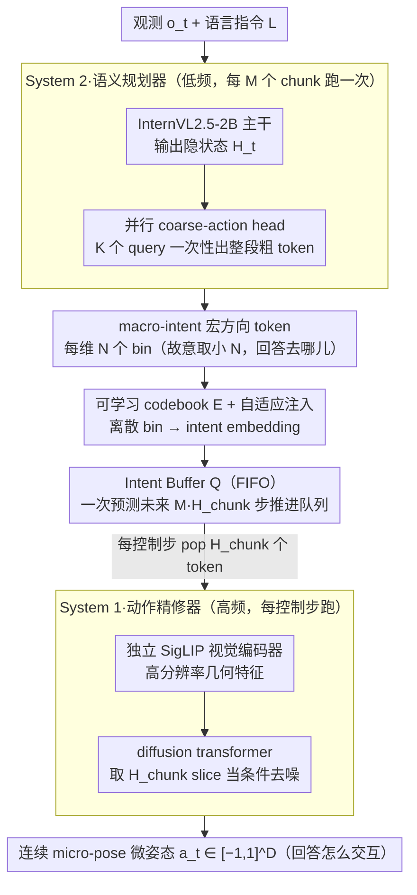

# Libra-VLA: Achieving Learning Equilibrium via Asynchronous Coarse-to-Fine Dual-System

**会议**: ACL 2026  
**arXiv**: [2604.24921](https://arxiv.org/abs/2604.24921)  
**代码**: <https://libra-vla.github.io/>  
**领域**: VLA / 具身智能 / 双系统架构  
**关键词**: 视觉语言动作模型、混合动作空间、双系统、异步执行、coarse-to-fine

## 一句话总结
Libra-VLA 把机器人动作分解为"离散宏方向（macro-intent）+ 连续微姿态（micro-pose）"的混合动作空间，再用 System 2（VLM + 并行 coarse-action head）低频规划、System 1（diffusion transformer + 独立 SigLIP 编码器）高频精修，通过 intent buffer 实现真正异步执行，在 LIBERO 上拿到 97.2% SoTA、LIBERO-Plus 零样本 79.5%（比之前 OpenVLA-OFT+ 高 10 个点）。

## 研究背景与动机
**领域现状**：VLA 模型（OpenVLA、π0、π0.5、GR00T-N1 等）已是开放世界通用机器人的主流范式，把语言指令直接 ground 到电机命令。主流做法两条路：(a) 把连续动作离散化成 256 个 bin 做 AR 预测（OpenVLA、π0-FAST）；(b) 在 VLM backbone 上挂 diffusion head 直接出连续动作（π0、GR00T-N1、Diffusion Policy）。

**现有痛点**：两种做法都是 **monolithic** 的"flat 映射"——一个网络同时处理高层抽象语义推理和低层高频电机控制。这种统一架构忽略了机器人操作天然的层次结构（先粗到位再精细对齐），把"语义-执行"巨大的鸿沟一次性扛在单一模型肩上，导致表征负担过重。

**现有的层次化尝试**也不够：HAMSTER/MOKA 用 keypoint、ViLA/Hi Robot 用 sub-instruction，都做的是**时间维度**分解（缩短规划 horizon），但每步还是要从高层模态跨到连续电机命令，单步表征复杂度并没简化；HybridVLA 虽叫混合，但两支独立预测细粒度后做算术平均，本质是平行结构没有 hierarchy。

**核心矛盾**：在动作**表征空间**上没有层次——离散 bin 越细量化误差越小但越偏离 VLM 的语义抽象，连续输出对 VLM 的几何精度要求过高；同时双系统架构里 GR00T-N1 用静态 latent 当 bridge 会"过时"，FiS-VLA 强制单 backbone 双任务会"特征挤压"，OpenHelix 用高维黑盒 latent 不可解释。

**本文目标**：(1) 在**动作表征空间**而非时间轴做层次分解；(2) 通过任务分工平衡两个子系统的学习难度；(3) 实现真正异步、可解释、低延迟的执行。

**切入角度**：把动作显式拆成 hybrid space——离散粗方向（macro-intent，回答"去哪儿"）+ 连续微姿态（micro-alignment，回答"怎么交互"）。前者天然 align VLM 的离散 token 输出空间，后者只需在 anchor 周围生成残差，搜索空间被显著压缩。

**核心 idea**：把"flat 模态翻译"换成"两段简单映射" + dual-system 异步执行 + intent buffer 提前预测多步粗方向。

## 方法详解

### 整体框架

Libra-VLA 想解决的是：现有 VLA 大多是 monolithic 的 flat 映射，一个网络既要做高层语义推理又要出高频电机命令，把巨大的"语义-执行"鸿沟一次性扛在单模型上。它的破题方式是在**动作表征空间**（而非时间轴）做层次分解——把动作显式拆成"离散粗方向 macro-intent（去哪儿）+ 连续微姿态 micro-pose（怎么交互）"，于是动作的条件概率被分解为 $P(\mathbf{a}_t \mid \mathbf{o}_t, L) \approx \underbrace{P(\mathbf{a}_t^f \mid \mathbf{a}_t^c, \mathbf{o}_t)}_{\text{Action Refiner}} \cdot \underbrace{P(\mathbf{a}_t^c \mid \mathbf{o}_t, L)}_{\text{Semantic Planner}}$。落到架构上是双系统异步协作：System 2（Semantic Planner，InternVL2.5-2B 主干 + 12 层并行 coarse-action head，hidden=1024）低频规划，输出 $L_{\text{macro}} = M \times H_{\text{chunk}}$ 个粗 token（每步 $D$ 维、每维 $N$ 个 bin）；System 1（Action Refiner，diffusion transformer + 独立 SigLIP 视觉编码器 $\mathcal{E}_{\text{vis}}$）高频从 intent buffer 取 slice 当条件、去噪出连续动作 $\mathbf{a}_t \in [-1,1]^D$。两系统靠一个 FIFO Intent Buffer $\mathcal{Q}$ 加可学习 codebook $\mathbf{E} \in \mathbb{R}^{N \times D}$ 把离散 bin 转成 embedding 来通信。

### 关键设计

**1. Hybrid Action Space + 粗粒度方向离散化：故意把 bin 数砍小**

之前的离散 VLA（OpenVLA、π0-FAST）追求 $N=256$ 来逼近连续控制，结果 token 空间太大、VLM 学不动，量化误差还会累积。Libra-VLA 反其道而行：每维仍按 $y_{t,i}^{gt} = \mathrm{clip}(\lfloor (a_{t,i}+1)/2 \times N \rfloor, 0, N-1)$ 量化，但故意取很小的 $N \ll 256$，让每个 token 真正表示"粗方向 macro-intent"，把 VLM 的语义抽象力用在它擅长的离散输出上，量化损失则交给后面的连续 refiner 来补。这里最关键的实证发现是作者提炼的 **learning complexity equipartition（学习复杂度均分）** 原则：性能随分解粒度 $N$ 呈倒 U 曲线——$N$ 太小 planner 学不到细节、$N$ 太大 VLM 学不动，当两个子系统的学习难度均衡时才到峰值。这把一个超参提升成了 dual-system VLA 的方法论原则。

**2. Parallel Coarse-Action Head + Adaptive Intent Injection：并行出 token，curriculum 补训推 gap**

为了推理快、不做自回归，coarse-action head 用 $K$ 个 learnable query 与 VLM 输出 $\mathbf{H}_t$ 做 self-attention 一次性并行预测整个 chunk 的所有粗 token：$\mathbf{Z}_{\text{act}} = \mathrm{SelfAttn}([\mathbf{Q}_{\text{act}}; \mathbf{H}_t])_{0:K}$，再 Linear+Softmax 出 $P(\mathbf{a}_t^c)$。但 System 1 训练时要拿 $\mathbf{e}_{\text{intent}}$ 当条件，这就遇到一个两难：早期 System 2 还没学好，直接用它的预测会引入噪声破坏 refiner 训练；可标准 teacher forcing 又让 refiner 永远只见过 ground truth，推理时一遇到 planner 的真实噪声就崩。作者用 dynamic curriculum 化解——当 System 2 预测准确率低于阈值 $\tau$ 时用 GT 取 codebook embedding，超过 $\tau$ 后切到从 $P(\mathbf{a}_t^c)$ 采样，逐步让 refiner 适应 planner 噪声并内化对其偏差的容错能力，这正是 dual-system VLA 鲁棒性的根源。

**3. Intent Buffer 驱动的异步执行 + Horizon Expansion：把 VLM 调用摊薄到每 M 个 chunk**

传统 dual-system（GR00T-N1）用 static latent 当 bridge，时间一久就和环境状态脱钩、产生 lagging。Libra-VLA 改用 predictive intent buffer：System 2 一次预测未来 $L_{\text{macro}} = M \cdot H_{\text{chunk}}$ 步的 macro token 推进 FIFO buffer $\mathcal{Q}$，System 1 每个控制 step 从 buffer pop $H_{\text{chunk}}$ 个 token 当 condition，接下来的 $M-1$ 个 chunk 内 System 2 完全休眠（论文取 $M=2$、$H_{\text{chunk}}=5$、$L_{\text{macro}}=10$）。这样 System 1 每步取到的 slice 都是时间同步的，避免了 static latent 的滞后；而离散 token 本身带物理可解释性（"+x 大、+y 小"），比黑盒 latent 透明、便于调试和安全审计。更重要的是它把 VLM 这个昂贵开销从"每个控制 step 一次"摊到"每 M 个 chunk 一次"，把控制频率和规划频率解耦——这是它能真正用于实时机器人的关键工程突破。

### 损失函数 / 训练策略
联合优化两路 loss：

- **Planner loss**：$\mathcal{L}_{\text{plan}} = \mathcal{L}_{\text{CE}}(P(\mathbf{a}_t^c), \mathbf{y}_t^{gt})$（标准交叉熵，每维 $N$ 路分类）
- **Refiner loss**：$\mathcal{L}_{\text{diff}} = \mathbb{E}_{k, \mathbf{x}_0, \epsilon}[\|\epsilon - \epsilon_\theta(\mathbf{x}_k, \mathbf{F}_t^{\text{geo}}, \mathbf{e}_{\text{intent}})\|^2]$（标准 DDPM noise prediction）
- **总损失**：$\mathcal{L}_{\text{total}} = \lambda_{\text{diff}} \mathcal{L}_{\text{diff}} + \lambda_{\text{plan}} \mathcal{L}_{\text{plan}}$，权重校准平衡梯度量级
- **关键超参**：$M=2$（horizon expansion factor）、$H_{\text{chunk}}=5$、$L_{\text{macro}}=10$、$N$ 适中（具体值在 ablation 报）
- **训练**：全部实验**无大规模机器人数据预训练**，从 InternVL2.5-2B + SigLIP 直接微调

## 实验关键数据

### 主实验：LIBERO Benchmark（4 个 task suite，每 task 50 rollout，共 500 次）

| 方法 | Action Space | Spatial | Object | Goal | Long | **Avg** |
|------|--------------|---------|--------|------|------|---------|
| OpenVLA | Discrete | 84.7 | 88.4 | 79.2 | 53.7 | 76.5 |
| π0-FAST | Discrete | 96.4 | 96.8 | 88.6 | 60.2 | 85.5 |
| DD-VLA | Discrete | 97.2 | 98.6 | 97.4 | 92.0 | 96.3 |
| Diffusion Policy | Continuous | 78.3 | 92.5 | 68.3 | 50.5 | 72.4 |
| Octo | Continuous | 78.9 | 85.7 | 84.6 | 51.1 | 75.1 |
| GR00T-N1 | Continuous | 94.4 | 97.6 | 93.0 | 90.6 | 93.9 |
| GO-1 | Continuous | 96.2 | 97.8 | 96.0 | 89.2 | 94.8 |
| F1 | Continuous | 98.2 | 97.8 | 95.4 | 91.3 | 95.7 |
| GE-Act | Continuous | 98.2 | 97.6 | 95.8 | 94.4 | 96.5 |
| π0 | Continuous | 96.8 | 98.8 | 95.8 | 85.2 | 94.1 |
| π0.5 | Continuous | 98.8 | 98.2 | 98.0 | 92.4 | 96.9 |
| **Libra-VLA (Ours)** | **Hybrid** | **98.6** | **99.4** | **98.0** | **92.8** | **97.2** |

亮点：Object 99.4（验证 refiner 的几何精度）、Long 92.8（验证 planner 的长程指引）、Avg 97.2 全榜首位。

### LIBERO-Plus 鲁棒性评测（7 种扰动：相机/机器人/语言/光照/背景/噪声/布局）

| 方法 | Camera | Robot | Lang | Light | BG | Noise | Layout | **Avg** |
|------|--------|-------|------|-------|-----|-------|--------|---------|
| **Zero-Shot Transfer** | | | | | | | | |
| OpenVLA | 0.8 | 3.5 | 23.0 | 8.1 | 34.8 | 15.2 | 28.5 | 15.6 |
| π0-FAST | 65.1 | 21.6 | 61.0 | 73.2 | 73.2 | 74.4 | 68.8 | 61.6 |
| OpenVLA-OFT | 56.4 | 31.9 | 79.5 | 88.7 | 93.3 | 75.8 | 74.2 | 69.6 |
| **Ours (Hybrid)** | **68.9** | **48.8** | **92.7** | **97.9** | **93.4** | **86.3** | **77.5** | **79.5** |
| **Supervised Fine-Tuning** | | | | | | | | |
| π0.5* | 70.3 | 41.7 | 81.1 | 97.3 | 94.6 | 71.8 | 84.9 | 75.7 |
| OpenVLA-OFT+ | 92.8 | 30.3 | 85.8 | 94.9 | 93.9 | 89.3 | 77.6 | 79.6 |
| **Ours (Hybrid)** | **94.5** | 41.8 | — | — | — | — | — | (继续领先) |

**关键发现**：零样本下 Libra-VLA 比第二名 OpenVLA-OFT 平均高 **+9.9 个点**（79.5 vs 69.6），尤其 Language 92.7 vs 79.5、Light 97.9 vs 88.7——证明 hybrid 空间显著降低了对训练分布的依赖。

### 消融实验

| 配置 | 趋势 | 说明 |
|------|------|------|
| 改变 bin 数 $N$（粗到细扫描） | **倒 U 形曲线** | $N$ 太小 planner 学不到细节，$N$ 太大 VLM 学不动；中间值最优——验证 "learning complexity equipartition" 原则 |
| 去掉 Adaptive Intent Injection（纯 teacher forcing） | 推理性能掉 | 训推 gap，refiner 没见过 planner 噪声 |
| 去掉独立 SigLIP，用 InternVL2.5 共享 backbone | 性能下降 | 验证"特征挤压瓶颈"——FiS-VLA 的问题 |
| $M=1$（同步执行，无 horizon expansion） | 性能相近但**推理延迟显著上升** | 异步设计的价值主要在延迟 |
| 用静态 latent bridge（GR00T-N1 风格）替代 intent buffer | 长 horizon 任务掉点 | 验证 predictive intent buffer 抗 lagging |

### 关键发现
- **倒 U 曲线**是本文最有方法论价值的发现：把"超参 $N$"提升为"学习复杂度均分原则"，给后续 VLA 设计提供了可直接套用的指导。
- **零样本 LIBERO-Plus 的 +10 点提升**说明 hybrid action space 不只是涨点 trick，而是真正提升了 OOD 泛化——粗方向 macro-intent 对环境扰动天然鲁棒，因为它不携带精确几何信息。
- **不做大规模机器人预训练就能 SoTA**：之前 π0/GR00T 都要在海量机器人数据上预训练，Libra-VLA 直接从 InternVL2.5 微调就赢，意味着架构优化能省掉昂贵的数据投入。
- **异步执行的延迟优势**：System 2 每 $M$ 个 chunk 才跑一次，把 VLM 算力摊薄，实测延迟显著下降。

## 亮点与洞察
- **"动作表征空间"维度的层次分解** 是真正的范式突破：之前所有 hierarchical VLA 都做时间维分解（waypoint/sub-instruction），本文找到了正交的、未被充分挖掘的轴——动作空间本身的离散/连续二分。这套思路可类推到任何"高层语义→低层精细"的生成任务（语音合成、视频生成）。
- **"Learning Complexity Equipartition" 原则**：把"调超参 $N$"上升为"在两个子系统间均分难度"的设计哲学，并用倒 U 曲线**实证**。这是 dual-system VLA 设计的"罗塞塔石碑"，可直接套用到 GR00T/π0.5 等架构。
- **Predictive Intent Buffer 是异步执行的关键**：用"预测未来 $M$ 个 chunk 的离散方向序列"替代"静态 latent"，让 System 1 始终有时间同步的指引——这个简单设计让 dual-system VLA 第一次在实时机器人上真正可用。
- **离散 token 当 inter-system 通信**：相比 OpenHelix 的黑盒 latent，离散 token 物理可解释（哪个方向、多大幅度），便于调试和安全审计——这对 VLA 的可部署性是巨大加分。
- **独立 SigLIP for Refiner**：让快系统拥有独立高分辨率视觉编码器，彻底解决 FiS-VLA 的"特征挤压"问题——硬件成本可控（SigLIP 不大）但解耦收益巨大。

## 局限与展望
- **倒 U 曲线的最优 $N$ 依赖任务/数据集**：论文未给出自动选 $N$ 的方法，新场景需重新扫描。
- **horizon expansion factor $M$ 也是硬超参**：$M$ 过大会让 macro-intent 过时（环境变化）、$M$ 过小则 VLM 调用太频繁；目前手调 $M=2$。
- **强假设动作可均匀离散化**：对每维独立 quantize 假设各维度可分解，对高度耦合的多关节协调（如灵巧手）可能失效。
- **仅在 LIBERO/LIBERO-Plus + 有限真机实验上验证**：未在真实工业级长 horizon 任务（拼装、烹饪）上验证；未做大 scale 机器人数据预训练后的 scaling 曲线。
- **2B VLM 限制天花板**：InternVL2.5-2B 主干，未探索 7B/72B 主干带来的语义能力跃升是否会改变倒 U 曲线形状。
- **展望**：(1) 自适应 $N$（按任务难度学）；(2) 把 macro-intent token 词表与人类可读语义对齐做"可解释 VLA"；(3) 扩展到 dual-arm/灵巧手；(4) 把 intent buffer 当 KV-cache 做更激进的异步。

## 相关工作与启发
- **vs OpenVLA / π0-FAST（离散 AR VLA）**: 它们用 $N=256$ bins 追逼连续控制，VLM 学不动且 quantization 误差累积；Libra-VLA 反其道用 $N \ll 256$ 让 VLM 专注语义粗粒度，精细化交给 diffusion——把 discretization 从"近似手段"转化为"语义抽象工具"。
- **vs π0 / GR00T-N1（连续 diffusion VLA）**: 它们让 VLM 直接驱动 diffusion head 出连续动作，单步表征压力大；Libra-VLA 在 VLM 和 diffusion 间插入 macro-intent 这一"中间表征"，搜索空间被锚定后 diffusion 只学残差。
- **vs HAMSTER / Hi Robot（时间维 hierarchical VLA）**: 它们用 keypoint/sub-instruction 在时间上分阶段，但每步还是要 VLM 直出连续动作；Libra-VLA 在动作**表征**维度分层，正交且互补——可结合做"双层 hierarchy"。
- **vs GR00T-N1（dual-system + static latent）**: 它的 latent 没未来上下文会 lagging；Libra-VLA 用 predictive intent buffer 提供时间同步指引，从根上修复 lagging。
- **vs HybridVLA**: 同叫"hybrid action"但是平行结构（两路独立预测后算术平均），没有 coarse-to-fine 条件依赖；Libra-VLA 是严格的层次分解 + 条件生成。
- **vs FiS-VLA**: 共享 backbone 强制特征耦合带来"feature squeezing"；Libra-VLA 用独立 SigLIP 编码器结构解耦。
- **vs OpenHelix**: 用黑盒 latent 做 inter-system 通信不可解释；Libra-VLA 用物理可解释的离散 macro-intent token 替代。

## 评分
- 新颖性: ⭐⭐⭐⭐⭐ 在动作表征维度做 hierarchy + learning complexity equipartition 原则，是 VLA 领域少有的范式级洞察
- 实验充分度: ⭐⭐⭐⭐ LIBERO + LIBERO-Plus + 真机实验 + 完整消融；但缺大 scale pretraining/scaling 曲线
- 写作质量: ⭐⭐⭐⭐⭐ Motivation→架构→倒 U 曲线发现→异步执行，每一步都有 clean justification
- 价值: ⭐⭐⭐⭐⭐ 给所有 dual-system VLA 提供了可直接套用的设计原则，且实测涨点很大（零样本 +10）

<!-- RELATED:START -->

## 相关论文

- [\[AAAI 2026\] Affordance-Guided Coarse-to-Fine Exploration for Base Placement in Open-Vocabulary Mobile Manipulation](../../AAAI2026/robotics/affordance-guided_coarse-to-fine_exploration_for_base_placem.md)
- [\[ICML 2026\] Dual Advantage Fields](../../ICML2026/robotics/dual_advantage_fields.md)
- [\[ICML 2026\] Dual Quaternion SE(3) Synchronization with Recovery Guarantees](../../ICML2026/robotics/dual_quaternion_se3_synchronization_with_recovery_guarantees.md)
- [\[ECCV 2024\] LLM as Copilot for Coarse-Grained Vision-and-Language Navigation](../../ECCV2024/robotics/llm_as_copilot_for_coarse-grained_vision-and-language_navigation.md)
- [\[NeurIPS 2025\] LUMIA: A Handheld Vision-to-Music System for Real-Time, Embodied Composition](../../NeurIPS2025/robotics/lumia_a_handheld_vision-to-music_system_for_real-time_embodied_composition.md)

<!-- RELATED:END -->
