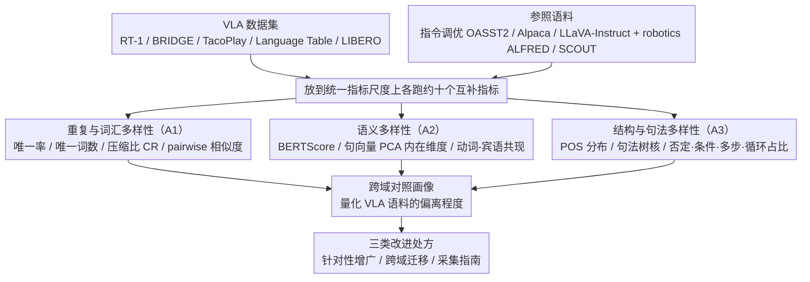

# Limited Linguistic Diversity in Embodied AI Datasets

**会议**: ACL 2026  
**arXiv**: [2601.03136](https://arxiv.org/abs/2601.03136)  
**代码**: 待确认  
**领域**: 具身智能 / 数据分析 / VLA / 语言多样性  
**关键词**: VLA 数据集审计、词汇多样性、语义多样性、句法多样性、Open X-Embodiment

## 一句话总结
本文对主流 VLA 训练语料（RT-1、BRIDGE、TacoPlay、Language Table、LIBERO）做系统性"语言多样性体检"，从词汇/语义/句法三维度量化发现：VLA 数据**仅 < 2% 指令唯一、RT-1 整库只有 49 个 unique word、否定/条件句 < 1%**，远逊于指令调优语料（OASST2 93%、Alpaca 99.8% 唯一），这种"模板化贫乏"或许正是 VLA 模型对 paraphrase 脆弱、泛化失败的根源。

## 研究背景与动机
**领域现状**：OpenVLA、RT-X、π0.5 等 VLA 模型主要靠 Open X-Embodiment (OXE) 这类大规模数据训练。OXE 文档强调对象/场景/具身的多样性，但**对指令语言本身的特性几乎不报告**。同时学术界已观察到 VLA 模型对 paraphrase 敏感、对干扰物脆弱、易泛化失败（Gao 2025, AgiBotWorld 2025, Wang 2024）。

**现有痛点**：现有 VLA 工作把指令当辅助标签，没人系统量化训练数据中的**语言信号**到底是什么样。模型对 paraphrase 鲁棒性差，但没人知道：(a) 训练时模型见到的指令有多少是重复的？(b) 词汇多丰富？(c) 句法结构多样吗？(d) 真实世界常见的否定/条件句出现频率多高？这些都是空白。

**核心矛盾**：VLA 社区追求"通用机器人 + 自然语言指令"，但训练数据可能在**语言维度上是 toy-level**——模型在数百万 episode 上训练，看到的语言可能就那么几十个模板词的组合。如果训练数据语言贫乏到这种程度，模型在 LLM backbone 上获得的丰富语言能力会被覆写/灾难性遗忘。

**本文目标**：(1) 给"指令语言多样性"建立**可操作的多维度量化框架**；(2) 对主流 VLA 数据集做**系统性审计**并与非机器人语料（指令调优、对话）对照；(3) 提出基于审计结果的**针对性数据增广/采集策略**。

**切入角度**：借鉴 Tevet & Berant 2021 把多样性分为 form vs content 的框架，再细分为词汇/语义/句法三轴，每轴用多个互补指标（避免单指标局限），并设置参考数据集（OASST2/Alpaca/LLaVA-Instruct/ALFRED/SCOUT）做对照——既不主张存在"理想指标值"，又能让读者直观感受 VLA 语料的偏离程度。

**核心 idea**：用三维多指标审计 + 跨域参考语料对照，把"指令语言贫乏"从感觉变成数字。

## 方法详解

### 整体框架

本文不训练任何模型，而是给「指令语言多样性」搭一套可量化的体检框架，再用它给主流 VLA 语料和一组跨域参考语料拍 CT。被检对象一侧是 VLA 数据集（RT-1、BRIDGE、TacoPlay、Language Table、LIBERO），参照一侧是指令调优与对话语料（OASST2、Alpaca、LLaVA-Instruct）以及语言导向的 robotics 语料（ALFRED、SCOUT）。每个数据集都沿词汇、语义、句法三条轴（A1/A2/A3）跑约十个互补指标，最后汇成一张跨域对照画像，并据此给出增广、跨域迁移、采集指南三类改进处方。

### 关键设计

**1. 分析一：重复与词汇多样性（A1）——指令到底重复多少、用了多少种词**

VLA 数据集动辄数百万条指令，却没人量化过其中有多少是真正不同的。A1 先用基础统计打底：句子总数 #Sent、唯一句数 #Uniq 及 % Uniq、唯一 unigram 数 #Words；再叠一组多样性指标——**Compression Ratio（CR）** 用 gzip 压缩比衡量整库的可压缩程度（越低越多样，Shaib 2025 验证它能区分人写与 LLM 写文本），以及 ROUGE-L、BLEU、Jaccard、Levenshtein 这类 pairwise 相似度（前两个进主表 Table 2，后三个在附录 Table 4）。之所以 CR 和 pairwise 指标并用，是因为 LLM 文献早已表明数据去重显著影响泛化（Kandpal 2022、Lee 2022），而过参网络又能直接记忆训练标签（Zhang 2017）——高重复率会让 VLA 模型背下训练指令而非泛化；CR 看的是全局可压缩性，正好补上 ROUGE 这类只看两两相似的盲区。

**2. 分析二：语义多样性（A2）——指令背后到底表达了多少种不同任务语义**

词汇换皮多不等于任务种类多，A2 用 embedding 视角度量「说的是什么」而非「怎么说」。它从三个层面切入：句子级配对采样 1000 条指令算 pairwise **BERTScore** 均值；数据集级对 USE/SBERT/CLIP/SONAR 四种编码器的句向量做 **PCA**，报告解释 95% 累计方差所需的主成分数（即 intrinsic dimensionality）；再加一个 robotics 特有的 **Verb–Direct Object 共现矩阵**，统计每个宾语搭配多少种动词（导航类数据集则换成方向/方式状语的覆盖度）。embedding 指标对 paraphrase 鲁棒，适合刻画任务种类的丰富程度；VO 共现则是可解释的诊断维度——如果「banana」永远只配「pick」，模型学到的就是 verb-object shortcut，正对应 Shah 2020 说的 simplicity bias。

**3. 分析三：结构与句法多样性（A3）——指令的语法骨架和高阶逻辑构造有多丰富**

真实世界的机器人命令常含否定、条件、循环这类结构，A3 专门量化这一层。表层句法上，统计 POS pattern 的频率分布，并用 **Constituency Tree Kernel（Moschitti 2006）** 算句法树的 pairwise 相似度；高阶构造上，用 dependency parse + 关键词模式 + POS 启发式自动识别**否定、条件、多步、循环**四类构造的占比——唯一句少于 600 的数据集人工标注，多于 600 的走自动 pipeline，每个数据集再人工 review 500 条估算标注不确定性。这么做是因为句法贫乏会放大模型偏置（Aggarwal 2022），而「不要拿烂的苹果」「如果拿到苹果就洗它」「重复直到放完」这类否定/条件/循环/多步结构是真实部署的刚需，现有 VLA 几乎不学等于直接砍掉这部分部署能力。

### 损失函数 / 训练策略

本文是纯数据集审计/经验研究，不训练任何模型。POS 与 dependency 解析用 spaCy，句向量用 USE/SBERT/CLIP/SONAR 公开模型，所有多样性指标按 1000 采样 × 3 次重复算均值 ± 标准差。

## 实验关键数据

### 主实验：跨数据集多维度对比（Table 2 核心数字）

| 数据集 | # Sent | # Uniq (% Uniq) | # Words | CR ↓ | ROUGE-L ↓ | BERTScore ↓ | USE PCA ↑ | Tree Kernel ↓ |
|--------|--------|------------------|---------|------|-----------|--------------|------------|----------------|
| **指令调优** | | | | | | | | |
| OASST2 | 42K+ | 39,301 (**93.33%**) | 35,445 | 2.75 | 0.05 | 0.45 | 254 | 2.25% |
| Alpaca | 53K+ | 52,996 (**99.81%**) | 18,141 | 3.20 | 0.10 | 0.57 | 231 | 3.66% |
| LLaVA-Instruct | 366K+ | 261,892 (71.45%) | 15,477 | 4.41 | 0.21 | 0.61 | 184 | 7.46% |
| **语言导向 robotics** | | | | | | | | |
| ALFRED | 162K+ | 126,005 (79.9%) | 2,627 | 5.91 | 0.21 | 0.64 | 159 | 5.71% |
| SCOUT | 23K+ | 8,795 (39.4%) | 1,631 | 4.85 | 0.07 | 0.49 | 148 | 1.89% |
| **VLA 数据集** | | | | | | | | |
| RT-1 | 3.7M+ | **577 (0.02%)** | **49** | **118.20** | 0.19 | 0.64 | **33** | 5.09% |
| BRIDGE | 864K+ | 11,693 (**1.4%**) | 1,189 | 64.90 | 0.15 | 0.60 | 125 | 3.68% |
| TacoPlay | 214K | 403 (**0.2%**) | 74 | 158.86 | 0.30 | 0.68 | **42** | 8.86% |
| Language Table | 7.0M+ | 127,370 (1.81%) | 928 | 56.64 | 0.29 | 0.70 | 86 | 9.19% |
| LIBERO | 6.5K | 112 (**1.72%**) | 79 | 134.86 | 0.38 | 0.71 | **34** | 12.22% |

**冲击性数字**：
- RT-1 有 **3.7M 条句子但只有 577 唯一句（0.02% 唯一率）**，整库一共只用了 **49 个唯一词**（"bottle / apple / pick / move / coke ..."等）
- VLA 数据集 CR（压缩比）56-158，远高于指令调优语料的 2.75-4.41——表明高度可压缩 = 高度重复
- USE PCA intrinsic dim 也表明 VLA 数据集（33-125）远不如非 VLA 语料（148-254）

### 消融 / 关键发现表（Table from Figure 5：高阶结构构造比例）

| 构造类型 | 平均 VLA 占比 | 平均非 VLA 占比 | 真实世界需求 |
|-----------|----------------|-----------------|----------------|
| Negation（否定） | < 1% | ALFRED/SCOUT 略高但仍少 | "不要拿烂苹果" — 安全关键 |
| Conditional（条件） | < 1% | < 2% | "如果...就..." — exception 处理 |
| Multi-step（多步） | 中等到高（LIBERO 最高） | 中等 | 顺序逻辑，**唯一覆盖较好的** |
| Cycle（循环） | 几乎为 0 | 仅 SCOUT/ALFRED 有微弱信号 | "重复直到..." — 长程任务 |

### POS Pattern 集中度（Figure 4）

| 数据集 | 最频繁 POS pattern 占比 | 例子 |
|--------|--------------------------|------|
| TacoPlay | **24%** | VERB→DET→ADJ→NOUN→ADP→DET→NOUN ("put the purple block on the table") |
| RT-1 | 11% | VERB→NOUN→NOUN→ADP→ADJ→NOUN ("place water bottle into white bowl") |
| BRIDGE | 3% | 比 RT-1/TacoPlay 多样 |
| Language Table | 4% | 接近 BRIDGE |

### 关键发现
- **#Episode ≠ 语言多样性**：RT-1 有 370 万条命令但只有 577 唯一句，"看了 3.7M 次同 577 句话"——这对 LLM 训练经验丰富的人来说是触目惊心的数据 inefficiency。
- **VLA 数据集词汇极度集中**：跨所有 VLA 数据集**只有 4 个词同时出现**：`move, close, open, pick`——这就是 VLA 模型实际的"动作动词词表"。
- **Verb-Object 共现极偏**：RT-1 里 "banana" 几乎只配 "pick"，"knock" 几乎只配 can-shaped 物体——模型很容易学到 shortcut "看到 banana → pick"，从而**忽略语言指令**（Shah 2020 simplicity bias 的活样本）。
- **结构性贫乏比词汇性贫乏更严重**：否定/条件/循环 < 1%，意味着所有 VLA 模型从未见过"不要做 X"或"如果 Y 则 Z"——这些是真实世界部署的安全必备结构。
- **SCOUT（Wizard-of-Oz 对话）显著优于所有 OXE 数据集**：唯一率 39.4%、词汇 1631、否定/循环占比明显更高——证明**交互式采集**比 scripted/teleoperated 能产出更多样的语言。
- **LLM 生成的指令（Alpaca）反而比人类（OASST2）唯一率更高（99.8% vs 93.3%）**：LLM 善于无穷"换皮"，但 LLaVA-Instruct 又因为视觉问答模板化降到 71.45%——生成方式的设计很关键。

## 亮点与洞察
- **首次把"VLA 数据集语言贫乏"从感觉变成数字**：之前社区里只有"似乎"的抱怨，本文给出了 RT-1 49 个唯一词、0.02% 唯一率这种**任何人都说服的硬数据**。这种"datasheet for datasets"在 VLA 领域是空白，本文填上了。
- **跨域对照是巧妙的方法论选择**：把 VLA 数据和 OASST2/Alpaca/LLaVA-Instruct 放在同一指标尺度上，让差距"用倍数说话"——CR=158 vs CR=2.75 直观到令人警醒。
- **VO 共现热图是诊断 shortcut learning 的简单工具**：可直接套用到任何带语言 condition 的 imitation learning 数据集，找出"哪个 noun 永远配同一个 verb"的 spurious correlation。
- **三维多指标 + 重复采样统计**：避免单指标偏置（BERTScore 不敏感语序、ROUGE-L 不敏感同义改写、CR 只看全局），方法论严谨度对 dataset audit 类工作是稀缺品。
- **可操作的改进建议**：(i) targeted augmentation（基于 Tree Kernel/POS 引导 LLM 做句法 paraphrase）、(ii) cross-domain transfer（混入 procedural text）、(iii) annotation guidance（采集时实时提示 rephrase）——把诊断变成处方。
- **隐含挑战 OXE / Bender-Rule 文化**：呼应 Bender 2019, 2021 的"数据透明化"运动，把"语言"加入 robotics 数据卡的必报项。

## 局限与展望
- **不评估跨模态对齐**：只看文本，不看 instruction-image-trajectory 的一致性——理论上一个数据集语言丰富但 grounding 错乱也是坏的。
- **不直接证因果**："VLA 模型脆弱"和"训练数据语言贫乏"只是 correlation，没做"在丰富语言数据上重训 VLA 看是否更鲁棒"的实验——这是后续最重要的 follow-up。
- **指标本身有局限**：BERTScore 不敏感语序/反义、Tree Kernel 对长句不稳；作者通过多指标互补 + 人工校验缓解，但单点不可全信。
- **OXE 子集只取 4 个**：未覆盖 OXE 全部 40+ 数据集，结论虽具代表性但不是 exhaustive。
- **数据获取成本约束的承认**：作者指出新对象/新场景的物理采集成本天然限制了 robotics 数据的语义多样性，建议把投资转向"新道具 + 新环境（如非厨房）"。
- **语言局限于英语**：所有数据集都是英语，多语种 VLA 数据的语言多样性未涉及。
- **展望**：(1) 用本文的 framework 做 dataset card 强制项；(2) 直接做 controlled experiment——同 episode 数下，纯模板 vs 增广 paraphrase vs 人工对话三种语言富集策略对 VLA 泛化的影响；(3) 把分析扩展到中文/多语种 VLA 数据；(4) 设计基于 negation/conditional 的新评测 benchmark 测 VLA 是否真"听懂"语言。

## 相关工作与启发
- **vs Xing et al. 2025（VLA shortcut 分析）**: 它聚焦视觉 shortcut（视角、背景、分割），仅一笔带过语言变化少；本文做的是补全的、语言专属的全面审计。
- **vs OXE 原始 paper（Collaboration 2024）**: OXE 文档强调对象/场景/具身多样性，但完全没量化语言；本文等于给 OXE 写了一篇缺失的"语言子节"。
- **vs Tevet & Berant 2021（NLG 多样性框架）**: 直接借用其 form vs content 二分法 + 多指标互补理念，迁移到 robotics 域；并加入 robotics 特有的 VO 共现分析。
- **vs Shaib et al. 2025（Compression Ratio for LLM 文本检测）**: 借用 CR 当数据集级多样性 proxy，并验证 VLA 数据集 CR 异常高（118-158）——压缩比这个简单指标在 robotics 域也很有用。
- **vs Bender 2019/2021（dataset documentation 运动）**: 思想一脉相承——"如果不报告数据特性，就无法理解模型行为"；本文是这一精神在 embodied AI 的具体执行。
- **vs Driess et al. 2025 / Grover et al. 2025（VLA 语言能力退化研究）**: 它们从模型侧观察"加 action expert 会损 VLM 能力"；本文从数据侧给出可能的根源——训练语言本身就贫乏到不足以维持 VLM 的语言能力。
- **vs Guo et al. 2024（LLM-generated 文本多样性下降）**: 同样关注"训练数据多样性影响下游能力"，本文把这个论点从纯 LLM 推广到 VLA 场景。

## 评分
- 新颖性: ⭐⭐⭐⭐ 第一篇系统性 VLA 数据集语言审计，方法借用但组合新；非方法论创新但 community-defining
- 实验充分度: ⭐⭐⭐⭐ 10+ 数据集 × 3 维度 × 10+ 指标 + 人工校验 + 多 encoder 对比，dataset paper 该做的都做了
- 写作质量: ⭐⭐⭐⭐⭐ 动机—框架—量化—改进建议链条干净，表格设计直观，三维分类清晰
- 价值: ⭐⭐⭐⭐⭐ 给 OXE / π0.5 / OpenVLA 等下游开发者敲警钟，可能直接改变下一代 VLA 数据采集 SOP

<!-- RELATED:START -->

## 相关论文

- [\[CVPR 2026\] CLiViS: Unleashing Cognitive Map through Linguistic-Visual Synergy for Embodied Visual Reasoning](../../CVPR2026/robotics/clivis_unleashing_cognitive_map_through_linguistic-visual_synergy_for_embodied_v.md)
- [\[ICLR 2026\] D2E: Scaling Vision-Action Pretraining on Desktop Data for Transfer to Embodied AI](../../ICLR2026/robotics/d2e_scaling_vision-action_pretraining_on_desktop_data_for_transfer_to_embodied_a.md)
- [\[ICLR 2026\] Grounding Generative Planners in Verifiable Logic: A Hybrid Architecture for Trustworthy Embodied AI](../../ICLR2026/robotics/grounding_generative_planners_in_verifiable_logic_a_hybrid_architecture_for_trus.md)
- [\[ICLR 2026\] Cross-Embodiment Offline Reinforcement Learning for Heterogeneous Robot Datasets](../../ICLR2026/robotics/cross-embodiment_offline_reinforcement_learning_for_heterogeneous_robot_datasets.md)
- [\[ICLR 2026\] Rethinking Policy Diversity in Ensemble Policy Gradient in Large-Scale Reinforcement Learning](../../ICLR2026/robotics/rethinking_policy_diversity_in_ensemble_policy_gradient_in_large-scale_reinforce.md)

<!-- RELATED:END -->
