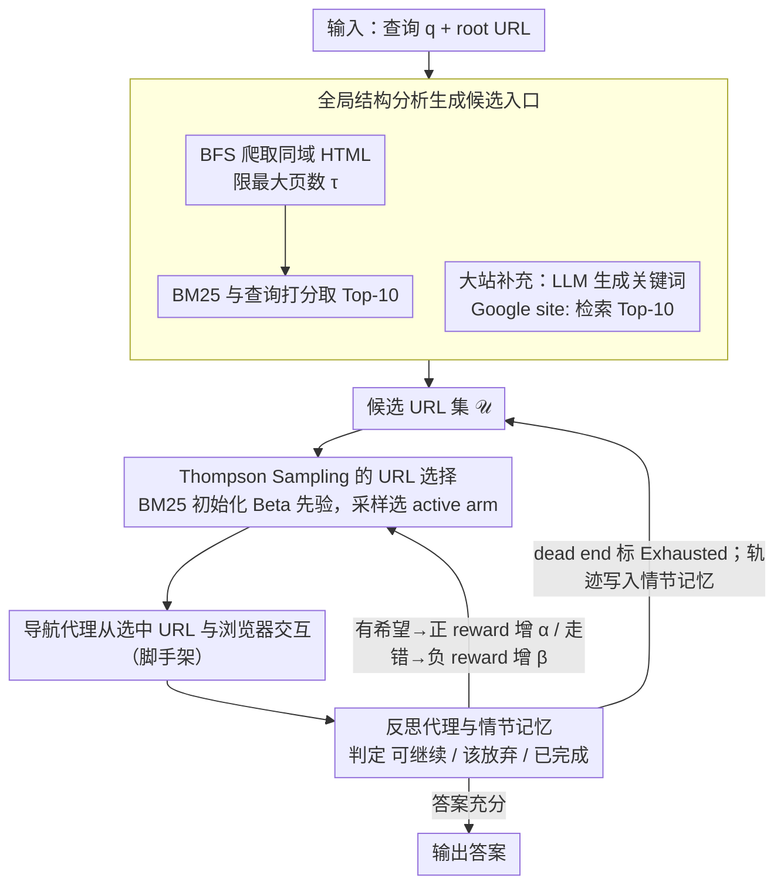

# Mango: Multi-Agent Web Navigation via Global-View Optimization

**会议**: ACL2026  
**arXiv**: [2604.18779](https://arxiv.org/abs/2604.18779)  
**代码**: https://github.com/VichyTong/Mango  
**领域**: Web Agent / LLM Agent / 网页导航  
**关键词**: 网页导航, 全局结构分析, 多臂老虎机, Thompson Sampling, 情节记忆

## 一句话总结
Mango 在网页导航前先构建网站的全局近似结构，再用 Thompson Sampling 在候选 URL 间动态分配有限导航预算，使 LLM web agent 不必总从首页盲目探索，并在 WebVoyager 和 WebWalkerQA 上显著超过 AgentOccam、WebWalker 等基线。

## 研究背景与动机
**领域现状**：LLM web agent 通常从网站 root URL 开始，通过点击、输入、阅读页面等动作逐步寻找答案。已有工作主要改进浏览器感知、动作空间对齐、分步规划或 agentic search，让模型在当前页面的局部观察下做更好的下一步决策。

**现有痛点**：真实网站往往有深层级结构和大量页面。若所有任务都从首页出发，agent 需要自顶向下穿过大量无关页面，很容易陷入导航陷阱、探索错误分支，或在严格动作预算内到不了目标页面。MCTS 等搜索策略虽然能探索轨迹树，但在网页这种大分支、长 horizon 场景里，模拟开销很高。

**核心矛盾**：网页导航的瓶颈不只是“下一步点哪里”，还包括“从哪里开始探索”。局部观察的 agent 即使动作选择不错，也可能因为初始入口太差而浪费大部分预算；但穷尽爬完整个网站又不现实。

**本文目标**：作者希望在导航前构造一个轻量全局视图，从中选出与用户问题相关的入口 URL；然后在有限预算下自适应地决定先访问哪个入口、是否继续探索、是否放弃某条路径。

**切入角度**：Mango 把候选 URL 看作 multi-armed bandit 的 arms，把一次导航尝试后的反思结果看作 reward 信号。相比 MCTS 扩展整棵交互树，bandit 只需在候选入口间快速平衡 exploration/exploitation，更适合严格预算。

**核心 idea**：先用轻量 BFS crawl、BM25 和 site-specific Google search 形成候选 URL 集，再用以 BM25 relevance 初始化先验的 Thompson Sampling 选择 URL；每次导航后由 reflection agent 判断该路径是否有前途，并更新 Beta 后验和情节记忆。

## 方法详解

### 整体框架
Mango 的输入是用户查询 $q$ 和 root URL $u_r$。系统先做 **Global Structure Analysis**：爬取同域可达网页、过滤非 HTML 和外部链接，用 BM25 找出与查询相关的候选 URL；对于 crawl 难以覆盖的大网站，再让 LLM 生成搜索关键词，用 Google `site:` 检索补充候选入口。之后进入 **URL Prioritization and Selection**：把候选 URL 集 $\mathcal{U}$ 建模成有限生命期的多臂老虎机，用 Thompson Sampling 在 active arms 中选择下一次导航入口。导航 agent 从选中的 URL 开始与浏览器环境交互；一次尝试结束后，reflection agent 判断答案是否充分、路径是否值得继续，更新后验并写入 episodic memory。

实验中 Mango 对 WebVoyager 使用与 AgentOccam 对齐的 Playwright-based 环境，对 WebWalkerQA 使用与 WebWalker 对齐的 Crawl4AI 环境，保证浏览器执行设置公平。每个 URL 的导航预算 $b$ 和 Thompson Sampling 迭代次数都设为 10。

### 关键设计

**1. 全局结构分析生成候选入口：在导航前把可能藏着答案的页面入口从整站结构里筛出来**

首页常常不是好入口，但爬完整站又不现实，所以 Mango 先建一张轻量的全局近似图。它从 root URL 做 BFS 爬取，只保留同域 HTML 页面并设最大爬取页数 $\tau$，对爬到的页面用 BM25 与用户查询打分取 Top-10 进候选集；遇到 arXiv 这种数百万页面、crawl 难覆盖的大站，再让 LLM 根据查询生成关键词，用 Google `site:` 检索补 Top-10。这样导航就从「从根节点盲搜」变成「从几个相关子树入口试探」，BM25 兼顾站内可达结构、Google 兼顾搜索引擎已索引页面，两路候选互补。

**2. 基于 Thompson Sampling 的 URL 选择：在有限预算下动态决定下一个最值得访问的入口**

候选入口该按什么顺序试？BM25 给的全局相关性不能全信，导航反馈又次数有限，Mango 于是把候选 URL 集 $\mathcal{U}$ 建成一个有限生命期的多臂老虎机来折中二者。每个 URL 是一个 arm，有 Active/Exhausted 状态，维护 Beta 分布参数 $(\alpha_u,\beta_u)$，初值由 BM25 分数归一化得到 $\rho_u=(\lambda_u-\min \lambda)/(\max \lambda-\min \lambda+\epsilon)$，再设 $\alpha_u^{(0)}=1+\kappa\rho_u$、$\beta_u^{(0)}=1+\kappa(1-\rho_u)$。每步从 active arms 的 Beta 后验采样 $\theta_u$，选最大者导航；反思给正 reward 就增 $\alpha$，否则增 $\beta$，被判 dead end 的路径标为 Exhausted。相比固定排序或 MCTS 模拟整棵交互树，Thompson Sampling 只在候选入口间快速平衡 exploration/exploitation，更扛得住严格预算。

**3. 反思代理与情节记忆：判断一次导航是否完成、是否值得继续，并避免重复踩坑**

网页导航常要多次试探，只用成功/失败二值会把「差一点完成」和「完全走错」混为一谈。导航 agent 若声称完成，reflection agent 就核对最终答案和动作轨迹是否真满足查询；若答案不足但路径仍有希望，给正 reward 让该 URL 未来更可能被继续探索；若预算耗尽，则判断当前页面是否仍相关，不相关给负 reward。每次尝试的轨迹、输出和反思都写入 episodic memory，同一 URL 再被访问时作为上下文喂给导航 agent。这样反思就把导航状态细分为「可继续 / 该放弃 / 已完成」三态，并用记忆减少重复探索——reflection 不再只是日志，而是直接驱动下一次 URL 选择的后验。

### 损失函数 / 训练策略
Mango 不训练新模型，主要是 inference-time agent pipeline。实验使用五个 backbone：GPT-5-mini 和 Qwen3-4B/8B/14B/32B。Qwen3 模型关闭 thinking mode，temperature=0.7、top_p=0.8。主要超参包括导航预算 $b=10$、Thompson Sampling 迭代次数 10、候选来源各取 Top-10；敏感性分析显示 $\kappa=3$、$\tau=1000$、候选 Top-10 是较优设置。

## 实验关键数据

### 主实验
| Benchmark | Backbone | 最强基线 SR | Mango SR | 绝对提升 | 备注 |
|-----------|----------|-------------|----------|----------|------|
| WebVoyager | GPT-5-mini | AgentOccam 56.25 | 63.57 | +7.32 | 摘要四舍五入为 63.6%、+7.3% |
| WebVoyager | Qwen3-32B | AgentOccam 34.11 | 37.98 | +3.87 | 开源模型上也提升 |
| WebWalkerQA | GPT-5-mini | WebWalker 25.74 | 52.50 | +26.76 | 摘要写作 +26.8% |
| WebWalkerQA | Qwen3-4B | WebWalker 12.50 | 17.06 | +4.56 | 小模型仍有效 |
| WebWalkerQA | Qwen3-32B | WebWalker 16.76 | 28.38 | +11.62 | Mango 随模型规模单调提升 |

WebWalkerQA 中，GPT-5-mini 的 Mango 在 single-source QA Overall 上达到 60.59%，multi-source QA Overall 达到 44.41%，整体 52.50%；相比之下 WebWalker 分别为 29.41%、22.06%、25.74，AgentOccam 分别为 19.12%、21.47%、20.29。

### 消融实验
| Benchmark | Backbone | Random URL | Google-only | MCTS | Mango | 关键结论 |
|-----------|----------|------------|-------------|------|-------|----------|
| WebVoyager | GPT-5-mini | 56.59 | 59.69 | 46.51 | 63.57 | Thompson Sampling 明显优于 MCTS |
| WebVoyager | Qwen3-32B | 27.13 | 32.56 | 23.26 | 37.98 | 全局结构 + bandit 均有贡献 |
| WebWalkerQA | GPT-5-mini | 47.50 | 49.41 | 42.21 | 52.50 | Google-only 不够，MCTS 预算成本高 |
| WebWalkerQA | Qwen3-32B | 19.85 | 25.88 | 16.47 | 28.38 | Mango 在开源模型上保持优势 |

### 效率与失败分析
| 分析项 | 关键数字 | 解释 |
|--------|----------|------|
| WebVoyager GPT-5-mini action count | Mango 14.18, AgentOccam 9.46, WebWalker 7.38 | Mango 更愿意继续探索，解决更多长任务 |
| WebWalkerQA GPT-5-mini action count | Mango 19.13, AgentOccam 10.09, WebWalker 10.38 | 成功率提升伴随更高动作成本 |
| 失败样本数 | 323 个 WebWalkerQA 失败案例 | 作者手工检查 GPT-5-mini backbone 的失败 |
| Exceed Budget | 52.4% | 目标信息太深或候选集初始误差导致预算耗尽 |
| Locating Wrongly | 24.6% | 被模糊链接误导到错误子页 |
| Reasoning Error | 15.4% | 到达正确页面但抽取/推理出错 |
| Out-of-date Golden Answers | 5.6% | benchmark 标准答案过期 |
| Reflection Error | 2.0% | 反思代理过早判定答案足够 |

### 关键发现
- Mango 的最大收益来自“导航前剪枝搜索空间”。它不是让 LLM 更聪明，而是给 LLM 一个更好的起点集合。
- MCTS 在严格预算下表现较差，因为它需要大量交互扩展和估值；Thompson Sampling 不做轨迹树模拟，更适合候选 URL 选择。
- GPT-5-mini 上 Mango action count 更高，但这是因为它还能继续完成基线早已 plateau 的复杂任务，不只是无效拖长。
- 失败中超过一半来自预算耗尽，说明全局视图仍是近似视图，长尾深层网页仍困难。

## 亮点与洞察
- **从“页面内决策”上升到“入口选择”**：很多 web agent 论文默认从首页开始，Mango 直接质疑这个假设。对于大型网站，入口选择本身就是任务的一半。
- **BM25 先验 + bandit 后验是实用组合**：BM25 给廉价全局相关性，reflection reward 给在线反馈。这个设计比全靠 LLM 打分更便宜，也比固定排序更能适应错误初始估计。
- **把反思结果接入 URL 后验**：reflection 不只是生成日志或自然语言总结，而是直接影响下一次 URL selection 的概率分布。这让反思模块真正参与控制。
- **失败分析很诚实**：作者区分了导航失败、定位失败、阅读推理失败和 benchmark 答案过期。这样能看出 Mango 解决的是探索效率，不是所有 web QA 问题。

## 局限与展望
- 全局结构只是轻量近似，无法覆盖大型、动态、深层网站。目标信息若埋得很深，仍可能超过预算。
- 候选集质量对后续 bandit 很关键。若 BM25、LLM keyword 或 Google results 早期引入错误入口，严格预算下后验修正可能来不及。
- 到达正确页面后仍可能因 LLM 阅读理解或细节抽取错误失败，这不是导航策略本身能解决的。
- Mango 有时通过更多动作获得更高成功率，在延迟敏感或 API 成本敏感场景中可能不划算。
- 论文使用 Google search 作为候选补充源，实际部署可能受到搜索 API、地区、个性化和网页更新影响。

## 相关工作与启发
- **vs AgentOccam**: AgentOccam 强调对动作和观察空间做对齐，使 LLM 更容易操作浏览器；Mango 更关注导航开始前的入口选择和预算分配，两者可以互补。
- **vs WebWalker**: WebWalker 采用 explore-critic 范式从网页中逐步探索；Mango 通过全局结构和 bandit 先减少无关探索。
- **vs MCTS web agent**: MCTS 适合可模拟、分支较可控的搜索空间；网页导航交互成本高、分支复杂，Mango 的 Thompson Sampling 更轻量。
- **启发**: 对代码库导航、文档检索、企业知识库问答也可复用同样思想：先建立轻量全局索引，再用 bandit/反思在候选入口之间分配预算。

## 评分
- 新颖性: ⭐⭐⭐⭐☆ 从全局网站结构和 bandit 入口选择切入 web navigation，角度清楚且实用。
- 实验充分度: ⭐⭐⭐⭐⭐ 两个 benchmark、五个 backbone、动作数、消融、敏感性和失败分析都比较完整。
- 写作质量: ⭐⭐⭐⭐☆ 方法讲得直观，表格充分；个别符号和算法细节略显分散。
- 价值: ⭐⭐⭐⭐⭐ 对构建实际 web agent 很有参考价值，尤其是预算受限场景下的入口选择和反思控制。

<!-- RELATED:START -->

## 相关论文

- [\[ICLR 2026\] MVR: Multi-view Video Reward Shaping for Reinforcement Learning](../../ICLR2026/robotics/mvr_multi-view_video_reward_shaping_for_reinforcement_learning.md)
- [\[AAAI 2026\] UrbanNav: Learning Language-Guided Urban Navigation from Web-Scale Human Trajectories](../../AAAI2026/robotics/urbannav_learning_language-guided_urban_navigation_from_web-scale_human_trajecto.md)
- [\[AAAI 2026\] A Computable Game-Theoretic Framework for Multi-Agent Theory of Mind](../../AAAI2026/robotics/a_computable_game-theoretic_framework_for_multi-agent_theory_of_mind.md)
- [\[CVPR 2025\] CityWalker: Learning Embodied Urban Navigation from Web-Scale Videos](../../CVPR2025/robotics/citywalker_learning_embodied_urban_navigation_from_web-scale_videos.md)
- [\[ICLR 2026\] Distributionally Robust Cooperative Multi-Agent Reinforcement Learning via Robust Value Factorization](../../ICLR2026/robotics/distributionally_robust_cooperative_multi-agent_reinforcement_learning_via_robus.md)

<!-- RELATED:END -->
