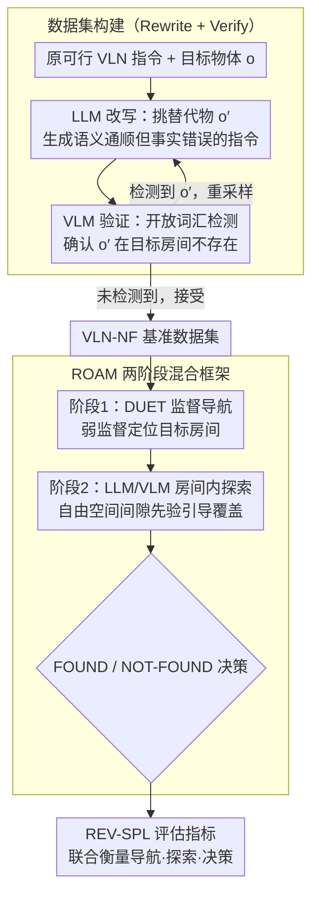

# VLN-NF: Feasibility-Aware Vision-and-Language Navigation with False-Premise Instructions

**会议**: ACL 2026  
**arXiv**: [2604.10533](https://arxiv.org/abs/2604.10533)  
**代码**: [https://vln-nf.github.io/](https://vln-nf.github.io/)  
**领域**: 机器人/具身智能  
**关键词**: 视觉语言导航, 虚假前提, NOT-FOUND, 具身探索, 可行性感知

## 一句话总结

本文提出 VLN-NF 基准——首个要求 VLN agent 在 3D 部分可观测环境中识别虚假前提指令并输出 NOT-FOUND 的任务，配套提出 REV-SPL 评估指标和 ROAM 两阶段混合框架，ROAM 达到 6.1 REV-SPL，比监督基线提升 45%。

## 研究背景与动机

**领域现状**：视觉语言导航（VLN）研究如何让具身智能体根据自然语言指令在 3D 环境中导航。现有基准（R2R、REVERIE 等）均假设指令总是可行的，目标物体一定存在于环境中。

**现有痛点**：真实部署中，人类指令经常出错——认知科学研究表明人类每七次物体-位置回忆中约有一次错误。例如用户说"拿厨房桌上的盘子"，但盘子实际在客厅。现有 VLN agent 无法处理这类情况，要么幻觉出相似物体，要么无限搜索。

**核心矛盾**：在部分可观测的 3D 环境中，目标不存在这一事实无法从单个视角确认，需要充分探索收集证据后才能做出 NOT-FOUND 判断。但现有 VLN 系统缺乏这种证据驱动的验证能力，且简单地添加 NOT-FOUND 动作会导致过早放弃。

**本文目标**：(1) 构建包含虚假前提指令的 VLN-NF 基准数据集；(2) 设计评估指标 REV-SPL 联合评估导航、探索和决策；(3) 提出 ROAM 框架实现证据驱动的 NOT-FOUND 判断。

**切入角度**：将问题分解为房间级导航（可用监督学习）和房间内探索验证（需要 LLM/VLM 驱动），避免端到端训练中探索行为不确定性带来的问题。

**核心 idea**：通过 LLM 改写 + VLM 验证的可扩展流程自动构建虚假前提数据集，并用两阶段混合框架（监督导航 + LLM/VLM 探索验证）解决新任务。

## 方法详解

### 整体框架

VLN-NF 包含三个贡献：(1) 数据集构建流程——用 LLM 将可行指令改写为虚假前提指令，用 VLM 验证目标确实不存在；(2) REV-SPL 评估指标——联合评估到达目标房间、探索覆盖率和 FOUND/NOT-FOUND 决策正确性；(3) ROAM 两阶段方法——第一阶段用监督模型定位目标房间，第二阶段用 LLM/VLM 在房间内探索并做出判断。三者串成一条链路：先自动造出虚假前提数据，再让 ROAM 在数据上跑导航与验证，最后用 REV-SPL 给出探索是否充分、判断是否正确的评分。

### 关键设计

**1. 数据集构建流程（Rewrite + Verify）：把现成的可行 VLN 指令自动改写成虚假前提指令**

手动标注探索行为成本极高、不确定性又大，所以本文用「LLM 改写 + VLM 验证」的自动流程低成本造数据。给定原指令和目标物体 $o$，LLM Rewriter 在目标房间物体列表之外挑一个合理替代物 $o'$（如「浇窗户下的植物」改成「擦窗户下的沙发」），生成语义通顺但事实错误的新指令；VLM Verifier 再对目标房间所有全景图跑开放词汇检测，确认 $o'$ 确实不存在——检测到就重采样，没检测到才接受。人工抽审 5% 样本，错误率 <2%，证明这套流程既便宜又可扩展。

**2. REV-SPL 评估指标：联合衡量导航效率、探索充分度和决策正确性**

标准 SPL 只看是否沿最短路径到达目标，无法衡量「证据收集够不够」，直接复用还会鼓励退化行为——不探索就输出 NOT-FOUND 也能拿分。REV-SPL 因此重新定义参考探索路径：指令含地标线索时，参考路径覆盖原目标物体的可见视点（用 TSP 求最短覆盖路径）；无地标时改用贪心覆盖策略遍历房间直到覆盖 85%+ 的物体。在此基础上，REV-SPL 惩罚过早停止（覆盖不足）和错误决策（把 FOUND 判成 NOT-FOUND 或反之），同时奖励探索效率，从而把「探得够不够、判得对不对」一起纳入评分。

**3. ROAM 两阶段混合框架：用监督导航 + LLM/VLM 探索实现证据驱动的判断**

纯监督方法受模仿学习的协变量偏移影响会过早终止，纯 LLM 方法又在部分可观测的房间间导航上很弱，ROAM 干脆让两者各做擅长的一段。第一阶段用 DUET 监督模型导航到目标房间（弱监督，只需房间级标注）；第二阶段交给 LLM 规划探索策略、VLM 执行开放词汇检测，并结合自由空间间隙先验（free-space clearance prior）把探索引向尚未覆盖的区域，探索结束后再根据检测结果判 FOUND 还是 NOT-FOUND。这样监督模型负责跨房间的稳定导航、大模型负责房间内的灵活探索与验证，规避了端到端训练里探索行为不确定性带来的麻烦。

### 损失函数 / 训练策略

第一阶段 DUET 模型使用标准 VLN 训练（交叉熵损失 + 导航奖励）；第二阶段的 LLM/VLM 探索模块无需训练，直接利用预训练模型的能力进行零样本推理。

## 实验关键数据

### 主实验

| 方法 | 类型 | REV-SPL (val-unseen) |
|--------|------|------|
| DUET + VLN-NF | 监督 | 4.2 |
| NaviLLM | LLM-based | 1.0 |
| Gemini 1.5 Pro | LLM-based | 1.5 |
| ROAM | 混合 | 6.1 |

ROAM 比最强监督基线提升 45%，比 LLM 基线提升 4-6 倍。

### 消融实验

| 配置 | 关键指标 | 说明 |
|------|---------|------|
| ROAM 完整 | REV-SPL 6.1 | 监督导航 + LLM/VLM 探索 |
| w/o 自由空间先验 | REV-SPL 降低 | 探索覆盖率下降 |
| DUET 直接加 NF | REV-SPL 4.2 | 过早输出 NOT-FOUND |

### 关键发现

- **现有 VLN agent 无法处理虚假前提**：所有基线在 VLN-NF 上 REV-SPL 极低，主要因为探索不充分就做出判断。
- **过早放弃是核心问题**：简单在监督 VLN 中添加 NOT-FOUND 动作反而导致模型学会"提前放弃"，因为模仿学习的协变量偏移在探索任务中尤为严重。
- **LLM 擅长房间内规划但不擅长房间间导航**：纯 LLM 方法（NaviLLM、Gemini）在缺乏步级导航指导时表现极差，但 ROAM 利用 LLM 做房间内探索规划取得了好效果。
- **数据集质量高**：LLM 改写 + VLM 验证流程的人工审核错误率 <2%，构建成本低且可扩展。

## 亮点与洞察

- **填补 VLN 可靠性空白**：首次系统研究 3D 部分可观测环境中的虚假前提导航，填补了 VLN 社区在指令不可靠性方面的重要空白。
- **REV-SPL 指标设计巧妙**：从 SPL 延伸到证据驱动验证场景，参考探索路径的双模式设计（地标引导 vs 覆盖扫描）很好地平衡了不同场景的评估需求。
- **两阶段分解策略可迁移**：将导航和验证解耦的思路可以迁移到其他需要在不确定条件下做决策的具身任务。

## 局限与展望

- 目前仅关注目标级虚假前提（物体不存在），未涵盖属性错误、歧义指令等更广泛的不可靠指令类型。
- 当判断为 NOT-FOUND 后直接终止，缺乏恢复策略（如请求澄清、尝试替代路径）。
- REV-SPL 绝对数值较低（最高 6.1），说明任务本身仍非常有挑战性，有大量提升空间。
- 仅在 REVERIE 基础上构建，未扩展到 R2R 等其他 VLN 基准。

## 相关工作与启发

- **vs MoTIF**: MoTIF 在 2D 移动应用中研究不可行指令，但 agent 具有完全可观测的屏幕。VLN-NF 在 3D 部分可观测环境中要求通过自主探索确认目标缺失，难度更高。
- **vs R2R-UNO**: R2R-UNO 研究物理障碍导致的指令-环境不匹配，关注可导航性变化。VLN-NF 关注语义级别的虚假前提，即目标本身不存在。

## 评分

- 新颖性: ⭐⭐⭐⭐⭐ 首个 3D 部分可观测 VLN 虚假前提基准，问题定义新颖且实用
- 实验充分度: ⭐⭐⭐⭐ 与多种基线对比充分，但绝对性能较低限制了分析深度
- 写作质量: ⭐⭐⭐⭐⭐ 问题动机清晰，方法和评估设计逻辑严密
- 价值: ⭐⭐⭐⭐ 为 VLN 可靠性研究开辟了新方向

<!-- RELATED:START -->

## 相关论文

- [\[CVPR 2026\] Towards Open Environments and Instructions: General Vision-Language Navigation via Fast-Slow Interactive Reasoning](../../CVPR2026/robotics/towards_open_environments_and_instructions_general_vision-language_navigation_vi.md)
- [\[ACL 2026\] Breaking Down and Building Up: Mixture of Skill-Based Vision-and-Language Navigation Agents](breaking_down_and_building_up_mixture_of_skill-based_vision-and-language_navigat.md)
- [\[ACL 2026\] GROKE: Vision-Free Navigation Instruction Evaluation via Graph Reasoning on OpenStreetMap](groke_vision-free_navigation_instruction_evaluation_via_graph_reasoning_on_opens.md)
- [\[ECCV 2024\] LLM as Copilot for Coarse-Grained Vision-and-Language Navigation](../../ECCV2024/robotics/llm_as_copilot_for_coarse-grained_vision-and-language_navigation.md)
- [\[CVPR 2026\] DecoVLN: Decoupling Observation, Reasoning, and Correction for Vision-and-Language Navigation](../../CVPR2026/robotics/decovln_decoupling_observation_reasoning_and_correction_for_vision-and-language_.md)

<!-- RELATED:END -->
