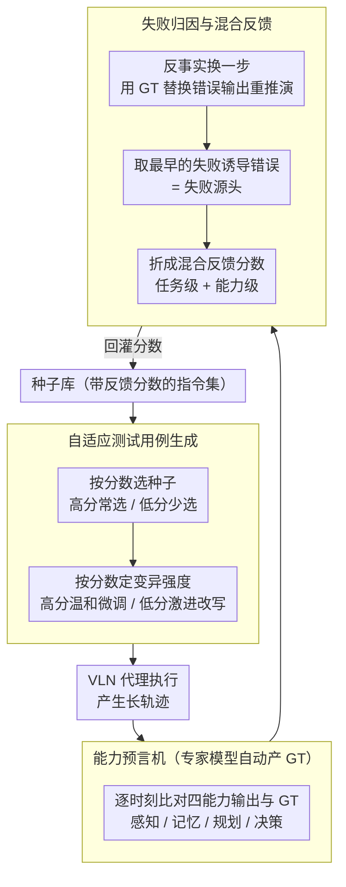

# 视觉语言导航代理的能力导向失败归因

**会议**: ACL 2026  
**arXiv**: [2604.25161](https://arxiv.org/abs/2604.25161)  
**代码**: https://github.com/JMChen121/CanTest/  
**领域**: 机器人 / 具身智能 / 导航  
**关键词**: 视觉语言导航、能力失败诊断、测试框架、具身代理、模糊化测试

## 一句话总结

本文针对具身代理（特别是视觉语言导航 VLN 代理）的多层次能力失败问题，提出 CanTest 框架，通过能力导向的测试预言机与失败归因机制，精准定位导致任务失败的具体能力缺陷（感知/记忆/规划/决策），比现有方法发现的失败案例多 23–34%。

## 研究背景与动机

**领域现状**：具身代理在安全关键应用（如视觉语言导航、家务机器人）中的可靠性评估主要依赖任务级指标（路径长度、执行时间等），缺乏对代理内部能力结构的深入测试。

**现有痛点**：

- VLN 代理集成感知、记忆、规划、决策四个能力，这些能力紧密耦合且相互依赖
- 失败时，上游能力错误会级联传播到下游（如感知错误导致记忆混乱、进而规划错误）
- 在长轨迹上很难追踪最初的失败源头
- 开发者无法精准定位薄弱环节进行针对性改进

**核心矛盾**：系统级的失败检测（"任务失败了"）与能力级的失败诊断（"是哪个能力导致的"）之间存在巨大鸿沟。对长序列具身任务而言，仅知道失败而不知道失败根源几乎无法指导改进。

**本文目标**：开发**能力导向的测试方法**，使得：(1) 能自动生成容易暴露特定能力缺陷的测试用例；(2) 为每个能力构建独立的评价标准（预言机）；(3) 能从长轨迹中准确归因失败到具体的某一个能力及其首次出错时刻。

**切入角度**：将长轨迹失败归因问题转化为反事实推理（counterfactual reasoning）：对每个检测出的能力错误，尝试用预言机的正确输出替换，看轨迹是否变成成功；若变成功，则这个错误是"失败诱导错误"。在多个诱导错误中，找最早出现的那个，就是失败源头。

**核心 idea**：将模糊测试（fuzzing）与能力级的预言机和反事实因果推理相结合，设计自适应的反馈评分机制。

## 方法详解

### 整体框架

CanTest 的目标是：当一个 VLN 代理在长轨迹上任务失败时，不止告诉你"失败了"，而是指出"是感知/记忆/规划/决策中的哪个能力、在哪一步最先出错"。它用一个模糊测试（fuzzing）循环来驱动整个过程——维护一个带反馈分数的种子库，每轮挑一条种子指令、做强弱两档变异生成新指令喂给代理执行；执行后用四个能力预言机逐时刻比对代理输出与专家 GT，找出真正诱发失败的最早错误，把这个诊断结果折算成反馈分数回灌种子库，引导下一轮生成更容易暴露薄弱能力的指令。三件事——生成、判分、归因——首尾相接，越跑越精准。

### 关键设计

**1. 自适应测试用例生成：让变异强度跟着"这条种子有多容易失败"走**

VLN 代理的失败是稀疏事件，盲目随机变异指令很难高效命中缺陷。CanTest 把每条种子在历史上的反馈分数当作信号来分配搜索资源：选种子时按分数归一化成概率 $p_{cs_i} = \max(F_{cs_i}, 0) / \sum_{i=1}^{N} F_{cs_i}$，分高的更常被选中；变异时按 $p_m = (F_{cs} - \min(\mathbf{F})) / (\max(\mathbf{F}) - \min(\mathbf{F}))$ 决定强度——高分种子（已证实易诱发失败）用温和变异，小步微调以保留并精化这个失败模式；低分种子用激进变异，大幅改写指令把代理推上完全不同的路线，去探测其他尚未暴露的缺陷。这样既"深挖"已知弱点，又"广撒"未知盲区。

**2. 能力预言机构造：为四个异构能力各自定一把可自动计算的"对错尺"**

要把失败归因到具体能力，就得能独立判断每个能力当下输出是否正确，但感知、记忆、规划、决策的输出形态各不相同，没有统一标准。CanTest 借模拟环境里的专家模型自动获取 ground truth——导航专家用贪心路径规划给最优路径、图像标注模型（RAM）给感知 GT、历史视觉标注存档作记忆 GT——再为每个能力定制一个距离度量。感知预言机融合 LLM 语义相似度与检测框 IoU：$\epsilon_t^p = \frac{1}{N}\sum_n (\|VA_{t,n} - VA_{t,n}^{gt}\|_{\mathbb{L}} - |P_{t,n} \cap P_{t,n}^{gt}| / |P_{t,n} \cup P_{t,n}^{gt}|)$；规划预言机用归一化动态时间规整衡量路径偏差 $\epsilon_t^{pl} = 1 - \text{nDTW}(\tau_t^{pl}, \tau_{t,\ldots,n}^{gt})$；决策预言机比对实际动作与规划动作 $\epsilon_t^d = 1 - \|D_t - D_t^{pl}\|$。因为 GT 全由专家模型自动产出，整套预言机无需人工逐例标注即可规模化运行。

**3. 失败归因与混合反馈：用反事实"换一步"找出最早的失败源头**

四个能力紧密耦合，上游错误会级联到下游，光看终点失败无法判断祸首是谁。CanTest 先用预言机扫过所有时刻 $t$，得到全部能力错误的集合 $C^{errors}$；然后对每个错误 $(C_x, t)$ 做反事实干预——把代理在该时刻的输出替换成预言机的正确输出，重新推演剩余轨迹，如果轨迹由失败翻转为成功，这个错误就被判定为"失败诱导错误"。在所有诱导错误里取时间最早的那个作为根源 $(C_x^*, t^*) = \arg\min_{(C_x', t') \in \mathbb{C}(\tau)} t$，对应"最初的那块多米诺骨牌"。最后把诊断结果折成混合反馈分数 $F_{cs} = F^f + \lambda^{C_x} F^c$ 回灌种子库：$F^f \in \{0, 1\}$ 是任务级成功/失败信号，$F^c = \text{Norm}(\epsilon_{t^*}^x)$ 是根源能力在根源时刻的归一化错误强度，自适应权重 $\lambda^{C_x} = \overline{N^{C_y}} / N^{C_x}$ 动态压低已被充分探索能力的比重、抬高欠探索能力，避免测试生成困在单一能力的局部循环里。任务级与能力级两个信号一起进，既不只盯"有没有失败"，也不只盯"某能力偏差大不大"。

## 实验关键数据

采用 Habitat 3 VLN 模拟环境，HM3D 数据集提供 216 个大规模室内 3D 场景及语义标注，测试三个先进 VLN 模型（ApexNav、MGDM、Mem2Ego），与三个基线对比：Random、BehAVExplor、VLATest。

### 主实验：发现失败用例数对比

| 方法 | ApexNav | MGDM | Mem2Ego | 平均改进 |
|------|---------|------|---------|---------|
| Random | ~20–25 | ~23–28 | ~18–22 | 基准 |
| BehAVExplor + OA | ~41–49 | ~42–51 | ~37–46 | 基准 |
| VLATest + OA | ~52–58 | ~56–63 | ~50–58 | 基准 |
| **CanTest（本文）** | **72–75** | **74–76** | **61–65** | **+23–34%** |

说明：OA 表示将 CanTest 的预言机和归因机制作为插件集成到基线。CanTest 在所有模型上稳定超越所有基线。

### 能力级失败案例数分解

| 能力 | ApexNav | MGDM | Mem2Ego | 说明 |
|------|---------|------|---------|------|
| 感知失败 | 72.2 | 74.7 | 61.4 | CanTest 在感知失败发现上最强 |
| 记忆失败 | 66.3 | 56.1 | 42.8 | 不同模型记忆能力差异大 |
| 规划失败 | 52.5 | 49.3 | 66.1 | 规划失败较少 |
| 决策失败 | 59.5 | 64.7 | 63.4 | 决策失败相对稳定 |

### 修复实验：用预言机正确输出修复失败用例

| 能力 | ApexNav 修复率 | MGDM 修复率 | Mem2Ego 修复率 |
|------|---------|---------|---------|
| 感知 | 84.35% | 83.53% | 85.83% |
| 记忆 | 81.30% | 82.35% | 83.64% |
| 规划 | 87.05% | 86.41% | 89.71% |
| 决策 | 95.13% | 94.90% | 96.69% |

修复率 > 81% 表明预言机可信度高。上游能力（感知、记忆）修复率略低，因为上游错误传播到下游会引发多阶段错误。

### 关键发现

- **预言机高保真**：修复率 > 81% 说明自动构造的预言机捕捉了真实的能力错误。
- **上游错误损伤更大**：感知/记忆错误修复率低于规划/决策，因为上游错误会级联扩散到整个轨迹。
- **多样性强**：手工分析 100 个失败用例，涵盖 8 种细粒度失败类型，比基线只覆盖 6 种。
- **消融**：去掉失败导向反馈、去掉能力导向反馈、去掉两者分别得到失败发现数 62–68、62–70、45–55，说明两种反馈信号对发现失败都有贡献。

## 亮点与洞察

- **反事实推理在具身任务测试中的巧妙应用**：通过替换错误能力输出为 GT 来判定是否导致失败，巧妙地在长轨迹中找到失败根源，优雅且可解释。
- **能力预言机的自动构造框架**：无需手工设计每个能力的评价标准，而是利用专家模型自动获取 GT。这对缺乏人工标注的场景非常实用。
- **自适应反馈权重平衡探索**：通过 $\lambda^{C_x}$ 动态降低已充分探索的能力权重、提升欠探索能力权重，避免测试生成陷入某一能力的局部循环。
- **失败多样性分析细致**：不仅报告能力级失败数，还手工标注了 8 种细粒度失败类型，提供了比"感知/记忆/规划/决策"更精细的失败诊断视图。

## 局限与展望

**作者确认的局限**：

1. **依赖专家模型**：构造预言机需要 GT，如最优路径规划和感知标注。在真实环境中获取这样的特权信息很困难。
2. **仿真-真实偏差**：当前评估在 Habitat 仿真环境中进行，真实环境中的噪声、动态性会让预言机设计失效。

**自身视角的扩展方向**：

1. 预言机当前基于专家模型的 GT，未来可探索弱监督预言机（用演示、纠正反馈、安全监视器蒸馏信号）。
2. VLN 之外的具身任务（如机械臂操作、多代理协作）的能力定义和预言机设计可能不同，需要通用化框架。
3. 当前只处理长轨迹上的一个最早失败源头，未来可考虑多个并发失败源的归因模型。

## 相关工作与启发

- **vs BehAVExplor**：BehAVExplor 用行为引导的模糊测试生成多样化测试用例，但反馈信号仅来自系统级任务成功/失败，无法区分失败根源。CanTest 引入能力级反馈后，探索更精准、失败发现 +23%。
- **vs VLATest**：VLATest 是操作机器人的 SOTA 测试框架，CanTest 针对 VLN 定制了能力预言机和反事实归因，相比通用算子方法，对多模态具身代理的诊断力更强。
- **vs 传统软件测试**：CanTest 借鉴反事实因果推理的思想，用反向推演来定位源头，是因果推理在具身 AI 测试中的创新应用。

## 评分

- **新颖性**: ⭐⭐⭐⭐⭐ 首次系统化地将能力级测试、能力预言机自动构造、反事实失败归因结合到具身代理测试。
- **实验充分度**: ⭐⭐⭐⭐ 三个 VLN 模型、三个 baseline 对比、消融实验、修复率验证、手工多样性分析都很全面，缺的是真实环境验证。
- **写作质量**: ⭐⭐⭐⭐ 动机清晰、方法讲透、实验结论明确。
- **价值**: ⭐⭐⭐⭐⭐ 对具身 AI 测试和诊断有重要启发，预言机框架可迁移到其他多能力系统。

<!-- RELATED:START -->

## 相关论文

- [\[ACL 2026\] VLN-NF: Feasibility-Aware Vision-and-Language Navigation with False-Premise Instructions](vln-nf_feasibility-aware_vision-and-language_navigation_with_false-premise_instr.md)
- [\[ACL 2026\] Limited Linguistic Diversity in Embodied AI Datasets](limited_linguistic_diversity_in_embodied_ai_datasets.md)
- [\[ACL 2026\] ElasticFlow: One-Step Physics-Consistent Policy with Elastic Time Horizons for Language-Guided Manipulation](elasticflow_one-step_physics-consistent_policy_with_elastic_time_horizons_for_la.md)
- [\[ACL 2026\] GoViG: Goal-Conditioned Visual Navigation Instruction Generation via Multimodal Reasoning](govig_goal-conditioned_visual_navigation_instruction_generation_via_multimodal_r.md)
- [\[ACL 2026\] Breaking Down and Building Up: Mixture of Skill-Based Vision-and-Language Navigation Agents](breaking_down_and_building_up_mixture_of_skill-based_vision-and-language_navigat.md)

<!-- RELATED:END -->
