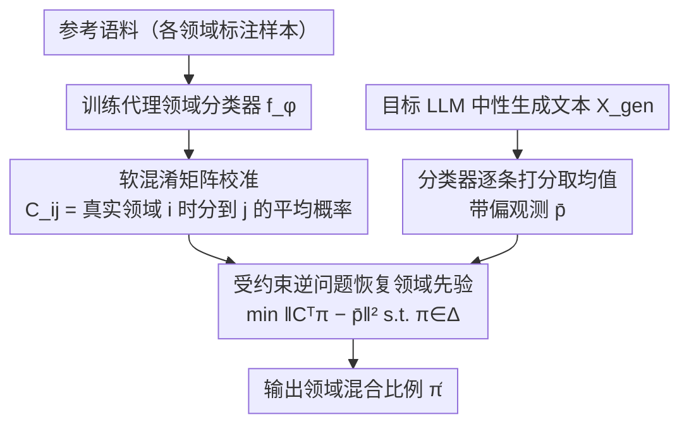

# LLMSurgeon: Diagnosing Data Mixture of Large Language Models

**会议**: ACL2026  
**arXiv**: [2605.30348](https://arxiv.org/abs/2605.30348)  
**代码**: 论文标注 Code & Data: LLMSurgeon，缓存未给出具体 URL  
**领域**: LLM 透明性 / 训练数据审计 / 模型治理  
**关键词**: 数据混合审计、训练语料组成、标签偏移、混淆矩阵、黑盒审计  

## 一句话总结
LLMSurgeon 把“这个 LLM 到底训练在什么数据上”形式化为 Data Mixture Surgery，并用代理分类器的软混淆矩阵反演生成文本中的领域分布，从而在只访问模型输出的条件下估计预训练数据混合比例。

## 研究背景与动机
**领域现状**：大型语言模型的行为、偏差和能力很大程度上来自预训练数据组成，但真实数据配方往往不公开。现有透明性工具多聚焦于成员推断，即判断某个具体样本是否出现在训练集中。

**现有痛点**：成员推断能回答“这一个样本有没有被见过”，却很难回答“整个训练语料有多少 Web、代码、书籍、论文或论坛内容”。如果直接把大量成员推断结果加总，计算量大、误差会累积，而且不同领域的推断难度不同，会造成系统性偏差。

**核心矛盾**：训练语料审计需要的是宏观分布估计，而现有工具大多提供微观样本级信号。闭源或固定模型又无法提供训练循环、原始语料或权重内部状态，因此方法必须在黑盒生成文本上工作。

**本文目标**：作者提出 Data Mixture Surgery (DMS)：给定一个预定义领域集合和目标 LLM 的生成样本，估计该模型隐含的有效领域先验 $\pi$。这个目标不是开放式发现未知类别，而是在已定义 taxonomy 下恢复混合比例。

**切入角度**：论文采用 label-shift 假设：领域比例会从训练语料到生成文本发生变化，但同一领域内部的语言特征近似保持不变。这样，生成文本经过代理领域分类器后得到的是被分类器混淆矩阵“模糊”过的观测分布，可以通过反问题校正。

**核心 idea**：先用参考语料估计代理分类器的软混淆矩阵，再把目标模型生成文本的平均分类输出当作带偏观测，通过受约束线性反演恢复潜在训练数据混合比例。

## 方法详解
LLMSurgeon 的方法很像给黑盒模型做“数据组成 CT”：不试图找出某个训练样本，而是让模型在中性提示下自然生成文本，再观察这些文本在预定义领域分类器眼中的分布，并用分类器自身的错误模式反推出真实领域比例。

### 整体框架
输入包括预定义领域集合 $\mathcal{Y}=\{1,\dots,K\}$、每个领域的参考语料、目标 LLM 的中性生成文本，以及公开文档给出的真实数据配方用于评测；输出是 simplex 上的估计向量 $\hat{\pi}$，表示模型行为中反映出的领域混合比例。整条管线分三步：先在参考语料上训练一个代理领域分类器 $f_\phi$ 并在 held-out 数据上标定它的软混淆矩阵 $C$；推理时让目标模型生成一批文本 $X_{gen}$，分类器逐条打分取均值得到带偏观测向量 $\bar{p}$；最后求解带约束最小二乘 $\min_{\pi\in\Delta^{K-1}} \|C^\top\pi-\bar{p}\|_2^2$（$\sum_k\pi_k=1$、$\pi_k\ge 0$）把观测还原成真实比例。

### 关键设计

**1. Data Mixture Surgery 问题定义：把审计从"样本见没见过"抬到"领域占多少"**

成员推断只能回答单条样本是否被训练过，但治理、版权和偏差分析真正关心的是整份语料里 Web、代码、书籍、论坛各占多大比例，逐条加总成员推断既贵又会累积误差。LLMSurgeon 把这件事形式化为 DMS：假设训练语料是各领域分布的混合 $p_\alpha(x)=\sum_i \alpha_i p_i(x)$，目标模型的生成分布可近似为 $q_\pi(x)=\sum_i \pi_i p_i(x)$，审计目标就是直接估计这个领域先验 $\pi$。它不做开放式的新类别发现，而是在一份已定义的 taxonomy 下恢复混合比例，把模糊的"审计"变成一个边界清楚的统计反问题。

**2. 软混淆矩阵校准：承认代理分类器一定会认错，并把错法记下来**

如果直接把分类器对生成文本的平均输出当成领域比例，C 与 C++、C4 与 Common Crawl 这类相似领域之间的系统性混淆就会被误读成真实占比，把估计带偏。LLMSurgeon 显式建模这种混淆：对真实领域为 $i$ 的参考样本，统计分类器预测到各领域 $j$ 的平均概率 $C_{ij}=\mathbb{E}_{x\sim p_i}[f_\phi(x)_j]$，整张矩阵 $C$ 就刻画了"真实是 $i$ 时分类器会怎么分散到各 $j$"。有了这张错法地图，后续才能把分类器的偏差从观测里扣掉，而不是把它当真值照单全收。

**3. 受约束逆问题恢复领域先验：用反演把被"模糊"过的观测还原回去**

label-shift 假设下，领域比例从训练语料到生成文本会变，但每个领域内部的语言特征近似不变，于是生成文本经分类器后的期望输出满足 $\mathbb{E}_{x\sim q_\pi}[f_\phi(x)]=C^\top\pi$——观测 $\bar{p}$ 正是真实先验 $\pi$ 被混淆矩阵 $C$ "模糊"后的结果。LLMSurgeon 在概率单纯形上解非负、和为 1 的约束最小二乘 $\min_{\pi}\|C^\top\pi-\bar{p}\|_2^2$ 把 $\pi$ 反解出来。这一步反演正是它相对朴素 audit-by-aggregation 的核心增益：它校正的是分类器自身的偏差，全程只用模型的黑盒生成文本，不需要触碰训练循环、原始语料或权重。

### 损失函数 / 训练策略
代理分类器在参考领域数据上训练；论文的核心估计目标不是常规端到端损失，而是受约束线性反演 $\min_{\pi\in\Delta^{K-1}} \|C^\top\pi-\bar{p}\|_2^2$。实验中 Coarse-Grained 设置使用 SlimPajama-627B-DC，每个 6 类领域采样 5,000 文档训练分类器；Mid-Grained 使用 The Pile 的 17 类；Fine-Grained 使用 The Stack 中 87 种编程语言。指标包括 Overlap Accuracy、MAE 和 $R^2$。

## 实验关键数据

### 主实验
| 设置 / 模型 | 粒度 | LLMSurgeon Overlap Accuracy | 表内强基线或代表性基线 | 说明 |
|--------|------|-----------------------------|------------------------|------|
| OLMo-1B | 6 类粗粒度 | 94.46% | Recall 48.05% | 粗粒度语料边界清晰，反演优势很大 |
| LLaMA1-7B | 6 类粗粒度 | 95.14% | Neighbor 40.13% | 接近恢复公开数据配方 |
| Amber-13B | 6 类粗粒度 | 78.87% | Recall 41.55% | 仍显著高于 MIA 聚合类方法 |
| LLaMA1-65B | 6 类粗粒度 | 94.26% | GradNorm 46.52% | 跨模型规模保持稳定 |
| GPT-Neo-2.7B | 17 类中粒度 | 61.86% | GradNorm 58.78% | 中粒度下优势缩小 |
| Pythia-12B | 17 类中粒度 | 65.98% | Recall 52.63% | 更细 taxonomy 会增加混淆 |
| StarCoder-15.5B | 87 类细粒度 | 30.37% | GradNorm 27.54% | C/C++ 等相似语言让反问题病态化 |

### 消融实验
| 消融项 | 配置 | 关键结果 | 结论 |
|------|------|---------|------|
| 分类器骨干 | DistilBERT vs Transformer / TF-IDF / MLP | LLaMA1-7B 上 DistilBERT 95.14%，Transformer 90.22%，TF-IDF 86.83%，MLP 82.97% | 代理分类器质量直接影响最终恢复 |
| 样本数 | 每领域 100 / 1,000 / 5,000 / 10,000 | StarCoder: 20.15 / 25.62 / 30.37 / 29.51；LLaMA1-7B: 85.78 / 93.68 / 95.14 / 92.44 | 5,000 是较好的准确率与成本折中 |
| 逆校正 | w/o Inverse Correction vs LLMSurgeon | StarCoder: 26.47% → 30.37%；OLMo: 92.77% → 94.46% | 软混淆矩阵反演确实带来增益 |
| 相似类别合并 | Separate C4&CC vs Merge C4&CC | LLaMA1-7B: 42.42% → 99.14% | 语义不可分的来源应合并，否则估计不稳定 |
| Held-out OLMo-3 | 固定早期协议迁移 | OLMo-3 overlap accuracy 86.41%，Web 76.88 → 75.37 | 方法有一定协议外泛化能力 |
| 毒性注入审计 | GPT-2 5% / 10% / 20% toxic | 估计 7.90% / 12.00% / 22.73%，Toxic Est. Accuracy 97.10% / 98.00% / 97.27% | 可作为低成本安全 triage 信号 |

### 关键发现
- DMS 与 MIA 的目标不同：MIA 适合问样本是否出现，DMS 适合问领域比例如何组成。
- LLMSurgeon 在粗粒度、语义可分的领域上表现最强；一旦类别高度重叠，反演矩阵会病态，准确率下降。
- Neutral sampling 对通用模型最稳，例如 LLaMA1-7B 达 95.14%；但对 StarCoder 这类专门模型，中性提示可能无法充分触发目标分布。
- 分类器准确率和最终估计准确率呈强正相关，论文报告平均相关性大于 0.9，并在另一处分析中提到 Pearson 系数超过 0.85。

## 亮点与洞察
- 论文最好的地方是把黑盒数据审计转成一个明确的统计反问题，而不是继续堆成员推断分数。这个形式化让问题、假设和失败边界都更清楚。
- 软混淆矩阵是很实用的设计：它承认代理分类器一定会犯错，并把错误结构纳入估计，而不是把分类器输出当真值。
- LLMScan 的价值不只在评测 LLMSurgeon，也在于提供了一个“配方可验证”的数据审计基准，避免只在合成混合上证明方法有效。
- “类别必须语义可分”这一点很重要。它提醒后续工作不要把 taxonomy 设计当成无关紧要的前处理，领域定义本身会决定审计是否可解。

## 局限与展望
- 方法依赖 label-shift 假设，即中性生成能反映预训练先验；经过 RLHF、指令微调或强系统提示的模型可能偏离这个假设。
- 方法采用 closed-world taxonomy，无法发现预定义类别之外的新领域，也无法自动指出 taxonomy 缺项。
- 细粒度、语义高度重叠的类别会导致混淆矩阵病态，例如 C4 与 Common Crawl、C 与 C++，这限制了可解释分辨率。
- 生成采样风格会影响估计稳定性；中性提示对通用模型好，但对专门模型可能不足。
- 后续可以研究层次化 taxonomy、非线性 transport、逆对齐校正，以及跨语言、多模态和更多闭源模型上的验证。

## 相关工作与启发
- **vs Membership Inference Attack**: MIA 判断单个样本是否在训练集中，LLMSurgeon 估计宏观领域比例；前者是微观隐私工具，后者是宏观透明性工具。
- **vs DUCI**: DUCI 估计特定候选数据集的使用比例，LLMSurgeon 在无需原始训练集访问的条件下恢复多领域全局 mixture。
- **vs Data Mixture Optimization**: 数据混合优化在训练前选择或重加权语料，LLMSurgeon 面向已训练模型做事后审计。
- **vs 直接分类器聚合**: 直接聚合 $\bar{p}$ 会保留分类器偏差；LLMSurgeon 用 $C^\top\pi$ 的反演校正这个偏差。

## 评分
- 新颖性: ⭐⭐⭐⭐☆ DMS 问题设定和软混淆矩阵反演组合很清晰，属于透明性方向的有用推进。
- 实验充分度: ⭐⭐⭐⭐☆ 覆盖 8 个公开配方模型、三种粒度、采样风格、样本数、held-out 和毒性注入，但仍依赖 closed-world taxonomy。
- 写作质量: ⭐⭐⭐⭐☆ 公式和实验设计容易跟上，优点与边界都写得比较明白。
- 价值: ⭐⭐⭐⭐⭐ 对模型治理、训练数据透明性和安全审计非常有实用价值。

<!-- RELATED:START -->

## 相关论文

- [\[ICCV 2025\] Improving Large Vision and Language Models by Learning from a Panel of Peers](../../ICCV2025/self_supervised/improving_large_vision_and_language_models_by_learning_from_a_panel_of_peers.md)
- [\[NeurIPS 2025\] M-GRPO: Stabilizing Self-Supervised Reinforcement Learning for Large Language Models with Momentum-Anchored Policy Optimization](../../NeurIPS2025/self_supervised/m-grpo_stabilizing_self-supervised_reinforcement_learning_for_multimodal_underst.md)
- [\[ICLR 2026\] PonderLM: Pretraining Language Models to Ponder in Continuous Space](../../ICLR2026/self_supervised/ponderlm_pretraining_language_models_to_ponder_in_continuous_space.md)
- [\[CVPR 2026\] Quantized Residuals to Continuous Prompts for Few-Shot Class Incremental Learning in Vision-Language Models](../../CVPR2026/self_supervised/quantized_residuals_to_continuous_prompts_for_few-shot_class_incremental_learning.md)
- [\[ICML 2025\] Towards Benchmarking Foundation Models for Tabular Data With Text](../../ICML2025/self_supervised/towards_benchmarking_foundation_models_for_tabular_data_with_text.md)

<!-- RELATED:END -->
