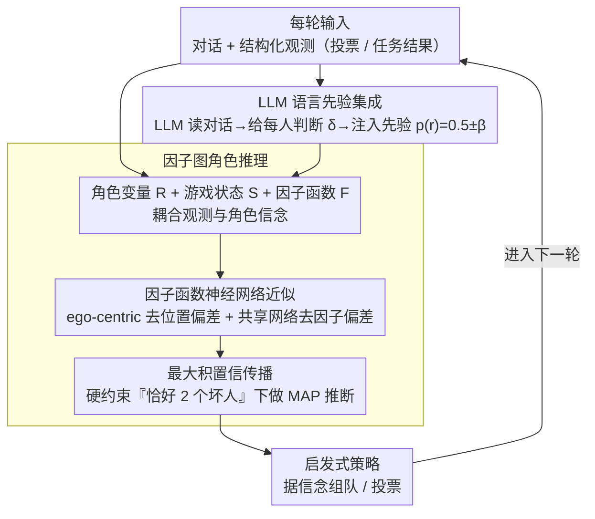

# Bayesian Social Deduction with Graph-Informed Language Models

**会议**: ACL 2026  
**arXiv**: [2506.17788](https://arxiv.org/abs/2506.17788)  
**代码**: [项目页](https://camp-lab-purdue.github.io/bayesian-social-deduction)  
**领域**: LLM Agent / Social Reasoning  
**关键词**: 社会推理, 概率图模型, 心智理论, 博弈智能体, 人机交互

## 一句话总结

提出 GRAIL（Graph Reasoning Agent Informed through Language），一个混合推理框架，将概率推理外化到因子图模型、用 LLM 处理语言理解和交互，在社交推理游戏 Avalon 中首次击败人类玩家（67% 胜率），且资源消耗远低于大规模推理模型。

## 研究背景与动机

**领域现状**: LLM 在通用推理上表现出色，但在多智能体隐藏信息场景下的社会推理——推断他人的信念、意图和欺骗——仍是开放挑战。社交推理游戏（如 Avalon）提供了评估此能力的结构化环境。

**现有痛点**: (1) 最大的推理模型（如 DeepSeek-R1 671B）能解决简单推理但需要大量 token 和计算；(2) 蒸馏到小模型后性能急剧下降；(3) 纯 LLM 方法难以进行跨长时间跨度的约束概率推理；(4) 大模型延迟高，无法与人类实时交互。

**核心矛盾**: 社交推理需要约束概率推理（如"只有2个坏人"的硬约束）和长程信念跟踪，但 LLM 本质上是 token 级推理，不擅长此类结构化推理。

**本文目标**: 构建能与人类实时对抗的社交推理智能体，在小模型上也能达到或超越大推理模型的性能。

**切入角度**: 混合架构——将信念推理外化到概率图模型（因子图+置信传播），LLM 专注于语言理解和对话生成。

**核心 idea**: 解耦结构化推理和语言能力：因子图跟踪角色信念（可解释、高效），LLM 提供语言先验和对话生成。

## 方法详解

### 整体框架

GRAIL 想解决的是：LLM 在 Avalon 这类隐藏身份游戏里，既要做"只有 2 个坏人"这种硬约束下的长程概率推理，又要听懂对话、自然交互，而纯 LLM 两头都做不利索。它的思路是把这两件事**解耦**——结构化的信念推理交给一个因子图（用置信传播在硬约束下精确推断每个玩家是好是坏），语言理解和对话生成交给 LLM，再用一套启发式策略把当前信念翻译成具体游戏动作（组队、投票）。每一轮对话进来，LLM 把社交信号转成对因子图的"先验扰动"，因子图据此更新信念，策略再据信念行动，如此循环。

### 关键设计

**1. 因子图角色推理：把"恰好 2 个坏人"的硬约束和跨轮信念跟踪从 LLM 手里接管过来**

LLM 做 token 级推理，很难稳定维持"全场恰好 2 个坏人"这类硬约束，更难跨多轮一致地更新对每个人的怀疑。GRAIL 把这部分外化成因子图：变量节点 $\mathcal{R} = \{r_1,...,r_6\}$ 表示每个玩家角色（0=好/1=坏），游戏状态变量 $\mathcal{S}$ 记录历轮的队伍组成、投票和任务结果，因子函数 $F = p(r_j\mid\{p_i,v_i,o_i\})$ 把这些观测和角色信念耦合起来，再用最大积置信传播做 MAP 推断。因子图天然支持硬约束和增量更新，所以信念是可解释、可累积的，比让 LLM 每轮从头"想一遍"既精确又高效。

**2. LLM 语言先验集成：把对话里那些结构化数据里没有的社交线索喂回概率推理**

因子图只吃得下投票、任务结果这类结构化观测，但 Avalon 真正的博弈藏在对话里——谁自相矛盾、谁在暗示结盟，这些都不在表格里。GRAIL 让 LLM 读完每轮对话后，对每个玩家给出一个"该更可疑 / 该更可信 / 不变"的判断 $\delta_j^t$，再转成先验 $p(r_j^t) = 0.5 \pm \beta^t$ 注入因子图。其中 $\beta^t$ 随游戏推进递增，意味着早期对话证据弱、先验保守（贴近 0.5），后期信息累积、先验更敢于偏离——这样既利用了对话线索，又不会在信息不足时被一句话带偏。

**3. 因子函数的神经网络近似：让高维条件概率"算得出来"，并消除位置与因子偏差**

因子函数 $p(r_j\mid\text{game state})$ 的条件维度很高，传统列举条件概率表在这种维度下根本不可行。GRAIL 改用一个简单前馈网络来估计它，并做两个去偏处理：以自我为中心（ego-centric）的输入变换消除玩家座位的位置偏差，所有因子共享同一张网络以消除因子间的偏差。好处是只需 2.5K–5K 局游戏就能训出一个灵活的近似，远比堆概率表现实。

### 一个完整示例

以一局 6 人 Avalon 走两轮为例：开局因子图对每个玩家的"坏人"信念都接近 $0.5$。第 1 轮某次任务失败，且玩家 3 当时在队里——因子图据此把 $r_3$ 的怀疑度抬高。接着对话阶段，LLM 听出玩家 5 一直替玩家 3 辩护、说法前后矛盾，于是给出 $\delta_5=$"更可疑"，注入先验 $p(r_5)=0.5+\beta^t$；此时 $\beta^t$ 还小，所以只是轻推。到第 3 轮信息累积、$\beta^t$ 增大，因子图把怀疑集中到玩家 3、5 上并逼近硬约束"恰好 2 个坏人"，策略据此拒绝包含这两人的提议、投票否掉相关队伍。论文观测到：有语言先验时第 3 轮就能收敛到高置信，没有先验则要拖到第 4–5 轮——这正是 LLM 先验加速信念收敛的体现。

### 损失函数 / 训练策略

因子函数网络用二元分类损失训练；整套系统**无需端到端 RL**，LLM 仅通过 in-context prompting 接入。主实验用 GPT-4.1 作底层 LLM，但消融显示换成 Llama-3.1-8B 仍能拿到 75% 胜率。

## 实验关键数据

### 主实验（Agent-Agent）

| Good 智能体 | 对手类型 | 平均胜率 |
|------------|---------|---------|
| Random | 多种 Evil | 0.00 |
| ReCon (GPT-4.1) | 多种 Evil | 0.43 |
| GPT-o4-mini 推理 | 多种 Evil | 0.40 |
| DeepSeek-R1 (671B) | 多种 Evil | 0.71 |
| **GRAIL (GPT-4.1)** | **多种 Evil** | **0.75** |

### 人类实验

| 条件 | 胜率 | 贡献评分 | 有帮助评分 |
|------|------|---------|-----------|
| GRAIL vs 人类 | **67%** | 高于推理基线和部分人类 | 高于推理基线和部分人类 |
| GPT-o4-mini 推理 vs 人类 | 27% | 较低 | 较低 |

### 消融实验

| 配置 | 发现 |
|------|------|
| 仅因子图（Graph Only） | 对模型大小鲁棒，8B 也达 75% 胜率 |
| 仅 LLM（LLM Only） | 对模型大小极敏感，8B 性能大幅下降 |
| GRAIL 8B Llama vs 推理 70B DS-R1 | GRAIL 8B 胜率更高 |

### 关键发现

- GRAIL 输出 token 比推理基线少 10 倍以上，计算效率极高
- 因子图提供"性能地板"，即使用最小模型也维持高胜率
- 语言先验加速信念收敛——有先验时第 3 轮即达高置信，无先验需第 4-5 轮
- 推理智能体出现反直觉现象：405B Llama 因阿谀偏见反而不如 70B
- GRAIL 幻觉率在所有模型大小上均低于推理智能体

## 亮点与洞察

- 首个在受控实验中击败人类玩家的语言智能体（67% 胜率）
- 混合架构思路——将 LLM 不擅长的结构化推理外化，充分发挥各组件优势
- 因子图 + 置信传播是经典 AI 方法在 LLM 时代的优雅复兴
- 人类不知道有 AI 参与，却对 GRAIL 评价高于部分人类队友

## 局限与展望

- 仅作为好人阵营（Good）评估，未测试欺骗和撒谎能力
- 排除了特殊角色（如 Merlin），简化了游戏复杂度
- 因子函数训练需要大量历史游戏数据
- 未来可扩展至更复杂的不完全信息博弈

## 相关工作与启发

- DeepRole（Serrino et al., 2019）：通过自博弈训练的 Avalon 智能体（无对话）
- ReCon（Wang et al., 2023）：基于 LLM 的 Avalon 推理智能体
- 概率图模型在社交推理中的应用（Xu et al., 2024a）
- 混合神经-符号推理是一个重要的研究方向——在结构化推理任务上，专用模型 + LLM 组合优于纯大模型

## 评分

- 新颖性: ⭐⭐⭐⭐⭐ 混合架构首次击败人类，经典 AI + LLM 的优雅结合
- 实验充分度: ⭐⭐⭐⭐⭐ Agent-Agent、人类实验、模型大小消融、架构消融齐全
- 写作质量: ⭐⭐⭐⭐ 问题设置清晰，人类实验设计严谨
- 价值: ⭐⭐⭐⭐⭐ 对 LLM 社会推理能力的重要突破

<!-- RELATED:START -->

## 相关论文

- [\[ACL 2026\] Inertia in Moral and Value Judgments of Large Language Models](inertia_in_moral_and_value_judgments_of_large_language_models.md)
- [\[ACL 2025\] Measuring Social Biases in Masked Language Models by Proxy of Prediction Quality](../../ACL2025/social_computing/measuring_social_biases_in_masked_language_models_by_proxy_of_prediction_quality.md)
- [\[ACL 2026\] The Proxy Presumption: From Semantic Embeddings to Valid Social Measures](the_proxy_presumption_from_semantic_embeddings_to_valid_social_measures.md)
- [\[ACL 2026\] SPAGBias: Uncovering and Tracing Structured Spatial Gender Bias in Large Language Models](spagbias_uncovering_and_tracing_structured_spatial_gender_bias_in_large_language.md)
- [\[ACL 2026\] Synthia: Scalable Grounded Persona Generation from Social Media Data](synthia_scalable_grounded_persona_generation_from_social_media_data.md)

<!-- RELATED:END -->
