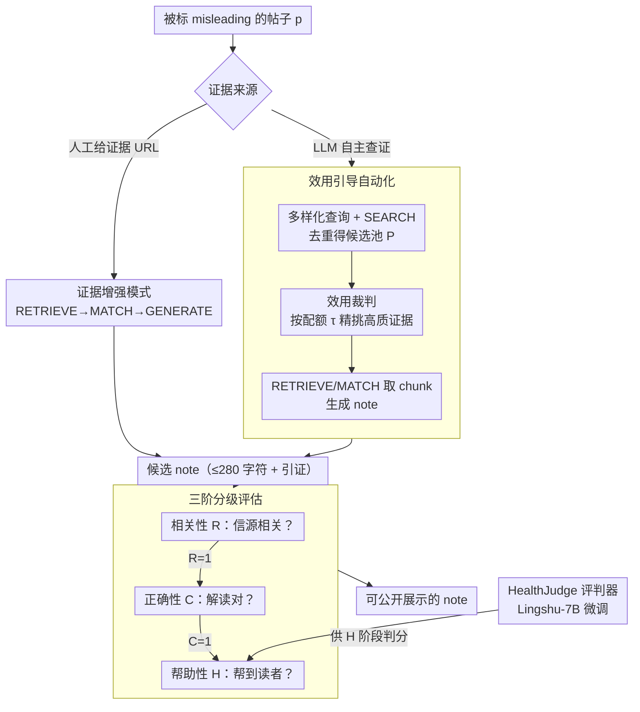

# Beyond the Crowd: LLM-Augmented Community Notes for Governing Health Misinformation

**会议**: ACL 2026  
**arXiv**: [2510.11423](https://arxiv.org/abs/2510.11423)  
**代码**: https://github.com/jiayingwu19/CrowdNotesPlus (有)  
**领域**: 社会计算 / 健康误导信息治理 / LLM 应用  
**关键词**: Community Notes, 误导信息治理, 检索增强, 分级评估, LLM-as-judge

## 一句话总结
作者用 30.8K 条 X 平台健康类 Community Notes 的实证分析揭示出"首条 helpful verdict 中位延迟 17.6 小时、87.9% 笔记永远无评级"的系统性慢响应问题，提出 CrowdNotes+ 框架——以 (1) **证据增强**和 (2) **效用引导自动化** 两种模式让 LLM 写 note，并配以"相关性→正确性→帮助性"三级评估；15 个 LLM 在新 benchmark HealthNotes 上全面超过人工 note 的 73.19% helpfulness（最高 o3 模型达 81.15%）。

## 研究背景与动机

**领域现状**：X 平台的 Community Notes 是当前最有影响力的 **众包事实核查系统** —— 用户标可疑帖、写补充说明、给 note 投票，只有"Currently Rated Helpful"状态的 note 才会公开展示。先前研究主要分析投票动力学、共识形成、对极化的影响，普遍假设"note 已存在"，关注下游。

**现有痛点**：作者用 4 年期、30,791 条健康类 note 做时序分析，发现两个系统性瓶颈：(1) **note 出现慢**——misleading 帖发布到第一条 note 出现，中位延迟 10.4 小时；从第一条 note 到首个 verdict 又要 7.2 小时；(2) **大量 note 永远拿不到评级**——87.9% 的 note 永远停留在 "Needs More Ratings"，永远不会被公开。健康误导（疫苗政策、疾病暴发）的传播窗口往往只有几小时，等评级出来风已经过了。

**核心矛盾**：众包模式的"广度（人人可写）"和"深度（每条都要充分投票）"在快速变化的健康误导场景下不可兼得。手工核查（FactCheck.org 等）质量高但慢，纯 LLM 替代（Singh et al. 2025）又因为没有 web 检索能力对新涌现谣言无效，且 De et al. 2025 还需多条人工 note 作输入。

**本文目标**：(1) 让 note 创作快起来——LLM 辅助人工或全自动写 note；(2) 让 note 评估准起来——避免投票者把"流畅"等同于"正确"。

**切入角度**：作者发现现行投票机制有个"漏洞"——通过分析人工标为 Helpful 的 note，11.7% 引证不相关、14.0% 错误地解读了引证，说明 voter 经常因为 note 写得流畅就投 helpful。如果能把评估拆成"相关→正确→有用"三个独立 gate，就能堵这个漏洞。

**核心 idea**：**用 LLM agent 加速 Community Notes 全流程（写 + 评），并以"相关性 → 正确性 → 帮助性"分级条件概率分解评估，避免流畅性骗过 helpfulness 判断**。

## 方法详解

### 整体框架

CrowdNotes+ 要治的是 Community Notes "写得慢、评得糙"的毛病：输入一条被标为 misleading 的帖子 $p$，输出一条带引证 URL、不超过 280 字符的简洁 note。它给出两种写 note 的模式——**证据增强**（人工先给一组证据 URL $\mathcal{E}_h$，LLM 走 RETRIEVE→MATCH→GENERATE 合成 note $n_h$）和**效用引导自动化**（LLM 自己查证据再写），并在两种模式之上压一套"相关→正确→帮助"的三级评估把关，保证 LLM 写出来的 note 不只是流畅、而是真的站得住。

### 关键设计

**1. 效用引导自动化（utility-guided automation）：在没有人工证据时，让 LLM 自主走完"查什么→选什么→写什么"**

自动化模式要模拟真实部署——没有人替它准备好证据，可纯 RAG 拿 top-$k$ 经常召回一堆重复或低质来源，note 自然写不准。CrowdNotes+ 借鉴"diverse query 互补 retrieval"的发现（Santos et al. 2015），先从 $p$ 生成一组语义多样的查询 $\mathcal{Q}$，每个查询 SEARCH 后合并去重得候选池 $\mathcal{P}=\text{dedup}\left(\bigcup_{q\in\mathcal{Q}}\text{TopK}(q)\right)$；再让一个 utility judge 模块（受 evidence ranking 启发）按 quota $\tau$ 迭代地挑出最高效用的证据 snippet（title+summary）构成 $\mathcal{E}_m$，最后 RETRIEVE/MATCH 出 chunk $\mathcal{C}_m$，用 $(p, \mathcal{C}_m)$ 生成 note $n_m$。

这里的关键是"找证据"和"选证据"分工：query 多样化负责拓宽召回不漏信源，utility 模块负责在召回里精挑可信来源（健康权威 > 普通新闻 > 社交媒体）。两个组件缺一不可——消融表里去掉任意一个，helpfulness 都掉 ~7–11pp。

**2. 三阶分级评估：把 helpfulness 拆成相关→正确→帮助三个条件 gate，堵"流畅≠准确"的漏洞**

原始 Community Notes 投票把"信源相不相关、解读对不对、是否帮到读者"三件事混在一起，全凭投票者一时感觉判，结果有 89 条人工标为 Helpful 的 note 其实是"引证相关但内容错误"——voter 经常因为 note 写得流畅就投 helpful。CrowdNotes+ 用三个 binary indicator $R/C/H$ 强制条件依赖：只有 $R{=}1$ 才进而评 $C$，只有 $C{=}1$ 才进而评 $H$，联合概率因此分解为

$$P(R{=}1,C{=}1,H{=}1)=P(H{=}1\mid C{=}1,R{=}1) \cdot P(C{=}1\mid R{=}1) \cdot P(R{=}1)$$

前两个 gate 用 GPT-4.1，最后一个 gate 用 fine-tuned 的 HealthJudge（Lingshu-7B 微调）。强制分级后，CrowdNotes+ 对 Helpful 集的判分相比人工降 11.7%（R）/ 14.0%（C），但 Not Helpful 集只差 5.5%——说明 gate 主要是在精准地抓"假阳性"，而不是无差别压低所有分数。

**3. HealthNotes benchmark + HealthJudge 评估器：给社区一个可复现、领域专一的健康 note 评测设施**

通用 LLM-judge 在医疗专业判断上并不可靠，容易把"听起来权威"当成真，缺一个领域专一、可复现的评测基础。作者从 30K 健康 note 中筛出 3,713 条有 helpfulness 标签的，再保留 634 条带有效 URL 的 Not Helpful 加等量 Helpful、共 1,268 个 post-note 对，覆盖疾病 / 疫苗 / 政策 / wellness / 医疗体系 / 生物 / 阴谋论 7 大类，构成 HealthNotes；评估器 HealthJudge 则是 Lingshu-7B 在专家标注数据上 fine-tune 出的 helpfulness 判官。相比通用 GPT，它更能捕捉 medical guideline / 临床证据等级这类专业信号，同时避免了昂贵的闭源 API 调用。

### 损失函数 / 训练策略
本文不训练生成模型，只对 HealthJudge (Lingshu-7B) 做了一次专家标注数据上的 SFT。所有 note 在 helpfulness 评估前严格截断到 280 字符以匹配平台约束。Automation 模式中 LLM 的检索 quota 与时间窗与原始人工 note 作者条件严格对齐，确保公平。

## 实验关键数据

### 主实验：15 个 LLM vs Human Baseline 在 HealthNotes（C=正确性, H=帮助性, R=相关性，单位 %）

| 模型组 | 模型 | Aug. C (Helpful) | Aug. H (Helpful) | Auto. H (Helpful) | Auto. H (Not Helpful) | Overall H |
|---|---|---|---|---|---|---|
| — | **Human baseline** | 75.24 | 73.19 | 73.19 | 5.52 | 39.36 |
| G1 LRM | o3† | 87.70 | 86.91 ↑ | 92.11 ↑ | 70.19 ↑ | **81.15** ↑ |
| G1 LRM | Gemini-2.5-pro† | 88.64 | 85.65 ↑ | 91.17 ↑ | 69.24 ↑ | 80.21 ↑ |
| G1 LRM | Grok-4† | 86.44 | 82.65 ↑ | 88.17 ↑ | 67.19 ↑ | 77.68 ↑ |
| G2 LLM | GPT-4.1 | 87.85 | 85.80 ↑ | 88.49 ↑ | 69.87 ↑ | 79.18 ↑ |
| G2 LLM | Claude-4-Opus | 85.17 | 83.60 ↑ | 85.96 ↑ | 64.51 ↑ | 75.24 ↑ |
| G3 open | Qwen3-32B | 81.39 | 76.66 ↑ | 70.35 ↓ | 55.84 ↑ | 63.10 ↑ |
| G3 open | Llama-3.1-8B | 67.98 | 61.36 ↓ | 49.05 ↓ | 36.28 ↑ | 42.67 ↑ |
| G4 medical | MedGemma-27B | 84.38 | 79.02 ↑ | 79.81 ↑ | 58.68 ↑ | **69.25** ↑ |
| G4 medical | Lingshu-32B | 79.34 | 73.19 – | 67.35 ↓ | 52.37 ↑ | 59.86 ↑ |

→ **>14B 的模型 helpfulness 普遍超过人工**；闭源 LRM (o3) 自动化模式在 Not Helpful 子集上比人工高 64.7pp（70.19 vs 5.52），证明 LLM 写 note 在"难案例"上提升尤其大。

### 消融实验：Utility-Guided 自动化的组件贡献（H, %）

| 配置 | Helpful | Not Helpful | Overall |
|---|---|---|---|
| **CrowdNotes+ (o3) 完整** | **92.11** | **70.19** | **81.15** |
| — Query Diversity | 79.50 | 69.09 | 74.30 (-6.85) |
| — Utility Judgment | 79.02 | 64.83 | 71.93 (-9.22) |
| **CrowdNotes+ (MedGemma-27B) 完整** | 79.81 | 58.68 | 69.25 |
| — Query Diversity | 74.76 | 54.73 | 64.75 (-4.50) |
| — Utility Judgment | 66.25 | 50.47 | 58.36 (-10.89) |

### 关键发现
- **Utility judgment 比 query diversity 更重要**：在两个模型上去掉 utility 模块分别掉 9.22pp/10.89pp，而去掉 query diversity 掉 6.85pp/4.50pp。说明"选对证据"比"找到证据"难。
- **Reasoning model > 通用 LLM > 医疗微调 LLM**：o3 是唯一突破 80% overall helpfulness 的模型，说明 explicit reasoning trace 对"从多源证据中精挑"特别有效；MedGemma 在 medical 领域知识上有优势，但缺乏 reasoning 能力使得它输给了通用 LRM。
- **人类盲评 87% 选 CrowdNotes+**：3 个标注者在 100 条 note 对（50 helpful + 50 not helpful）的盲评里，o3 生成的 note 比人工胜率 87%，GPT-4.1 77%，MedGemma-27B 62%。
- **89 条人工 Helpful note 实为错误**：CrowdNotes+ 三阶评估抓出来后人工复审，三类典型错误（缺乏证据支撑 / 误解信源 / 过度泛化）占比相当。

## 亮点与洞察
- **三阶分级评估的 P(R)·P(C|R)·P(H|C,R) 分解非常优雅**：直接对应"信源真不真 → 解读对不对 → 是否帮到 reader"，每一步都可审计可拒判，是一种可推广到任何"AI 辅助治理"场景的评估框架。
- **"voter 把流畅当正确"是这个领域的关键 finding**：作者通过对比人工评分和分级 judge 的差异，把这个潜在的众包系统弱点量化了出来，为后续众包平台改进提供了实证依据。
- **utility judgment 模块的设计可复用**：让 LLM 用 reranker 思路选 top-$\tau$ 证据 snippet，比简单 cosine similarity 检索更强，可以直接搬到通用 RAG。
- **HealthJudge 微调思路**：用人工标注的 helpfulness 标签微调一个领域小模型作 judge，避免昂贵的闭源 API 调用，对其他 high-stakes 领域（法律、金融）的 LLM-judge 设计有借鉴。

## 局限与展望
- 作者承认：(1) 仅在英文 X 上做，多语言 / 其他平台未验证；(2) HealthJudge 微调数据规模有限，专业医疗判断上仍有 ceiling。
- 自己观察：评估用的 GPT-4.1 既是 G2 baseline 又是 judge，存在**自评偏置**；如果用与生成模型完全异源的 judge（如纯医生评 panel），数字可能不那么好看。
- 280 字符截断在 helpfulness 评估时一刀切，可能不公平地惩罚了原本写得长但被截断成不连贯的 note；如果允许扩展上下文显示，结果会变。
- 改进思路：(a) 加入多轮 dialog，让 LLM note 可以回应后续质疑；(b) 把 utility judgment 推广到不同信源信任度（权威 > 期刊 > 媒体 > 社交）的显式 weight；(c) 在线上 A/B 测 actual user 对 LLM note vs 人工 note 的点击/采纳率。

## 相关工作与启发
- **vs De et al. 2025**: 他们需要多条人工 note 作输入才能聚合，实用性受限；本文支持完全自动化（automation 模式），更贴近真实部署。
- **vs Singh et al. 2025**: 他们让 LLM 用内部知识写 note，无 web 检索，对新涌现谣言无能为力；本文以 utility-guided web 检索弥补，并以 hierarchical 评估保证质量。
- **vs Hu et al. 2024 / Pan et al. 2023**: 这些工作把 LLM 当作"事实核查员"独立给出结论，丢失了 "human-in-the-loop" 控制；CrowdNotes+ 定位 LLM 为"草稿协助"，保留人工最终把关。
- **启发**：分级条件概率评估范式可迁移到 RAG 引用质量评估、AI 辅助诊断的不确定性分级、agent tool-call 链的过程评估。

## 评分
- 新颖性: ⭐⭐⭐⭐ 双模式 + 分级评估的组合在 Community Notes 场景首次系统化，分级条件概率分解尤其新颖。
- 实验充分度: ⭐⭐⭐⭐⭐ 15 个 LLM × 2 模式 × 3 评估维度 + 人评 + 错误溯因，工程量惊人。
- 写作质量: ⭐⭐⭐⭐⭐ 实证 (§3) → 框架 (§4) → 基准 (§5) → 实验 → 讨论 RQ 划分清晰，case study 直观。
- 价值: ⭐⭐⭐⭐⭐ 直接服务于社会治理基础设施，HealthNotes + HealthJudge 已开源，可被平台直接采纳。

<!-- RELATED:START -->

## 相关论文

- [\[ACL 2025\] Can Community Notes Replace Professional Fact-Checkers?](../../ACL2025/social_computing/can_community_notes_replace_professional_fact-checkers.md)
- [\[ACL 2026\] MM-StanceDet: Retrieval-Augmented Multi-modal Multi-agent Stance Detection](mm-stancedet_retrieval-augmented_multi-modal_multi-agent_stance_detection.md)
- [\[AAAI 2026\] T2Agent: A Tool-augmented Multimodal Misinformation Detection Agent with Monte Carlo Tree Search](../../AAAI2026/social_computing/t2agent_a_tool-augmented_multimodal_misinformation_detection_agent_with_monte_ca.md)
- [\[ACL 2026\] Explain the Flag: Contextualizing Hate Speech Beyond Censorship](explain_the_flag_contextualizing_hate_speech_beyond_censorship.md)
- [\[ACL 2026\] Estimating the Black-box LLM Uncertainty with Distribution-Aligned Adversarial Distillation](estimating_the_black-box_llm_uncertainty_with_distribution-aligned_adversarial_d.md)

<!-- RELATED:END -->
