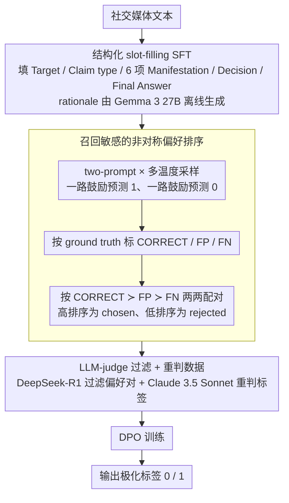

# BITS Pilani at SemEval-2026 Task 9: Structured Supervised Fine-Tuning with DPO Refinement for Polarization Detection

**会议**: ACL 2026 (SemEval workshop)  
**arXiv**: [2604.11121](https://arxiv.org/abs/2604.11121)  
**代码**: https://github.com/atharva7-g/POLAR-SemEval-Submission  
**领域**: 多语言 NLP / SemEval shared task / 极化检测  
**关键词**: 极化检测、结构化 SFT、DPO、SemEval-2026、Qwen2.5 / Mistral-Nemo

## 一句话总结
本文为 SemEval-2026 POLAR 极化检测任务（英文子集）提出「结构化 slot-filling SFT + DPO 偏好优化」两阶段流水线，赛中提交 Qwen2.5-7B 系统取得 0.7664 Macro-F1，赛后换 Mistral-Nemo-12B + LLM-judge 过滤的偏好对，Macro-F1 提升至 0.8162，超过 organiser baseline (0.7802)。

## 研究背景与动机

**领域现状**：在线极化（polarization）检测属于内容审核任务，传统做法包括 BERT/DistilBERT 上的二分类微调、prompt-based ICL、以及 LLM zero-shot。SemEval-2026 Task 9 (POLAR) 把这一任务标准化为多语言、多文化、多事件场景，但本工作只覆盖英语子集（3,222 训练 / 160 验证 / 1,452 测试）。

**现有痛点**：(1) 极化语言常带隐式 framing（"我能接受 X，但不能接受 Y"），关键词词典无能为力；(2) 标注成本高，类别不均衡（约 36% 正样本）；(3) 纯 SFT 容易把 majority class（非极化）当 prior，recall 偏低导致漏检；(4) ICL 的 prompt 容易让模型输出"过于保守"的 0，false negative 在审核场景中危害更大（极化内容继续传播 vs. 误判可被人工 review 撤回）。

**核心矛盾**：SFT 优化 likelihood 时，long reasoning chain 会稀释 final-label token 的 gradient signal，导致 reasoning SFT 反而比 label-only SFT 差；但 reasoning 又是构造 high-quality DPO 偏好对的前提（需要"理由"才能判断好坏）。

**本文目标**：(1) 设计一个结构化 rationale schema 让模型输出可解释、可批量打分的中间结果；(2) 用 DPO 把 false-negative 比 false-positive 排得更靠后，把决策边界往「召回敏感」侧推；(3) 探索 LLM-judge 过滤偏好对带来的收益。

**切入角度**：作者把极化检测从「单标签分类」改造成「slot-filling 生成任务」——模型必须先填 target / claim type / 6 项 manifestation checklist / decision basis 再吐 label，这样既给了 DPO 可比较的「rationale 维度」，又给了 LLM judge 一个可审计的 paper trail。

**核心 idea**：用「结构化 slot-filling 生成 + 三类输出（CORRECT / FP / FN）的 DPO 排序 + LLM judge 过滤」组合，把分类问题转成 RLHF-style 决策边界调整问题，专门攻击 false negative。

## 方法详解

### 整体框架
两阶段流水线：

- **Stage 1（结构化 SFT）**：把 Qwen2.5-7B-Instruct（赛中）/ Mistral-Nemo-Instruct-2407（赛后）用 LoRA 微调到固定的 slot-filling 模板上。模型输入是社交媒体文本，输出是 [Target referenced / Claim type / 6-class Manifestations checklist / Decision basis / Final Answer (0 or 1)] 的 JSON-like 结构。training rationale 由 Gemma 3 27B 离线生成。

- **Stage 2（DPO 偏好优化）**：从 SFT 检查点出发，用 two-prompt（一个 prompt 鼓励预测 1、另一个鼓励预测 0）+ 多温度采样得到一批 completion，把每条 completion 按 ground truth 标成 CORRECT / FP / FN 三类，按偏好 $\mathrm{CORRECT} \succ \mathrm{FP} \succ \mathrm{FN}$ 配对（高排序为 chosen，低排序为 rejected），用 DPO loss 训练。

赛后增强：(1) Rejudged Sonnet——用 Claude 3.5 Sonnet 重判训练集标签，6.2% 的样本被改标，整体极化比例上升；(2) DeepSeek-R1 LLM judge 过滤偏好对到 299 条 62:38 FP:FN 平衡集。

### 关键设计

**1. 结构化 slot-filling rationale schema：把分类改造成可对齐比较的生成任务**

纯 label SFT 只有一个 0/1 信号，无法构造细粒度偏好对；而开放式 free-form CoT 又方差太大、不同样本之间没法对齐打分。本文的解法是给模型固定一个 slot-filling 输出模板，强迫它先填中间字段再吐 label：Target referenced / Claim type / 6 项 Manifestation checklist（Stereotype / Vilification / Dehumanization / Extreme Language / Lack of Empathy / Invalidation）/ Decision basis / Final Answer。所有训练样本的 chain-of-thought 都由 Gemma 3 27B 离线按这个模板生成，最终 label 用 regex 从 "Final Answer:" 后抽取。

固定 schema 一举解决两件事：每条 completion 都有 6 维可对齐的字段，DPO 才能在「同一维度上谁更好」的粒度上配对；同时这套结构化输出也是一份可审计的 paper trail，让后续 LLM judge 能批量打分。这正是把单标签分类问题转成「生成 + 决策边界调整」的前提。

**2. 召回敏感的非对称偏好排序 $\mathrm{CORRECT} \succ \mathrm{FP} \succ \mathrm{FN}$：把决策边界往召回侧推**

审核场景里漏判（FN，极化内容继续传播）的代价远大于误判（FP，可被人工 review 撤回），但纯 SFT 优化 likelihood 时容易把 majority class（非极化）当 prior，recall 偏低。直接对 SFT 加类别权重在本任务上无效（实验显示加权 loss 没帮助），改 SFT loss function 也治标不治本。本文改从偏好角度直接调边界：对每个 input 用 two-prompt（一个鼓励预测 1、一个鼓励预测 0）× 多温度采样得到一批 completion，按 ground truth 标成 CORRECT / FP / FN 三类，再按偏序 $\mathrm{CORRECT} \succ \mathrm{FP} \succ \mathrm{FN}$ 两两配对（高排序为 chosen、低排序为 rejected）训练 DPO。

把 FN 系统性排在 FP 之后，等于告诉模型「宁可多报也别漏报」，DPO 因此把整条决策边界往 more aggressive predict polarization 的方向推。实验里 recall 从 0.5085 抬到 0.7797、precision 从 0.8333 跌到 0.7077，正是这个非对称排序的预期效果。

**3. LLM-as-a-judge 过滤偏好对 + Rejudged 训练数据：质量比数量重要**

自动构造的偏好对噪声很大，低质量对越多反而越拖性能——实验里 721 条 unfiltered → F1 0.7637，比 SFT baseline 0.7795 还低。本文用 DeepSeek-R1 当 judge 对候选偏好对做 valid/invalid 打分，剔除推理不一致、标签错配的对，把 721 条候选过滤到 299 条（62:38 FP:FN 平衡集）；同时用 Claude 3.5 Sonnet 重判训练集标签，纠正了 6.2% 的标注错误，使整体极化比例上升。

效果是单调的：330 条过滤后 → 0.7889，299 条 R1-filtered → 0.8162。这条链条直白地说明 DPO/RLHF 的瓶颈不在偏好对数量，而在 curation 质量——一堆烂对的副作用比没有 DPO 还糟。

### 损失函数 / 训练策略
SFT 用标准 causal LM cross-entropy（LoRA rank=8, alpha=16, dropout=0.05, target=q/k/v/o_proj, lr=5e-5, 3-10 epochs）。DPO 用标准 Rafailov et al. (2024) 的偏好对比 loss，$\beta=0.1$（赛中）/ $\beta=0.3$（赛后最佳），lr=5e-6, 2 epochs。

## 实验关键数据

### 主实验：English 开发集 + 测试集 F1

| 方法 | English Dev F1 | English Test Macro-F1 | 说明 |
|------|---------------|-----------------------|------|
| Zero-shot baseline | 0.7105 | — | 不微调 |
| DistilBERT (SLM) | 0.7149 | — | 小模型 baseline |
| Qwen2.5-7B SFT (reasoning) | 0.738 | — | 单 SFT 阶段 |
| Qwen2.5-7B SFT + DPO (submitted) | 0.7893 | **0.7664** | 提交系统，排名 52/60 |
| POLAR organiser baseline | — | 0.7802 | 官方基线 |
| Highest-ranked system | — | 0.8252 | 榜首 |
| Mistral-Nemo SFT (Rejudged) | — | 0.8097 | 赛后换大模型 |
| Mistral-Nemo + DPO (β=0.3, R1-filtered) | — | **0.8162** | 最终最佳 |

### Stage1-Stage2 增量与结构化 rationale 消融（English test, n=1,452）

| 配置 | Accuracy | P(1) | R(1) | Macro-F1 |
|------|----------|------|------|----------|
| Label-only SFT | 0.792 | 0.777 | 0.788 | 0.781 |
| Label-only + DPO | 0.720 | 0.618 | 0.625 | 0.699 |
| Reasoning SFT | 0.793 | 0.745 | 0.662 | 0.771 |
| Reasoning + DPO (本文) | **0.802** | 0.732 | 0.704 | **0.789** |

### DPO 偏好对数量与质量消融

| 偏好对配置 | F1 | FN 数 | FP 数 |
|-----------|----|----|----|
| SFT only (无 DPO) | 0.7795 | 158 | 137 |
| DPO 330 pairs (filtered) | 0.7889 | 132 | 155 |
| DPO 721 pairs (unfiltered) | 0.7637 | 64 | **274** |

### 关键发现
- **DPO 系统性把 recall 从 0.5085 抬到 0.7797**（dev set），代价是 precision 从 0.8333 跌到 0.7077，这正符合「召回敏感」设计意图。
- **Rationale 的真正价值在 enable DPO**：label-only SFT 单独最强（0.781），但叠加 DPO 后崩到 0.699；而 reasoning SFT 单独最弱（0.771），叠加 DPO 后升到 0.789。说明 rationale 给 DPO 提供了「可比较的细粒度差异」。
- **偏好对质量比数量重要**：721 条未过滤反而比 330 条过滤后差 2.5 个 F1，提醒大家 RLHF/DPO 数据 curation 才是关键瓶颈。
- **scale 效应明显**：Mistral-Nemo 12B 比 Qwen2.5 7B 显著受益于 reasoning SFT，说明 reasoning capability 与模型规模正相关。

## 亮点与洞察
- **「rationale 为 DPO 服务」的观点**：作者明确指出 rationale 在 SFT 阶段反而稀释 final label token 的 gradient，但在 DPO 阶段提供了不可替代的细粒度比较维度。这种"两阶段角色不同"的认知很有启发性，可迁移到任何 SFT+DPO pipeline。
- **two-prompt 偏好对生成**：用「pro 视角 prompt + anti 视角 prompt」两路采样，再排序配对，比单 prompt 多温度采样能更系统覆盖决策边界的两侧，值得借鉴。
- **β 不敏感的发现**：9 个 β（0.1-0.5）下 Macro-F1 介于 0.8065-0.8162，flatness 说明 pair quality 才是 binding constraint，β 调参回报很低。这种「在哪里调参才有用」的诊断很实用。

## 局限与展望
- **只覆盖英语**：POLAR benchmark 是 22 语言，本系统未做多语言迁移。
- **Mistral-Nemo 结果未提交 CodaBench**：赛后 0.8162 的成绩没在官方榜单上，可比性打折扣。
- **Rejudged training set 与提交系统的训练数据不同**：赛后增强同时改了 base model 和 training labels，难以解耦各自贡献。
- **Precision 仍偏低（~0.73）**：极化与「强烈但中性」语言的边界仍难辨，下一步可能需要外部知识或 retrieval-augmented context。
- **DPO 在 7B 模型上不稳定**：未来可探索 SimPO / KTO 等 reference-free 偏好优化方法，以及 loss masking 来 recover reasoning SFT 的 recall 损失。

## 相关工作与启发
- **vs SemEval-2019 HatEval**：传统多语言仇恨言论检测，多用 BERT 分类；本文用生成式 LLM + DPO 把 task formulation 从分类升级为生成+决策。
- **vs Gunel et al. (2021) supervised contrastive**：对比学习同样提升 robustness，但需要正负样本对的语义距离，构造成本高；DPO 用 ranking 反而更简洁。
- **vs Maggini et al. (2025)**：同样发现 fine-tuning > ICL 在极化-相邻任务上；本文进一步证明「SFT + DPO + LLM-judge filtering」三层栈最强。
- **vs Shi et al. (2025) key answer token emphasis**：直接 mask reasoning loss 来抢救 final label gradient，本文则用 DPO 绕开这个问题。两条路线值得对比。

## 评分
- 新颖性: ⭐⭐⭐ 组合既有技术（结构化生成 + DPO + LLM judge）攻击具体任务，每个组件单独不算新颖，但组合的实验诊断很到位
- 实验充分度: ⭐⭐⭐⭐ β sweep / pair quality sweep / structured rationale ablation / label-only vs reasoning 对比都做了
- 写作质量: ⭐⭐⭐⭐ SemEval system paper 标准结构，限制坦诚，发现陈述清晰
- 价值: ⭐⭐⭐ 完整可复现的 pipeline，代码开源；适合作为 SFT+DPO 工业级模板

<!-- RELATED:START -->

## 相关论文

- [\[ACL 2026\] mdok-style at SemEval-2026 Task 9: Finetuning LLMs for Multilingual Polarization Detection](mdok-style_at_semeval-2026_task_9_finetuning_llms_for_multilingual_polarization_.md)
- [\[ACL 2026\] YEZE at SemEval-2026 Task 9: Detecting Multilingual, Multicultural and Multievent Online Polarization via Heterogeneous Ensembling](yeze_at_semeval-2026_task_9_detecting_multilingual_multicultural_and_multievent_.md)
- [\[ACL 2026\] PSK@EEUCA 2026: Fine-Tuning Large Language Models with Synthetic Data Augmentation for Multi-Class Toxicity Detection in Gaming Chat](pskeeuca_2026_fine-tuning_large_language_models_with_synthetic_data_augmentation.md)
- [\[ACL 2026\] Prompt-Level Distillation: A Non-Parametric Alternative to Model Fine-Tuning for Efficient Reasoning](prompt-level_distillation_a_non-parametric_alternative_to_model_fine-tuning_for_.md)
- [\[ACL 2026\] ClaimDB: A Fact Verification Benchmark over Large Structured Data](claimdb_a_fact_verification_benchmark_over_large_structured_data.md)

<!-- RELATED:END -->
