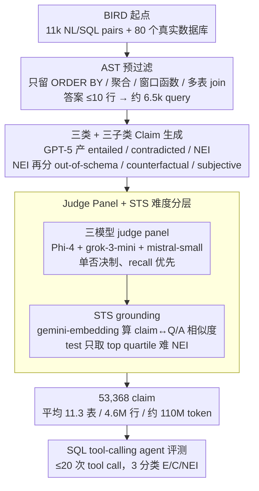

# ClaimDB: A Fact Verification Benchmark over Large Structured Data

**会议**: ACL 2026  
**arXiv**: [2601.14698](https://arxiv.org/abs/2601.14698)  
**代码**: https://claimdb.github.io  
**领域**: 事实核查 / 结构化数据 / LLM 评测  
**关键词**: 事实核查基准, 大规模结构化数据, 工具调用 agent, NEI 弃权能力, SQL 推理

## 一句话总结
ClaimDB 是首个把事实核查 evidence 放大到 80 个真实数据库、平均每 claim 含 11 张表 / 460 万行 / 1.1 亿 token 的基准，强制方法必须用可执行程序（SQL）做组合推理；对 30 个 SOTA LLM 的工具调用 agent 评测显示，过半模型 accuracy 不到 55%，且封闭模型几乎不会"弃权"、开源模型又过度弃权——NEI 处理是最大短板。

## 研究背景与动机

**领域现状**：现有事实核查基准从 FEVER（文本）→ TabFact、FEVEROUS（小表）→ SCITAB（论文表格）一路演化，但都默认 evidence 可以塞进 LLM 上下文窗口里——即"读完证据再推理"的范式成立。

**现有痛点**：现实世界的高影响力 claim（如拜登 "美国通胀全球最低"、特朗普 "华盛顿凶杀率世界第一"）的 evidence 来自 BLS、警察局这种**百万行级 CSV / 多表数据库**，根本读不完。即使是 Gemini 这种 1–2M token 上下文，相对 1.1 亿 token 也差 2–3 个数量级。

**核心矛盾**：fact-checking 的真实分布 ↔ 既有基准的"小 evidence"假设之间存在数量级 gap，使得现有模型在实验榜上 SOTA、在真实数据库上完全失效。一旦无法 "读完证据"，必须 shift 到 "用可执行程序象征性地处理大量数据 + 推理"，但这种 neuro-symbolic 能力既没有合适基准也没有系统评测。

**本文目标**：构造一个 **(1) evidence 必须远超 LLM context、(2) 必须涉及聚合/排序/多表 join 等组合推理、(3) 含真实 NEI 类别** 的大规模 fact-verification 基准，并系统评测 30 个 LLM 在 tool-calling agent 下的表现。

**切入角度**：从 BIRD（NL2SQL 基准，11k NL/SQL pairs + 真实大数据库）出发——这些 SQL 本身就指示了"需要组合推理的 question"，对其结果用 GPT-5 生成 entailed/contradicted/NEI claim，再用多 LLM judge panel 把关质量。

**核心 idea**：用 SQL AST 过滤出 "聚合/排序/多表 join/window 函数" 类组合查询，把它们的执行结果转成 claim，再以 LLM-as-judge panel 做质量控制，最终强制评测必须用 SQL tool-calling agent 来解答 claim。

## 方法详解

### 整体框架
ClaimDB 构建 pipeline 是 5 步流水线：

- **Step 1 BIRD 起点**：拿 BIRD 的 11k NL/SQL pairs + 80 个真实数据库。
- **Step 2 Pre-Filtering**：把 SQL 转 AST，只保留含 ORDER BY / aggregate (AVG, SUM) / window function / multi-table join 的 query，且答案行数 $\le 10$，剩约 6.5k。
- **Step 3 Claim Generation**：对每个 Q/A pair，用 GPT-5 生成 entailed、contradicted、NEI 三类 claim；NEI 又分 out-of-schema、counterfactual、subjective 三个子类。
- **Step 4 Quality Control**：用 Phi-4 + grok-3-mini + mistral-small 三人 judge panel 评每个 claim 的"label 是否正确""是否 self-contained""NEI 是否 schema 泄漏 / 子类正确"，**单否决制**——任一 judge 不通过就 drop。
- **Step 5 NEI Grounding**：用 gemini-embedding-001 算 claim 与 Q/A 的相似度，把 NEI 按"离数据库概念远近"排序，test split 只从 top quartile 采样难例。

最终得到 53,368 claim（E:12,855 / C:16,529 / NEI:23,984），平均每 claim 涉及 11.3 张表、4.6M 行、~110M token。

评测端给 agent 一个 SQL 执行工具（Google MCP toolbox）、最多 20 次 tool call、3-way 分类（E/C/NEI），report Macro-F1 + Acc。

### 关键设计

**1. AST-based Pre-Filtering：用机械可验证的语法规则强制每条 claim 都需要组合推理**

如果只靠 LLM 提示去生成 claim，没法保证背后的 evidence 真的大、推理真的需要跨表聚合，基准很容易退化成"查一行就能答"的简单 lookup。ClaimDB 的做法是把 BIRD 的每条 SQL 解析成 AST，只保留满足以下任一条件的 query：(a) 含 ORDER BY / superlative（如 MAX、TOP-K，意味着要比较全表）；(b) 含 aggregate function（AVG / SUM / COUNT 等大集合操作）；(c) 含 window function（跨 partition 的复杂信息流）；(d) 三表以上 join。再额外规定答案行数 $\le 10$，让 GPT-5 在后续 claim 生成阶段能稳定追踪 column/value 结构，从 11k pairs 筛到约 6.5k。

这套 AST 规则是 ClaimDB 难度的根源：它是机械且可复核的"组合推理证明"，确保任何方法只要不能跨表聚合就必然答不对，而不依赖人去主观判断"这题够不够难"。这正是它区别于 TabFact / SCITAB 等小表基准的核心机制。

**2. 三类 + 三子类 NEI Claim Generation：把"证据不足"从一个粗类拆成可诊断的失败模式**

传统基准要么没有 NEI（Not-Enough-Info），要么 NEI 只是"完全无关"的简单负样本，一眼就能识破；但真实 fact-checking 里"证据不足"才是最常见也最危险的判定。ClaimDB 对每个 Q/A pair 用 GPT-5 生成 entailed / contradicted / NEI 三类 claim，并借鉴 Kirichenko 等的弃权 taxonomy 把 NEI 进一步分成三个子类——**Out-of-Schema**（概念不在 schema 中，如向"加州学校"DB 问"家庭是否更倾向 homeschool"）、**Counterfactual**（what-if 假设，如"如果 Pinecrest 2020 年开新校区…"）、**Subjective**（主观价值判断，如"哪个城市最适合 K-12 学习"）。生成策略也按类型分化：E/C 结构受答案约束，用 1-shot + medium reasoning；NEI 自由度大、shot 反而限制多样性，用 zero-shot + medium reasoning；同时把 schema metadata 喂给 GPT-5，保证 out-of-schema claim "概念上越界但与 DB 主题相关"。

这种细分让 NEI 评测从一个 binary 标签变成可分析的多维度问题——后续正是靠它发现封闭模型几乎不敢预测 NEI、开源模型又过度预测，把模型的弃权能力变成能被诊断的现象，而不是一个笼统的 abstention rate。

**3. LLM Judge Panel + STS Grounding：在 64k 规模上做低成本高召回的质量控制，并把 NEI 难度分层**

人工标注 64k claim 不现实，单个 large judge 又会带 bias，而且自动生成的 NEI 容易"过于明显"导致退化。质量控制因此分两步走。其一是 judge panel：选三个不同家族的小模型（Microsoft Phi-4 + xAI grok-3-mini + Mistral mistral-small），刻意排除 OpenAI 模型以避免 self-enhancement bias（claim 本身由 GPT-5 生成）；rubric 是 binary yes/no（label 对吗？self-contained 吗？NEI 子类对吗？schema 泄漏吗？），采用单否决制——任一 judge 不通过就 drop；prompt 显式写 "If you are unsure, answer no"，优化目标不是 agreement with human，而是 maximize recall on bad claims，在 150 个人工标注样本上测得 100% recall。其二是 STS grounding：对 NEI claim 用 gemini-embedding-001 算它与 Q/A 的相似度，例如同一 Chicago Crime DB 下，"指挥官有法学学位"（远，$0.798$）vs "案件多涉及游客"（近，$0.869$），test split 只从 top quartile 采样难 NEI。

这两步合在一起，让大规模合成数据既能被廉价过滤、又不至于在 NEI 维度上退化成常识就能 reject 的简单题：recall-first 的小模型 panel 是工程化最优解，STS grounding 则逼模型真正去查 DB。它们共同支撑了 ClaimDB test set 5.6% 的 label-flag 率与 14% 的总过滤率。

## 实验关键数据

### 主实验（30 个 LLM × 1000 公开测试 claim，SQL tool-calling agent，20 tool call 上限）

| 模型 | Acc. | Macro-F1 | F1_E | F1_C | F1_NEI |
|------|------|----------|------|------|--------|
| gpt-5-mini | **0.827** | **0.828** | 0.810 | 0.815 | 0.860 |
| claude-haiku-4-5 | 0.809 | 0.811 | 0.815 | 0.814 | 0.805 |
| gemini-3-flash | 0.801 | 0.800 | 0.776 | 0.832 | 0.792 |
| gpt-5-nano | 0.787 | 0.787 | 0.777 | 0.794 | 0.790 |
| gemini-2.5-flash | 0.793 | 0.793 | 0.755 | 0.777 | 0.849 |
| gpt-oss:20b (open) | 0.740 | 0.739 | 0.749 | 0.710 | 0.758 |
| qwen3-coder:30b | 0.672 | 0.672 | 0.691 | 0.641 | 0.685 |
| nemotron-3-nano:30b | 0.667 | 0.671 | 0.681 | 0.658 | 0.673 |
| ministral-3:14b | 0.623 | 0.623 | 0.605 | 0.608 | 0.655 |
| qwen3:32b | 0.574 | 0.561 | 0.512 | 0.544 | 0.626 |
| llama3.1:8b | 0.344 | 0.288 | 0.269 | 0.133 | 0.461 |
| qwen3:1.7b | 0.366 | 0.239 | 0.110 | 0.089 | 0.518 |

**关键统计**：30 个模型中 **17 个 (>50%)** Acc 与 Macro-F1 均 < 55%；开源里除 gpt-oss-20b 外，其余 20 个开源模型都不超过 68%。

### 分析实验

| 分析维度 | 关键观察 | 含义 |
|---------|---------|------|
| 数据污染测试 | gpt-5-mini 不给工具时 Macro-F1=0.253、Acc=0.367（近随机） | ClaimDB 无法被纯参数知识解决，排除污染 |
| 工具调用次数 vs 性能 | 二次多项式拟合显示最优 ~4–8 次 tool call，过多反而下降 | 长 session 会让模型 lose focus；一次烂查询可灌入数十万 token |
| SQL 成功率 | gpt-5-mini 93%、claude-haiku-4.5 99% | 错的 query 在成功 vs 错误预测上均匀分布，说明 strong model 的失败不是语法层面而是推理层面 |
| 弃权行为 (NEI) | gpt-5-mini / claude 几乎从不预测 NEI；qwen3 / nemotron 过度预测 NEI | 闭源模型刚愎、开源模型摆烂——闭/开源差距主要来自 NEI 处理 |

### 关键发现
- **超过一半 SOTA LLM 在 ClaimDB 上 < 55% Acc**，说明 "大规模结构化数据 + 组合推理" 是当前 LLM 真正的能力盲区，远未被现有 benchmark 覆盖。
- **scaling 收益是 log-linear、且很弱**：Figure 5 显示开源模型 size 增长带来的提升非常 marginal；想突破 ClaimDB 不能只靠堆参数。
- **NEI 处理两极分化**：闭源模型避免 abstention（"装懂"）、开源过度 abstention（"摆烂"）——两种行为都不可接受，揭示了未来 trustworthy LLM 必须解决的 calibration 问题。
- **工具调用次数有甜区**：~4–8 次 SQL call 最佳，过短信息不足、过长失焦；这给 agent 设计一个具体的可执行优化目标。

## 亮点与洞察
- **基准设计上的"数量级 leap"**：从 TabFact 的几千 token evidence 跳到 110M token，把基准难度直接提升 3 个数量级，强制方法 paradigm shift 到 neuro-symbolic，是少有的"benchmark 推动 paradigm"工作。
- **AST-based 过滤 + 多 LLM judge panel + STS grounding 这套 quality pipeline** 完全可复用：任何需要从大规模 NL→SQL 数据合成可控难度评测集的项目都可借鉴这一三段式方案（结构筛选 → panel 把关 → 难度分层）。
- **判官提示工程的反范式**：传统 LLM-judge 追求 "agreement with human"，本文反过来追求 "recall on bad samples"，把 prompt 改成 "If unsure, answer no" + 单否决制——在大规模过滤场景下这种保守策略更合适，方法论可迁移到 RLHF 数据清洗。
- **首次系统量化 LLM 的"弃权能力"**：把 NEI 拆成 out-of-schema/counterfactual/subjective 三类，并用 confusion matrix 揭示 closed vs open source 的两极化行为，给 trustworthy AI 提供具体诊断维度，比单一 abstention rate 更有信息量。

## 局限与展望
- **作者承认**：(1) **依赖 BIRD**——任何 BIRD 标注错误会传播到 ClaimDB；通过把 test 集限定到经过多轮 cleanup 的 BIRD dev split 来缓解；(2) **单 evidence modality**——只覆盖结构化数据，未含 free text / 图表 / 报告等多模态证据；(3) **快照有效性**——DB 是某个时点的静态快照，与"今天的世界"可能不一致；(4) **SQL 偏倚**——评测只用 SQL 工具，对 SQL 熟练度低的模型可能被低估。
- **额外局限**：(1) 全部用 GPT-5 生 claim，可能引入了 GPT-5 的语言/逻辑分布偏差，即便 panel 排除了 OpenAI judge；(2) NEI 三子类的占比是 12k/5.8k/5.6k——分布并不平衡，且 subjective 的"对错"本身就有主观争议；(3) 评测只跑公开 1k test，private test 没释放结果。
- **改进思路**：(1) 加入 multi-modal evidence（charts、PDF 报告、time-series）；(2) 引入多 base model 共同生成 claim 降低单模型偏倚；(3) 评测 coding agent（Python+pandas）vs SQL agent 的对比，看是否能进一步逼出大模型能力差异。

## 相关工作与启发
- **vs FEVER / FEVEROUS / TabFact / SCITAB**：它们的 evidence 都"读得完"（Wikipedia 句子 / 小表 / 论文表格），ClaimDB 把数量级拉高 3 个数量级，把任务从 "读+推理" 推到 "查+推理"。
- **vs Devasier et al. (2025, 2026)**：他们也开始探索 large structured data fact-checking，但只到 single-table、pilot scale；ClaimDB 跨表、跨百万行、跨 80 个 DB，scale 和 diversity 都领先。
- **vs BIRD（NL2SQL）**：BIRD 是 NL→SQL parsing 基准，本文反向使用——把它的 SQL 当作"组合推理 ground truth"来生成 claim，是一种巧妙的"benchmark recycling"。
- **vs Recursive Language Models (Zhang 2026) / Program of Thoughts**：本文给这些 neuro-symbolic 方法提供了真正的 stress test 平台，预期未来 RLM、PoT 类方法会在 ClaimDB 上展示出对 in-context reading 类方法的本质优势。
- **vs LLM-as-a-Judge with single model**：借鉴 Verga 2024 的 panel-of-judges，并加入 recall-oriented prompting 与单否决制，是当前大规模数据合成 quality control 的最佳实践范本。

## 评分
- 新颖性: ⭐⭐⭐⭐⭐ 首个 110M token 量级、强制组合推理的 fact-checking 基准，paradigm-shifting
- 实验充分度: ⭐⭐⭐⭐⭐ 30 个 LLM、4 维度分析（scaling/tool calls/SQL success/NEI confusion）、数据污染检测都做了
- 写作质量: ⭐⭐⭐⭐⭐ 真实案例切入（Biden/Trump claims）、pipeline 图解清晰、taxonomies 设计精巧、analytic findings 条理化
- 价值: ⭐⭐⭐⭐⭐ 给"LLM 在真实大数据上的能力"提供权威量尺，弃权能力诊断维度可直接推动 trustworthy LLM 研究

<!-- RELATED:START -->

## 相关论文

- [\[ACL 2026\] SPAGBias: Uncovering and Tracing Structured Spatial Gender Bias in Large Language Models](spagbias_uncovering_and_tracing_structured_spatial_gender_bias_in_large_language.md)
- [\[ACL 2026\] VeriTaS: The First Dynamic Benchmark for Multimodal Automated Fact-Checking](veritas_the_first_dynamic_benchmark_for_multimodal_automated_fact-checking.md)
- [\[ICLR 2026\] BiasFreeBench: a Benchmark for Mitigating Bias in Large Language Model Responses](../../ICLR2026/social_computing/biasfreebench_a_benchmark_for_mitigating_bias_in_large_language_model_responses.md)
- [\[ACL 2026\] SMARTER: A Data-efficient Framework to Improve Toxicity Detection with Explanation via Self-augmenting Large Language Models](smarter_a_data-efficient_framework_to_improve_toxicity_detection_with_explanatio.md)
- [\[ICML 2025\] OR-Bench: An Over-Refusal Benchmark for Large Language Models](../../ICML2025/social_computing/or-bench_an_over-refusal_benchmark_for_large_language_models.md)

<!-- RELATED:END -->
