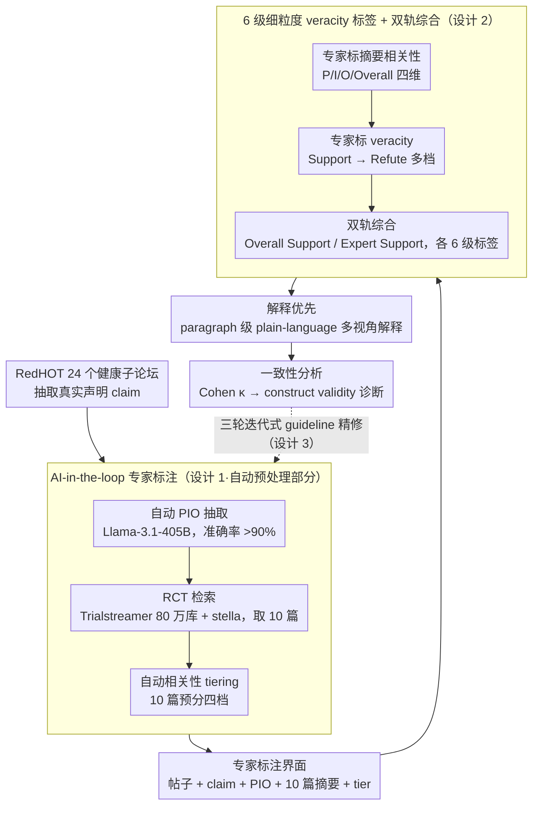

# Decide less, communicate more: On the construct validity of end-to-end fact-checking in medicine

**会议**: ACL 2026 Findings  
**arXiv**: [2506.20876](https://arxiv.org/abs/2506.20876)  
**代码**: https://github.com/SebaJoe/decide-less-communicate-more （有）  
**领域**: 事实核查 / 医学 NLP / 立场论文 / 人机交互  
**关键词**: 医学 fact-checking, construct validity, RedHOT, RCT, 通信模型

## 一句话总结
作者用 5 位临床专家在 RedHOT（Reddit 健康讨论）社交媒体真实声明上做了一项 1,000 实例的标注研究，发现端到端医学事实核查（end-to-end fact-checking）在 construct validity 层面就站不住脚 —— 证据连接难、声明欠规约、严重程度判定主观，三大障碍即便专家也无法消除，因此提出应把医学 fact-checking 重构为「交互式医患沟通模型」而非「分类→裁决」管线。

## 研究背景与动机
**领域现状**：传统 fact-checking pipeline（Guo et al. 2022）三段式 —— Claim Detection → Evidence Retrieval → Claim Verification，主流医学数据集（pubhealth / scifact / healthver / covid-fact / covert / healthfc 等）都把任务设成「给一句声明 + 检索证据 → 输出 True/False/Unproven」的多类分类。

**现有痛点**：(i) 现成数据多取自专业 fact-checking 网站、新闻或 RCT 摘要，剥离了原始语境，跟真正的「社交媒体声明」差距巨大；(ii) 即便用 SOTA 检索系统 + LLM，自动系统在 in-the-wild 声明上仍然普遍不可用；(iii) 关键问题没人系统量化：当我们把声明本身换成 Reddit 上原汁原味的真实病人发问时，**人类专家**能不能、用什么标准达成一致 verdict？

**核心矛盾**：现有任务定义把 fact-checking 简化为「内容相关」的判定，但真实医学 query 牵涉 (a) 病人未明示的意图、(b) 高质量证据（RCT）的覆盖盲区、(c) 个体专家对「错得多严重」的主观标尺；这些都是任务本身的 construct validity（构念效度）问题，再优化模型也救不了。

**本文目标**：(i) 通过专家 + AI-in-the-loop 标注研究测出医学 fact-checking 的「人类上界」；(ii) 拆解端到端范式失败的根因；(iii) 给出替代方案：交互式通信模型。

**切入角度**：作者不调模型，转而做一项「极端理想化」实验 —— 5 位临床专家拿到 contextualized claim（Reddit 原帖 + PIO 三元组）+ 自动检索的 10 篇 RCT 摘要 + 友好的标注界面，逐条评相关性、综合证据、写 plain-language 解释。如果连这种「最理想化」的人类上界 agreement 都很差，那当前任务定义本身就有问题。

**核心 idea**：医学 fact-checking 应被重新框定为「澄清意图 + 引导式证据检索 + 多视角解释」的交互沟通过程，而不是端到端的 True/False 分类。

## 方法详解

### 整体框架
**AI-in-the-loop 标注 pipeline（图 1）**：(1) 从 r/Epilepsy、r/CysticFibrosis、r/ADHD、r/lupus 等 24 个健康相关子论坛的 RedHOT 语料里抽 claim；(2) 用 Llama-3.1-405B-Instruct 重新抽取 PIO（Population / Intervention / Outcome）三元组以稳定专家关注点；(3) 在 Trialstreamer 80 万 RCT 摘要库上用 stella_en_400M_v5 dense retriever 检 10 篇候选 RCT；(4) 把帖子 / claim span / PIO / 10 个抽象 + 自动 tiering 喂进 web 标注界面；(5) 专家先按 PIO + Overall 四个维度（Relevant / Somewhat / Irrelevant）标 abstract 相关性 → Support / Partially Support / Partially Refute / Refute → 整合阶段分 Overall Support 和 Expert Support 两轮 → 写 paragraph 级 plain-language 解释。整个研究分 3 轮，含 1,000 abstract-level 标注 + 100 synthesis 解释，前两轮持续修订 guideline，最后一轮 5 个 claim × 5 个专家 × 50 abstract 用于一致性分析。

### 关键设计

**1. AI-in-the-loop 专家标注：把苦力交给机器，只把"证据相关性 + 综合判断"留给人**

要测的是"人类专家在最理想条件下能达成的一致性上界"，就必须把人类独有的判断和一切可自动化的环节彻底隔离——否则一旦 inter-annotator agreement 偏低，便分不清究竟是任务本身难、还是工具拖了后腿。为此 PIO 抽取、证据检索、相关性分档全部外包给 LLM / IR：自动 PIO 抽取用 Duke EBM 指南改写的 prompt（附录 J），在 55 条专家校验子集上准确率 $>90\%$；检索端比较了 8 种 sentence-to-sentence / sentence-to-passage × query / document 组合，最终选 PIO→Abstract 的 S2S（专家相关性评分平均最高）；自动 tiering 再按相关性把 10 篇 abstract 预分四档供专家微调。专家于是只需专注"这篇证据相不相关、综合起来到底支持还是反驳"这两件机器替不了的事，让 agreement 数值能干净地反映任务难度。

**2. 6 级细粒度 veracity 标签 + 双轨综合：把"证据说了什么"和"专家凭经验怎么看"拆成两条独立轨道**

现有数据集要么只标 True/False，要么把"实证支持"和"专家临床经验"混进同一个标签，导致根本看不出 disagreement 究竟源自证据缺位还是主观裁决。本文在综合阶段对每个 claim 跑两轮：Overall Support 只许依据给定的 RCT 证据，Expert Support 才允许引入临床知识；两轮各自从 6 个标签 $\{\text{No Relevant Abstracts/No Expert Opinion, Refutes, Partially Refutes, Inconclusive, Partially Supports, Supports}\}$ 里选一个。把两种判断拆开后，研究者第一次能定量看清——是"证据不足"而非"主观分歧"主导了一致性崩塌（最后一轮 25 条裁决里有 20 条落在"No Relevant Abstracts"）。

**3. 三轮迭代式 guideline 精修 + 解释优先：先把可优化的工程因素挤干净，剩下的分歧才能归咎于任务定义**

作者要论证的是"不是工具不够好，而是端到端范式本身没有 construct validity"，这就要求先穷尽一切工程改进、再看残余分歧来自哪里。于是标注分三轮、每轮后两位 co-first author 与专家集体讨论约 4 小时：第 1 轮无显式 PIO 上下文、无 Expert Support 字段，第 2 轮细化标签定义，第 3 轮做了实质改造（用 LLM 滤掉非 RCT-可验证的 claim、重抽 PIO、改进检索、加细化指南）。即便把这些工程因素都拉满，第 3 轮 5 个 claim 上 Overall Support 的 Cohen $\kappa$ 仍只有 0.124，25 条裁决中 20 条标为"No Relevant Abstracts"——正因可优化的部分已被挤干，这残余的低一致性才能干净地归到 construct validity 头上。与此同时全程坚持让专家写 paragraph 级 plain-language 解释而非只打标签，因为后文发现解释比单一标签更能反映真实的共识范围。

### 损失函数 / 训练策略
本文是 position paper + 标注研究，不涉及模型训练。

## 实验关键数据

### 主实验
最终轮一致性（表 2，5 条声明 × 5 位专家 × 50 abstract，Cohen $\kappa$ 越高越一致）：

| 维度 | $\kappa$ | 级别（Landis & Koch） |
|------|---------:|----------------------|
| Population（abstract 级） | 0.416 | moderate |
| Intervention | 0.714 | substantial |
| Outcome | 0.200 | slight |
| Overall (Abstract-level) | 0.155 | slight |
| Tab Support (per abstract → claim) | 0.170 | slight |
| **Overall Support (synthesis)** | **0.124** | **slight** |
| Expert Support (synthesis) | **−0.184** | 比随机还差 |

数据集对比（表 1 摘要）：

| 数据集 | 域 / 来源 | 标签 | Explanations | 证据类型 | 包含原始上下文？ |
|--------|----------|------|:------------:|--------|:----------------:|
| pubhealth | 公共卫生 / fact-checking 网站 | True/Unproven/False/Mixture | ✗ | 新闻段落 | ✗ |
| healthver | COVID-19 / 新闻+博客+社媒 | Supports/Refutes/Neutral | ✗ | 科学论文 | ✗ |
| healthfc | Health / Medizin Transparent | Supported/Refuted/NEI | ✓ | 系统综述 + RCT | ✗ |
| **our case study (2025)** | **Reddit 帖子原文** | **6 级精细度** | ✓ | **RCT 摘要** | ✓ |

### 消融实验
论文不是模型对比，「消融」体现在三轮 guideline 演进对 $\kappa$ 的影响：

| 标注轮 | 改动 | Overall Support $\kappa$ |
|--------|------|--------------------------|
| 第 1 轮 | 无 PIO 显示 / 无 Expert Support 字段 | 仍很低（论文未列） |
| 第 2 轮 | 精化标签定义 | 仍很低 |
| 第 3 轮 | 加 PIO + 过滤非 RCT 可验证 + 改进检索 + 更细 guideline | 0.124（slight） |

工程优化几乎不能提升 synthesis-level 一致性，强烈支持「问题在任务定义本身」的论点。

### 关键发现
- **绝大多数 in-the-wild 声明在 RCT 范围内根本不可验证**：最后一轮 5 个 claim × 5 个专家 = 25 条裁决里 20 条独立选了「No Relevant Abstracts」，3 个 claim 五位专家全部一致认为无相关 RCT。作者归因四类：无干预（如「我的情绪与月经周期相关」）、不伦理（如把吸烟设为 RCT 干预）、不可行（特定 PIO 组合 RCT 几乎不会做）、无效用（即便能做也没临床价值）。
- **声明欠规约导致解释发散**：r/CysticFibrosis 上「菠萝汁对鼻窦问题有益」一句话，专家不知道病人指即时 / 渐进改善，也不知道是否考虑高糖代谢风险，五位专家给出 5 种不同框定。
- **错误前提（misguided claim）撕裂判断**：ADHD 病人认为「药效随经期波动」并问「草药能否调节经期」，专家分裂为 (a) 直接验证「草药调经」, (b) 先驳前提再讨论, 哪种处理算正确没有定义。
- **veracity 严重程度的判定是天然主观的**：同一份证据下，菠萝汁声明可被一位专家判为「轻微不准」另一位判为「严重误导」，两者都合理。
- **plain-language 解释比标签更能对齐**：尽管标签分歧大，专家之间在自然语言解释中相互认可对方推理路径 —— 暗示「多视角解释」比单一标签更能反映真实共识范围。

## 亮点与洞察
- **用「人类上界差到不能再差」反推任务定义问题**：这是 position paper 里少见的实证策略，把 expert disagreement 当作 construct invalidity 的诊断信号，而非工具缺陷，方法论可移植到任何「LLM 自动评判」研究。
- **「Overall Support vs Expert Support」双轨设计很巧妙**：把「证据缺位」和「专家经验」分离后，研究者第一次能定量看到「证据不足」是 disagreement 的主要驱动因素（20/25 都是「No Relevant Abstracts」）。
- **从单回合 verdict 转向「通信模型」**（图 2，§5）：系统应主动追问、guided retrieval、对不可验证 claim 转向相关可验证版本、产出多视角解释 + 不确定性，而不是发一个 0/1 verdict —— 这与 IIR、clarification question generation、PIO-guided dialog 等多个邻域天然契合，为后续工作铺路。

## 局限与展望
- **样本量小**：最后一致性分析只覆盖 5 条 claim × 5 位专家；虽然每条配 10 abstract 极费力，但 $\kappa$ 数值的统计强度有限。
- **检索器不是研究对象**：用 stella 单一模型，未对比 RM / BM25 / LLM-rerank；但作者明确说目标不是检索本身。
- **只用 RCT 一种证据**：忽略 meta-analysis / cohort / case-control / case report，未来加入会带来「证据等级整合」的新难题。
- **通信模型没有原型实现**：附录 D 仅讨论评估思路，未交付任何 dialog 系统；后续真要落地需要病人-系统的 simulator + 专家评估闭环。
- **病人意图建模仍是开问题**：声明欠规约本质上要求模型读出病人未明示的意图，这超出当前 dialog clarification 工作的覆盖范围。
- **伦理与隐私**：直接放出 Reddit 帖子子集，尽管 RedHOT 原作给了 opt-out 机会，但二次发布仍是社区敏感话题。

## 相关工作与启发
- **vs RedHOT (Wadhwa et al. 2023)**: 只到 claim 标注层面（不做 verification），本文是首个在 RedHOT 上完整跑「claim + 证据 + 综合」流程并暴露失败模式。
- **vs healthfc (Vladika et al. 2024) / scifact / covid-fact / healthver**: 这些数据集都把 claim 从语境中剥离 + 用闭式标签，符合 end-to-end 范式；本文论证这种范式在真实 in-the-wild 场景下没有 construct validity。
- **vs AmbiFC (Glockner et al. 2024)**: 已意识到「声明可有多种合理解读」，本文进一步说明这种 ambiguity 在医学场景下不可消除，并把它纳入沟通模型设计。
- **vs Tree-of-Clarifications (Kim et al. 2023) / dialog clarification 系列**: 提供了 § 5.1 中通信模型的技术基础 —— 用 clarification question 树覆盖多种可能解读。
- **vs Decompose-then-verify (FActScore, Chen et al. 2022, Wanner et al. 2024)**: 本文指出 claim decomposition 不能处理「隐含 premise」，这是医学场景独有的难题。
- **vs Warren et al. 2025（fact-checker 实践调研）**: 与他们呼吁「细致、多视角解释」一致，本文用专家标注数据为该呼吁提供了量化支撑。

## 评分
- 新颖性: ⭐⭐⭐⭐⭐ 首次用专家上界实验论证医学 fact-checking 的 construct validity 问题，立场鲜明。
- 实验充分度: ⭐⭐⭐ 标注数据有 1,000 实例但最终一致性分析样本偏小，缺少模型落地实验。
- 写作质量: ⭐⭐⭐⭐⭐ 结构清晰、附录详尽（标注指南 / 检索配置 / claim 全文 / 案例分析）。
- 价值: ⭐⭐⭐⭐⭐ 直接质疑整个医学 fact-checking 子领域的范式，并给出可操作的替代方向，长期影响大。

<!-- RELATED:START -->

## 相关论文

- [\[ICCV 2025\] PropVG: End-to-End Proposal-Driven Visual Grounding with Multi-Granularity Discrimination](../../ICCV2025/social_computing/propvg_end-to-end_proposal-driven_visual_grounding_with_multi-granularity_discri.md)
- [\[ACL 2026\] VeriTaS: The First Dynamic Benchmark for Multimodal Automated Fact-Checking](veritas_the_first_dynamic_benchmark_for_multimodal_automated_fact-checking.md)
- [\[AAAI 2026\] Fact2Fiction: Targeted Poisoning Attack to Agentic Fact-checking System](../../AAAI2026/social_computing/fact2fiction_targeted_poisoning_attack_to_agentic_fact-check.md)
- [\[ICML 2025\] DEFAME: Dynamic Evidence-based FAct-checking with Multimodal Experts](../../ICML2025/social_computing/defame_dynamic_evidence-based_fact-checking_with_multimodal_experts.md)
- [\[ACL 2026\] ClaimDB: A Fact Verification Benchmark over Large Structured Data](claimdb_a_fact_verification_benchmark_over_large_structured_data.md)

<!-- RELATED:END -->
