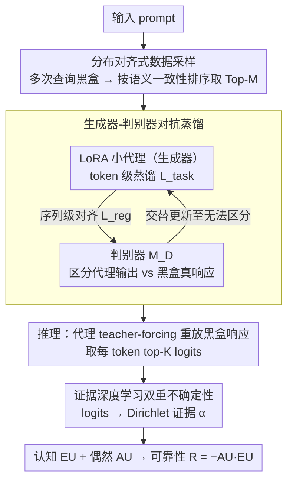

# Estimating the Black-box LLM Uncertainty with Distribution-Aligned Adversarial Distillation

**会议**: ACL 2026  
**arXiv**: [2605.05777](https://arxiv.org/abs/2605.05777)  
**代码**: https://github.com/huizi-Cui/DisAAD  
**领域**: LLM 校准 / 不确定性 / 黑盒模型 / 蒸馏  
**关键词**: 黑盒不确定性、对抗蒸馏、代理模型、证据深度学习、幻觉检测

## 一句话总结
提出 DisAAD：用一个仅占目标模型 1% 体积的小代理模型，通过 "分布对齐 + 对抗蒸馏" 学到 "黑盒 LLM 知不知道这道题"，再借证据深度学习把代理模型 logits 拆成认知 / 偶然不确定性，单次响应即可估计 GPT-4/Claude 这类闭源模型的实时不确定性，平均 AUROC 比黑盒 baseline 高 18.2%、AUPR 高 22.9%。

## 研究背景与动机

**领域现状**：LLM 在复杂推理与生成上突飞猛进，但 hallucination 仍是落地最大障碍。Uncertainty Quantification (UQ) 是让模型在不靠谱时主动 "示弱" 的核心手段，主流路线分三类：(1) self-evaluation 让模型自评，需 fine-tune 且不太可信；(2) multi-sample 反复采样看一致性 (Semantic Entropy / EigV / CoCoA / SAR)；(3) single-sample 直接读 token 概率 / logits / hidden states (LogTokU / CCP / Focus)。

**现有痛点**：(1) multi-sample 方法需要对同一 prompt 多次推理，部署成本和延迟都高，而且模型 "稳定地一致错" 时根本测不出不确定性；(2) single-sample 方法需要访问模型内部 logits 或 hidden states，**对 GPT-4 / Claude 这类只暴露 API 的商用闭源模型完全失效**；(3) self-evaluation 准确性差，且越大越 instructive 的 LLM (尤其商用模型) 越倾向 "假装自信" 给出看似合理的错答，反而比小模型更难发现幻觉。

**核心矛盾**：商用闭源 LLM 是真实部署的主力，它们对内部状态零暴露 + 倾向 overconfidence，而现有 single-sample UQ 既要 logits 又假设模型校准良好，两个条件全不成立。

**本文目标**：(1) 不访问目标模型内部、不重复采样，单次响应即给出实时不确定性；(2) 让一个小代理模型代替黑盒大模型 "暴露" 不确定性信号；(3) 用证据学习把不确定性拆成 epistemic (知识缺口) 与 aleatoric (数据噪声) 两个维度。

**切入角度**：作者引用 Zhou 2024 / Steyvers 2025 的发现——小 LLM 在难题上更常拒答、更校准良好；既然 "用小模型测大模型的不确定性" 可能比 "让大模型自评" 更靠谱，关键就是让小代理模型的输出分布精准对齐到大黑盒的高概率区域。

**核心 idea**：用对抗蒸馏 (生成器 + 判别器) 训练 LoRA 小代理，使它学到黑盒模型在 prompt 空间上 "答什么"，再借代理模型暴露的 logits 用证据学习推出 AU+EU。

## 方法详解

### 整体框架

DisAAD 要解决的是"GPT-4 / Claude 这类只暴露 API 的黑盒模型怎么做实时不确定性估计"。它的核心反转是：既然摸不到黑盒的内部 logits，就训练一个仅占目标模型 1% 体积的小代理模型去精准模仿黑盒"会答什么"，再让这个内部完全可见的代理替黑盒暴露 logits。整条流程分两阶段——先用"分布对齐采样 + 对抗蒸馏"把 LoRA 小代理对齐到黑盒的高概率输出区域，推理时让代理 teacher-forcing 重放目标模型给出的真实响应、从逐 token 的 logits 借证据学习拆出认知（EU）与偶然（AU）两种不确定性，单次响应即可给出实时估计。

### 关键设计

**1. 分布对齐式数据采样：把蒸馏数据精确指向黑盒"真正会输出"的高概率区域**

黑盒模型的真实输出分布是长尾的，如果对一个 prompt 把所有采样响应全收进蒸馏集，long-tail 噪声会稀释训练信号、逼代理去对齐黑盒偶尔的失误。本文的做法是对每个 prompt $\bm{x}^{(i)}$ 多次查询黑盒 $\mathcal{M}_B$ 得到候选池 $D_B^{(i)}$，再按响应之间的 mutual semantic consistency 排序，只保留 Top-$M$ 条作为 high-probability mass 的代表，构造蒸馏对 $\{(\bm{x}^{(i)}, \bm{y}_B^{(i,j)})\}$；prompt 来源同时覆盖开放领域对话与任务专项数据以保证泛化。语义一致性筛选等价于经验地估计高概率区域，让代理只需对齐"黑盒会真心给的回答"而非它的离群失误，既省查询预算又不引噪声。

**2. 生成器-判别器对抗蒸馏：让小代理在 token 级与序列级双重对齐，而非只学 next-token 平均**

纯 next-token cross-entropy 只在逐 token 上对齐，序列层面缺约束，代理容易 token 级平均却在整体语义上漂离——这样它重放黑盒响应时 logits 没有判别力。DisAAD 让代理 $\mathcal{M}_p$ 用 LoRA $W=W_0+BA$ 充当生成器，并新加一个判别器 $\mathcal{M}_D$。代理的训练目标是 $\min_\theta \mathcal{L}(\theta)=\mathcal{L}_{\text{task}}(\theta)+\lambda \mathcal{L}_{\text{reg}}(\theta)$，其中 $\mathcal{L}_{\text{task}}=-\frac{1}{NM}\sum_{i,j}\sum_t \log P_\theta(y_t\mid y_{<t})$ 是标准 token 级蒸馏，$\mathcal{L}_{\text{reg}}=-\frac{1}{NM}\sum_{i,j}\log\mathcal{M}_D(\bm{x}^{(i)}, \bm{y}_P^{(i,j)}; \phi)$ 鼓励代理生成的响应骗过判别器；判别器则按 $\mathcal{L}_D(\phi)$ 把代理输出与黑盒真响应区分开。两者交替更新到判别器无法区分为止，从而把对齐压力推到 sequence-level，让代理的"整段输出风格"也贴近黑盒，重放黑盒响应时 logits 才具备 UQ 所需的判别力。

**3. 证据深度学习的双重不确定性：把代理重放时的 logits 拆成认知与偶然两个可解释维度**

softmax 归一化会丢掉绝对证据尺度，直接用概率算 entropy 区分不了"稀疏证据下的高确信"和"丰富证据下的高确信"，也就无法把商用模型"假装自信"的失败模式形式化。DisAAD 在代理 teacher-forcing 重放黑盒响应的每个 token 时取 top-K logits，用 ReLU 转成 Dirichlet 证据 $\alpha_k=\text{ReLU}(\bm{z}_{t,k})$，记 $\alpha_0=\sum_k \alpha_k$：偶然不确定性 $\text{AU}(u_t)=-\sum_k \frac{\alpha_k}{\alpha_0}(\psi(\alpha_k+1)-\psi(\alpha_0+1))$ 反映输出分布的尖峭程度，认知不确定性 $\text{EU}(u_t)=\frac{K}{\sum_k(\alpha_k+1)}$ 反映总证据强度，综合可靠性取 $R(u_t)=-\text{AU}(u_t)\cdot\text{EU}(u_t)$。logits + Dirichlet 把绝对尺度保留下来，让 EU（知识维度）与 AU（数据维度）解耦——比如 Figure 2 里错答 "France" 被识别为 High EU + Low AU（知识缺口 + 单一回答倾向），对答 "America" 则是 Low EU + Low AU（确定且唯一），这正是把黑盒模型"假装自信"与"真正确定"区分开的关键。

### 损失函数 / 训练策略

联合最小化 $\mathcal{L}(\theta)=\mathcal{L}_{\text{task}}+\lambda\mathcal{L}_{\text{reg}}$；判别器最小化 $\mathcal{L}_D(\phi)$；两者交替更新；LoRA rank $r\ll d$；蒸馏数据从大规模对话集 + 任务集采样，每 prompt 取 Top-$M$ 语义一致响应；推理时 top-K 取 logits 算 Dirichlet 参数。

## 实验关键数据

### 主实验
在多项 QA 与幻觉检测任务上 (cf. 论文摘要 + 实验段)，与黑盒 baseline 平均对比：

| 设置 | DisAAD 提升 vs 黑盒最强 baseline (平均) |
|------|----------------------------------------|
| AUROC | **+18.2%** |
| AUPR | **+22.9%** |
| 代理模型大小 | 仅为目标 LLM 的 **1%** |
| 采样次数 | **1 次** (single response) |

与多 baseline 在黑盒幻觉检测 / 可靠性预测设置下对照 (基于论文 §4 报告)：

| 方法 | 需访问内部 | 需多次采样 | AUROC (相对) | 备注 |
|------|----------|-----------|-------------|------|
| Self-evaluation (Kadavath 2022) | 否 | 否 | 基线 | LLM 自评 |
| Semantic Entropy (Farquhar 2024) | 否 | 是 (多次) | 高于 self-eval | 同一 prompt 多次采样聚类熵 |
| EigV (Lin 2023) | 否 | 是 | 类似 SE | 图谱方法 |
| LogTokU (Ma 2025) | **是** | 否 | 最强 white-box | 不适用 GPT-4/Claude |
| Focus / CCP | **是** | 否 | 强 | 不适用黑盒 |
| **DisAAD (本文)** | **否** | **否** | **比黑盒 SOTA 平均 +18.2%** | 单次响应、1% 代理体积 |

### 消融实验

| 配置 | 关键效果 | 解读 |
|------|---------|------|
| Full DisAAD (含对抗 + AU+EU) | 最佳 AUROC / AUPR | 完整模型 |
| w/o discriminator (只用 $\mathcal{L}_{\text{task}}$) | AUROC 显著下降 | 序列级对齐缺失，代理 logits 失校准 |
| w/o distribution-aligned sampling (随机采样响应) | 性能下降 | 长尾噪声进入蒸馏集，污染高概率区域 |
| 仅 AU / 仅 EU | 均次于 $R=-\text{AU}\cdot\text{EU}$ | 双不确定性互补 |
| 代理大小 1% → 0.1% | 性能进一步下降 | 太小代理无法吸收黑盒输出分布 |
| 代理大小 1% → 10% | 仅微小提升 | 1% 已经接近性价比拐点 |

(注：具体数值见论文 §4 与附录 D，本笔记按方法学因果链给出趋势性结论。)

### 关键发现
- "用 1% 体积的小代理 + 单次响应" 就能达到 +18.2% AUROC 提升，刷新了 "黑盒 UQ 必须多采样" 的认知；这说明真正贵的是 "对分布对齐的精确性"，而不是 "采样次数"。
- 对抗判别器是必需的：去掉之后 logits 标定能力崩塌，说明 next-token loss 在序列层面留下的偏差对 UQ 是致命的。
- AU 和 EU 提供正交信号：AU 高 + EU 低 = "答案唯一但有歧义"；AU 低 + EU 高 = "强信号给了错答 (典型知识缺口)"；二者乘积 $R=-AU\cdot EU$ 才能可靠区分商用模型的 "假装自信" 与 "真正确定"。
- Distribution-aligned 采样 (Top-$M$ semantic consistency) 比随机采样显著好，验证了 "把蒸馏数据严格指向高概率区域" 比 "数据量大" 更关键。
- 代理大小存在性价比拐点：从 1% 缩到 0.1% 会塌掉，从 1% 涨到 10% 收益微小——说明黑盒输出分布的可学习信息量是有上界的。

## 亮点与洞察
- "用小模型代替大黑盒暴露 logits" 是一个很优雅的认知反转——把传统 white-box UQ 不能用在黑盒上的根本障碍 (无内部访问)，转化为 "找一个内部可访问的等价分布" 的代理问题，对所有商用 LLM API 都立即适用。
- 判别器 + token loss 的对抗组合，比单纯做 distillation 多一层 sequence-level 对齐，且天然带 "对齐到难以区分" 的终止信号，避免了过拟合或欠拟合的人工 stopping rule。
- AU vs EU 的拆解直接对应了 "知识缺口" vs "答案歧义" 两类失败原因，对下游 RAG / Self-Refine 等系统具有可执行价值——EU 高时去检索补知识，AU 高时让模型澄清问题。
- "Top-$M$ semantic consistency 筛选高概率区域" 这个想法本身可迁移到所有需要从黑盒采样数据的场景 (蒸馏 / 偏好学习 / 教师模型构造)，是一个工程上很容易复用的小 trick。
- 论文给的 1% 代理体积已经够好，意味着即便闭源模型规模继续无限增长，UQ 工具的代理成本是常数级 (而非线性增长)，对实际部署意义巨大。

## 局限与展望
- 蒸馏阶段需多次查询黑盒 API，初次部署有一次性数据采集成本，尤其针对小众领域 / 长 prompt 场景的 token 消耗不可忽略。
- 代理模型对齐的是 "目标模型在某分布下的常见输出"，当用户 prompt 偏离训练分布时，代理 logits 可能给出不可靠的 EU/AU——对完全 out-of-distribution 输入的鲁棒性未充分验证。
- AU/EU 的 ReLU + top-K 转换有较多超参 (K、Dirichlet 平滑常数等)，论文虽给经验值但跨任务 / 跨黑盒模型的迁移性需要再调。
- 没有讨论目标模型版本更新 (如 GPT-4 → GPT-4 Turbo) 后代理模型是否需要重训，工程持续成本未知。
- 判别器训练采用普通 GAN-style 交替优化，可能引入训练不稳定；论文未深入对比 Wasserstein / hinge 等变体。
- 仅在文本 QA 验证，对多模态 / 工具调用 / 长程 Agent 场景的不确定性估计有效性待考察。

## 相关工作与启发
- **vs Semantic Entropy / EigV / CoCoA / SAR (multi-sample)**：那些必须多次查询黑盒，部署延迟与 token 成本高；DisAAD 单次响应即可，且能识别 "稳定一致地错答" 这类 multi-sample 无能为力的场景。
- **vs LogTokU / CCP / Focus (single-sample white-box)**：那些直接用模型 logits 算 UQ，效果最强但要求 white-box；DisAAD 把 white-box 信号 "转移" 到代理模型上，让 white-box 技术间接适用于 GPT-4 / Claude 等闭源。
- **vs Self-evaluation (Kadavath 2022 / Kapoor 2024)**：让大模型自评不可靠，尤其 instruction-tuned 模型倾向高估自己；DisAAD 用小代理客观打分，规避 overconfidence 偏差。
- **vs LogTokU 的 Dirichlet 证据建模**：直接借鉴该论文 logits-as-evidence + 双不确定性的数学框架，但把这个框架从 "目标模型自身 logits" 解耦到了 "代理模型 logits"，扩展了适用范围。
- **vs 传统知识蒸馏**：传统蒸馏目的是让小模型替代大模型做推理；DisAAD 目的是让小模型作为大模型的 "不确定性传感器"，不替代主任务而做辅助 UQ，定位更精准。

## 评分
- 新颖性: ⭐⭐⭐⭐ 把 UQ 与对抗蒸馏 + 证据学习结合，覆盖 "黑盒商用 LLM 实时 UQ" 这个 white space。
- 实验充分度: ⭐⭐⭐⭐ 多任务 + 多黑盒 + 多 baseline 对比，AUROC/AUPR 双指标，附录有理论分析。
- 写作质量: ⭐⭐⭐⭐ 动机递进清晰，Figure 1/2 直观展示框架；公式部分稍密但有标准化符号。
- 价值: ⭐⭐⭐⭐⭐ 直接打通了 GPT-4/Claude 这类闭源主力模型的实时 UQ，工程落地价值极高。

<!-- RELATED:START -->

## 相关论文

- [\[ACL 2026\] ToxiTrace: Gradient-Aligned Training for Explainable Chinese Toxicity Detection](toxitrace_gradient-aligned_training_for_explainable_chinese_toxicity_detection.md)
- [\[ACL 2026\] Prompt-Level Distillation: A Non-Parametric Alternative to Model Fine-Tuning for Efficient Reasoning](prompt-level_distillation_a_non-parametric_alternative_to_model_fine-tuning_for_.md)
- [\[ICML 2026\] IDO: Incongruity-Aware Distribution Optimization for Multimodal Fake News Detection](../../ICML2026/social_computing/ido_incongruity-aware_distribution_optimization_for_multimodal_fake_news_detecti.md)
- [\[ICML 2025\] Learning Survival Distributions with the Asymmetric Laplace Distribution](../../ICML2025/social_computing/learning_survival_distributions_with_the_asymmetric_laplace_distribution.md)
- [\[ACL 2026\] Beyond the Crowd: LLM-Augmented Community Notes for Governing Health Misinformation](beyond_the_crowd_llm-augmented_community_notes_for_governing_health_misinformati.md)

<!-- RELATED:END -->
