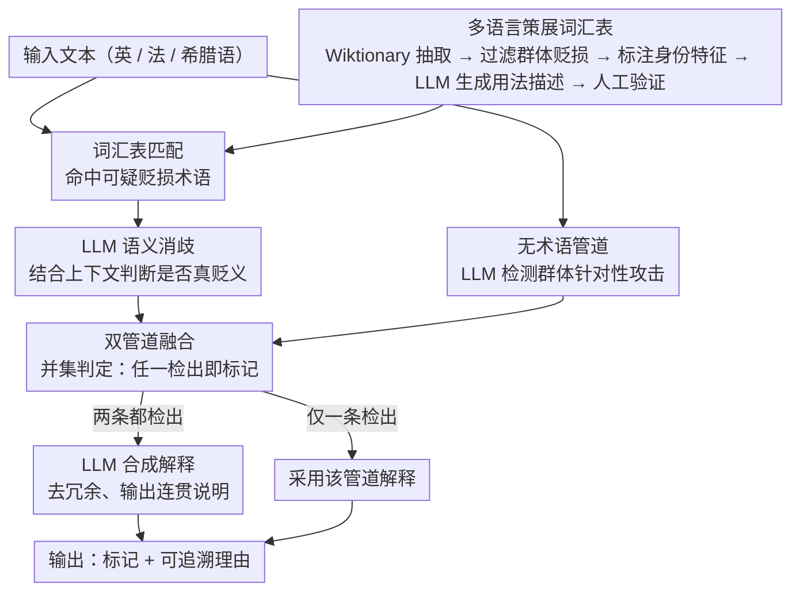

# Explain the Flag: Contextualizing Hate Speech Beyond Censorship

**会议**: ACL 2026 Findings  
**arXiv**: [2604.14970](https://arxiv.org/abs/2604.14970)  
**代码**: [GitHub](https://github.com/ails-lab/detoex)  
**领域**: 社会计算 / 仇恨言论  
**关键词**: 仇恨言论检测, 可解释性, 多语言词汇表, 上下文化解释, 混合系统

## 一句话总结
本文提出一种混合方法，结合 LLM 和三种语言（英/法/希腊语）的人工策展词汇表来检测和解释仇恨言论——术语管道通过词汇匹配+LLM 语义消歧检测固有贬损用语，无术语管道用 LLM 检测群体针对性内容，两者融合生成有据可查的解释。

## 研究背景与动机

**领域现状**：自动化仇恨言论检测系统广泛用于在线平台审核，但大多聚焦于审查或删除，缺乏透明度和解释性——用户被标记但不知为何被标记。

**现有痛点**：（1）纯删除方式缺乏透明度，限制了用户理解为什么其语言有害；（2）审核决策可能显得武断或有偏见；（3）仇恨言论有两种形态——固有贬损用语（如侮辱性称呼）和群体针对性内容（即使无侮辱词也可能有害）——需要不同的检测策略；（4）低资源语言（如希腊语）缺乏相关资源。

**核心矛盾**：审核需要在"阻止有害内容"和"解释为何有害"之间取得平衡——纯 LLM 方法缺乏稳定的术语知识，纯词汇方法缺乏上下文理解。

**本文目标**：构建一个能检测和解释仇恨言论的混合系统，覆盖英/法/希腊语。

**切入角度**：双管道设计——术语管道利用策展词汇表做精确匹配+LLM 消歧，无术语管道用 LLM 做上下文感知的群体针对检测。

**核心 idea**：策展词汇表（含义解释+身份特征标注）+ LLM 上下文推理 → 有据可查的解释。

## 方法详解

### 整体框架
这套系统想做的不是"标记后删除"，而是"标记并讲清为什么有害"，覆盖英、法、希腊三种语言。它把仇恨言论拆成两种形态分开处理：固有贬损用语走**术语管道**（先用词汇表匹配出可疑术语，再让 LLM 在上下文里判断这次到底是不是贬义用法），无侮辱词但攻击群体的内容走**无术语管道**（直接交给 LLM 做身份特征攻击的判断）。两条管道各自给出结论和解释，最后融合：任一条判为有害即标记，两条都判有害时再让 LLM 把两份解释合成一份连贯的说明。

### 关键设计

**1. 多语言策展词汇表：给 LLM 补上罕见、文化特定贬损用语的知识盲区**

LLM 对常见侮辱词很熟，但对罕见或地域文化特定的贬损用语（尤其低资源的希腊语）经常一无所知，纯靠模型判断会漏检。本文因此构建了一套三语言词汇表作为外部知识基础，从 Wiktionary 提取带 "derogatory/offensive/vulgarities" 标签的术语，经五步流程精炼：初始收集（11,310 英 / 3,749 法 / 965 希腊）→ 过滤出真正针对群体的固有贬损用语 → 分类并标注其攻击的身份特征 → 用 LLM 为每条术语生成一段同时涵盖争议用法与非争议用法的连续描述 → 人工验证，最终保留 3,904 英 / 1,644 法 / 288 希腊条目。关键不只在词条本身，而在每条都带"含义解释 + 身份特征标注"，这正是后续消歧和解释生成的依据。

**2. LLM 语义消歧：用上下文把"匹配中了"和"真的是骂人"分开**

许多贬损术语本身是多义的，简单字符串匹配会把大量正常用法误报为仇恨言论。术语管道因此不止步于匹配：命中某个术语后，把源文本连同该术语在词汇表里的含义描述（含争议与非争议两种用法）一起交给 LLM，由它判断这次到底是不是贬义使用并给出解释。这样就能处理多义词（如 "bitch" 可指母狗也可骂人）和回收用语（被目标群体自己回收使用、不构成攻击的情况），把"词在不在表里"升级为"这次用法到底有没有恶意"。

**3. 双管道融合与解释生成：两条互补的检测路径合成一份有据可查的说明**

两条管道各有盲区——术语管道擅长抓固有贬损用语却会漏掉无侮辱词的群体攻击，无术语管道擅长抓上下文攻击却会漏掉罕见术语，所以最终判定取并集：只有当两条管道都认为无仇恨言论时才判为安全。若只有一条检出，就直接采用该管道的解释；若两条都检出，则再由 LLM 把两份解释融合、去除冗余，输出一份连贯统一的说明。这一步让系统的输出始终是"标记 + 可追溯的理由"，而非一个孤立的有害标签。

### 损失函数 / 训练策略
混合系统不涉及训练。使用 Claude Sonnet 3.7 作为大模型，Llama 系列作为轻量开源替代。

## 实验关键数据

### 主实验

| 语言 | 模型 | Precision | Recall | F1 (Safe) |
|------|------|-----------|--------|-----------|
| 英语 | Claude (混合) | 0.92 | 0.89 | 0.90 |
| 英语 | Llama (混合) | 0.82 | 0.82 | 0.82 |
| 法语 | Claude (混合) | 0.96 | 0.91 | 0.93 |
| 希腊语 | Claude (混合) | - | - | 高于基线 |

### 消融实验

| 配置 | 关键指标 | 说明 |
|------|---------|------|
| 仅无术语管道 (LLM-only) | 较低 | 遗漏罕见/文化特定术语 |
| 仅术语管道 | 较低 | 遗漏无侮辱词的群体攻击 |
| 混合系统 | 最优 | 两管道互补 |

### 关键发现
- 混合系统一致优于纯 LLM 基线，证明策展词汇表对 LLM 有增强作用
- 人工评估显示解释质量高——用户能理解为什么内容被标记
- Claude 显著优于 Llama 系列，但 Llama 在低资源部署（单 GPU）中有实用价值
- 词汇表在希腊语（低资源语言）上的增益尤其显著

## 亮点与洞察
- **从审查到解释**的理念转变有重要的社会价值——解释为什么有害比简单删除更能促进用户理解和行为改变
- 策展词汇表+LLM 的混合模式是一个可推广的范式——在任何需要"精确领域知识+上下文理解"的任务中都适用
- 多语言词汇表的构建方法论（Wiktionary + LLM 过滤 + 人工验证）是可复用的资源构建流程

## 局限与展望
- 词汇表需要持续维护以覆盖新出现的贬损用语
- 仅在推文（短文本）上评估，长文本场景可能不同
- 回收用语（如 LGBTQ 社区回收的术语）的处理仍有挑战——缺少用户身份信息时难以判断
- 解释的自动评估指标有限，主要依赖人工评估

## 相关工作与启发
- **vs 纯 LLM 检测**: 缺乏稳定的术语知识，可能漏检罕见侮辱
- **vs 纯词汇方法**: 缺乏上下文理解，误报率高
- **vs Menis Mastromichalakis et al. (2025)**: 他们做可解释仇恨言论但不涉及多语言词汇表

## 评分
- 新颖性: ⭐⭐⭐ 双管道混合方法不算全新，但多语言词汇表是有价值的资源贡献
- 实验充分度: ⭐⭐⭐⭐ 三语言覆盖、人工评估检测和解释质量、多模型对比
- 写作质量: ⭐⭐⭐⭐ 结构清晰，社会动机充分

<!-- RELATED:START -->

## 相关论文

- [\[ACL 2026\] RV-HATE: Reinforced Multi-Module Voting for Implicit Hate Speech Detection](rv-hate_reinforced_multi-module_voting_for_implicit_hate_speech_detection.md)
- [\[ACL 2026\] Confident, Calibrated, or Complicit: Safety Alignment and Ideological Bias in LLM Hate Speech Detection](confident_calibrated_or_complicit_safety_alignment_and_ideological_bias_in_llm_h.md)
- [\[ACL 2025\] ImpliHateVid: Implicit Hate Speech Detection in Videos](../../ACL2025/social_computing/implihatevid_video_hate.md)
- [\[ACL 2025\] Silencing Empowerment, Allowing Bigotry: Auditing the Moderation of Hate Speech on Twitch](../../ACL2025/social_computing/silencing_empowerment_allowing_bigotry_auditing_the_moderation_of_hate_speech_on.md)
- [\[ACL 2025\] HateDay: Insights from a Global Hate Speech Dataset Representative of a Day on Twitter](../../ACL2025/social_computing/hateday_global_hate_speech.md)

<!-- RELATED:END -->
