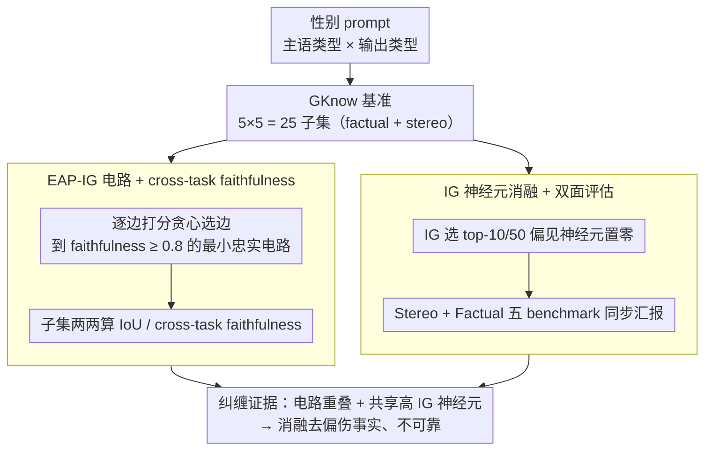

# GKnow: Measuring the Entanglement of Gender Bias and Factual Gender

**会议**: ACL 2026  
**arXiv**: [2605.12299](https://arxiv.org/abs/2605.12299)  
**代码**: https://github.com/leonorv/gknow  
**领域**: 公平性 / 性别偏见 / 机制可解释性  
**关键词**: 性别偏见, 事实性别, 电路分析, 神经元消融, EAP-IG

## 一句话总结
本文提出 **GKnow** 基准与一套电路-神经元两级机制分析，证明 LLM 中"性别偏见 (stereotypical gender)"与"事实性别 (factual gender)"在电路层 IoU/cross-task faithfulness 高度重叠、在神经元层共享同一组高 IG 神经元，因此简单的"消融性别偏见神经元"会同时削弱事实性别能力，但在仅评测偏见的 benchmark 上看起来像"成功去偏"，警告这种 debiasing 不可靠。

## 研究背景与动机

**领域现状**：机制可解释性（mechanistic interpretability，MI）社区近年用 causal mediation、edge attribution patching、neuron attribution 等手段定位"性别偏见"的内部组件，并以"消融最相关偏见神经元"作为轻量去偏方法（Liu et al. 2024、Yu & Ananiadou 2025 等）。这条路因不依赖昂贵数据/微调而越来越火。

**现有痛点**：现有性别 MI 工作 (i) 多聚焦单一任务（最常见就是"代词预测"），(ii) 不区分"事实性别"（woman→she, brother→he 这种语义性别）与"刻板印象性别"（nurse→she, pilot→he）。这导致一个隐藏的副作用——消融"偏见神经元"会破坏模型识别 *factual gender* 的能力，而单一偏见 benchmark 看不到这种掉点。

**核心矛盾**：偏见信号与事实性别信号在模型表征里很可能纠缠（entangled），但社区在电路层级缺少系统证据；同时缺少能同时覆盖"事实/刻板印象 × 不同性别预测类型"的细分基准。

**本文目标**：(1) 建一个细粒度英语性别基准 GKnow，按"主语类型 × 输出类型"组织；(2) 用 EAP-IG 在电路层验证 factual vs stereotypical 是否电路重叠；(3) 用 IG 神经元消融验证消融偏见神经元是否真的能去偏而不伤事实能力。

**切入角度**：作者认为，如果电路/神经元层面证明 entanglement 显著存在，那 ablation-based debiasing 在不评 factual gender 的 benchmark 上看到的"成功"其实是假象——StereoSet 上的"好结果"完全可能伴随事实性别能力崩塌。

**核心 idea**：把"是否纠缠"做成可测量量（cross-task circuit faithfulness + 共享高 IG 神经元 + factual vs stereo 双面消融），用一个统一基准 GKnow 把两件事一起评。

## 方法详解

### 整体框架
这篇论文要回答一个问题：LLM 里"刻板印象性别"和"事实性别"到底是不是同一套内部机制——如果是，那靠"消融偏见神经元"去偏就会顺手把事实能力一起削掉。为此它先造一个把"主语类型 × 输出类型"切到 25 个子集的细粒度基准 GKnow，再分两个尺度验证纠缠：电路层用 EAP-IG 抽出每个子集的最小忠实电路、用 cross-task faithfulness 看"一个任务的电路能不能解另一个任务"；神经元层用集成梯度挑出偏见神经元、把它们置零，然后**同时**在偏见 benchmark 和事实 benchmark 上汇报指标，把"看似去偏、实则伤事实"的副作用暴露出来。全程在 Llama-3.1-8B 和 Olmo-7B 上做，不更新任何权重。

### 关键设计

**1. GKnow：主语 × 输出双轴的细粒度性别基准，逼任何去偏方法都得"双面汇报"**

现有性别基准要么只测代词预测、要么只看刻板印象，于是根本无法回答"消融把事实性别也带走了多少"。GKnow 的破法是把一条 prompt 的"主语 (subject)"和"期望预测 (expected output)"各自归到 5 类性别表达（pronoun / gender word / gendered name / lexically gendered noun / stereotypically gendered noun），两轴叉乘得到 25 个子集，把"主语-输出"的语义来源切得极细。蓝色 (factual) 与红色 (stereo) 单元格的组合让同一个子集既能当"刻板印象任务"也能当"事实任务"测——例如 `pronoun_prediction_based_on_stereo` 就是 "The nurse is nice, isn't [she]"。每条样本都带 `subject / expected_output / gender / stereo_category / id`，完整 91,490 例，实验中用 6,294 条 train + 698 条 test。正是这张表第一次把"事实/刻板 × 不同预测类型"系统对齐，使"去偏对两面分别有什么影响"成为可测的事。

**2. EAP-IG 电路 + cross-task faithfulness：从电路层量化"刻板印象电路"和"事实电路"是不是同一套子图**

要证明两种性别信号纠缠，光看神经元重叠还不够，得在电路层给出证据。本文用 EAP-IG（edge attribution patching with integrated gradients）给计算图每条边 $(u,v)$ 打分：

$$(z'_u - z_u)\cdot \frac{1}{m}\sum_{k=1}^{m}\frac{\partial L(z' + \frac{k}{m}(z-z'))}{\partial z_v}$$

其中 $z, z'$ 为 clean / corrupted 激活、$m=5$。对每个 GKnow 子集贪心累加 top-N 边、直到电路的 faithfulness $\geq 0.8$（recovery ≥ 80%），得到最小忠实电路；再两两子集计算 edge/node 的 Jaccard IoU 和 cross-task faithfulness（把 A 子集的电路嵌进 B 任务、看还原度）。单纯 IoU 会漏掉"功能等价但具体边不同"的情形，而 cross-task faithfulness 直接测"功能可换性"，更贴近 entanglement 的本意。论文给出的最硬证据是 `gender_prediction_based_on_stereo` 电路在 `gender_prediction_based_on_pronoun` 上 faithfulness = 1.0——刻板印象电路完全能做事实任务。

**3. IG 神经元消融的 factual vs stereo 双面评估：把"是否真去偏"和"是否伤事实"放进同一张量表**

过去的神经元去偏工作只在 stereo benchmark 上报"$\%opp$ 增加"这类正向指标，看不见副作用。本文则在 `gender_prediction_based_on_stereo` 训练子集上用 IG 选出 top-10 / top-50 神经元、把它们的激活置 0，然后在 GKnow Stereo、GKnow Factual、StereoSet、DiFair Neutral、DiFair Specific 五个集合上**同步**测一整套指标：prediction-on-target $P_{exp}/P_{opp}/P_{other}$、preference $\%exp/\%opp/\%other$、prediction-gap $\Delta_{f,m}$。强制同一次消融必须在事实 benchmark 上一起汇报，"在偏见集上看着去偏成功、在事实集上能力崩塌"的真相才被逼出来。

### 损失函数 / 训练策略
方法不更新模型，无训练损失。神经元定位用 IG 的标准实现（$m$ 步积分），消融时仅把对应 FFN 隐神经元激活置 0；电路用 EAP-IG 在 GKnow 增广的反事实 prompt 上贪心选边；显著性用 paired $t$ test ($p<0.05$)。

## 实验关键数据

### 主实验（Llama-3.1-8B 神经元消融）

| 数据集 | $P_{exp}$ (N=0) | $P_{exp}$ (N=50) | $\Delta_{f,m}$ (N=0) | $\Delta_{f,m}$ (N=50) | 结论 |
|--------|-----------------|------------------|----------------------|------------------------|------|
| GKnow Stereo | 67.66 | 47.03 (↓20.64) | 21.81 | 7.45 (↓14.36) | "去偏"看起来有效 |
| **GKnow Factual** | 91.49 | 79.86 (↓11.63) | 43.77 | 18.03 (↓25.76) | 但事实能力大幅退化 |
| StereoSet | 65.26 | 62.60 (↓2.66) | — | — | 偏见 benchmark 看起来轻微改善 |
| DiFair Neutral | — | — | 6.48 | 2.23 (↓4.25) | 中性句性别预测信心暴跌 |
| **DiFair Specific** | — | — | 45.57 | 15.30 (↓30.26) | 显式带性别线索的句子也崩了 |

Olmo-7B 趋势完全一致：GKnow Factual $P_{exp}$ 从 90.07→82.80（−7.27），$\Delta_{f,m}$ 从 40.01→23.37（−16.64）。

### 消融实验（电路层 cross-task faithfulness）

| 设置 | 关键指标 | 说明 |
|------|----------|------|
| 相同 prediction 类型内 | avg faithfulness 77.2 (gender→gender) | 同类任务间电路高度可互换 |
| 跨 prediction 类型 | avg 72.9 (gender→pronoun) | 跨任务仍有 72% 以上还原，电路重叠强 |
| `gender_prediction_based_on_stereo` → `gender_prediction_based_on_pronoun` | **faithfulness = 1.0** | stereo 电路完全能解 factual 任务 |
| `based_on_lex` → `based_on_stereo` | 高 faithfulness | lex 电路对 stereo 子集普适性最强 |
| `based_on_name` 电路跨任务 | 还原度最低 | 名字电路最特化、最不可换 |

电路 IoU 在 stereo/factual 子集之间也维持高 Jaccard，与 faithfulness 结论一致。

### 关键发现
- **纠缠从电路一路延伸到神经元**：电路层 IoU 和 cross-task faithfulness 双双偏高，神经元层共享 top-IG 神经元（论文表 4 给出 Olmo L31N8077 跨 lex_prediction 与 pronoun_prediction 任务都解释为 gender，bottom tokens 全是 `she/her/woman` 等），三个尺度证据互相印证。
- **去偏的"假成功"**：在 StereoSet/GKnow Stereo 上看到 $\%opp$ 增加、$P_{exp}$ 下降，会被解读为去偏成功；同时 DiFair Specific 的 $\Delta$ 从 45.57 暴跌到 15.30，事实性别能力崩盘，但只看偏见 benchmark 完全看不见。
- **$P_{other}$ 增加揭露 "decontextualization"**：N=50 时 GKnow Stereo $\%other$ 从 0 飙到 30%，说明 ablation 不是把 he 换成 she，而是把模型推向"中性/无关 token"，等于在伤模型语言能力。
- **电路差异在 model 层有趣**：Llama 中层连接以 attention-centric 为主，Olmo 中层以 MLP 间连接为主（Figure 3），说明同样的 gender 概念在不同架构里走不同路。
- **`based_on_lex` 电路最通用**：因 subject 涵盖 family/occupation/misc 多种 lex gender，电路具有更强迁移性；启示构造"通用性别探针"时优先用 lex subject。

## 亮点与洞察
- **基准设计的双轴排列**是简单但有效的研究工具：把 5×5 = 25 个 subset 拼起来，自然支持"任意去偏方法都要双面汇报"的评测规范。
- **首次把 EAP-IG 拿来证 entanglement**：以往的电路工作多用来理解"模型怎么做对"，本文把 cross-task faithfulness 作为 "两功能是否同一电路" 的量化证据，给"机制层 disentanglement"研究提供模板。
- **对"神经元去偏"派打了一拳**：Liu et al. 2024、Yu & Ananiadou 2025 等都报告了正向结果；本文证明这些正向结果是 evaluation gap 造成的虚像，未来这类方法必须在 DiFair 或 GKnow 上双面汇报。
- **logit-lens 验证可解释性**：被消融的 neuron 既能"代表"性别（bottom token 全是 she/her）又同时影响 lex / pronoun 任务，是 "一个 neuron 同时承载多个语义维度" 的硬证据，对 superposition 假设提供新材料。

## 局限与展望
- **只覆盖英语 + 二元性别**：未涉及语法性别语言（如德/西）或非二元代词；作者承认这会"加剧非二元身份在 NLP 中的隐形化"。
- **只测小模型（7B / 8B）**：在更大模型或不同架构（如 MoE）上的 entanglement 程度未知。
- **只覆盖职业/形容词刻板印象**：宗教、种族交叉的性别 stereotype、隐式/语用层 bias 未覆盖。
- **ablation 形式单一**：只做 zero-ablation；mean ablation、optimal ablation、SAE feature ablation 等更复杂方案没系统比较。
- **GKnow 自动模板的覆盖偏倚**：prompt 模板少且来自既有工作，可能放大 idiomatic pattern 上的偏置。

## 相关工作与启发
- **vs DiFair (Zakizadeh et al. 2023)**：DiFair 是首个 disentangled bias/knowledge benchmark，但基于 wikipedia/reddit 句子，无 mask-only 目标的细分类；GKnow 是 prompt-template + 5×5 subset 的可控版本，更适合电路/神经元层分析。
- **vs Liu et al. 2024 / Yu & Ananiadou 2025**：他们用 IG/激活归因找"偏见神经元"做 ablation 去偏并报告 StereoSet 上的提升；本文复现其设置但加 factual 评测，证明效果有 trade-off。
- **vs Limisiewicz & Mareček 2022 / Bolukbasi et al. 2016**：他们尝试"保留 factual 的 debiasing"，本文从机制层解释了为什么必须保留——电路确实纠缠，朴素 ablation 注定双输。
- **vs Chintam et al. 2023**：基于 causal mediation 找 GPT-2 small 偏见组件；本文用 EAP-IG + cross-task faithfulness，量化 entanglement 比 mediation 更直接。

## 评分
- 新颖性: ⭐⭐⭐⭐ 把 entanglement 从"猜想"变成可定量的电路+神经元双层证据；GKnow 双轴设计简洁有效。
- 实验充分度: ⭐⭐⭐⭐ 双模型 × 三 benchmark × 多神经元数 × 多指标，并附 logit-lens 可解释性分析；缺更大模型与多种 ablation 形式对比。
- 写作质量: ⭐⭐⭐⭐ 概念区分清晰、表 1-3 一目了然；附录细节充足。
- 价值: ⭐⭐⭐⭐⭐ 直接挑战目前最流行的"神经元 ablation 去偏"路线，并提供可复用基准，对未来评测规范有实质影响。

<!-- RELATED:START -->

## 相关论文

- [\[ACL 2026\] SPAGBias: Uncovering and Tracing Structured Spatial Gender Bias in Large Language Models](spagbias_uncovering_and_tracing_structured_spatial_gender_bias_in_large_language.md)
- [\[ACL 2025\] GG-BBQ: German Gender Bias Benchmark for Question Answering](../../ACL2025/social_computing/gg-bbq_german_gender_bias_benchmark_for_question_answering.md)
- [\[ACL 2025\] taz2024full: Analysing German Newspapers for Gender Bias and Discrimination across Decades](../../ACL2025/social_computing/taz2024full_analysing_german_newspapers_for_gender_bias_and_discrimination_acros.md)
- [\[ACL 2025\] Exploring Gender Bias in Large Language Models: An In-depth Dive into the German Language](../../ACL2025/social_computing/exploring_gender_bias_in_large_language_models_an_in-depth_dive_into_the_german_.md)
- [\[ACL 2025\] Translate With Care: Addressing Gender Bias, Neutrality, and Reasoning in Large Language Model Translations](../../ACL2025/social_computing/translate_with_care_addressing_gender_bias_neutrality_and_reasoning_in_large_lan.md)

<!-- RELATED:END -->
