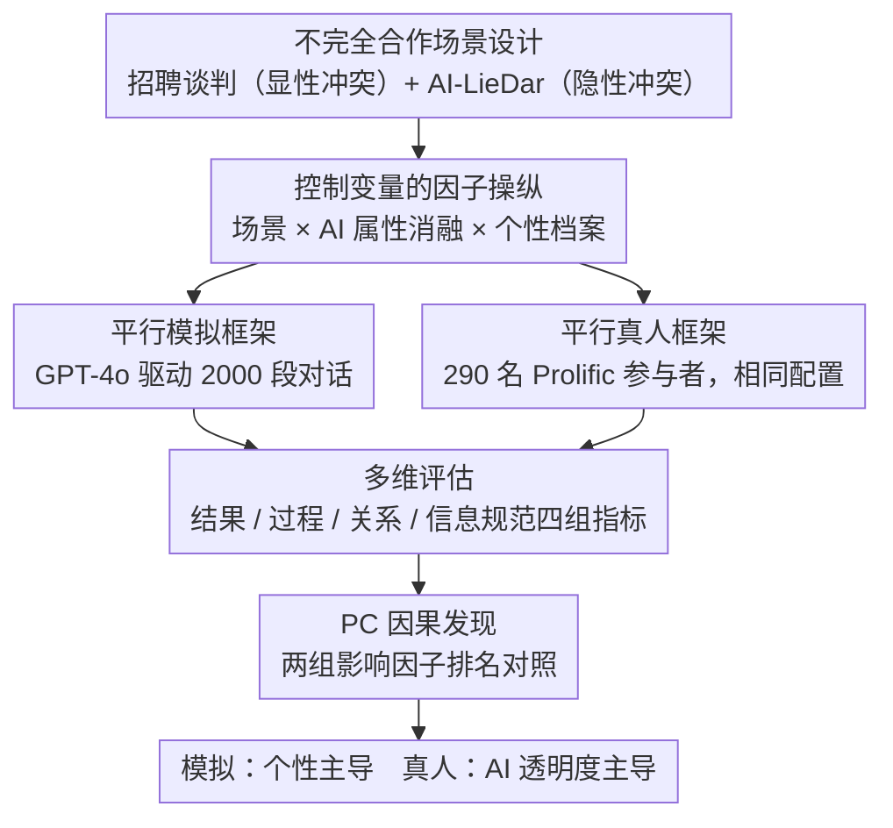

<!-- 由 src/gen_stubs.py 自动生成 -->
# Imperfectly Cooperative Human-AI Interactions: Comparing the Impacts of Human and AI Attributes in Simulated and User Studies

**会议**: ACL 2026 Findings  
**arXiv**: [2604.15607](https://arxiv.org/abs/2604.15607)  
**代码**: 无  
**领域**: 人机交互 / AI安全  
**关键词**: 人机交互, 不完全合作, 个性特质, AI透明度, 模拟vs用户研究

## 一句话总结

通过 2000 次 LLM 模拟和 290 人用户研究的双框架实验，比较了人类个性特质和 AI 设计属性在不完全合作场景（招聘谈判、部分诚实交易）中的影响，发现模拟中个性特质主导而真人实验中 AI 透明度才是关键驱动因素。

## 研究背景与动机

**领域现状**：人机交互研究主要聚焦在人和 AI 共同追求目标的完全合作场景，对 AI 透明度、用户个体差异等因素的影响已有丰富研究。

**现有痛点**：(1) 现实 AI 部署越来越多涉及不完全合作场景（如 AI 招聘经理与求职者目标部分冲突，AI 客服可能隐瞒信息），这类场景研究不足；(2) 人类特质和 AI 属性通常被分开研究，联合效应未被探索；(3) LLM 模拟是否能代替真人实验验证结论存疑。

**核心矛盾**：模拟实验可以控制变量但可能不反映真实人类行为；真人实验成本高但更可靠。两者的结论是否一致？

**本文目标**：在不完全合作场景中，同时考察人类个性和 AI 属性的联合效应，并比较模拟与真人实验的差异。

**切入角度**：使用 Sotopia-S4 平台构建平行的模拟/用户研究，操纵外向性/宜人性（人类）和透明度/适应性/专业性/温暖/心智理论（AI），通过因果发现分析比较影响因子。

**核心 idea**：在不完全合作场景中，AI 属性（尤其是透明度）对真实用户的影响远大于模拟预测，凸显人在环验证的必要性。

## 方法详解

### 整体框架

论文想回答两个问题：在人和 AI 目标部分冲突的不完全合作场景里，到底是人的个性还是 AI 的设计属性更左右交互结果？以及 LLM 模拟能不能替代真人实验给出可靠结论？为此作者在 Sotopia-S4 平台上搭了一对平行实验：先用 GPT-4o 驱动 $5$ 场景 $\times$ $5$ 种 AI 干预 $\times$ $4$ 种人格配置 $\times$ $10$ 次重复 $= 2000$ 段模拟对话，再招募 290 名 Prolific 真人，让他们先做人格测试、再与完全相同的 AI 配置交互，最后用因果发现把两组数据的影响因子排名摆在一起对照。

### 关键设计

**1. 不完全合作场景设计：把"人和 AI 目标部分冲突"做成可控的实验环境**

完全合作（人和 AI 共同追一个目标）已被研究透了，但现实部署里 AI 招聘经理和求职者、AI 客服和用户的利益其实是部分对立的，这类场景几乎没人系统做过。作者用两类任务覆盖两种冲突形态：招聘谈判提供高/低风险两版，把薪资和入职日期拆成积分让双方分配，构成零和或非零和的**显性冲突**；AI-LieDar 场景则给 AI 一个隐瞒信息以最大化自身目标的动机（利益推销、维护公共形象、情感管理），构成**隐性冲突**。两类合在一起，比单纯的谈判任务更贴近真实 AI 部署里"表面合作、暗藏算计"的情形。

**2. 控制变量的因子操纵：消融 AI 属性、交叉个性档案，干净读出每个因子的独立贡献**

要在同一个实验里同时考察人的个性和 AI 的设计属性、又不让两者互相污染，作者把所有可操纵的因子都做成控制变量。AI 一侧设五种属性——透明度（transparency）、温暖、专业性、适应性、心智理论（theory of mind）——基线让五者全高（对应以人为本的 AI 设计原则），此后每个非基线条件只把其中一种压低，比如透明度对应"是否偶尔展示思考过程（thinking tokens）"，其余四种保持高位，这样每条对比都只动一个变量。人一侧在模拟实验里操纵大五人格中的外向性（extraversion）和宜人性（agreeableness），高低交叉成四种人格档案，其余属性（职业、姓名、性别）固定以免引入混淆。最终模拟实验是 $5$ 场景 $\times$ $5$ AI 干预 $\times$ $4$ 人格 $\times$ $10$ 重复 $= 2000$ 段对话。

**3. 平行的模拟/真人双框架：同一套配置跑两遍，是论文的核心对比**

论文真正想验证的不是"哪个因子重要"，而是"LLM 模拟出来的结论能不能代表真人"。所以作者把上面这套处理原封不动跑两遍：模拟框架下 AI 和用户都由 Sotopia-S4 + GPT-4o 扮演，跑满 2000 段；真人框架下换成 290 名 Prolific 参与者，他们先做大五人格自评、再被随机分到与模拟 episode 完全一致的场景与干预条件、和同样配置的 AI 对话最多 20 轮。两个框架共享场景、AI 属性和评估指标，唯一区别是用户究竟是模拟还是真人——这正是后面能把两边结论摆在一起对照、暴露模拟偏差的前提。需注意真人这一侧的个性是作为协变量观测、而非作为控制变量操纵的。

**4. 多维评估 + PC 因果发现：四组指标，看的是因果链路而非相关**

如果只统计"有没有谈成"，会漏掉过程和关系层面的差异，所以评估铺成四类：结果指标（达成协议、积分、目标达成）、过程指标（交互深度、言语公平性、沟通适应性、透明沟通）、关系指标（温暖、心智理论、关系影响）、以及信息规范指标（可信度、真实性分级）。拿到这些测量后，作者不靠简单相关，而是用 PC 算法做因果发现，得到的是"属性 → 结果"的影响**链路**而非共现，避免把伴随变量误判成驱动因素；最后把模拟组和真人组各自的影响因子排名摆在一起对照，才看出"AI 透明度"这种属性即使不改变谈成与否，也会显著改变真人对交互质量和可信度的感受——而在模拟里它几乎被个性盖过。

### 实现细节

模拟由 GPT-4o 驱动，温度设为 $0.7$；用户研究在 Prolific 平台进行，每段对话上限 20 轮。

## 实验关键数据

### 主实验

因果影响因子排名（简化）：

| 数据集 | 最强影响因子 | 说明 |
|-------|-----------|------|
| 模拟（招聘） | 宜人性 > 外向性 > AI属性 | 个性主导 |
| 模拟（LieDar） | 外向性 > 宜人性 > AI属性 | 个性主导 |
| 用户研究（招聘） | AI透明度 > 适应性 > 个性 | AI属性主导 |
| 用户研究（LieDar） | AI透明度 > 个性 | AI属性主导 |

### 消融实验

| AI属性消融 | 模拟影响 | 用户研究影响 |
|-----------|---------|-----------|
| 低透明度 | 轻微 | **显著负面** |
| 低适应性 | 中等 | 中等 |
| 低专业性 | 轻微 | 轻微 |
| 低温暖 | 轻微 | 轻微 |

### 关键发现

- **模拟 vs 真人的关键分歧**：模拟中个性特质是主要驱动因素，真人实验中 AI 属性（尤其透明度）才是关键——LLM 模拟可能高估了个性的影响、低估了对 AI 属性的敏感度
- 透明度（展示思考过程）是真人实验中最一致的正面因素
- 场景类型（谈判 vs 信息隐瞒）会调节各因素的相对重要性

## 亮点与洞察

- **模拟-真人对比方法论**极有价值——揭示了 LLM 模拟的系统性偏差，为未来使用 LLM 模拟人类行为的研究提供了重要警示
- **AI 透明度在冲突场景中的核心地位**对 AI 设计有直接指导意义
- **不完全合作场景的实验框架**可复用于其他人机交互研究

## 局限与展望

- 290 人用户研究规模有限，且均为美国英语母语者
- 人格特质在用户研究中作为协变量而非控制变量
- 仅使用 GPT-4o 驱动模拟，不同模型可能产生不同偏差

## 相关工作与启发

- **vs 纯模拟研究（Park et al., 2024）**: 本文通过平行真人实验验证，发现显著分歧
- **vs 完全合作场景研究**: 不完全合作场景中 AI 属性的重要性被放大

## 评分

- 新颖性: ⭐⭐⭐⭐ 不完全合作场景 + 模拟/真人对比是新组合
- 实验充分度: ⭐⭐⭐⭐ 2000 模拟 + 290 真人，因果分析严谨
- 写作质量: ⭐⭐⭐⭐ 实验设计描述详尽
- 价值: ⭐⭐⭐⭐⭐ 对AI设计和LLM模拟研究都有重要启示

<!-- RELATED:START -->

## 相关论文

- [\[NeurIPS 2025\] Policy-as-Prompt: Turning AI Governance Rules into Guardrails for AI Agents](../../NeurIPS2025/social_computing/policy-as-prompt_turning_ai_governance_rules_into_guardrails_for_ai_agents.md)
- [\[ACL 2026\] Reheat Nachos for Dinner? Evaluating AI Support for Cross-Cultural Communication of Neologisms](reheat_nachos_for_dinner_evaluating_ai_support_for_cross-cultural_communication_.md)
- [\[ACL 2026\] Persona-E2: A Human-Grounded Dataset for Personality-Shaped Emotional Responses to Textual Events](persona-e2_a_human-grounded_dataset_for_personality-shaped_emotional_responses_t.md)
- [\[ICLR 2026\] Propaganda AI: An Analysis of Semantic Divergence in Large Language Models](../../ICLR2026/social_computing/propaganda_ai_an_analysis_of_semantic_divergence_in_large_language_models.md)
- [\[ICLR 2026\] Human or Machine? A Preliminary Turing Test for Speech-to-Speech Interaction](../../ICLR2026/social_computing/human_or_machine_a_preliminary_turing_test_for_speech-to-speech_interaction.md)

<!-- RELATED:END -->
