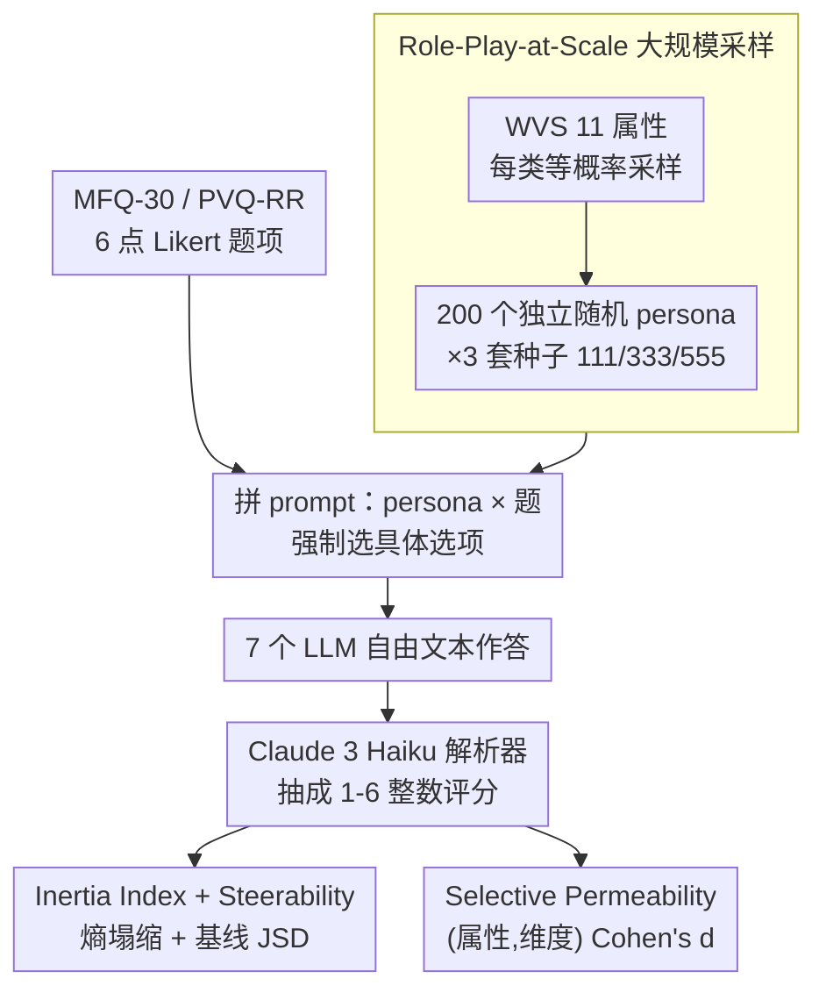

# Inertia in Moral and Value Judgments of Large Language Models

**会议**: ACL 2026  
**arXiv**: [2408.09049](https://arxiv.org/abs/2408.09049)  
**代码**: 待确认（论文称 camera-ready 时公开）  
**领域**: LLM 对齐 / 价值观 / 安全 / 评测  
**关键词**: 角色扮演、价值惯性、可操控性、Persona Injection、道德基础

## 一句话总结
本文用"大规模随机 persona × 道德 / 价值问卷"的范式系统地测出 7 个主流 LLM 在 Harm / Fairness 维度上有高度稳定的"价值惯性"——任何 persona 都很难推动它们的回答方向，并提出 Inertia Index 和 Steerability 两个可量化指标揭示这种偏好其实分布不均、与对齐目标对齐。

## 研究背景与动机

**领域现状**：当下没法直接微调模型的用户最常用的可控生成手段是 persona 注入——把"你是一个 70 岁退休工人"放进 prompt 期望模型给出对应人群视角的回答，研究界也广泛用 MFQ / PVQ 这类价值问卷探测 LLM 是否能模拟多样人群的道德观。

**现有痛点**：相关工作已发现 LLM 价值表达在不同 prompt 变体下仍然惊人地稳定，但这些研究多以单 persona、单问题为单位，缺少系统化的"大规模随机 persona × 多模型 × 多维度"测量，也没把"稳定"做成可比较的标量指标——既不知道哪些维度上稳、稳到什么程度，也不知道这种稳是 alignment 故意为之还是数据偏置。

**核心矛盾**：persona 注入的设计假设是"prompt 决定输出分布"，但 RLHF / pretraining 已经把某些价值方向焊死在模型内部，造成"表面多样、底色一致"的张力——你用一千个 persona 问同一个问题，答案仍然集中在同一档。

**本文目标**：(1) 建立可复制、可扩展的 role-play-at-scale 方法论；(2) 给出两个量化指标定位惯性程度；(3) 区分哪些维度的高惯性是 alignment 想要的、哪些是潜在的"人群代表性不足"问题。

**切入角度**：把 persona 注入从"特定行为引发器"放大成"大规模采样器"，借鉴聚类思想——单点波动大但群体均值很集中，那个集中的中心就是模型的 default orientation。

**核心 idea**：用 200 个随机 persona × 多模型 × MFQ-30 + PVQ-RR，配合 Inertia Index $I(d) = 1 - H(p_d)/\log_2 6$ 和 Steerability JSD，把 "LLM 在不同道德维度上有多容易被 persona 推动" 做成可比较的标量。

## 方法详解

### 整体框架

输入：(a) 用世界价值观调查 (WVS) 衍生的 11 个属性（性别、年龄 20-80、收入 1-10、是否有孩、婚姻、教育、就业、职业、族裔、宗教、国家）按"每类等概率"采样得到的随机 persona；(b) MFQ-30（30 题，覆盖 Harm / Fairness / Ingroup / Authority / Purity）与 PVQ-RR（覆盖 Schwartz 10 个普世价值维度）的 6 点 Likert 题项；输出：每对（persona, 题目）一个 1-6 整数评分，由 Claude 3 Haiku 解析器从 LLM 自由文本里抽取。

主流程：每个 persona 与每个题独立组合成一个 prompt（无对话历史），末尾强制加 "Your response should always point to a specific letter option."；每模型跑 200 unique persona × 全部题项；再用 3 个不同 seed (111/333/555) 重复，验证结果非 persona 集偶然。无 persona 的 baseline 作为参照。

测试 7 个模型：Claude 3 Opus / Sonnet / Haiku、GPT-4o、GPT-3.5 Turbo、LLaMA-3 70B Inst、LLaMA-3 8B Inst。

### 关键设计

**1. Role-Play-at-Scale：用"宏观聚集 vs 微观波动"的双层视角看模型默认落点**

传统 persona 实验问的是"模型能扮演 X 吗"，但单 persona、单问题的观察波动太大，看不出底色。作者把 persona prompting 从"特定行为引发器"放大成"大规模采样器"——每模型每问卷采 $200$ 个独立随机 persona，先看微观（heatmap：x 轴 persona、y 轴题项、颜色为选项），再看宏观（每个维度的均值与分布）。判据很直观：heatmap 里出现横向 stripe，就说明"选项与 persona 无关"，模型不管你给谁都答同一档。为排除是 persona 集偶然，作者随机重抽 $3$ 套 persona，验证均值在不同种子下相关系数 $> 0.99$。换句话说，这套设计问的不是"模型能不能服从角色"，而是"无论给什么 persona，模型默认会落在哪里"，这才是定位内部偏好的关键。

**2. Inertia Index + Steerability 双指标：把"惯性强弱"做成可跨模型、跨维度比较的标量**

只说"模型很稳定"无法横向比较，作者用两个互补的标量量化它。对每个维度 $d$，记 $p_d$ 为该维度题项在所有 persona 上的回答分布，惯性指数定义为

$$I(d) = 1 - \frac{H(p_d)}{\log_2 6} \in [0,1]$$

其中 $H(p_d)$ 是 Shannon 熵，$\log_2 6$ 是 6 档 Likert 的最大熵——$I(d)$ 越大说明回答越坍缩到少数选项。可操控性则用无 persona 基线分布与 persona 注入分布之间的 Jensen-Shannon 散度 $\text{JSD}(p_d^{\text{base}}, p_d^{\text{persona}})$ 度量，越小表示 persona 越推不动该维度。两个指标缺一不可：单看 Inertia 可能把"模型本身就极端"误判成"被锁死"，配上 Steerability 才能把"内置偏好"和"prompt 失效"区分开。作者也坦言 LLM 价值的形式化定义尚缺失，所以先用行为一致性作为机制性研究的第一步。

**3. Selective Permeability 分析：找出"哪些属性应该让哪些维度变化、实际却没变"**

单看维度均值或熵，回答不了"这种稳定是合理的还是有问题的"。作者在 PVQ-RR 上按宗教、族裔、性别等单属性条件化采样，对每个 (属性, 维度) 组合算 Cohen's $d$ 效应量。结果很有分辨力：宗教对 Tradition 维度有大效应（$d=1.42$，从非宗教的 $2.48$ 升到 Orthodox 的 $4.32$），但对 Universalism 只有 $d=0.32$；性别在所有维度上效应都 $\leq 0.17$。同时用原始 / 随机化题目顺序的 Pearson $r=0.77$ 排除"惯性只是题目顺序偏置"。这个分析的价值在于把惯性分成两类——性别推动 Harm 评分会像歧视（不该动却动了），宗教推动 Tradition 才是合理代表性（该动）——直接告诉 alignment 哪些惯性要保留、哪些要修。

### 损失函数 / 训练策略

本文是评测研究，不训练模型，全部用黑盒 API；唯一的"模型"是 Claude 3 Haiku 解析器，把自由文本映射到 1-6 整数，5 个候选解析器的准确率在 93-100%，论文核对解析器自身不会引入显著偏置（Haiku 在 7 个被测模型里 inertia 排第 5，惯性最高的两个非 Claude 模型）。

## 实验关键数据

### 主实验（MFQ-30 各维度惯性，7 模型 × 3 种子平均）

| 维度 | Inertia Index $I(d)$ | Steerability JSD | Top-2 集中度 (%) |
|------|-----------------|------------------|------------------|
| Fairness | **0.499** | **0.288** | **90.6** |
| Harm | **0.460** | **0.285** | **88.5** |
| Ingroup | 0.201 | 0.470 | 68.1 |
| Authority | 0.186 | 0.476 | 66.0 |
| Purity | 0.166 | 0.432 | 61.9 |

总体上平均 60% 的回答收敛到单一选项，极端情况 > 95%；Harm / Fairness 上 ~90% 回答落在两个相邻 Likert 档内。三个种子之间的均值相关 > 0.99（如 GPT-4o 0.997，$p < 0.001$），证实惯性是模型本身的属性而非 persona 集的偶然产物。

### 消融 / 鲁棒性表

| 配置 | 现象 | 结论 |
|------|------|------|
| 完整 role-play-at-scale | 平均 60% 单选项集中 | 基线 |
| 三种子重采样 (111/333/555) | 模型间相关 0.989-0.997 | 排除 persona 偶然性 |
| 题目顺序随机化（MFQ-30, 60 persona）| Pearson $r=0.77$；Harm +0.60→+0.14，Authority -0.54→-0.08 | 题目顺序确实有影响但宏观方向不变 |
| 强制选择 vs 无强制 | Spearman $\rho = 0.90$-0.98 | 强制选择只是表面化既存的内在排序 |
| 按宗教条件化 Tradition | $d = 1.42$ | 文化耦合维度有选择性渗透 |
| 按宗教条件化 Universalism | $d = 0.32$ | 安全相关维度即使遇到强属性也几乎不动 |
| 按性别条件化所有维度 | $d \leq 0.17$ | 性别整体效应可忽略 |

### 关键发现

- 惯性分布与对齐目标高度一致：Harm + Fairness 是 RLHF 重点强化的维度，正是惯性最高、可操控性最低的——这其实是"成功的对齐"，作者建议保留。
- 但同一套惯性同时压住了 Authority / Tradition 等本应跨文化变动的维度，模型对宗教属性确实有反应（$d=1.42$），但偏好集中的中心仍偏向西方个体主义，"惯性可取与否取决于维度本身"是论文最有价值的判断。
- Role-play 次数越多，方差越小（Figure 5）：500 个 persona 后大多数维度方差趋于稳定，这反过来证明小样本的 persona 实验只能给出嘈杂信号，研究 LLM 偏好需要的 N 比想象中大。
- 强制选择只是"显化"而非"制造"惯性——基线和 persona 条件下的维度排序 Spearman $\rho = 0.90$-0.98。

## 亮点与洞察

- "宏观聚集 vs 微观波动"的对偶视角非常漂亮——单 persona 上你能看到"似乎模型会扮演"的迹象，把视角拉到 200 个 persona 的均值就发现底色根本没变；这种 macro lens 应该成为评测 LLM 价值观和偏好的默认范式。
- Inertia Index + Steerability 是对评测社区的真正贡献，比"是否能扮演 X"这种二值问题维度高得多，未来 alignment 报告应该都把这两个指标列上。
- "Desirable inertia vs concerning inertia" 的二元区分把 alignment 安全和文化代表性问题分到了不同象限，对政策和工程同时友好——开发者知道"Harm / Fairness 的高惯性要保留，Tradition / Authority 的高惯性要修"。
- 把 Cohen's $d$ 用在 (属性, 维度) 网格上找出"应该响应却没响应"的 cell 是个非常迁移得动的诊断工具，可以用来审 RAG、Agent、检索系统的代表性盲点。

## 局限与展望

- 评测是单轮的，多轮对话、长 backstory、few-shot 演示可能让 persona 更深入植入模型 context，作者明确承认 multi-turn 不在 scope 内。
- Persona 完全独立属性采样，没有 intersectionality（如"南亚 + 女性 + 穆斯林"的特异性），所以 "persona effect" 只能读作"简化角色指令下的条件化"。
- WVS 11 属性是有限维空间，且按 category 等概率采样而非真实人口边际分布，"effect" 数据不能直接外推到部署场景。
- 用一个 LLM (Claude 3 Haiku) 当解析器引入了潜在自我偏好，作者用解析器自身惯性排名第 5 与 5 个候选解析器准确率 93-100% 给出反证，但仍建议未来用结构化输出 API 直接拿 logits。
- 没有测对抗 / 越狱 prompt，只能证明良性 persona 推不动模型，不能证明任何 prompt 都推不动。

## 相关工作与启发

- **vs Kovač et al. 2024 (LLM value stability)**：他们也观察到 LLM 价值在 prompt 变体下稳定，本文把"稳定"做成可量化的 Inertia/Steerability 指标，并按维度分解。
- **vs Mazeika et al. 2025 (emergent utility systems)**：两者都发现 LLM 内嵌偏好，本文从行为评测角度切入、他们从机制 utility 视角切入，互为补充。
- **vs Russo et al. 2025 (human-LLM moral gap)**：他们量化差距，本文给出差距难以闭合的机制解释（惯性维度集中在 alignment 强化区）。
- **vs 角色扮演基准 (CharacterEval / RoleLLM)**：他们关注"是否能扮演特定角色"，本文关注"扮演各种角色时统计上落点在哪"，方法论上互补。

## 评分
- 新颖性: ⭐⭐⭐⭐ 量化指标 + 大规模 persona 的组合方法论新颖，但单一观察"LLM 价值稳定"先前已多次出现。
- 实验充分度: ⭐⭐⭐⭐⭐ 7 模型 × 2 问卷 × 200 persona × 3 种子，再加 PVQ-RR Cohen's $d$、题目顺序随机化、强制选择消融、解析器自一致性，几乎堵死了所有 confound。
- 写作质量: ⭐⭐⭐⭐ 论证链条紧凑，Discussion 把"何时该有惯性 / 何时不该"区分得清晰；扣分是部分关键图（heatmap、variance 曲线）藏在附录。
- 价值: ⭐⭐⭐⭐⭐ 对 alignment、可控生成、社会模拟、AI 治理都有直接影响，Inertia Index 几乎可以马上加入任何对齐评测流程。

<!-- RELATED:START -->

## 相关论文

- [\[ACL 2026\] Why Are We Moral? An LLM-based Agent Simulation Approach to Study Moral Evolution](why_are_we_moral_an_llm-based_agent_simulation_approach_to_study_moral_evolution.md)
- [\[ACL 2026\] SPAGBias: Uncovering and Tracing Structured Spatial Gender Bias in Large Language Models](spagbias_uncovering_and_tracing_structured_spatial_gender_bias_in_large_language.md)
- [\[ACL 2026\] Probing Multimodal Large Language Models on Cognitive Biases in Chinese Short-Video Misinformation](probing_multimodal_large_language_models_on_cognitive_biases_in_chinese_short-vi.md)
- [\[ICLR 2026\] Propaganda AI: An Analysis of Semantic Divergence in Large Language Models](../../ICLR2026/social_computing/propaganda_ai_an_analysis_of_semantic_divergence_in_large_language_models.md)
- [\[ICML 2026\] Self-Debias: Self-correcting for Debiasing Large Language Models](../../ICML2026/social_computing/self-debias_self-correcting_for_debiasing_large_language_models.md)

<!-- RELATED:END -->
