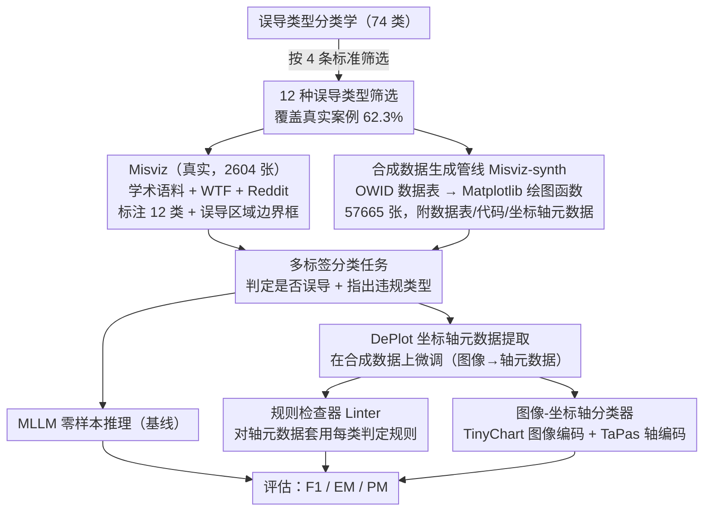

# Is this chart lying to me? Automating the detection of misleading visualizations

**会议**: ACL 2026  
**arXiv**: [2508.21675](https://arxiv.org/abs/2508.21675)  
**代码**: [GitHub](https://github.com/UKPLab/acl2026-misviz)  
**领域**: 可视化/错误信息检测  
**关键词**: 误导性可视化, 图表检测, 多模态大模型, 数据可视化, 多标签分类

## 一句话总结

提出 Misviz（2604张真实世界误导性可视化）和 Misviz-synth（57665张合成可视化）基准，覆盖12种误导类型，系统评估MLLM、规则检查器和图像分类器在检测误导性图表上的表现，揭示该任务仍极具挑战性。

## 研究背景与动机

**领域现状**：误导性可视化是社交媒体上虚假信息的重要载体，通过违反图表设计原则（如截断坐标轴、3D效果、不一致的刻度间隔等）扭曲数据，误导读者得出错误结论。已有研究证明人类和MLLM都容易被这类可视化欺骗。

**现有痛点**：自动检测误导性可视化并识别具体违规类型的训练和评估受限于缺乏大规模、多样化、开放的数据集。现有数据集要么规模小（150张），要么不开放获取，要么仅覆盖少数误导类型，限制了方法间的可比性和研究进展。

**核心矛盾**：误导特征往往隐藏在细微的视觉细节中（如坐标轴刻度间隔），且高度多样化（最新分类学识别出70+种），使自动检测极为困难。

**本文目标**：构建首个大规模开放的误导性可视化基准，系统评估不同检测方法的优劣势。

**切入角度**：从三个来源（学术语料、WTF Visualizations网站、Reddit社区）收集真实图表，结合基于真实数据表的合成生成，构建互补的基准对。

**核心idea**：将误导性可视化检测定义为多标签分类问题，系统比较三种检测路径——零样本MLLM、基于坐标轴元数据的规则检查器、图像-坐标轴分类器。

## 方法详解

### 整体框架

这篇论文要解决的是「自动判断一张图表是否在用视觉手段误导读者，并指出具体违规类型」。整体围绕两个互补的基准展开：Misviz 收录 2604 张真实世界可视化（70% 误导 + 30% 正常），逐张标注 12 种误导类型和误导区域的边界框；Misviz-synth 则用真实数据表合成 57665 张可视化，每张都自带数据表、Matplotlib 代码和坐标轴元数据作为完美监督。任务被统一成「多标签分类」，并在其上系统比较三条检测路径：MLLM 零样本推理、先用 DePlot 抽取坐标轴元数据再交给规则检查器、以及直接训练图像（+坐标轴）分类器。

### 关键设计

**1. 12 种误导类型的筛选：从 74 类分类学里挑出"既常见又可自动检测"的子集**

误导手段的分类学最新已识别出 70+ 种，全量覆盖既无法标注也无法评估，必须先收敛到一个有意义的子集。作者从 Lo 等人的 74 类里按四条标准过滤：必须在真实世界中足够频繁（每类 ≥15 个实例）、直接违反明确的图表设计规则（排除需要主观推理的类型）、确实扭曲了数据（排除只是降低可读性的类型）、且不需要专业领域知识就能判断。最终留下 12 类，它们已覆盖真实案例的 62.3%。这样筛选保证了基准既有足够的现实覆盖面，又让每个标签都可被人工可靠标注、被模型客观检测。

**2. 合成数据生成管线（Misviz-synth）：用真实数据表批量造出带完美元数据的误导图表**

真实误导图表标注成本高、数量少，难以支撑训练和细粒度评估，于是作者构造了一条两步合成管线。第一步从 Our World in Data 抓取真实数据表，确定哪些列组合和图表类型是有效的；第二步对每个（图表类型, 误导类型）组合调用手工编写的 Matplotlib 绘图函数生成对应可视化。关键在于每个合成实例都附带原始数据表、绘图代码和坐标轴元数据，因此不仅能大规模扩充训练样本，还能自动得到无噪声的标签和轴信息，直接用来训练下面的坐标轴提取模型。

**3. 基于坐标轴元数据的规则检查器（Linter）：把"看图判断"转成"读轴查规则"**

许多误导类型的破绽其实藏在坐标轴里——截断轴的起点不为 0、刻度间隔忽大忽小——这些都是结构化、可被规则精确判定的线索。作者先微调 DePlot，让它从图表图像里抽取坐标轴元数据（刻度标签、刻度位置、轴名称），再对每种误导类型套用手工设计的判定规则：例如截断轴检查 $y$ 轴起始值是否为 0，不一致间隔检查相邻刻度的数值差是否恒定。注意这个 DePlot 提取步骤是规则检查器和下面分类器共用的中间环节——真实图表只有图像、没有现成元数据，必须先靠它把图像还原成结构化的轴信息。规则检查器只覆盖能从轴元数据判定的 6 种误导（截断轴、反转轴、双轴、不一致刻度间隔、不一致分箱、不当排序），需要视觉判断或领域知识的类型（如 misrepresentation）它管不了；但相比直接让模型"看图猜误导"，这条路径可解释性强、判据明确，在元数据准确的合成数据上表现尤其突出。

**4. 图像-坐标轴分类器：把"看图"和"读轴"两路特征拼起来学**

MLLM 只看图像、规则检查器只读轴元数据且仅覆盖 6 类，作者于是训练一个分类器把两路信号融合，作为第三条检测路径。具体训练两个版本：一个只吃可视化图像，另一个把图像和坐标轴元数据一起吃。图像用冻结的 TinyChart 图像编码器（一个专门做图表理解的 MLLM）编码，轴元数据用冻结的 TaPas 表格编码器编码；融合版把图像嵌入与轴元数据嵌入的 `[CLS]` token 拼接，再送进一个可训练的分类头，输出「某一种误导或无误导」。分类器同样在 Misviz-synth 上训练，真实图表上靠微调后的 DePlot 现提取轴元数据。和规则检查器一样，它在同分布的合成数据上明显占优（图像+轴版 F1 最高），但因为坐标轴提取器难以泛化到真实图表，到 Misviz 上表现就掉下来——这正是论文揭示的「合成→真实」泛化鸿沟。

## 实验关键数据

### 主实验（Misviz测试集）

| 方法 | F1 | EM(精确匹配) | PM(部分匹配) |
|------|-----|------------|------------|
| GPT-o3 | **71.3** | **24.0** | **38.2** |
| GPT-4.1 | 67.7 | 22.1 | 36.2 |
| Qwen2.5-VL-72B | 59.0 | 13.2 | 22.3 |
| InternVL3-38B | 58.3 | 6.1 | 19.9 |
| Linter(GT轴) | — | — | — |
| 图像分类器 | ~55 | — | — |

### Misviz-synth测试集

| 方法 | F1 | EM |
|------|-----|-----|
| 图像-轴分类器(GT轴) | **~85** | **~75** |
| Linter(GT轴) | ~80 | ~70 |
| GPT-o3 | ~70 | ~45 |

### 关键发现
- MLLM在真实图表上最强（F1 71.3），但规则检查器和分类器在合成图表上更优——因为它们可以利用训练数据
- 合成数据训练的轴提取器无法很好泛化到真实图表，限制了规则检查器和分类器在Misviz上的表现
- 即使最好的模型也仅24% EM，说明精确识别所有误导类型极其困难
- misrepresentation是最常见的误导类型（32%），但也最难检测——需要比较视觉编码与标注值
- 多数可视化含1个误导（85%），14%含2个，1%含3个

## 亮点与洞察
- **填补数据空白**：首个大规模开放的误导性可视化基准，规模是此前最大公开数据集的15倍以上
- **方法论全面**：系统比较三种完全不同的检测路径，揭示各自的优劣势
- **合成-真实差距的深入分析**：合成数据有训练价值但泛化到真实图表仍有挑战
- **社会价值**：自动检测误导性可视化对抗虚假信息传播有直接应用价值

## 局限与展望
- **仅覆盖12/74种误导类型**：还有大量罕见或需要领域知识的误导类型未覆盖
- **合成→真实泛化差距**：轴提取器在真实图表上准确率不足
- **MLLM的EM很低**：即使最好的模型也仅24%精确匹配，说明仍有巨大改进空间
- 未来方向：扩展误导类型覆盖、改进合成→真实泛化、结合LLM推理和规则检查器

## 相关工作与启发
- **vs Lo and Qu (2025)**：仅150张真实可视化评估MLLM；Misviz规模大15倍且方法更全面
- **vs Maciborski et al. (2025)**：合成数据+CNN训练但仅5种误导类型且无真实图表评估
- **vs 规则检查器（linters）**：传统linter需要数据表或代码，Misviz的linter从图像提取轴元数据更实用

## 评分
- 新颖性: ⭐⭐⭐⭐ 首个大规模开放误导可视化基准，方法对比框架完整
- 实验充分度: ⭐⭐⭐⭐⭐ 覆盖9+个MLLM、多种方法、两个数据集、详细消融和错误分析
- 写作质量: ⭐⭐⭐⭐ 结构清晰，12类误导的可视化图例直观
- 价值: ⭐⭐⭐⭐ 对反虚假信息和数据可视化教育有实际应用价值

<!-- RELATED:START -->

## 相关论文

- [\[NeurIPS 2025\] Worse than Zero-shot? A Fact-Checking Dataset for Evaluating the Robustness of RAG Against Misleading Retrievals](../../NeurIPS2025/social_computing/worse_than_zero-shot_a_fact-checking_dataset_for_evaluating_the_robustness_of_ra.md)
- [\[ACL 2026\] MM-StanceDet: Retrieval-Augmented Multi-modal Multi-agent Stance Detection](mm-stancedet_retrieval-augmented_multi-modal_multi-agent_stance_detection.md)
- [\[ACL 2026\] LiveFact: A Dynamic, Time-Aware Benchmark for LLM-Driven Fake News Detection](livefact_a_dynamic_time-aware_benchmark_for_llm-driven_fake_news_detection.md)
- [\[ACL 2026\] DIA-HARM: Dialectal Disparities in Harmful Content Detection Across 50 English Dialects](dia-harm_dialectal_disparities_in_harmful_content_detection_across_50_english_di.md)
- [\[ACL 2026\] Confident, Calibrated, or Complicit: Safety Alignment and Ideological Bias in LLM Hate Speech Detection](confident_calibrated_or_complicit_safety_alignment_and_ideological_bias_in_llm_h.md)

<!-- RELATED:END -->
