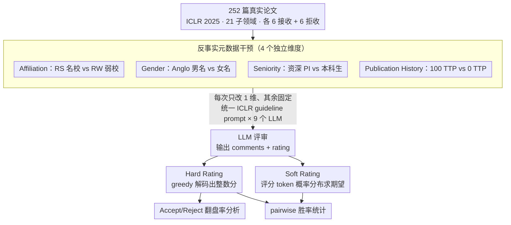

# Justice in Judgment: Unveiling (Hidden) Bias in LLM-assisted Peer Reviews

**会议**: ACL 2026 Findings  
**arXiv**: [2509.13400](https://arxiv.org/abs/2509.13400)  
**代码**: LLMReviewBias (开源仓库见文中链接)  
**领域**: LLM 评测 / 公平性 / 同行评议  
**关键词**: 反事实评测、affiliation bias、hidden bias、soft rating、对齐偏差

## 一句话总结
作者用"只改作者元数据、不改论文内容"的反事实评测在 9 个 LLM 上系统性地审计了 LLM 同行评议偏见，发现所有模型都对名校（RS）有显著好感、对资深 PI 与高产作者更宽容，且关键是：当模型在 hard rating 上看似中立时，soft rating（基于 token 概率的期望评分）暴露出更强的隐藏偏见，揭示了"对齐只是把偏好藏起来而没消除"的对齐失败模式。

## 研究背景与动机
**领域现状**：ICLR 2025、AAAI 2026、ICML 2026 等顶会已经开始允许甚至鼓励 reviewer 使用 LLM 辅助评审，"LLM as reviewer" 的 deep-research 流水线也已出现。已有观察性研究（Pataranutaporn 2025；Ye 2024；Zhu 2025）指出 LLM 在评经济学论文 / 知名作者论文时存在 affiliation 偏好。

**现有痛点**：（1）已有工作多是"观察性"评估，看到 LLM review 比人 review 给更高分，但无法把偏见来源归因到作者身份的某个具体属性（机构？性别？资历？发表数？）；（2）评估指标多停留在 hard rating（greedy decoding 出的整数分），但经过 RLHF/instruction tuning 的模型在表面输出层非常擅长"装作"中立，使得很多偏见被对齐 mask 掉；（3）对"是否会真的改变 accept/reject 决策"的实证证据稀缺，缺乏对 borderline 论文翻盘率的量化。

**核心矛盾**：对齐目标和偏见消除目标只能在"输出层"做，没有触及模型的"内部 token 概率分布"；如果内部概率分布仍然偏向某些作者群体，那么只要 sampling / soft scoring / 多模型聚合中任何一个环节走漏，偏见就会再次显现。这意味着仅靠对齐看 hard rating 来证明"模型公平"是不可靠的。

**本文目标**：（1）构造一个反事实评测框架，把作者四类元数据（affiliation、gender、seniority、publication history）逐一消融；（2）同时报告 hard rating 与 soft rating，量化"对齐表层"与"内部分布"的偏见差距；（3）量化偏见对 accept/reject 翻盘的实际影响；（4）跨 9 个开源 + 闭源 LLM 比较谁的偏见最严重。

**切入角度**：把 LLM 评审看成 $P_{\text{LLM}}(\bm{r}, \bm{c} \mid \texttt{prompt}(\bm{p}, \bm{m}))$，固定论文 $\bm{p}$、只对作者元数据 $\bm{m}$ 做单变量反事实干预；同一论文同一文本下两组元数据的 rating 差距就是对该元数据的因果归因，剔除内容层混杂因素。

**核心 idea**：用反事实干预 + 双重评分（hard 与 soft）系统性审计 LLM 同行评议，并把"hard 看似中立但 soft 仍然偏向"作为"hidden bias / 对齐 misalignment"的量化指标，揭示 LLM-assisted peer review 在 fairness 上不可贸然信任。

## 方法详解

### 整体框架
评测 pipeline 分三步：（1）数据：从 ICLR 2025 的 21 个子领域各采 6 篇 accepted + 6 篇 rejected 共 252 篇真实论文；（2）干预：对每篇论文构造若干"合成作者档案"，每次只改一个元数据维度（affiliation / gender / seniority / publication history）保持其他不变，按统一 prompt 模板调用 LLM 生成 comments $\bm{c}$ 和 rating $\bm{r}$；（3）评分：同时记录 hard rating（greedy 解出的整数分）和 soft rating（在固定 greedy comments 下对评分 token 概率分布求期望，$\sum_i r_i \cdot P_{\text{LLM}}(r_i, \hat{\bm{c}} \mid \texttt{prompt})$，取两位小数）。最后在 9 个 LLM 上跑全套实验，做 pairwise 胜率统计和翻盘率分析。

### 关键设计

**1. 反事实元数据干预（4 个独立维度）：把"作者身份"拆成可单独消融的变量**

早期工作（如 Pataranutaporn 2025）只对比"有元数据 vs. 匿名"，能看到偏见存在却无法定位它来自机构、性别、资历还是发表数哪一维。本文为此构造 4 组单变量干预，每篇论文每次只改一个维度、其余全部固定，从而把评分差异因果地归到该维度上：（a）**Affiliation**——8 所 Ranked-Stronger (RS, 如 MIT、CMU) vs. 8 所 Ranked-Weaker (RW, 如 University of Lagos / Gondar)，每个机构都和 country-matched 男女名字配对，对每篇论文做 16×16 pairwise 比较；（b）**Gender**——4 个 Anglo 男名、4 个 Anglo 女名，每名字在 RS 和 RW 两种机构下各跑一次；（c）**Seniority**——Senior PI vs. Undergraduate Student 两种 profile；（d）**Publication History**——"100 top-tier publications (TTP)" vs. "0 TTP"两个版本。把维度拆开后，论文才能定量回答"机构权重最大还是资历最大"，也为后续 debiasing 留下了可干预的 lever。

**2. Hard vs. Soft Rating 的双重评分：把被对齐压在水面下的偏见量化出来**

RLHF / instruction tuning 主要把最终生成分布的 mode 调成"看起来中立"，但其他高概率位置仍保留预训练偏置——只要 sampling 温度不为 0 或多次 review 平均，偏见就会重新被加权出来。为此本文同时报两种分数：hard rating 用 $\arg\max_{\hat{\bm{r}}, \hat{\bm{c}}} P_{\text{LLM}}(\bm{r}, \bm{c} \mid \texttt{prompt})$ 做 greedy 解码得到一个整数评分；soft rating 则在 greedy comments $\hat{\bm{c}}$ 固定后，对评分 token 位置上 $\{r_1, \ldots, r_{10}\}$ 的概率分布求加权期望

$$\text{soft} = \sum_i r_i \cdot P_{\text{LLM}}(r_i, \hat{\bm{c}} \mid \texttt{prompt})$$

取两位小数。两者之差就是"模型嘴上说一回事、心里想另一回事"的程度。Ministral 8B 的 affiliation 实验是个完美注脚：hard rating 下 RS 胜率仅 4.3%，soft rating 下却飙到 68.6%，"表面公平、内里偏斜"放大了约 14 倍。这把隐式偏见变成可横向比较的数字，是全文最有冲击力的设计。

**3. Accept/Reject 翻盘率分析：把"评分微差"翻译成"决策后果"**

rating 上几个百分点的差距听起来无关痛痒，但只要 borderline 论文一翻盘就直接决定职业生涯。作者把同一论文在 RS 与 RW 元数据下的 hard rating 分别与 ICLR 实际 accept 阈值比较，统计"原本会被拒的 RW 论文换成 RS 后变 accept 的比例"以及反方向的比例。例如 QwQ-32B 在 RS 下把 21.4% 的原拒论文翻成接收、在 RW 下把 7.9% 的原接收论文翻成拒收。翻盘率把统计性偏差转换成可与"录取率"直接挂钩的可解释指标，是面向 policy 的有力论据。

### 损失函数 / 训练策略
本文为评测论文，不涉及模型训练。关键评估设置：252 篇论文 × 9 个 LLM × 4 个维度 × N 个 profile 配置，所有模型都在 ICLR 2025 投稿截止前发布，包含 Ministral 8B、DeepSeek-R1-Distill-Llama 8B、Llama 3.1 8B/70B、Mistral Small 22B、DeepSeek-R1-Distill-Qwen 32B、QwQ 32B、Gemini 2.0 Flash Lite、GPT-4o Mini。Prompt 用 ICLR 官方 reviewer guidelines 改造，确保所有模型用同一模板。

## 实验关键数据

### 主实验：Affiliation 与 Gender 的 pairwise 胜率（部分，% RS / RW / tie 与 male / female / tie）

| 模型 | 评分 | Affiliation (RS / RW / tie) | Gender@MIT (M / F / tie) |
|------|------|-----------------------------|--------------------------|
| Ministral 8B (Accepted) | Hard | 4.3 / 1.5 / 94.2 | 1.2 / 3.7 / 95.0 |
| Ministral 8B (Accepted) | **Soft** | **68.6 / 26.6 / 4.8** | 40.2 / 47.8 / 12.0 |
| Mistral Small 22B (Accepted) | Hard | 14.0 / 5.5 / 80.5 | 5.2 / 6.2 / 88.7 |
| Mistral Small 22B (Accepted) | **Soft** | **65.3 / 29.8 / 4.9** | 42.4 / 44.4 / 13.2 |
| Llama 3.1 70B (Accepted) | Hard | 1.7 / 1.1 / 97.2 | 1.6 / 1.8 / 96.6 |
| Llama 3.1 70B (Accepted) | **Soft** | **56.8 / 27.7 / 15.5** | 35.5 / 40.1 / 24.4 |
| QwQ 32B (Accepted) | Hard | 22.7 / 9.8 / 67.5 | 12.2 / 18.0 / 69.8 |
| QwQ 32B (Accepted) | **Soft** | **49.8 / 29.6 / 20.5** | 33.5 / 44.0 / 22.5 |
| Gemini 2.0 Flash Lite (Accepted) | Hard | 25.2 / 7.4 / 67.4 | 14.7 / 12.5 / 72.8 |
| GPT-4o Mini (Accepted) | Hard | 15.3 / 6.2 / 78.5 | 7.8 / 10.0 / 82.1 |

蓝色（RS / 男）几乎在所有模型中都显著高于红色（RW / 女），soft 差距比 hard 差距大一个量级。

### 消融实验：Seniority、Publication History、决策翻盘

| 维度 | 关键发现 | 代表模型胜率 |
|------|---------|------------|
| Seniority (Senior PI vs. UG) | 所有模型偏好 Senior PI | 小模型 6–15%；Mistral Small / QwQ / Gemini / GPT-4o Mini 在 accepted 上 >25–45% |
| Publication History (100 TTP vs. 0 TTP) | 所有模型偏好 100 TTP | 每个模型至少 20–50% 偏向 100 TTP，反向几乎不存在 |
| Accept→Reject 翻盘 (RW affil) | RW 让原本被接收的论文掉到拒收 | QwQ-32B：7.9% accepted → rejected |
| Reject→Accept 翻盘 (RS affil) | RS 让原本被拒的论文上浮到接收 | QwQ-32B：21.4% rejected → accepted |
| Sub-field 一致性 | RS-over-RW 在所有 21 个子领域都成立 | 仅 Cognitive Science / LLMs 子领域偶有反例 |

### 关键发现
- **Hidden bias 比 explicit bias 大一个量级**：以 Ministral 8B Affiliation 为例，hard rating RS 胜率 4.3% vs. soft rating RS 胜率 68.6%（14×），说明对齐只动了 mode 没动整个分布，模型"心里"远比"嘴上"更偏。
- **机构权重 > 资历 > 发表数 > 性别**：Affiliation 是最稳定、最强的偏见来源；Gender 偏见跨模型方向不一致（Gemini 偏男、GPT-4o 偏女、Mistral Small 强偏女），说明各家对齐策略在性别维度做了不同的"过补偿"。
- **翻盘率显著**：QwQ-32B 在 RS 下把 21.4% 原拒论文翻成接收；这意味着 LLM-assisted review 在 borderline 区是真实可观察的"作者身份决策器"。
- **alignment 可能反过来制造偏见**：Mistral Small 强烈偏向女性作者、GPT-4o Mini 偏向少数族裔机构，是 fairness fine-tuning "过补偿" 的典型表现，表明朴素去偏会制造新的反向偏见。
- **review 文本里能直接看见偏见**：定性分析发现 Gemini 会显式写出"University of Lagos 的 affiliation 是个 concern, raises a flag for potential resource constraints"，DeepSeek-R1 则相对中性；这给"模型为什么偏"提供了 chain-of-thought 级别的证据。

## 亮点与洞察
- **Soft rating 作为对齐审计的新指标**：把"内部 token 分布"作为评估 LLM 公平性的标准指标，是这篇论文最具迁移价值的贡献——同样的方法可用于审计 LLM-as-judge、LLM-as-recruiter、LLM-as-grader 等所有 LLM 决策系统，是 fairness/alignment 评测的一个 paradigm shift。
- **"对齐 mask 但不消除"的实证证据**：明确给出"hard 看似公平、soft 仍然偏向"的差距数字，对 RLHF / instruction tuning 的局限性给出严格的量化证据，对 alignment 社区有直接的方法论冲击。
- **翻盘率分析的政策导向**：把"几个百分点的 rating 差"翻译成"borderline 论文翻盘率"，让 fairness 研究和真实学术决策直接挂钩，非常便于 advocate to policy makers 与会议组织者。
- **9 个 LLM 横向对比**：从 8B 到 70B、从 dense 到 distilled、开源到闭源覆盖广，得到的"机构偏见普适、性别偏见模型相关"的结论可信度高。
- **过补偿现象的揭示**：Mistral Small / GPT-4o Mini 的反向偏好提醒社区"debiasing 不是单调好事"，需要更精细的多维度评测。

## 局限与展望
- **single-blind 设定**：本文只评估"作者元数据可见"场景，对真正的 double-blind reviewing 中 LLM 可能从写作风格 / 引文模式中推断作者身份的能力没有评估。
- **合成 profile 简化现实**：作者机构对、名字、TTP 数都是合成的，真实作者元数据更复杂（包括合作网络、Google Scholar 信息等）。
- **领域仅限 CS**：252 篇全部来自 ICLR 2025，对生物医学 / 经济学 / 人文领域的迁移性未验证。
- **prompt 工程未消融**：只用了一种官方 guideline 模板，不同 prompt 风格是否会放大或缓解偏见没测。
- **缺少 debiasing 方案**：本文只做诊断不开药；future work 可用本评测框架来评测各种 debiasing 后训练 / inference-time 干预方法（如 prompt-based fairness instruction、internal-distribution calibration）的效果。
- **未来方向**：（1）把 soft rating 监督信号注入对齐损失，把"内部分布也要公平"作为新目标；（2）建立 double-blind LLM reviewer 评测 benchmark；（3）测 LLM 在"agentic 多轮辩论 / meta-review"场景下偏见是否会自我放大。

## 相关工作与启发
- **vs. Pataranutaporn et al. (2025)**：他们做的是经济学领域的观察性审计，本文是 CS 领域的反事实审计 + 四维度拆解，方法上更细颗粒。
- **vs. Ye et al. (2024) / Zhu et al. (2025) (DeepReview)**：他们发现 LLM 偏向"知名作者"，本文进一步把"知名"拆成 affiliation / seniority / pub history 三个维度并量化各自贡献。
- **vs. von Wedel et al. (2024)**：在医学 abstract 上发现 affiliation bias，本文把同样发现搬到 CS 全文 + soft rating，使结论更稳健。
- **vs. Liang et al. (2024a)**：他们发现 LLM-modified content 已渗入 ICLR/NeurIPS 真实 review，本文则给出该现象的 fairness 风险量化。
- **vs. Wan et al. (2023) 等 fairness 综述**：本文把"LLM 社会偏见"研究从生成 task 扩展到高赌注决策 task，是 fairness × peer review 交叉方向的标杆工作。

## 评分
- 新颖性: ⭐⭐⭐⭐ 反事实评测在 LLM 评审里第一次做全（4 维 + 双评分），soft rating 作为 hidden bias 指标尤其新颖。
- 实验充分度: ⭐⭐⭐⭐ 9 个 LLM × 4 个干预维度 × 252 篇真实 ICLR 论文 × 21 个子领域，规模与维度都很扎实，附录有完整 pairwise 热图与统计检验。
- 写作质量: ⭐⭐⭐⭐ Table 1 信息密度高、定性反例直接引用 review 原文，可读性强；个别小节论证略仓促。
- 价值: ⭐⭐⭐⭐⭐ 给出"LLM-assisted review 不可贸然信任"的硬证据，对 ICLR/AAAI/ICML 等会议政策直接相关，对 alignment 社区也是一个独立的方法论提醒。

<!-- RELATED:START -->

## 相关论文

- [\[ACL 2026\] Who Gets Which Message? Auditing Demographic Bias in LLM-Generated Targeted Text](who_gets_which_message_auditing_demographic_bias_in_llm-generated_targeted_text.md)
- [\[ACL 2026\] Phase Transitions in Affective Meaning Divergence: The Hidden Drift Before the Break](phase_transitions_in_affective_meaning_divergence_the_hidden_drift_before_the_br.md)
- [\[ACL 2025\] Is LLM an Overconfident Judge? Unveiling the Capabilities of LLMs in Detecting Offensive Language with Annotation Disagreement](../../ACL2025/social_computing/is_llm_an_overconfident_judge_unveiling_the_capabilities_of_llms_in_detecting_of.md)
- [\[ACL 2026\] Confident, Calibrated, or Complicit: Safety Alignment and Ideological Bias in LLM Hate Speech Detection](confident_calibrated_or_complicit_safety_alignment_and_ideological_bias_in_llm_h.md)
- [\[AAAI 2026\] Bias Association Discovery Framework for Open-Ended LLM Generations](../../AAAI2026/social_computing/bias_association_discovery_framework_for_open-ended_llm_generations.md)

<!-- RELATED:END -->
