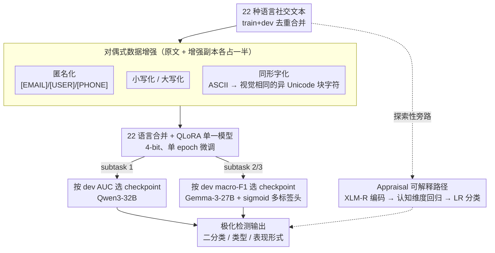

# mdok-style at SemEval-2026 Task 9: Finetuning LLMs for Multilingual Polarization Detection

**会议**: ACL 2026 (SemEval-2026 Task 9 system paper)  
**arXiv**: [2605.02695](https://arxiv.org/abs/2605.02695)  
**代码**: https://github.com/kinit-sk/mdok-style-polar2026  
**领域**: 多语言 NLP / 文本分类 / SemEval 系统论文  
**关键词**: 极化检测, 多语言, QLoRA, 数据增强, 同形字攻击

## 一句话总结
将原本用于多语言机器生成文本检测的 mdok 系统（QLoRA 微调 Qwen3-32B / Gemma-3-27B）迁移到 SemEval-2026 Task 9 多语言极化检测，并叠加匿名化、大小写、同形字四种数据增强，在 22 种语言上跑出比官方 baseline 平均高 3–4% Macro-F1 的结果。

## 研究背景与动机
**领域现状**：在线极化（polarization）是仇恨言论与社会分裂的前奏，自动检测是缓解的关键。SemEval-2026 Task 9 (POLAR) 把它拆成三个子任务：subtask 1 二分类（是否极化）、subtask 2 极化类型（政治 / 种族 / 宗教 / 性别 / 其他）、subtask 3 极化表现形式（刻板印象 / 妖魔化 / 去人化 / 极端语言 / 缺乏共情 / 否定），全部覆盖 22 种语言（包含阿姆哈拉、豪萨、奥里亚等大量低资源语言）。

**现有痛点**：22 种语言里大量低资源语言训练数据少且类别不均衡，BERT-like 小模型既扛不住低资源也扛不住跨语言迁移；同时社交媒体文本充斥大小写混乱、表情符号、@用户名、电话邮箱等噪声，以及恶意混淆者会用**同形字攻击**（用视觉相似但属于不同 Unicode 块的字符替换 ASCII）打断 tokenizer 让分类器失效。

**核心矛盾**：(1) 想用一个统一模型覆盖 22 种语言以共享低资源语言信号，但模型必须足够大以承载多语言；(2) 想要鲁棒于视觉混淆，但训练数据里几乎没有这类样本。

**本文目标**：把作者团队在 PAN@CLEF 2025 机器生成文本检测拿下双 1st 的 mdok 流水线（QLoRA 微调中型多语言 LLM + 鲁棒性增强）原封不动迁移到极化检测，验证「鲁棒检测器是任务无关的工具箱」这一假设。

**切入角度**：作者注意到极化检测与机器生成文本检测在表面上不同，但底层都是"对短文本做鲁棒序列分类"，鲁棒性技巧（尤其是同形字防御）应该可以迁移。

**核心 idea**：mdok 范式 = QLoRA 4-bit 微调 27–32B 多语言 LLM + 四种"对偶式"文本增强（原文 + 增强版本各占训练集一半），将 22 种语言数据合并训练以增强跨语言迁移。

## 方法详解

### 整体框架
系统输入是任意语言的一段社交媒体文本，输出是 subtask 1 的二分类 logit / subtask 2 多标签极化类型 / subtask 3 多标签表现形式。整条流水线分四步：(1) 对 22 种语言的 train+dev 集去重合并；(2) 对每条文本做四种数据增强（匿名化、小写化、大写化、同形字化），将训练集扩大 ~20%；(3) 用 QLoRA 在合并后的多语言数据上单 epoch 微调；(4) 按 validation 上的 AUC (subtask 1) 或 macro-F1 (subtask 2/3) 选最佳 checkpoint。subtask 1 选定 Qwen3-32B 为 backbone（支持 100+ 语言），subtask 2/3 因 Qwen3 在 multi-label 头训练上不稳定，改用 Gemma-3-27B-pt（支持 140+ 语言）。此外作者还探索了一条与主系统平行的 appraisal 可解释旁路。

### 关键设计

**1. 对偶式数据增强：把对抗扰动当训练正则，逼模型学语义不变性**

社交媒体文本充斥大小写混乱、@用户名、邮箱电话等噪声，更棘手的是恶意混淆者会用同形字攻击替换 ASCII 字符——这会让 BPE/SentencePiece tokenizer 把同一个词切成完全不同的子词序列，直接打断分类器。作者的做法是在不引入任何外部数据的前提下，对每条原始训练样本 $x$ 生成一份增强副本 $T(x)$，把 $(x, y)$ 和 $(T(x), y)$ 都喂给模型，再用全局去重剔除与原文完全相同的副本。四种 $T$ 分别是：(a) **匿名化**——用 `[EMAIL]/[USER]/[PHONE]` 替换识别出的个人信息，削弱对特定用户名的过拟合；(b) **小写化**；(c) **大写化**；(d) **同形字化**——把部分 ASCII 字符替换成视觉相同但属于不同 Unicode 块的字符（如用希腊小写 a 替拉丁 a）。subtask 1 中四种增强各加 5%，合计把训练集扩大 20%。

关键在于同形字攻击在作者上一篇机器生成文本检测工作里就是干扰最强的对抗策略，所以这里不把它留到测试时再做 Unicode 归一化（那会丢掉对抗者使用的视觉信号），而是直接当成训练时正则项：模型在训练中反复看到"被替换字符的词其实还是同一个词"，于是一次训练同时拿到鲁棒性和表面稳健性，且推理时零额外开销。

**2. 22 语言合并 + QLoRA 单一模型：用模型规模消化跨语言迁移**

22 种语言里大量低资源语言（如 Hausa、Khmer）单语样本根本不足以微调一个 32B 模型，传统做法是为每种语言训一个分类头，但这样低资源语言彼此孤立、无法共享极化信号。本文反其道而行，把所有语言的训练数据按行混合成一个池子，用 4-bit QLoRA 微调单个 base LLM：learning rate 取常数 $2 \times 10^{-5}$、warmup ratio 0.03、paged AdamW、batch size = 1，每 500 步在均衡采样的 4400 条 dev 集上验证，单 epoch 训完（防止过拟合到表面线索）。subtask 2/3 是多标签任务，把 LM head 换成 sigmoid 多输出头并配 BCE 损失。

合并训练既让模型暴露在更多极化样本里，又强迫它学习"任务而非语言"的表示。之所以敢这么无脑合并、省掉 cross-lingual loss 或 adapter，是因为选用的 Qwen3-32B（subtask 1）和 Gemma-3-27B-pt（subtask 2/3，Qwen3 在多标签头上训练不稳定故换用）都原生支持 100+/140+ 语言，跨语言对齐已经内建在 backbone 里。

**3. Appraisal 标注作为可解释替代路径（探索性）：用认知维度解释"为什么极化"**

在主系统之外，作者探索了一条轻量级旁路：把情感的认知 appraisal 维度（愉悦度、可预测性、可控性、对自己/他人的后果、价值观对齐等）当作极化特征。具体用 XLM-Roberta 编码文本，接一个多任务回归头同时预测 5 个二元 appraisal 维度 + 4 个事件描述维度，损失是 MSE + BCE 的加权和（架构改自 AppraisePLM）；再用 LogisticRegression（默认超参，random state 42，80/20 切分）按 appraisal 特征做极化分类，每种语言独立训一个。

这条路的价值在于可解释性——appraisal 是显式的认知信号，能说出"这段话为什么是极化的"。虽然单独看 macro-F1 接近随机，但每个 label 的 AUC（threshold-independent）普遍 >0.65，说明 appraisal 确实捕捉到了与极化相关的判别力，提示未来可以把它作为额外特征融进主模型。

### 损失函数 / 训练策略
subtask 1 用标准 cross-entropy；subtask 2/3 用 BCE-with-logits 处理 multi-label。QLoRA 4-bit 量化通过 bitsandbytes 加载 base 模型权重，LoRA adapter 在所有 attention/MLP 投影上，全程单 epoch（防止过拟合到表面线索）。checkpoint 选择：subtask 1 按 dev AUC，subtask 2/3 按 dev macro-F1。

## 实验关键数据

### 主实验（提交系统在 22 种语言上的 Macro-F1，与官方 baseline 差值）

| 语言 (subset) | Subtask 1 | Subtask 2 | Subtask 3 | 相对 baseline (S1/S2/S3) |
|---|---|---|---|---|
| zho (中文) | 0.9237 | 0.8199 | 0.4912 | +0.055 / +0.150 / +0.491 |
| nep (尼泊尔语) | 0.8915 | 0.8026 | 0.5669 | +0.012 / +0.081 / +0.436 |
| tel (泰卢固语) | 0.8818 | 0.2573 | 0.2143 | +0.238 / -0.057 / -0.460 |
| mya (缅甸语) | 0.8788 | 0.6835 | — | +0.058 / +0.206 / — |
| ben (孟加拉语) | 0.8415 | 0.3050 | 0.1272 | -0.011 / +0.016 / +0.040 |
| eng (英语) | 0.8058 | 0.4519 | 0.3697 | +0.026 / +0.119 / -0.040 |
| hau (豪萨语) | 0.7401 | 0.1689 | 0.0000 | -0.035 / -0.035 / -0.746 |
| khm (高棉语) | 0.6293 | 0.6323 | 0.2482 | -0.030 / +0.005 / -0.361 |
| amh (阿姆哈拉语) | 0.6619 | 0.5116 | 0.4310 | -0.053 / +0.140 / -0.012 |
| **22 语言平均 vs baseline** | **+0.033** | **+0.043** | **−0.001** | — |

整体在 subtask 1 / 2 都比 baseline 平均高 3–4%，在 subtask 3 持平（被 Hausa 的 0.0 严重拖累）。Rank percentile 看，22×3=62 个子任务中有 14 个进入 top-20%、28 个进入 top-50%，意大利语 subtask 1 拿到全场第 1，尼泊尔语 subtask 2 第 3，乌尔都语 subtask 3 第 4。

### 消融 / 分析（按 label 拆解的细粒度性能，节选）

| 子任务 / 类别 | 中文 zho | 英语 eng | 印地语 hin | 平均最难类别 |
|---|---|---|---|---|
| S2 政治 | 0.8571 | 0.8014 | 0.8019 | 政治类整体可达 0.74+ |
| S2 宗教 | 0.9651 | 0.7535 | 0.9214 | 宗教最易区分 |
| S2 "其他"杂类 | 0.8294 | 0.5194 | 0.6536 | **最难** (平均 ~0.58) |
| S3 妖魔化 (vilification) | 0.8696 | 0.7821 | 0.7407 | — |
| S3 去人化 (dehumanization) | 0.7958 | 0.5391 | 0.7130 | **最难之一** |
| S3 缺乏共情 (lack of empathy) | 0.5491 | 0.5742 | 0.6554 | **最难** (均值最低) |
| S3 否定 (invalidation) | 0.5937 | 0.4894 | 0.7480 | 第二难 |

### 关键发现
- **子任务难度差异巨大**：subtask 1 平均 ~0.79，subtask 2 ~0.53，subtask 3 ~0.36；multi-label 是主要 bottleneck，原 mdok 是为二分类 tuning 的，简单换头并不够。
- **类别"其他"是 subtask 2 的死穴**（平均最低 ~0.58），因为它是垃圾桶类（凡是不属于政治/种族/宗教/性别的都丢进来），语义最不一致；类似地 subtask 3 的「dehumanization / lack of empathy / invalidation」最难，与 vilification / 极端语言这类有显式词汇标志的类别拉开明显差距。
- **语言差异显著**：中文、尼泊尔语、缅甸语整体最好（>0.85 in S1）；阿姆哈拉、豪萨、高棉最差（<0.67）。作者指出豪萨 subtask 3 的 0.0 是因为合并训练让模型完全把 Hausa 当成 outlier。
- **Appraisal 路径虽 Macro-F1 接近随机，但 per-label AUC 普遍 >0.65**（例如中文 vilification 0.7896、英语 invalidation 0.6667），意味着 appraisal 信号确实捕捉到了与极化相关的认知线索，融合到主模型有潜力。

## 亮点与洞察
- **同形字攻击当训练增强**是个被低估的小 trick：与其在测试时部署 Unicode 归一化（会丢失对抗者使用的视觉信号），不如直接训模型识别"被替换字符"也是同一个词，一次训练同时获得**鲁棒性 + 表面不变性**，零额外推理开销。
- **"任务-语言 trade-off"被 27–32B 模型规模消化掉了**：当模型足够大、原生支持 100+ 语言时，22 种语言数据可以无脑合并训练而无需 cross-lingual loss / adapter；这反过来说明对低资源任务，"扩 backbone 比加 trick"可能性价比更高。
- **从机器生成文本检测到极化检测的 zero-effort 迁移**是这篇 system paper 最有教育意义的地方：它把 mdok 当成"工具"而非"模型"，证明鲁棒序列分类 pipeline 本身是任务无关的。

## 局限与展望
- 作者承认只试了少数 base 模型，可能对某些低资源语言有更优选择；且训练只用了官方 train+dev，未引入外部多语言极化数据。
- 我看到的几个限制：(1) 22 语言合并实际上对极低资源语言（Hausa / Khmer）有负迁移，"为每个语言族单独 fine-tune"可能是后续方向，作者也明确提到了；(2) subtask 3 的 multi-label 头几乎没做专门设计，建议加 label-correlation 建模（如 Asymmetric Loss / Tail-aware sampling）；(3) appraisal 路径与主系统是平行的而非融合的，融合实验缺失。
- 改进方向：把 appraisal 当成 auxiliary head 与主分类头多任务联合训练；同形字增强可以扩展到 emoji / 重复字符等社交媒体噪声；引入 self-training 利用未标注的多语言社交文本。

## 相关工作与启发
- **vs 传统 BERT/XLM-R 微调**：作者在 SemEval-2024 Task 8 已经验证 7B LLM > BERT-like 小模型；本文进一步推到 27–32B，且强调"PEFT (QLoRA) 把成本拉到可承受"，对中型实验室是个示范。
- **vs 单语言独立分类器**：传统多语言比赛常常每个语言训一个，本文证明在大模型时代统一模型可行，且对中文/印地语等中资源语言效果更佳；但低资源语言确实会被牺牲。
- **vs 数据增强工作**：相比 EDA / back-translation，对偶式增强（原文 + 增强副本 + 全局去重）更轻量，且同形字攻击是文本鲁棒性社区里少见的训练侧用法。

## 评分
- 新颖性: ⭐⭐☆☆☆ 主要贡献是迁移已有 mdok pipeline 到新任务，技术创新有限，但同形字训练增强 + 22 语言合并是实用 trick。
- 实验充分度: ⭐⭐⭐☆☆ 22 语言 × 3 subtask 完整跑出，per-label 细粒度分析齐全；但缺少消融（同形字 / 匿名化各自的贡献未单独验证）。
- 写作质量: ⭐⭐⭐☆☆ system paper 标准写法，方法清晰但缺失关键细节（LoRA rank、目标模块等）。
- 价值: ⭐⭐⭐☆☆ 对参加 SemEval / 做多语言文本分类的工程团队有直接复用价值；学术上贡献有限。

<!-- RELATED:START -->

## 相关论文

- [\[ACL 2026\] YEZE at SemEval-2026 Task 9: Detecting Multilingual, Multicultural and Multievent Online Polarization via Heterogeneous Ensembling](yeze_at_semeval-2026_task_9_detecting_multilingual_multicultural_and_multievent_.md)
- [\[ACL 2026\] BITS Pilani at SemEval-2026 Task 9: Structured Supervised Fine-Tuning with DPO Refinement for Polarization Detection](bits_pilani_at_semeval-2026_task_9_structured_supervised_fine-tuning_with_dpo_re.md)
- [\[ACL 2026\] PSK@EEUCA 2026: Fine-Tuning Large Language Models with Synthetic Data Augmentation for Multi-Class Toxicity Detection in Gaming Chat](pskeeuca_2026_fine-tuning_large_language_models_with_synthetic_data_augmentation.md)
- [\[ACL 2026\] Investigating Counterfactual Unfairness in LLMs towards Identities through Humor](investigating_counterfactual_unfairness_in_llms_towards_identities_through_humor.md)
- [\[ACL 2026\] To Lie or Not to Lie? Investigating The Biased Spread of Global Lies by LLMs](to_lie_or_not_to_lie_investigating_the_biased_spread_of_global_lies_by_llms.md)

<!-- RELATED:END -->
