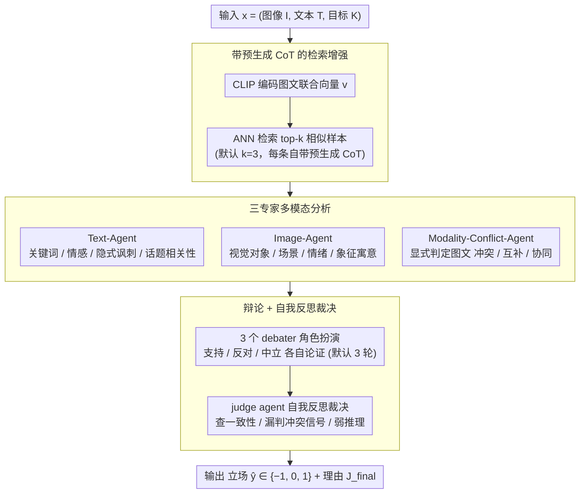

# MM-StanceDet: Retrieval-Augmented Multi-modal Multi-agent Stance Detection

**会议**: ACL 2026  
**arXiv**: [2604.27934](https://arxiv.org/abs/2604.27934)  
**代码**: https://github.com/luweihai/MM-StanceDet  
**领域**: 多模态立场检测 / Multi-agent / RAG  
**关键词**: 多模态立场检测、检索增强、多智能体辩论、自我反思、跨模态冲突

## 一句话总结
作者把多模态立场检测重构成一个 4 阶段 multi-agent pipeline——CLIP 检索相似样本提供 few-shot CoT、文本/图像/跨模态冲突 3 个专家 agent 各自分析、3 个立场（支持/反对/中立）的 debater agent 互相辩论、最后一个 adjudicator agent 做 self-reflection 出最终标签，5 个数据集上 in-target 和 zero-shot 都超过包括 GPT-4V、TMPT、MV-Debate 在内的强 baseline。

## 研究背景与动机

**领域现状**：立场检测从纯文本（BERT/RoBERTa）发展到多模态（MSD），现有工作主要分两类——(1) 简单融合 BERT+ViT 等独立编码器特征；(2) 用 prompt tuning（TMPT）适配预训练 VLM 抓取立场特征。最近直接用 GPT-4V / Qwen-VL 这类 MLLM 当 zero-shot judge 也成为新方向。

**现有痛点**：作者总结三个核心瓶颈——(1) **Contextual Grounding Void**：MLLM 缺少领域内 concrete 样本时容易误判 nuanced 多模态信号；(2) **Cross-Modal Interpretation Ambiguity**：当 image 和 text 信号冲突或互补时，MLLM 经常 hallucinate 或忽略冲突，Zhang et al. 2024c 已实证 GPT-4V 在 cross-modal consistency 上有显著缺陷；(3) **Single-Pass Reasoning Fragility**：直接 single-shot prompt LLM 给立场，没有结构化探索 alternative interpretation 的过程，错就一错到底。

**核心矛盾**：单模型 single-pass 的"emergent reasoning"在简单场景下能 work，但碰到 sarcasm、conflict、cross-modal nuance 时容错率低；要稳定就必须把"分析—辩论—反思"这种人类决策过程显式建模出来。

**本文目标**：在不 fine-tune 任何模型的前提下，构造一个仅靠 prompt 编排就能稳定处理冲突多模态信号的 stance detection 框架。

**切入角度**：把 RAG（提供 concrete 示例）+ specialized agent（专攻每种 modality）+ debate（强制探索三种立场）+ self-reflection（防止 single-pass 错误）四件套组合起来，每个组件各治一个痛点。

**核心 idea**：用 multi-agent + RAG + debate + reflection 的 4-stage 流水线把"立场判断"从 single-shot 决策变成结构化推理过程。

## 方法详解

### 整体框架
MM-StanceDet 对每条输入 $x = (I, T, K)$（image / text / target）按 4 个阶段串行：(1) **Retrieval Augmentation** 从向量库 $\mathcal{D}$ 检索 top-$k$ 相似样本及其预生成的 CoT；(2) **Multimodal Analysis** 由 Text-Agent / Image-Agent / Modality-Conflict-Agent 三个专家分别输出 $A_\text{text}$、$A_\text{image}$、$A_\text{conflict}$；(3) **Reasoning-Enhanced Debate** 三个 debater agent（支持/反对/中立）各拿到所有分析，分别构造支持本立场的 argument；(4) **Self-Reflection and Adjudication** 一个 judge agent 综合三方 argument + 原始分析 + critical reflection 给出最终 $\hat{y} \in \{-1, 0, 1\}$ 和 justification $J_\text{final}$。所有 agent 默认用 GPT-4o-mini，检索用 CLIP encoder + ANN，默认 $k=3$、debate 3 轮。

### 关键设计

**1. 带预生成 CoT 的检索增强：让被检索样本不只给"类似情境"还给"如何推理"**

这一步针对的是 grounding void——MLLM 缺少领域内具体样本时容易在 nuanced 多模态信号上误判。作者先用 CLIP 把训练集每条样本 $(I_j, T_j)$ 编码成单一图文联合向量 $\mathbf{v}_j$ 放进向量库，每条 entry 除了标注 $y_j$，还存一段离线由 MLLM 生成的 CoT 推理 $C_j$（解释"为什么这个样本是这个立场，重点看 image-text alignment 和与 target 的关系"）。推理时把 query 用同样方式编码成 $\mathbf{v}$，做 ANN 检索 $\mathcal{E}_\text{retrieved} = \text{ANN}(\mathbf{v}, \mathcal{D}, k)$（默认 $k=3$）。

它和传统 RAG 的区别在于：普通 RAG 只检 raw text/example，这里 entry 自带 CoT，相当于把"如何推理这个 case"的范式也作为知识一并传给下游；用 CLIP 图文联合 embedding 检索则同时利用两个模态，比单纯文本相似度更贴近"多模态情境相似"。

**2. 三专家多模态分析：把单一 MLLM 的"一口气全看"拆成三个互补视角**

single-shot MLLM 把文本、图像、跨模态关系全塞进一个 prompt，信息互相干扰且容易漏掉冲突信号。作者改成三个各管一类任务的 agent：Text-Agent $\mathcal{A}_\text{text}(T, K) \to A_\text{text}$ 抽关键词、情感极性、隐式讽刺、对 target $K$ 的话题相关性；Image-Agent $\mathcal{A}_\text{image}(I, K) \to A_\text{image}$ 描述视觉对象、scene context、人物情绪、配色寓意与 symbolic 元素；Modality-Conflict-Agent $\mathcal{A}_\text{conflict}(I, T, K, \mathcal{E}_\text{retrieved}) \to A_\text{conflict}$ 专门判断图文是冲突 / 互补 / 协同，并显式对照检索来的 CoT 样本做推理。

每个 agent 只承担一类任务避免了 prompt overload，而真正的核心是 Modality-Conflict-Agent——它把"图文是否一致"从一个隐式假设变成显式产出物 $A_\text{conflict}$ 交给下游，使框架能稳定捕捉 sarcasm、反讽这类 cross-modal 不一致的场景，而不是像 single-pass 那样直接忽略或 hallucinate 掉冲突。

**3. 辩论 + 自我反思裁决：用三方角色扮演强制探索所有立场，再用反思抓隐藏缺陷**

single-pass 推理一旦在高 confidence 的错误立场上起步就会一错到底。作者让 3 个 debater agent 分别扮演 support / oppose / neutral，各自拿到全部分析后构造 $\text{Arg}_s = \mathcal{A}_s(I, T, K, A_\text{text}, A_\text{image}, A_\text{conflict})$ 来论证为何立场应是 $s$，默认辩论 3 轮。最后的 judge agent 不是简单挑最强 argument，而是借鉴 Self-Refine / Reflexion 做 critical self-assessment——主动检查每个 argument 的内部一致性、有没有漏掉 $A_\text{conflict}$ 的关键信号、有没有 weak reasoning，输出 $\hat{y}, J_\text{final} = \mathcal{A}_\text{judge}(\text{Arg}_\text{support}, \text{Arg}_\text{oppose}, \text{Arg}_\text{neutral}, x, A_\text{text}, A_\text{image}, A_\text{conflict})$。

强制三方辩论让模型必须把每个立场都论证一遍，避免"一条道走到黑"；self-reflection 是最后一道安全网，让 judge 跳出"最具说服力 ≠ 最准确"的陷阱——因为说服力本身可能来自 hallucinated reasoning。

### 损失函数 / 训练策略
全 prompt-based 框架，**完全不训练任何模型**，只调编排（agent prompt 设计 + 检索参数 + debate 轮数）。所有 agent 共用同一个 LLM backbone（默认 GPT-4o-mini，鲁棒性实验也跑了其他 MLLM 都 work）。

## 实验关键数据

### 主实验：In-target Macro F1 (%) 节选（5 datasets × 12 targets）

| 方法 | MTSE-DT | MWTWT-AC | MWTWT-AH | MRUC-RUS | MRUC-UKR | MTWQ-MOC |
|------|---------|----------|----------|----------|----------|----------|
| BERT | 48.25 | 63.05 | 59.24 | 41.25 | 46.80 | 57.77 |
| TMPT | 55.41 | 67.25 | 62.92 | 43.56 | 59.24 | 55.68 |
| GPT-4 + CoT | 69.12 | 70.10 | 72.05 | 42.03 | 54.21 | 58.48 |
| GPT-4 Vision | 70.46 | 57.47 | 57.90 | 44.83 | 56.42 | 66.72 |
| MV-Debate | 69.45 | 69.87 | 72.31 | 41.89 | 54.55 | 58.71 |
| BridgeTower | 68.53 | 67.92 | 65.44 | 43.26 | 58.19 | 68.06 |
| **MM-StanceDet** | **70.12** | **71.93** | 66.50 | **48.34** | **64.02** | **68.13** |

Zero-shot 提升更显著：MTSE-DT 上 GPT-4V 72.68 → MM-StanceDet 71.03（持平最强基线），MRUC-RUS 上从 GPT-4V 的 42.09 提升到 45.37（+3.3），MRUC-UKR 从 GPT-4V 的 47.00 提升到 55.25（+8.2）。

### 消融 + agent 贡献分析

| 配置 | MTSE-DT | MWTWT-AC |
|------|---------|----------|
| Text Analysis Agent only | 67.52 | 63.30 |
| Image Analysis Agent only | 42.34 | 57.09 |
| Modality Conflict Agent only | 55.10 | 63.51 |
| Text + Image Analysis | 68.91 | 68.37 |
| Full MM-StanceDet | **70.12** | **71.93** |
| w/o Retrieval Augmentation (RA) | 显著下降 | 显著下降 |
| w/o Multimodal Analysis (MA) | **最大下降** | **最大下降** |
| w/o Reasoning-Enhanced Debate (RED) | 中等下降 | 中等下降 |
| w/o Self-Reflection (SRA) | 较小下降 | 较小下降 |

检索噪声鲁棒性：把 top-3 检索里 50% 替换成随机样本，MTSE-DT 仅从 70.12 → 68.92（-1.2），证明 debate + reflection 能软化噪声影响。

### 关键发现
- **Multimodal Analysis 是最大功臣**：去掉 MA 阶段掉点最多，说明"专家分工"比"让 single LLM 一口气看完所有 modality"显著更强；其中 Modality-Conflict-Agent 单独表现一般（55.10）但加进 full model 能补足前两个 agent 漏的 cross-modal nuance。
- **Retrieval Augmentation 抗噪能力强**：50% 检索 noise 才掉 1.2 个 F1 点，归因于 debate 阶段会主动质疑检索来的样本是否真的相关，self-reflection 还会再筛一次。
- **Zero-shot 上的优势更显著**：MRUC-UKR 上比最强 baseline GPT-4V +8.2 点，说明结构化 reasoning 在 OOD / 低资源场景下尤其有用。
- **数据小且多模态冲突高的数据集收益最大**：MRUC 多模态冲突率 15%（5 数据集最高）+ 样本量小，MM-StanceDet 提升最显著；MWTWT 冲突率仅 9% + 数据量大，提升空间被 TMPT 等 SFT 方法挤压。
- **跨 backbone 通用**：换不同 MLLM backbone 框架性能一致优，说明 multi-agent 编排本身有效，不是某一个模型的偶然 trick。

## 亮点与洞察
- **"每个组件治一种痛点"映射清晰**：RA 治 grounding void、MA 治 modality ambiguity、Debate+Reflection 治 single-pass fragility——这种"problem-driven 模块化"让方法解释起来非常顺，也方便后续工作针对单点优化。
- **预生成 CoT 当检索增强单元**：传统 RAG 只检 raw text/example，这里 entry 自带 CoT 推理样板，相当于把"如何推理这个 case"也作为知识传递，类似"分析师笔记 + 案件卷宗"——这个思路在所有需要复杂判断的 task（医学诊断、法律判决）都能复用。
- **Modality-Conflict-Agent 显式产出冲突信号**：把"图文是否一致"做成 first-class 输出而非隐式判断，使下游 debate / adjudicator 可以围绕这个信号显式推理；这对 fake news detection、meme understanding 也是直接可迁的设计。
- **3 轮 debate 是甜点**：超过 3 轮收益递减但成本翻倍，作者用 sensitivity 分析直接给了"3 是最优"的实证结论，工程友好。

## 局限与展望
- 作者承认：(1) 4 阶段 × multi-agent 推理每条样本约 4.8K tokens + 27 秒延迟，不适合 real-time，只适合离线 moderation / 舆情分析；(2) 强依赖 backbone LLM，若 backbone 本身有幻觉偏见会渗透到最终判断；(3) 检索效果依赖 vector DB 质量，小语种或新领域很难维护高质 CoT 库。
- 个人观察：debate 阶段的 3 个 agent 共用同一 backbone，可能存在 echo chamber——三方论证表面对抗但都受同一模型先验影响；用不同模型扮演不同 debater 可能更鲁棒。self-reflection 的 critic 也是同一个模型 self-evaluate，理论上存在 self-bias。
- 改进思路：把 retrieval 替换成 mixture（CoT-retrieval + counterfactual sample 同时检索）；引入 process reward model 给每个 agent 输出实时打分，而非全靠 judge 最后定夺。

## 相关工作与启发
- **vs TMPT**：TMPT 走 prompt tuning 适配预训练 VLM，需要训练参数；MM-StanceDet 完全 training-free 且大幅度超过 TMPT（MTSE-DT 70.12 vs 55.41）。
- **vs GPT-4 Vision + CoT**：单 MLLM 加 CoT 在 in-target 接近本文，但 zero-shot 上掉得多（MWTWT 上 GPT-4V 普遍 < 50）；说明 single-pass 即使带 CoT 也不够，结构化辩论 + 反思才能真正稳。
- **vs MV-Debate**：MV-Debate 是 multi-view debate 但只处理文本，没法看图；本文证明 debate 框架结合多模态分析能产生显著增量。
- **vs Liu et al. 2024 Teller**：Teller 用 logic-based dual-system 做 fake news 也是 multi-agent 但只用文本；MM-StanceDet 的 Modality-Conflict-Agent 是其多模态扩展的关键。
- **启发**：所有需要"判断跨模态信号一致性"的任务（fake news、meme understanding、sentiment）都可以套这个 4-stage 模板，把"检索证据 + 多专家分析 + 辩论 + 反思"作为通用 protocol；27 秒的延迟换稳定性，对很多离线分析场景是值得的 trade-off。

## 评分
- 新颖性: ⭐⭐⭐ multi-agent + RAG + debate + reflection 单点都不算新（都有先例），组合应用到 MSD 有一定创新；Modality-Conflict-Agent 是最有特色的细节。
- 实验充分度: ⭐⭐⭐⭐ 5 数据集 × in-target/zero-shot + ablation + agent contribution + retrieval noise + backbone sensitivity，覆盖比较完整。
- 写作质量: ⭐⭐⭐⭐ 痛点—设计—实验的对应关系写得很清晰；附录里加了 conflict rate 分析很到位。
- 价值: ⭐⭐⭐⭐ 给 MSD 一个 training-free 强 baseline，且每个组件都开源；对舆情监控、内容审核等场景直接可用。

<!-- RELATED:START -->

## 相关论文

- [\[AAAI 2026\] Cross-modal Prompting for Balanced Incomplete Multi-modal Emotion Recognition](../../AAAI2026/social_computing/cross-modal_prompting_for_balanced_incomplete_multi-modal_emotion_recognition.md)
- [\[ICML 2026\] MIND: Multi-Rationale Integrated Discriminative Reasoning Framework for Multi-Modal Fake News](../../ICML2026/social_computing/mind_multi-rationale_integrated_discriminative_reasoning_framework_for_multi-mod.md)
- [\[AAAI 2026\] Multi-modal Dynamic Proxy Learning for Personalized Multiple Clustering](../../AAAI2026/social_computing/multi-modal_dynamic_proxy_learning_for_personalized_multiple_clustering.md)
- [\[AAAI 2026\] T2Agent: A Tool-augmented Multimodal Misinformation Detection Agent with Monte Carlo Tree Search](../../AAAI2026/social_computing/t2agent_a_tool-augmented_multimodal_misinformation_detection_agent_with_monte_ca.md)
- [\[ACL 2026\] Beyond the Crowd: LLM-Augmented Community Notes for Governing Health Misinformation](beyond_the_crowd_llm-augmented_community_notes_for_governing_health_misinformati.md)

<!-- RELATED:END -->
