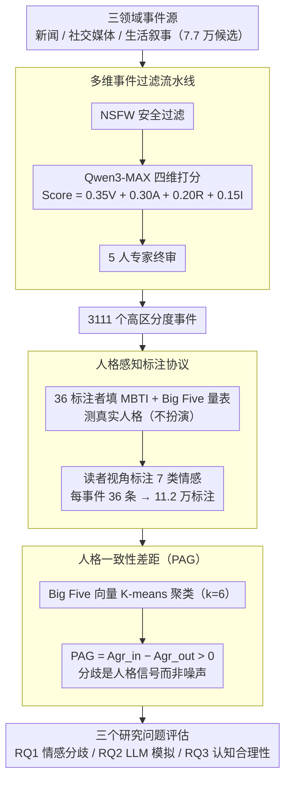

# Persona-E2: A Human-Grounded Dataset for Personality-Shaped Emotional Responses to Textual Events

**会议**: ACL 2026  
**arXiv**: [2604.09162](https://arxiv.org/abs/2604.09162)  
**代码**: [HuggingFace](https://huggingface.co/datasets/CRIS-Yang/Persona-E2-Dataset)  
**领域**: 社会计算 / 情感计算  
**关键词**: 人格建模, 情感评估, 读者视角, MBTI, 大五人格

## 一句话总结
构建了首个将人格特质（MBTI + Big Five）与读者情感反应关联的大规模数据集 Persona-E2，包含 3111 个事件 × 36 名标注者共 11.2 万条标注，揭示 LLM 在模拟人格化情感反应时存在"人格幻觉"问题，且 Big Five 特征比 MBTI 更有效地缓解该问题。

## 研究背景与动机

**领域现状**：情感计算研究主要关注文本中作者表达的情感，而忽略了读者视角的情感评估。现有数据集大多将标注聚合为单一标签，掩盖了不同个体因人格差异而产生的情感多样性。

**现有痛点**：角色扮演 LLM 试图通过在 prompt 中注入人格特征来模拟个性化反应，但它们往往表现出"人格幻觉"（personality illusion）——仅模仿表面的语言风格而非真正采用基于人格的认知评估模式。更关键的是，缺乏真实的人类数据来验证 LLM 是否真正捕捉到了人格驱动的情感多样性。

**核心矛盾**：认知评估理论指出情感源于个体化的评估过程，受目标和性格特质影响，但 NLP 领域缺少将人格特质与情感反应系统关联的基准数据集。LLM 生成的伪标签无法替代真实人类数据进行验证。

**本文目标**：构建一个有真实人格标注的读者情感反应数据集，用于 (1) 分析人格如何影响情感评估，(2) 评估 LLM 模拟人格化情感的能力，(3) 探究 LLM 能否生成心理学上合理的推理。

**切入角度**：让具有已测量人格特质（MBTI + Big Five）的真实标注者，对来自新闻、社交媒体和生活叙事三个领域的事件进行情感标注，每个事件获得 36 个标注，确保密集的人格多样性覆盖。

**核心 idea**：通过真实人格评估 + 密集标注（36 人/事件）+ 跨领域事件覆盖，构建首个人格-事件-情感的基准数据集，系统评估人格对情感评估的影响及 LLM 的模拟能力。

## 方法详解

### 整体框架
Persona-E2 的构建分为三个阶段：(1) 事件收集与过滤——从新闻、社交媒体、生活叙事三个领域收集事件，经过安全过滤、LLM 多维评分和专家审核，从 7.7 万候选中筛选出 3111 个高质量事件；(2) 人格化标注——招募 36 名标注者完成 MBTI 和 Big Five 问卷，每人对全部 3111 个事件标注真实情感反应；(3) 三个研究问题的实验评估——分析情感分歧模式、LLM 模拟能力和认知合理性。

### 关键设计

**1. 多维事件过滤流水线：只留"不同人格会有不同反应"的事件**

数据集要能区分人格差异，前提是事件本身得能触发差异化反应——一条所有人读了都一样平淡的新闻没有标注价值。作者用三阶段从 7.7 万候选里筛出 3111 个事件：先用 NSFW 分类器过滤有害内容；再用 Qwen3-MAX 给每个事件在人格变异性($V$)、情感唤醒度($A$)、情感隐含性($I$)、来源相关性($R$) 四个维度打分，按 $Score = 0.35V + 0.30A + 0.20R + 0.15I$ 加权（变异性权重最高，正对应"能否拉开人格差异"这个核心目标）；最后由 5 人专家组终审。

这样筛出来的事件最大化了数据集的区分价值——把刺激限定在"对人格敏感"的子集上，后续 36 人标注产生的分歧才更可能是人格信号而非事件本身无聊导致的随机噪声。

**2. 人格感知标注协议：用标注者自己的真实人格，而不是让他们扮演**

以往做法是让标注者模拟某个指定人格，得到的数据其实是"人对人格的刻板印象"。作者反过来——36 名标注者先做标准化 MBTI 和 Big Five 量表测出自己真实的人格，然后以读者视角（"How would you feel when reading this event?"）对全部 3111 个事件标注 Ekman 六基本情感 + 中性共 7 类，全程不做任何角色扮演。每个事件拿到 36 条来自不同真实人格的标注，保证了密集的人格覆盖。

这个"不扮演"的设计直接决定了数据的心理学有效性：情感反应锚定在已测量的真实特质上，才能用来验证"人格是否真的驱动了情感差异"这件事——这正是后面 PAG 指标要做的检验。

**3. 人格一致性差距（PAG）：内在验证标注分歧是人格信号而非噪声**

有了密集标注还要回答一个关键质疑：这些分歧到底来自人格，还是纯随机？作者定义 PAG 来检验——对所有标注者的 Big Five 向量做 K-means 聚类（$k=6$），再计算同一簇内标注者对同一事件的一致性 $Agr_{in}$ 与跨簇一致性 $Agr_{out}$，两者之差即 $\text{PAG} = Agr_{in} - Agr_{out}$。实验里所有聚类的 PAG 都为正（+8.27% ~ +25.96%），说明人格越相似的人对同一事件的情感反应确实越一致。

PAG 为正这件事本身就是数据质量的内在证据：它把"标注分歧是结构化的人格信号"从一个假设变成了可量化的结论，也为后续"LLM 是否真正捕捉到人格驱动的情感多样性"提供了人类侧的对照基准。

### 损失函数 / 训练策略
本文是数据集论文，不涉及模型训练。实验部分使用现有 LLM（GPT-4o、Claude 3.5、Qwen2.5 等）在 zero-shot 和 few-shot 设置下进行人格化情感预测评估。

## 实验关键数据

### 主实验
LLM 模拟人格化情感预测性能（加权 F1）：

| 模型 | 新闻 | 社交媒体 | 生活叙事 | 平均 |
|------|------|----------|----------|------|
| GPT-4o (zero-shot) | 0.42 | 0.31 | 0.38 | 0.37 |
| Claude 3.5 | 0.40 | 0.29 | 0.36 | 0.35 |
| Qwen2.5-72B | 0.39 | 0.28 | 0.35 | 0.34 |
| + BFI prompt | 0.45 | 0.34 | 0.41 | 0.40 |
| + MBTI prompt | 0.43 | 0.32 | 0.39 | 0.38 |

### 消融实验
人格信息对 LLM 情感预测的影响：

| 配置 | 加权 F1 | 说明 |
|------|---------|------|
| 无人格信息 | 0.37 | 基线 |
| + MBTI 标签 | 0.38 | 仅提供 4 字母类型 |
| + BFI 向量 | 0.40 | 提供连续人格维度得分 |
| + BFI + 认知解释 | 0.42 | 同时要求模型解释推理过程 |

### 关键发现
- LLM 在社交媒体领域表现最差（F1 仅 0.28-0.31），因为社交媒体文本更模糊、更依赖个人化解读
- Big Five 特征显著优于 MBTI 用于缓解"人格幻觉"，可能因为 BFI 提供了连续维度而非离散类型
- 作者-读者情感分歧在生活叙事领域最大，新闻领域最小，证明第一人称投射会放大个体差异
- PAG 验证显示 ESTP 类型的人格一致性最高（+26.98%），ISTJ 最低（+9.68%）

## 亮点与洞察
- 数据集设计的核心洞察非常深刻——"标注分歧不是噪声而是人格信号"。PAG 验证方法可以推广到任何涉及主观判断的标注任务中
- 36 人 × 3111 事件 = 11.2 万条标注的规模前所未有，且每个标注都锚定在真实测量的人格特质上，这为人格化 AI 研究提供了宝贵的基准
- "人格幻觉"概念的系统化验证——揭示 LLM 并非真正理解人格对认知评估的影响，只是在模仿刻板印象

## 局限与展望
- 标注者仅 36 人，人格覆盖有限，特别是某些 MBTI 类型人数不足 3 人无法进行统计分析
- 仅使用 7 类基本情感，无法捕捉更细腻的情感维度（如混合情感、情感强度）
- 事件主要来自英文源，文化多样性有限
- 未来可以扩展到更多标注者和文化背景，探索人格特质的动态变化对情感评估的影响

## 相关工作与启发
- **vs GoodNewsEveryone**: GNE 包含作者+读者视角但无人格标注，Persona-E2 首次引入真实人格测量
- **vs Big5-Chat**: Big5-Chat 使用 LLM 生成人格化对话数据，缺乏真实人类验证；Persona-E2 基于真实标注者的真实反应

## 评分
- 新颖性: ⭐⭐⭐⭐⭐ 首个将真实人格测量与读者情感标注系统关联的大规模数据集
- 实验充分度: ⭐⭐⭐⭐ 三个研究问题设计全面，但 36 人样本量在心理学实验中偏小
- 写作质量: ⭐⭐⭐⭐ 结构清晰，心理学理论基础扎实
- 价值: ⭐⭐⭐⭐⭐ 为人格化 AI 和情感计算提供了急需的真实基准数据

<!-- RELATED:START -->

## 相关论文

- [\[ACL 2026\] Synthia: Scalable Grounded Persona Generation from Social Media Data](synthia_scalable_grounded_persona_generation_from_social_media_data.md)
- [\[ACL 2026\] Imperfectly Cooperative Human-AI Interactions: Comparing the Impacts of Human and AI Attributes in Simulated and User Studies](imperfectly_cooperative_human-ai_interactions_comparing_the_impacts_of_human_and.md)
- [\[ACL 2026\] Point of Order: Action-Aware LLM Persona Modeling for Realistic Civic Simulation](point_of_order_action-aware_llm_persona_modeling_for_realistic_civic_simulation.md)
- [\[ACL 2026\] FigSIM: A Dataset for Fine-grained Suicide Severity and Figurative Language in Suicide Memes](figsim_a_dataset_for_fine-grained_suicide_severity_and_figurative_language_in_su.md)
- [\[ICLR 2026\] BiasFreeBench: a Benchmark for Mitigating Bias in Large Language Model Responses](../../ICLR2026/social_computing/biasfreebench_a_benchmark_for_mitigating_bias_in_large_language_model_responses.md)

<!-- RELATED:END -->
