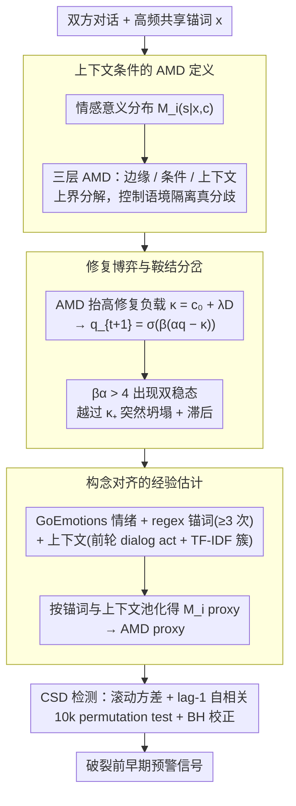

# Phase Transitions in Affective Meaning Divergence: The Hidden Drift Before the Break

**会议**: ACL2026  
**arXiv**: [2605.09043](https://arxiv.org/abs/2605.09043)  
**代码**: https://github.com/iamdiluxedbutcooler/phase_transition_amd  
**领域**: 社交计算 / 对话动力学 / 情感语义建模  
**关键词**: 情感语义分歧, 临界转变, 对话破裂, 修复协调, 早期预警

## 一句话总结
这篇论文把对话破裂前的“同词不同情感理解”形式化为 Affective Meaning Divergence，并用熵正则博弈证明修复概率会发生鞍结分岔，再在 Conversations Gone Awry 上观察到方差上升等 critical slowing down 早期预警信号。

## 研究背景与动机
**领域现状**：对话破裂、网络争吵和关系冲突的计算研究常看表层毒性、情绪极性、词汇差异或对话行为。CGA 这类数据集让研究者可以分析一段对话是否会从文明讨论走向人身攻击。

**现有痛点**：很多指标只能捕捉已经显性的冲突，例如毒性词、负面情绪或激烈表达。但真实对话常在破裂之前就发生隐蔽漂移：双方还在使用同一个词，却已经把它理解成不同的情感姿态。比如一句 “Fine” 对说话者意味着解决，对听者却意味着放弃。

**核心矛盾**：对话破裂看起来是突发事件，但很多冲突可能是连续小偏差积累后的相变。传统线性趋势或静态分类指标很难解释“为什么前面看似平稳，后面突然崩掉”。

**本文目标**：作者想同时给出理论和实证框架：理论上解释情感意义分歧如何导致修复协调从高水平突然坍塌；实证上检验这种坍塌前是否存在 critical slowing down 信号，例如滚动方差和自相关上升。

**切入角度**：论文将 speech-act theory、common ground、repair theory、appraisal theory、熵正则博弈和临界转变理论拼成一个闭环。词语的 affective uptake 被建模成上下文条件下的情感状态分布；双方分布差异越大，修复行动的负载越高。

**核心 idea**：用锚词条件情感分布之间的 total variation distance 度量 AMD，再把 AMD 作为修复博弈中的负载项，证明当互动增益超过阈值时，渐进漂移会触发突然、带滞后的修复坍塌。

## 方法详解
论文的贡献分成两层：第一层是形式化，定义什么是 affective meaning divergence，以及它如何影响修复行为；第二层是估计和验证，用可行的 NLP pipeline 在真实对话数据中构造 AMD proxy，并检测临界转变信号。

### 整体框架
对一段双方对话，先提取高频共享词作为 anchors，例如反复出现的立场词、话题词或普通词。对每个说话者 `i`、锚词 `x` 和上下文 `c`，定义情感意义为 `M_i(.|x,c)=P_i(s|x,c)`，也就是该说话者在这个上下文中使用锚词时对应的情感状态分布。两个说话者对同一锚词的条件情感分布越不同，AMD 越高。

然后把 AMD 放进一个最小修复博弈。每一轮双方可以选择 repair 或 withdraw。如果双方都 repair，有共同收益；如果一方尝试 repair 而另一方撤退，会付出成本。AMD 增大后，修复尝试更容易被误读，所以有效成本上升。熵正则 best response 给出一维动力系统 `q_{t+1}=sigma(beta(alpha q_t - kappa))`，其中 `q` 是修复概率，`kappa=c0+lambda D` 是由基础成本和 AMD 组成的负载。

最后在数据上估计 rolling-window 方差和自相关。理论预测：接近鞍结分岔时系统恢复速度变慢，噪声扰动更久才能消散，于是方差和自相关会在破裂前上升。

### 关键设计

**1. 上下文条件的 AMD 定义：把“同词不同情感”和“同词不同语境”分开**

直接比较两个人用同一锚词时的整体情绪分布会犯一个错：两个人可能都把 “fine” 理解成同样情绪，只是一个人在收尾语境用、另一个人在抱怨语境用——这种用法差异会被误判成意义分歧。论文因此把度量拆成三层：边缘 AMD 比较两人对锚词的整体分布 $\bar{M}_1(\cdot|x)$ 与 $\bar{M}_2(\cdot|x)$，条件 AMD 比较同一上下文下的 $M_1(\cdot|x,c)$ 与 $M_2(\cdot|x,c)$，上下文差异则比较两人在什么语境里用这个词 $P_1(\cdot|x)$ 与 $P_2(\cdot|x)$。论文进一步证明边缘 AMD 可以被上下文差异和条件 AMD 上界分解，意味着实证估计必须控制语境，才能保证测到的真的是“同一个词听起来不同”，而非“两人在不同场合用这个词”。

**2. 修复博弈与鞍结分岔：解释为什么渐进漂移会换来突然坍塌**

要回答“为什么前面看似平稳、后面突然崩掉”，论文把修复行为建成一个最小博弈：每轮双方选择 repair 或 withdraw，双方都修有共同收益、一方修一方撤则付出成本，修复优势记为 $\Delta U(q)=Bq-c_0$。AMD 越大，修复尝试越容易被误读，于是以 $\kappa=c_0+\lambda D$ 的形式抬高负载。熵正则 best response 给出一维动力系统

$$q_{t+1}=\sigma(\beta(\alpha q_t-\kappa))$$

其中 $q$ 是修复概率。当 $\beta\alpha\le 4$ 时固定点唯一且随 $\kappa$ 连续移动；一旦 $\beta\alpha>4$，系统出现两个稳定吸引子和一个不稳定中间点，$\kappa$ 越过 $\kappa_+$ 会从高修复状态突然跳到低修复状态。这正是“隐藏漂移后突然破裂”的可检验机制，并自然带出 hysteresis：关系崩掉后并非把负载降回触发点就能恢复，而要降到更低的 $\kappa_-$ 以下，对应现实里冲突后需要更强干预才能复原。

**3. 构念对齐的经验估计：把理论里的 $P_i(s|x,c)$ 落成可算的 proxy**

理论中的情感状态分布无法直接观测，论文用一套 NLP pipeline 去逼近：情绪用 RoBERTa-base GoEmotions 分类器输出的 27 类情绪加 neutral 分布表示；锚词用 regex token 取出现至少 3 次的共享词；上下文由前一轮 dialog act 与 TF-IDF topic cluster 共同定义；同一说话者所有含该锚词和上下文的 utterance 情绪分布被平均为 $M_i$。关键在于作者没有图省事用情感词典做平均，而是用上下文敏感的情绪分类器去接近 formal construct，同时明确把它标注为 proxy 而非潜在情感意义的直接观测——这种自我限定也让后面“AMD 信号显著但不单独提升预测”的结论更可信。

### 损失函数 / 训练策略
这篇论文不是训练一个生成模型，而是构造理论指标和统计检验。核心“目标函数”是动力系统与统计检测：合成实验迭代 logit best-response map；真实数据上计算 rolling-window 方差和 lag-1 autocorrelation，用 breakdown 前 5 个 turn 的 Kendall tau 衡量趋势，并用 10,000 次 permutation test 得到显著性。 repair proxy 包括 dialog-act 修复概率 `q_DA`、显式 repair marker `q_RM`、constructive engagement `q_CE=1-P(toxic)`。

## 实验关键数据

### 主实验
论文包含合成验证、CGA-Wiki 主实验、CGA-CMV 边界条件分析和 lead-time 分析。CGA-Wiki 过滤出 652 段至少 10 turn 的对话，其中 389 段最终 derail，263 段保持 civil；AMD 在 500 段有有效 anchor-context cell 的对话上计算。

| 合成设置 `(alpha,beta)` | `beta alpha` | `kappa_-` | `kappa_+` | 结论 |
|------|------|------|------|------|
| (2,2) | 4 | 唯一固定点 | 唯一固定点 | 临界边界，无双稳态区间 |
| (2,3) | 6 | 0.862 | 1.138 | 出现双稳态和滞后 |
| (2,4) | 8 | 0.734 | 1.266 | 双稳态区间变宽 |
| (2,5) | 10 | 0.638 | 1.362 | 互动增益越大，滞后越明显 |

| CGA-Wiki 指标 | `tau_derail` | `tau_civil` | p | Cohen d | 解释 |
|------|------|------|------|---------|------|
| `q_DA` 方差 | -0.129 | -0.010 | 0.016 | 0.20 | dialog-act 修复代理有 CSD 信号 |
| `q_RM` 方差 | -0.133 | -0.128 | 0.921 | 0.01 | 显式 repair marker 不区分 |
| `q_CE` 方差 | 0.055 | 0.019 | 0.434 | 0.06 | constructive engagement 不显著 |
| AMD 方差 | -0.200 | -0.054 | 0.001 | 0.26 | 理论核心指标显著 |
| Toxicity 方差 | 0.055 | 0.019 | 0.444 | 0.06 | 静态毒性动力学不显著 |
| VADER 方差 | 0.086 | 0.007 | 0.093 | 0.14 | 情感极性较弱 |
| Lexical Divergence 方差 | -0.327 | -0.125 | <0.001 | 0.36 | 表层词汇差异最强 |
| Lexical Divergence AC1 | 0.081 | -0.061 | <0.001 | 0.29 | 自相关也显著 |

### 消融实验

| 特征集合 | AUC | 增量 | 说明 |
|------|-----|------|------|
| Toxicity trend/mean/max | 0.539 | - | 表面毒性预测力弱 |
| + Sentiment | 0.561 | +0.022 | 情感均值有小幅帮助 |
| + Lexical divergence | 0.552 | -0.009 | 静态词汇差异没有持续增益 |
| + Sentiment AC1 tau | 0.618 | +0.066 | CSD 动态特征带来明显提升 |
| + `q_DA` CSD | 0.628 | +0.010 | 修复代理 CSD 有额外贡献 |
| + AMD CSD | 0.619 | -0.009 | 与已有 CSD 特征高度相关，分类增益不明显 |

| 边界条件 / Lead-time | 结果 | 含义 |
|------|------|------|
| CGA-CMV `q_CE` 方差 | p=0.009, d=0.16 | 短线程和噪声标签下只有 hostility dynamics 显著 |
| CGA-CMV `q_DA` 方差 | p=0.079, d=0.10 | 方向一致但未达显著 |
| CGA-CMV AMD 方差 | p=0.267, d=0.07 | AMD 在该域明显衰减 |
| CGA-Wiki AMD lead k=0 | p=0.001 | 破裂前最后窗口显著 |
| CGA-Wiki AMD lead k=1 | p=0.028, BH 后约 0.056 | 提前一窗口只有探索性证据 |
| Toxicity lead k=2-3 | p=0.005 / 0.001 | 毒性方差更早出现“暴风雨前平静”式模式 |

### 关键发现
- 理论预测的双稳态和 hysteresis 在合成迭代中得到验证：`beta alpha` 超过 4 后，`kappa` 的小变化可以触发从高修复到低修复的跳变。
- CGA-Wiki 上 AMD 方差显著，且经过 Benjamini-Hochberg 校正后仍保留显著性，说明“同词不同情感理解”的 proxy 确实在破裂前有动态信号。
- 词汇差异方差效果最大，但它测的是双方是否用不同词；AMD 测的是双方对共享词是否有不同情感 uptake，两者解释层次不同。
- 分类 ablation 中 AMD 没有带来额外 AUC，这说明它和其他 CSD 特征共享动态信息。作者也谨慎地把 AMD 的价值定位为理论 grounding 和时间剖面，而不是单独提升预测器。
- CGA-CMV 复制不强，支持“CSD 检测需要足够接近破裂且标签干净”的边界条件，也提醒该信号尚不能视为跨域鲁棒。

## 亮点与洞察
- 这篇论文最有意思的地方是把语用学里的 illocutionary force 和动力系统里的相变连接起来。它不是只说“情绪变坏会吵架”，而是解释为什么修复机制会突然失效。
- AMD 的上下文分解很重要。很多语义漂移指标会把上下文使用差异和意义差异混在一起，而作者明确给出边缘 AMD 的上界分解，提醒实证估计必须控制语境。
- Hysteresis 对现实关系有解释力：冲突发生后，双方不是回到之前状态就能恢复，而需要更强干预把负载降到更低水平。这比线性情绪趋势更贴近长期关系修复。
- 论文非常坦诚地区分理论构念和经验 proxy。它承认 GoEmotions、anchor extraction、全对话 pooling 都不完美，这反而让结论更可信。

## 局限与展望
- AMD 估计不是因果在线指标。论文用全对话范围内的说话者分布来估计 `M_i(s|x,c)`，包括未来 turn，因此 lead-time 结果不能解释为真实在线预警系统已经只用过去信息完成预测。
- GoEmotions 训练在 Reddit 评论上，不一定能捕捉 Wikipedia talk page 或 CMV 中的讽刺、防御、放弃、面子威胁等 repair-relevant affect。
- anchor 提取主要靠频率阈值，可能纳入很多话题词，也可能漏掉低频但语用关键的表达。未来可以结合 appraisal lexicon、对话 act 或人工验证。
- CGA-CMV 结果较弱，说明该理论信号对对话长度、标签清晰度和平台域迁移很敏感。需要更多中间难度语料验证泛化。
- 当前预测效果有限，AMD 更适合做解释性动态指标，而不是单独用于个体级高精度预警。

## 相关工作与启发
- **vs 毒性检测**: 毒性检测关注已经显露的攻击内容；AMD 关注破裂前双方对共享词的情感 uptake 是否漂移，理论上更早、更隐蔽。
- **vs 情感/情绪趋势**: 普通 sentiment 看单方或整体情绪水平；AMD 是双人之间的分布差异，强调共同词语上的互不理解。
- **vs lexical divergence**: 词汇差异测“说的词是否不同”，AMD 测“同一个词听起来是否不同”。二者互补，前者效果更强，后者解释更贴近本文理论。
- **vs 对话修复理论**: 传统 repair work 多为质性或规则式分析；本文把 repair probability 放入 logit best response，使其能产生可检验的临界慢化预测。

## 评分
- 新颖性: ⭐⭐⭐⭐⭐ 把情感语义分歧、修复博弈和鞍结分岔连成统一框架，非常有原创性。
- 实验充分度: ⭐⭐⭐⭐☆ 理论、合成和两套真实语料都有覆盖，但跨域复现较弱，经验 proxy 仍粗糙。
- 写作质量: ⭐⭐⭐⭐☆ 理论路线清晰且自我限定充分，公式较多，对非动力系统读者有一定门槛。
- 价值: ⭐⭐⭐⭐☆ 对社交计算和对话安全很有启发，尤其适合作为解释框架；离可部署预警系统还有距离。

<!-- RELATED:START -->

## 相关论文

- [\[ACL 2026\] Justice in Judgment: Unveiling (Hidden) Bias in LLM-assisted Peer Reviews](justice_in_judgment_unveiling_hidden_bias_in_llm-assisted_peer_reviews.md)
- [\[ICLR 2026\] Propaganda AI: An Analysis of Semantic Divergence in Large Language Models](../../ICLR2026/social_computing/propaganda_ai_an_analysis_of_semantic_divergence_in_large_language_models.md)
- [\[ICML 2026\] The Geometric Mechanics of Contrastive Representation Learning: Alignment Potentials, Entropic Dispersion, and Cross-modal Divergence](../../ICML2026/social_computing/the_geometric_mechanics_of_contrastive_representation_learning_alignment_potenti.md)
- [\[ACL 2026\] RV-HATE: Reinforced Multi-Module Voting for Implicit Hate Speech Detection](rv-hate_reinforced_multi-module_voting_for_implicit_hate_speech_detection.md)
- [\[ACL 2026\] PSK@EEUCA 2026: Fine-Tuning Large Language Models with Synthetic Data Augmentation for Multi-Class Toxicity Detection in Gaming Chat](pskeeuca_2026_fine-tuning_large_language_models_with_synthetic_data_augmentation.md)

<!-- RELATED:END -->
