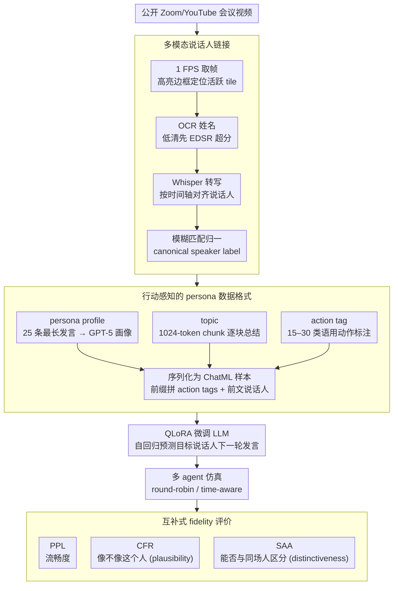

# Point of Order: Action-Aware LLM Persona Modeling for Realistic Civic Simulation

**会议**: ACL2026  
**arXiv**: [2511.17813](https://arxiv.org/abs/2511.17813)  
**代码**: 未公开  
**领域**: audio_speech  
**关键词**: 说话人归因、行动标签、角色建模、市政协商仿真、QLoRA

## 一句话总结
这篇论文把公开 Zoom 会议视频转成跨视频说话人可追踪、带行动标签和 persona 元数据的政府协商语料，并用 QLoRA 微调 LLM 生成特定参与者发言，使困惑度最多降低 67%，人类在图灵式测试中也很难区分模拟对话和真实会议片段。

## 研究背景与动机
**领域现状**：LLM multi-agent simulation 已经能模拟辩论、协商、会议和政策讨论，但很多系统仍然依赖人工写的 persona prompt：给每个 agent 一段身份描述、目标和风格，然后让模型轮流发言。这种做法部署成本低，却很难刻画真实机构里的稳定说话习惯、议事程序和长期互动结构。

**现有痛点**：真实公共会议视频很多，尤其是法院、学校董事会、市政委员会的公开 Zoom 录制，但自动语音识别通常只输出 `Speaker_1` 这样的匿名标签。没有跨视频的真实身份，模型只能学习一个泛化的“官员/委员/法官”说话方式，无法稳定模拟某个具体人的议题偏好、措辞习惯和程序性动作。

**核心矛盾**：要做 realistic civic simulation，一方面需要大规模真实对话数据，另一方面这些数据天然嘈杂：视频分辨率不一、说话人 tile 会切换、ASR 有错、多人会议会有程序性发言和即兴争论。单纯的人设 prompt 不够，单纯的语音 diarization 又无法给出跨会议身份和语用动作。

**本文目标**：作者希望解决三个子问题：第一，从普通公开视频中恢复稳定的说话人身份；第二，把 transcript 扩展成包含 persona、topic、action tag 的训练样本；第三，用一套能同时衡量流畅度、persona fidelity 和身份区分度的指标评价多 agent 仿真。

**切入角度**：Zoom gallery view 本身提供了一个可利用的弱监督信号：当前说话人的视频格子会被高亮，格子角落通常有姓名。作者抓住这个视觉线索，将 OCR、音频转写和文本上下文结合起来，把原本匿名的 ASR transcript 变成 speaker-attributed transcript。

**核心 idea**：用“可追踪身份 + 行动标签 + persona 元数据”替代单薄的人设提示，让 LLM 从真实协商语料中学习谁在什么议程下以什么程序动作发言。

## 方法详解
这篇论文不是单纯提出一个 prompt，而是从数据构建、元数据抽取、模型微调到仿真评价搭了一条完整流水线。它的关键思路是先把公开视频变成结构化对话数据，再把结构化信息注入训练与推理，让模型不仅会说“像政府会议的话”，还尽量会说“像某个具体参与者在某个议程阶段会说的话”。

### 整体框架
输入是公开 YouTube/Zoom 会议录像，输出是可用于训练和仿真的 speaker-labeled civic deliberation 数据集，以及为每个说话人微调出的 persona agent。流程可以分成四步：先从视频中识别活跃说话人并 OCR 出姓名；再用 Whisper 转写音频并把每段话对齐到规范化说话人；然后用 GPT-5 抽取 persona profile、meeting topics 和 action tags；最后把带元数据的上下文序列化为 ChatML 风格样本，用 QLoRA 微调 LLM 预测目标说话人的下一轮发言。

### 关键设计

**1. 多模态说话人链接：把匿名 `Speaker_1` 还原成跨视频一致的真实身份**

纯音频 diarization 在多人、噪声、远程会议里很容易把同一个人的身份打散，而公开会议又只有 ASR 输出的匿名标签，模型只能学到一个泛化的“官员/委员”口吻。论文抓住 Zoom gallery view 把“谁正在说话”显式画在界面上这一弱监督信号：以 1 FPS 处理画面，靠高亮边框定位当前活跃 tile，再裁剪 tile 左下角姓名区域做 OCR，低清视频先用 EDSR 超分辨率把姓名修清楚；随后用 Whisper 转写音频，并按时间轴把每段语音分配给当时高亮的说话人，跨视频姓名再用模糊匹配归一化成 canonical speaker label。利用 UI 信号比纯声学特征更稳，也不需要会议主办方额外提供元数据，这才让“追踪某个具体参与者”成为可能。

**2. 行动感知的 persona 数据格式：让样本同时带长期风格、当下议题和语用动作**

真实协商不是自由聊天，大量发言其实是程序动作——提出动议、询问澄清、引用材料、召集投票——只给身份和议题，模型学不到“下一句该是什么功能的话”。论文因此把三类元数据写进训练样本：persona profile 取每个说话人 25 个最长 monologue，让 GPT-5 抽出目标、语气、边界和政策立场再合并成稳定画像；topic 把 transcript 切成 1024-token chunk 逐块总结后汇总；action tag 用 15–30 个紧凑的 speech-act 标签标注每条 utterance。训练时每条 utterance 前面拼上按字母排序的 action tags 并保留前文说话人标签，等于把发言的“功能”显式喂给模型。这也解释了为什么 action tags 即便对未微调模型也能降低困惑度——它本身就是一种自然语言控制信号。

**3. 互补式 fidelity 评价：用两个指标分开衡量“像不像他”和“是不是他”**

低困惑度只说明句子流畅，并不等于像某个具体人；而政府会议里大家共享大量制度化措辞，生成“听起来像市政会议”的句子并不难。论文因此在 PPL 之外加两个指标：Classifier Fool Rate（CFR）训练 one-vs-all DeBERTa 分类器，统计生成话语被判成目标说话人真实话语的比例，衡量“像不像这个人”；Speaker Attribution Accuracy（SAA）训练多分类器，看生成话语能否被正确归因到对应说话人，衡量“能否和同场其他人区分开”。CFR 测的是 plausibility，SAA 测的是 distinctiveness，两者组合远比单一流畅度指标可靠，也正是后面“CFR 普遍高于 SAA”这一发现的度量基础。

### 损失函数 / 训练策略
训练目标是标准自回归语言建模：在前文 speaker-labeled context、persona/topic/action tag 条件下预测目标 utterance。作者比较 GPT-OSS-120B、LLaMA-3.1-70B 和 Qwen-2.5-72B，微调采用 QLoRA，学习率和 LoRA alpha 通过 grid search 调参，训练 5 个 epoch，并用 held-out PPL 选择最佳 checkpoint。上下文长度截断到 1024 tokens，与后续仿真一致。仿真阶段按 round-robin 让各 agent 发言，另有 time-aware 版本把议程时间戳加入提示，用来测试时间锚定是否能改善议程覆盖和决策闭环。

## 实验关键数据

### 主实验
论文构建了三个真实政府协商数据集，覆盖法院、学校董事会和新西兰地方委员会。数据规模不算巨型，但每个 transcript 都有身份、议题、action tag 和 speaker profile，适合训练特定参与者 agent。

| 数据集 | transcript 数 | 平均参与人数 | 总词数 | 平均每文件词数 |
|--------|---------------|--------------|--------|----------------|
| DC Court of Appeals | 10 | 8.6 | 193,712 | 19,371 |
| Albemarle School Board | 32 | 21.38 | 594,253 | 18,570 |
| Waipā District Council | 80 | 12.125 | 933,272 | 11,666 |

在人类数据验证中，utterance speaker identification 达到 98.5%，跨视频 speaker consistency 达到 95.3%；转写质量主观评分也很高，55.9% 为 Strongly agree，29.8% 为 Agree。这说明后续模型评价建立在比较可靠的数据底座上。

| 模型/配置 | Albemarle PPL↓ | Albemarle CFR↑ | Albemarle SAA↑ | 主要结论 |
|-----------|----------------|----------------|----------------|----------|
| GPT baseline w/o tags | 24.68 ± 1.00 | 0.21 ± 0.03 | 0.36 ± 0.02 | 仅靠 prompt 难以稳定 persona |
| GPT fine-tuned w/o tags | 12.89 ± 0.50 | 0.64 ± 0.04 | 0.48 ± 0.03 | 微调明显提升风格拟合 |
| GPT fine-tuned w/ tags | 7.73 ± 0.31 | 0.82 ± 0.05 | 0.63 ± 0.04 | action tags 与微调叠加收益最大 |
| Qwen baseline w/o tags | 24.64 ± 1.35 | 0.18 ± 0.03 | 0.27 ± 0.02 | 未微调时说话人特征弱 |
| Qwen fine-tuned w/ tags | 5.32 ± 0.19 | 0.58 ± 0.03 | 0.31 ± 0.02 | PPL 降到最低区间，身份区分仍较难 |

### 消融实验
论文的消融重点有三个：prompt 组件、行动标签、时间锚定。系统消息消融表明，微调前模型非常依赖 persona prompt；微调后模型已经内化了一部分 speaker traits，过多 prompt 反而可能引入噪声。

| 配置/分析 | 关键指标 | 说明 |
|-----------|----------|------|
| Full prompt + baseline w/o tags | PPL 20.37 ± 1.92, CFR 0.29 ± 0.02, SAA 0.23 ± 0.02 | 完整系统提示能让未微调模型保持基本角色感 |
| No system prompt + baseline w/o tags | PPL 18.22 ± 2.19, CFR 0.08 ± 0.01, SAA 0.09 ± 0.01 | 无 persona 条件时，CFR/SAA 大幅下降，模型更像在泛化总结 |
| Full prompt + fine-tuned w/ tags | PPL 6.64 ± 0.47, CFR 0.64 ± 0.03, SAA 0.45 ± 0.04 | 微调和 action tags 给出最稳健的整体质量 |
| No micro + fine-tuned w/ tags | PPL 6.53 ± 0.45, CFR 0.89 ± 0.03, SAA 0.61 ± 0.04 | 微调后简化 prompt 反而更好，说明详细 micro-profile 可能过度约束 |
| Time-aware simulation | LLaMA topic coverage 71.4%→94.4%，Qwen 81.4%→99.2% | 时间锚定帮助模型推进议程，而不是卡在第一个事项 |
| Human Turing test | 模拟片段被正确识别约 44.5% | 人类低于随机或接近随机，说明局部对话真实感较强 |

### 关键发现
- 微调是主收益来源：PPL、CFR、SAA 在三类模型和三个数据集上普遍提升，尤其 GPT 在 Albemarle 上从 PPL 24.68 降到 7.73。
- action tags 不只是训练标签，也能作为自然语言控制信号；即使未微调，带 tag 的 baseline PPL 也明显下降。
- CFR 往往高于 SAA，说明模型较容易生成“看起来像目标人”的话，但更难复制足以区分同场人物的细粒度风格。
- time-aware simulation 对 LLaMA 和 Qwen 的议程推进帮助更大，GPT 本身规划能力强，增益反而较小。

## 亮点与洞察
- 论文最巧妙的点在于把 Zoom UI 当成弱监督传感器。它没有追求昂贵的端到端视频理解，而是利用高亮边框和姓名 tile 这种稳定界面信号，低成本获得跨视频 speaker linking。
- action tags 把 persona modeling 从“像某人说话”推进到“像某人在某个程序动作中说话”。这对 civic simulation 很关键，因为议会、法院和委员会的真实感大量来自程序动作和 turn-taking 结构。
- CFR/SAA 的设计很有启发：一个指标测“能否骗过 one-vs-all 风格分类器”，另一个测“能否在同场人之间被正确归因”。很多生成任务也可以借鉴这种 plausibility vs. distinctiveness 的双指标评价。
- 时间锚定实验说明，真实会议仿真不是只要单句像，还要有议程级 progress。把时间或阶段写进 agent state 是一个很轻量却实用的控制手段。

## 局限与展望
- 方法强依赖 Zoom gallery view，非 Zoom、非公开视频、没有姓名 tile 或画面频繁切换的会议不容易直接适用。
- Whisper ASR 在重叠语音、噪声、口音和低质量录音下仍可能出错；如果 transcript 错误被用于 persona profile 和 action tag，后续微调会继承这些偏差。
- action tags 和 persona/topic extraction 依赖 GPT-5 自动标注，成本、可复现性和标注偏差都需要进一步讨论。
- 仿真采用 round-robin 发言顺序，真实协商中谁打断、谁接话、谁沉默本身也是行为模型的一部分；未来可以加入 next-speaker prediction、interruptions 和 agenda control。
- civic persona simulation 有明显双刃剑属性：可用于政策教学和反事实分析，也可能被滥用于伪造公共讨论或操纵舆论，需要更明确的使用边界。

## 相关工作与启发
- **vs 传统 speaker diarization**: 传统方法主要靠音频聚类，本文利用 Zoom 视觉界面做 speaker linking，更适合公开视频和跨会议身份追踪，但适用范围也更依赖视频布局。
- **vs prompt-only persona simulation**: prompt-only 方法轻量但容易 persona drift；本文通过真实 utterance 微调把身份特征写进模型参数或 LoRA adapter，稳定性更好。
- **vs Reflexion/ReAct 式多 agent 辩论**: 那些系统更关注推理或协作流程，本文关注制度化协商中的人物风格、程序动作和议程推进，评价维度更贴近 social simulation。
- **对其他任务的启发**: 医疗会诊、课堂讨论、公司会议和法庭庭审都可以复用“身份链接 + action tag + persona 微调 + 双指标评价”的结构，只是 action taxonomy 需要按领域重写。

## 评分
- 新颖性: ⭐⭐⭐⭐☆ 把公开视频 speaker linking、action tags 和 persona PEFT 组合成 civic simulation 流水线，问题设定很实用。
- 实验充分度: ⭐⭐⭐⭐☆ 数据验证、模型评价、人类图灵测试和 prompt/时间消融都比较完整，但自动标注质量和跨平台泛化还可加强。
- 写作质量: ⭐⭐⭐⭐☆ 论文主线清楚，实验指标解释充分；部分附录和图表信息较密，读者需要来回对照。
- 价值: ⭐⭐⭐⭐⭐ 对真实多方协商仿真、公共政策分析和 agent persona modeling 都有直接参考价值。

<!-- RELATED:START -->

## 相关论文

- [\[ACL 2026\] Why Are We Moral? An LLM-based Agent Simulation Approach to Study Moral Evolution](why_are_we_moral_an_llm-based_agent_simulation_approach_to_study_moral_evolution.md)
- [\[ACL 2026\] Dynamics of Cognitive Heterogeneity: Investigating Behavioral Biases in Multi-Stage Supply Chains with LLM-Based Simulation](dynamics_of_cognitive_heterogeneity_investigating_behavioral_biases_in_multi-sta.md)
- [\[ACL 2026\] LiveFact: A Dynamic, Time-Aware Benchmark for LLM-Driven Fake News Detection](livefact_a_dynamic_time-aware_benchmark_for_llm-driven_fake_news_detection.md)
- [\[ACL 2026\] Synthia: Scalable Grounded Persona Generation from Social Media Data](synthia_scalable_grounded_persona_generation_from_social_media_data.md)
- [\[ACL 2026\] Persona-E2: A Human-Grounded Dataset for Personality-Shaped Emotional Responses to Textual Events](persona-e2_a_human-grounded_dataset_for_personality-shaped_emotional_responses_t.md)

<!-- RELATED:END -->
