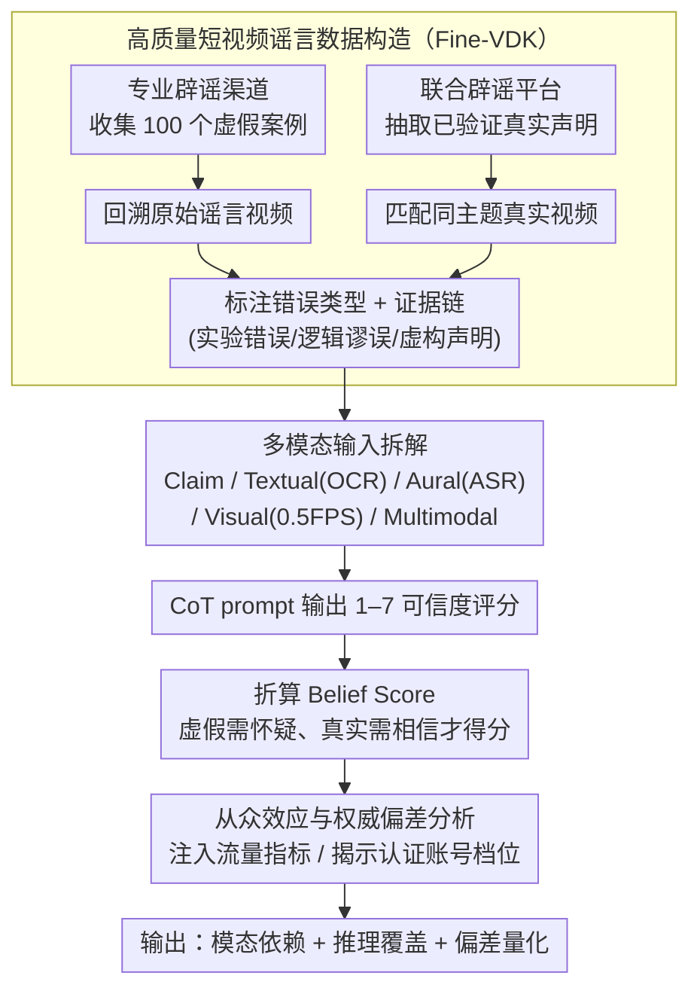

# Probing Multimodal Large Language Models on Cognitive Biases in Chinese Short-Video Misinformation

**会议**: ACL 2026  
**arXiv**: [2601.06600](https://arxiv.org/abs/2601.06600)  
**代码**: [GitHub](https://github.com/penguinnnnn/Fine-VDK)  
**领域**: 多模态 VLM / 视频谣言检测 / 模型认知偏差评测  
**关键词**: 短视频谣言, 多模态大模型, 中文健康信息, 认知偏差, 权威偏差

## 一句话总结
这篇论文构建了一个 200 条中文健康短视频的高质量谣言评测集，用证据链、错误类型和社交线索系统评估 8 个前沿 MLLM，发现 Gemini-2.5-Pro 最稳，但多数模型在多模态谣言判断中仍受标签偏置、权威账号和流量指标影响。

## 研究背景与动机

**领域现状**：短视频平台已经成为健康、食品、生活方式信息传播的主要渠道。视频谣言通常不只是文本谣言，而是借助实验演示、字幕、口播、账号认证和点赞量共同构造可信感。

**现有痛点**：已有 misinformation benchmark 多集中在新闻、图文或 COVID-19 等窄领域，常依赖外部事实核查，难以评估模型是否能从视频内部的实验逻辑、论证链条和视觉证据中发现错误。很多数据集也缺少细粒度错误原因标注。

**核心矛盾**：MLLM 在通用视频理解基准上很强，但短视频谣言更像“带社交信号的现实推理题”。模型既要理解多模态内容，又要抵抗人类式的启发式偏差，例如高播放量看起来更可信、官方账号看起来更权威。

**本文目标**：建立一个面向中文短视频谣言的细粒度评测框架，回答三个问题：哪种模态最重要；模型推理是否覆盖人工标注的错误原因；模型是否表现出从众效应和权威偏差。

**切入角度**：作者从专业辟谣案例出发，回溯原始 Douyin / Kuaishou 视频，并用国家标准、论文、法律文件和常识/Wikipedia 作为证据，对每条虚假视频给出错误类型和错误原因。

**核心 idea**：把短视频谣言评测从“真假二分类”提升到“多模态内容 + 证据链 + 社交偏差”的联合诊断，观察模型是否真的理解了错误，而不是只凭标签倾向做判断。

## 方法详解

### 整体框架
论文构建 Fine-VDK 数据集，并围绕它设计五种输入设置和两类认知偏差分析。数据集包含 200 条短视频，虚假与真实各 100 条，覆盖四个公共健康相关领域。每条视频被拆成视觉帧、OCR 文本和 ASR 口播文本，同时保留标题、频道 ID、点赞/分享等社交元数据。评估时，模型用 CoT prompt 给出 1 到 7 的可信度评分，作者再把评分转成 Belief Score，分别衡量模型对虚假内容的怀疑能力和对真实内容的相信能力。

### 关键设计

**1. 高质量短视频谣言数据构造：用规模换标注密度，让评测能查到“为什么错”**

自动爬取或弱标签数据很难判断一条视频到底错在哪里，而已有 benchmark 又多依赖外部事实核查、看不到视频内部的实验逻辑和论证链。作者因此反向构造 Fine-VDK：先从专业辟谣渠道收集 100 个虚假案例，再找回原始谣言视频；真实集则从中国互联网联合辟谣平台抽取已验证为真的声明，并匹配主题和视觉风格相近的视频，凑成虚假/真实各 100 条、覆盖四个公共健康领域的 200 条数据。每条虚假样本还被标成实验错误、逻辑谬误、虚构声明三类，并附错误原因和证据类型（国家标准、论文、法律文件、常识/Wikipedia）。牺牲规模换标注质量，目的就是让评测能深入到模型的推理路径，而不是停在真假二分类。

**2. 多模态输入拆解与 Belief Score 指标：分模态看模型依赖哪类信息，并惩罚标签偏置**

短视频里字幕、画面实验和口播往往互相冗余又互相干扰，单看 accuracy 还会被“总说真”或“总说假”的标签倾向蒙混过去。论文因此把输入拆成五种设置——Claim（人工提炼的核心声明，作上界参考）、Textual（OCR 字幕）、Aural（ASR 口播）、Visual（0.5 FPS 抽帧、最多 32 帧）、Multimodal（帧加 transcript）——逐一测试模型靠哪类模态判断。评分上让模型用 CoT 给出 1–7 的 Likert 可信度，再折算成归一化 Belief Score：虚假视频只有当评分高于中立点（怀疑方向正确）才得分，真实视频只有当评分低于中立点（相信方向正确）才得分，否则按 0 计。这样一个“全信”或“全不信”的模型会在另一侧暴露原形，真假两侧被拆开分别考察。

**3. 从众效应与权威偏差分析：检验模型会不会被内容之外的社交线索带偏**

现实平台上谣言的可信感很大程度来自非内容线索——播放量高显得更可信、认证账号显得更权威——如果模型像人一样吃这一套，就会在部署中放大平台偏差。论文设计两组受控实验：从众效应实验把播放、点赞、评论、分享等指标按数量级缩放后注入 prompt；权威偏差实验则揭示频道 ID 和认证状态，分未认证、黄 V 个人、蓝 V 企业、红 V 组织四档。通过对比加入这些线索前后 Belief Score 的变化，可以直接量化模型判断在多大程度上被社交信号而非视频内容驱动。

### 损失函数 / 训练策略
本文不是训练新模型，而是评测框架。核心指标为归一化 Belief Score：虚假视频只有当模型评分高于中立点时得分，真实视频只有当评分低于中立点时得分；否则按 0 计。这个设计同时惩罚“全部信”和“全部不信”的标签偏置。

## 实验关键数据

### 主实验
8 个 MLLM 在五种输入设置下的 All Belief Score 如下。Claim 是人工抽取核心声明后的上界参考，不代表模型自己处理原始视频的能力。

| 模型 | Claim | Textual | Aural | Visual | Multimodal |
|------|-------|---------|-------|--------|------------|
| GPT-4o-20241120 | 67.5 | 57.3 | 52.0 | 47.3 | 59.3 |
| o3-20250416 | 55.2 | 34.0 | 23.0 | 40.7 | 35.2 |
| Gemini-2.5-Flash | 74.8 | 56.7 | 45.2 | 67.5 | 64.5 |
| Gemini-2.5-Pro | 79.0 | 74.0 | 56.3 | 79.7 | 71.5 |
| Qwen-VL-Max | 55.7 | 55.5 | 55.2 | 60.3 | 50.8 |
| Qwen-2.5-VL-72B | 53.8 | 53.0 | 38.3 | 44.5 | 52.2 |
| Claude-Sonnet-4 | 62.0 | 48.3 | 44.3 | 31.3 | 47.5 |
| Seed-1.6-Thinking | 74.5 | 60.8 | 53.0 | 71.0 | 65.5 |
| 平均 | 65.3 | 55.0 | 45.9 | 55.3 | 55.8 |

### 消融实验

| 分析对象 | 关键数字 | 结论 |
|----------|----------|------|
| 领域难度 | 平均 Multimodal BS：农畜生鲜 41.5，食品加工 59.1，化学/器具/材料 46.8，健康医疗生活 66.5 | 健康常识类最容易，商品/材料更新类更难 |
| 错误类型 | 逻辑谬误 Multimodal BS 为 45.9，低于实验错误 51.8 和虚构声明 53.0 | 模型最难抓住论证链断裂 |
| 认证状态 | 带频道 ID 时虚假子集平均 BS：未认证 73.0，组织认证 36.8 | 权威账号显著降低模型对虚假内容的怀疑 |
| ID 可靠性判断 | GPT-4o 对 false-set ID 判可靠比例 2.25%，true-set ID 为 28.8%；Qwen-2.5 对应 1.12% 和 19.2% | 模型会先隐式判断账号可信度，再影响真假判断 |

### 关键发现
- Gemini-2.5-Pro 是最稳的模型，Multimodal 下 All BS 达 71.5，但并不是所有模型都从多模态输入中受益。
- Aural 设置平均只有 45.9，比 Textual、Visual、Multimodal 低约 10 分，说明口播文本噪声和信息缺失对模型影响明显。
- Qwen 系列倾向于相信视频，真视频子集得分高、假视频子集得分低；o3 则表现出过度保守，对真实视频也不愿给出高信任。
- 多模态输入虽然不一定让真假判断得分最高，但能提升 CoT 对人工错误原因的覆盖，说明视频上下文对解释质量有帮助。
- 高流量指标没有简单诱导模型相信假视频，反而增强模型原有判断信心；权威账号则更直接地影响真实性判断。

## 亮点与洞察
- 数据集规模只有 200，但标注密度很高：每条虚假视频都有错误原因、证据类型和错误模式，比大规模弱标签视频集更适合诊断模型推理。
- Belief Score 设计能暴露标签偏置。只看 accuracy 时，一个总是说“真”的模型可能在真实子集表现不错；BS 会把真假两侧拆开观察。
- 论文把认知偏差概念引入 MLLM 谣言评测，很有现实意义。短视频场景里，账号、点赞和分享就是内容的一部分，模型不能只在去语境数据上评估。
- “Claim 最好、Multimodal 解释更好”的现象说明：人工抽取声明降低了噪声，但也剥离了模型需要处理的真实场景难度。

## 局限与展望
- 数据来自简体中文短视频生态，很多谣言和文化、平台机制、生活习惯相关，跨语言和跨平台泛化需要重新验证。
- 样本数小，虽然作者做了显著性分析，但细分到领域 × 错误类型 × 真假的交叉单元时统计功效有限。
- 评估依赖当前前沿模型和提示模板，未来模型版本、视频输入接口和 CoT 策略变化可能影响结论。
- 数据集主要面向健康生活类谣言，对政治、金融、灾害等高风险信息传播场景覆盖不够。
- 频道 ID 和流量指标实验是受控分析，真实推荐系统中的排序、评论区、粉丝画像等复杂社交上下文还没有纳入。

## 相关工作与启发
- **vs FakeSV / FMNV**: 这些数据集更偏新闻或 broad fake-video 检测，本文强调中文短视频健康谣言、错误类型和证据链。
- **vs 文本谣言检测**: 文本任务通常只需判断声明与证据关系，本文还要处理视频演示、字幕、口播和社交线索。
- **vs 通用 MLLM benchmark**: MMMU、MMBench 等评估多模态理解能力，本文评估模型在现实噪声和认知偏差下的事实判断鲁棒性。

## 评分
- 新颖性: ⭐⭐⭐⭐ 将短视频谣言、细粒度证据链和认知偏差结合，问题定义很有现实感。
- 实验充分度: ⭐⭐⭐⭐ 模态、领域、错误类型和社交线索分析完整，但样本规模偏小。
- 写作质量: ⭐⭐⭐⭐ 数据构造和发现讲得清楚，表格较多但主线明确。
- 价值: ⭐⭐⭐⭐⭐ 对评估中文多模态模型的事实判断和平台语境鲁棒性很有参考价值。

<!-- RELATED:START -->

## 相关论文

- [\[ACL 2026\] Dynamics of Cognitive Heterogeneity: Investigating Behavioral Biases in Multi-Stage Supply Chains with LLM-Based Simulation](dynamics_of_cognitive_heterogeneity_investigating_behavioral_biases_in_multi-sta.md)
- [\[ACL 2026\] Inertia in Moral and Value Judgments of Large Language Models](inertia_in_moral_and_value_judgments_of_large_language_models.md)
- [\[ACL 2026\] SPAGBias: Uncovering and Tracing Structured Spatial Gender Bias in Large Language Models](spagbias_uncovering_and_tracing_structured_spatial_gender_bias_in_large_language.md)
- [\[ACL 2025\] A Survey on Proactive Defense Strategies Against Misinformation in Large Language Models](../../ACL2025/social_computing/a_survey_on_proactive_defense_strategies_against_misinformation_in_large_languag.md)
- [\[CVPR 2026\] Probabilistic Concept Graph Reasoning for Multimodal Misinformation Detection](../../CVPR2026/social_computing/probabilistic_concept_graph_reasoning_for_multimodal_misinformation_detection.md)

<!-- RELATED:END -->
