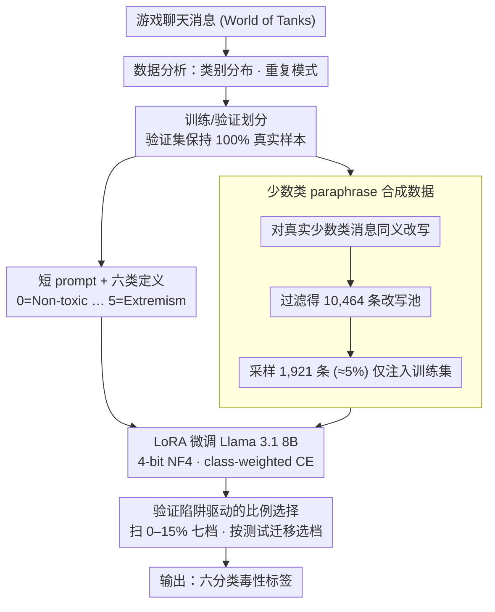

# PSK@EEUCA 2026: Fine-Tuning Large Language Models with Synthetic Data Augmentation for Multi-Class Toxicity Detection in Gaming Chat

**会议**: ACL2026  
**arXiv**: [2605.07201](https://arxiv.org/abs/2605.07201)  
**代码**: 未开源  
**领域**: 社会计算 / 游戏社区毒性检测  
**关键词**: 游戏聊天审核, 毒性分类, 合成数据增强, LoRA微调, 类别不均衡

## 一句话总结
这篇系统论文面向 EEUCA 2026 游戏聊天毒性识别任务，用 Llama 3.1 8B + LoRA + 经过严格过滤的 5% 少数类合成改写数据，在六分类 macro-F1 上达到 0.6234，并揭示了验证集高分但测试集迁移差的“验证陷阱”。

## 研究背景与动机
**领域现状**：在线游戏社区的聊天审核通常被建模为文本分类问题，主流方案从 XLM-RoBERTa 这类 encoder 微调，到 instruction-tuned LLM 的参数高效微调，再到 ensemble 或层级分类。EEUCA 2026 共享任务把 World of Tanks 聊天消息分成 Non-toxic、Insults/Flaming、Other Offensive、Hate/Harassment、Threats、Extremism 六类，评价指标是六类 macro-F1。

**现有痛点**：这个任务的难点不只是“有没有脏话”。数据中 81% 是 Non-toxic，Threats 和 Extremism 合计低于 0.2%；聊天文本短、口语化、带游戏术语和多语言混杂；Insults、Other Offensive、Hate/Harassment 之间的语义边界很细，模型很容易把“技术差”类嘲讽和身份攻击混在一起。

**核心矛盾**：验证集分布与测试集标注模式不完全一致，过于贴合验证集多数类比例的模型会显得很稳，但在测试集上对少数类过于保守。作者把这种现象称为 validation trap：高验证 F1 往往来自“少预测少数类”，而不是来自真正更好的泛化。

**本文目标**：在资源受限的共享任务场景下，找到一个能稳定迁移到测试集的毒性分类系统；同时分析哪些设计会造成验证集幻觉，哪些少量增强能改善少数类召回而不过拟合。

**切入角度**：作者没有盲目扩大合成数据，而是把合成样本限定为对少数类真实消息的 paraphrase，并系统扫描合成比例。这个角度的关键假设是：真实少数类样本太少，但其表面表达可被轻微扩展；合成比例一旦过大，又会让模型学习到生成器的风格。

**核心 idea**：用小剂量、同义改写式的合成少数类样本校准 LLM 的类别倾向，让模型在测试集上更积极地识别难分少数类，同时避免大规模合成数据带来的分布漂移。

## 方法详解
这篇论文更像一个高质量 shared-task system report：贡献不在复杂新架构，而在系统性比较、合成比例控制和错误模式分析。最终系统以 Llama 3.1 8B 为 backbone，用 4-bit NF4 量化和 LoRA 训练，把六分类标签定义显式写进 prompt，再加入极小比例的合成少数类样本。

### 整体框架
输入是一条 World of Tanks 游戏聊天消息，输出是六个毒性类别之一。训练流程先分析原始数据的类别分布与重复模式，然后在真实训练集划分之后只对训练分区加入合成数据，验证集保持 100% 真实样本。模型侧用 instruction prompt 给出六类定义，Llama 3.1 8B 以 LoRA 方式微调；实验阶段对 encoder、Gemma、Llama、层级分类、一对多分类、迁移学习、ensemble 和后校准进行比较，最后选择测试集迁移最好的 Llama 8B + 5% synthetic 配置。

### 关键设计

**1. 短 prompt + 明确定义的 LLM 分类器：在相近毒性类间给出清楚的判别边界**

游戏聊天句子本来很短，冗长说明会挤占 384 token 的最大长度、让训练目标变啰嗦；但完全不给类别解释，模型又会把 Insults、Other Offensive、Hate/Harassment 这几个边界模糊的类混在一起。系统用短格式 prompt 把 `0=Non-toxic` 到 `5=Extremism` 的简短定义直接列在输入前，再接 `Message: [input text]`。这样既保留了类别语义、给 instruction-tuned LLM 一个清楚的判别参照，又不让说明文本喧宾夺主。

**2. 少数类 paraphrase 合成数据：用同义改写而非凭空生成补稀有类信号**

直接让 LLM 生成毒性句子会产出过于通用、不像游戏聊天的样本，反而把生成器的风格喂给模型。为提升 Class 2/3/4/5 这些稀有或易混类别的训练信号，系统改让 LLM 对真实少数类消息做语义保持的改写，从而保留真实语境和短 slang 风格。过滤后的合成池共 10,464 条改写（Class 2 有 8,348 条，Class 3 有 1,633 条，Class 4 有 343 条，Class 5 有 140 条），最终只采样 1,921 条加入训练，占训练数据 4.998%。

**3. 验证陷阱驱动的比例选择：用测试迁移而非验证 F1 来选合成比例**

这个任务里验证集分布并不是最终泛化的可靠代理，贴合验证集多数类比例的模型会“看起来稳”、实则对少数类过度保守。系统因此扫描 0%、2%、3%、5%、7%、10%、15% 七档合成比例，同时比较验证 F1、测试 F1 和测试预测分布来选档。5% 这一档让 Non-toxic 预测从 79.6% 降到 79.0%、Class 2 从 4.9% 升到 5.7%，更接近测试集需要的少数类敏感度；小比例合成微调了决策边界，大比例则让模型过拟合合成风格、过度预测少数类。

### 损失函数 / 训练策略
最终模型使用 Llama 3.1 8B，4-bit NF4 量化，LoRA rank=16、alpha=64、dropout=0.0，学习率 5e-5、cosine schedule，训练 4 个 epoch，batch size 4 且 gradient accumulation 为 4，最大序列长度 384。训练目标是 class-weighted cross-entropy，以缓解严重类别不均衡。作者还尝试了层级分类、one-vs-rest、DOTA 2 迁移学习、概率 averaging/voting/confidence routing ensemble，以及 Platt scaling、isotonic regression、temperature scaling 等后校准方法，但都没有超过最终单模型。

## 实验关键数据

### 主实验

| 系统 | Val F1 | Test F1 | 备注 |
|------|--------|---------|------|
| XLM-RoBERTa Large | 0.30 | - | encoder 全量微调，效果较弱 |
| Gemma 2B | 0.63 | 0.52 | 验证较高但测试迁移差 |
| Gemma 12B | 0.66 | 0.52 | 典型验证陷阱 |
| Two-stage 层级分类 | 0.67 | 0.47 | 最大泛化落差 |
| Llama 8B 无合成 | 0.6554 | 0.5971 | 强验证、测试一般 |
| Llama 8B + 5% 合成 | 0.6271 | 0.6234 | 最终提交，35 队第 4 |

### 消融实验

| 合成比例 | Val F1 | Test F1 | 说明 |
|----------|--------|---------|------|
| 0% | 0.6554 | 0.5971 | 验证集最好之一，但少数类偏保守 |
| 2% | 0.6247 | 0.5042 | 增强不足且测试不稳定 |
| 3% | 0.6051 | 0.5514 | 仍低于无合成 |
| 5% | 0.6271 | 0.6232 | 最佳测试迁移 |
| 7% | 0.6214 | 0.4649 | 明显过拟合或分布偏移 |
| 10% | 0.5499 | 0.5851 | 有恢复但不如 5% |
| 15% | 0.6045 | 0.5343 | 合成风格干扰明显 |

### 关键发现
- 最终系统每类 F1 差异很大：Non-toxic 为 0.94，Insults/Flaming 为 0.74，Other Offensive 为 0.44，Hate/Harassment 为 0.43，Threats 为 0.33，Extremism 为 0.86，说明宏平均性能主要受少数类拖累。
- 训练集中有 40.2% exact duplicates，13.4% 同文本不同标签；去重反而降低性能（0.44 vs 0.60 F1），说明重复样本在这里像一种隐式过采样。
- 高验证 F1 不可靠：Gemma 12B、迁移学习、Two-stage 都在验证集达到 0.66-0.68，但测试只有 0.47-0.55。
- 5% 合成比例的价值不是把数据“补平”，而是轻微提高模型对 Class 2/3 等混淆少数类的预测倾向。

## 亮点与洞察
- 最有价值的发现是 validation trap。论文没有只报榜单结果，而是指出“验证集分布匹配”可能奖励过度保守的分类器，这对共享任务和内容审核系统都很实用。
- 合成数据的使用非常克制。很多数据增强论文默认越多越好，这里反而展示了 7% 或 15% 会显著伤害测试集，提醒合成数据是校准剂，不是无限扩容器。
- 作者对重复样本的观察也有启发：在极端不均衡任务中，常规的数据清洗规则不一定正确，重复可能携带标注频率和类别 prior。
- 这套思路可以迁移到其他社区治理任务，例如直播弹幕审核、论坛攻击性语言识别和跨语言仇恨言论检测：先分析验证/测试偏移，再用小剂量真实样本改写调整少数类敏感度。

## 局限与展望
- 论文是 shared-task system report，方法创新主要来自工程选择和分析，缺少更一般化的理论解释来预测“最佳合成比例”为何落在 5%。
- 实验只围绕 World of Tanks 语料，游戏类型、社群文化和语言分布都可能影响毒性类别边界，跨游戏泛化仍需验证。
- Class 4 Threats 的 F1 只有 0.33，说明最稀有但安全风险最高的类别仍然难以可靠识别。
- 代码未开源，复现 LoRA 训练、合成过滤和后处理的细节需要更多实现说明。
- 后续可考虑把验证陷阱显式转化为模型选择准则，例如用预测分布、少数类 calibration 或反事实测试集辅助 early stopping。

## 相关工作与启发
- **vs XLM-RoBERTa / RoBERTa 毒性分类**: encoder 模型更轻量，但在短文本、多语言、类别定义细粒度的场景下难以充分利用类别语义；本文用 instruction prompt 把标签定义注入模型。
- **vs 直接生成式数据增强**: 直接生成可能产生模板化毒性句子，本文改用真实消息 paraphrase，更强调域内风格保持。
- **vs 层级分类**: 层级方法先判 toxic 再判细类，验证集 F1 高但测试最差，说明错误会在两阶段中放大。
- **vs ensemble / 后校准**: 这类策略在强单模型占优时反而引入噪声；本文显示对数据分布的理解比堆叠模型更关键。

## 评分
- 新颖性: ⭐⭐⭐ 有限的新算法，但 validation trap 与合成比例分析很有实战价值。
- 实验充分度: ⭐⭐⭐⭐ 比较了多种模型、合成比例和替代策略，shared-task 系统论文里算扎实。
- 写作质量: ⭐⭐⭐⭐ 叙事清楚，失败方案和负结果写得坦诚。
- 价值: ⭐⭐⭐⭐ 对内容审核、低资源少数类分类和合成数据使用都有直接启发。

<!-- RELATED:START -->

## 相关论文

- [\[ACL 2026\] SMARTER: A Data-efficient Framework to Improve Toxicity Detection with Explanation via Self-augmenting Large Language Models](smarter_a_data-efficient_framework_to_improve_toxicity_detection_with_explanatio.md)
- [\[ACL 2026\] BITS Pilani at SemEval-2026 Task 9: Structured Supervised Fine-Tuning with DPO Refinement for Polarization Detection](bits_pilani_at_semeval-2026_task_9_structured_supervised_fine-tuning_with_dpo_re.md)
- [\[ACL 2026\] Prompt-Level Distillation: A Non-Parametric Alternative to Model Fine-Tuning for Efficient Reasoning](prompt-level_distillation_a_non-parametric_alternative_to_model_fine-tuning_for_.md)
- [\[CVPR 2026\] Learning from Synthetic Data via Provenance-Based Input Gradient Guidance](../../CVPR2026/social_computing/learning_from_synthetic_data_via_provenance-based_input_gradient_guidance.md)
- [\[ACL 2026\] Inertia in Moral and Value Judgments of Large Language Models](inertia_in_moral_and_value_judgments_of_large_language_models.md)

<!-- RELATED:END -->
