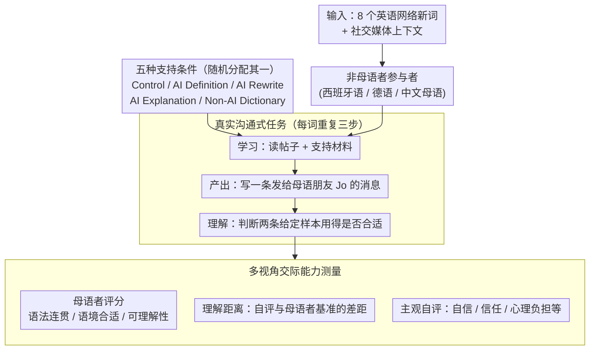

# Reheat Nachos for Dinner? Evaluating AI Support for Cross-Cultural Communication of Neologisms

**会议**: ACL2026  
**arXiv**: [2604.23842](https://arxiv.org/abs/2604.23842)  
**代码**: https://github.com/dayeonki/crosscultural_communication  
**领域**: audio_speech  
**关键词**: 跨文化沟通、网络新词、AI语言学习、交际能力、用户研究

## 一句话总结
本文通过 234 名非母语者和 144 名母语评价者的人类实验比较四类 AI/非 AI 支持，发现带语境解释的 AI Explanation 最能提升非母语者使用英语网络新词时的母语者评分，但学习者的自信和真实交际能力之间仍存在明显错位。

## 研究背景与动机
**领域现状**：网络新词和新兴俚语已经成为日常英语交流的一部分，例如 main character energy、delulu、reheat nachos 等表达往往承载社群语境、语气和文化身份。非母语者在跨文化沟通中会越来越多地求助于 AI 工具，让模型给出定义、改写原句或解释用法。

**现有痛点**：传统词典和教材更新慢，难以及时覆盖快速演化的网络新词；而已有 AI 评测多停留在选择题、翻译或静态理解任务，无法反映真实用户在看到新词后如何学习、写消息、判断语境是否合适。

**核心矛盾**：新词学习不是只知道字面定义，而是要知道何时能用、对谁能用、语气是否自然。AI 输出可能很流畅，但一旦解释缺少语境或产生错误，非母语者往往没有机制判断它是否可靠，容易把“感觉学会了”误当成“母语者也觉得自然”。

**本文目标**：作者把问题拆成三个层面：不同支持方式是否能帮助非母语者写出更自然的新词用法；非母语者的自评能否替代母语者评价；AI 支持能否缩小非母语者和母语者之间的交际能力差距。

**切入角度**：论文选择一个高度贴近真实使用的场景：非母语者在社交媒体帖子里遇到新词，借助某种支持学习后，给一个假想的母语朋友 Jo 写消息，再判断别人的写法是否合适。这个设计比离线问答更接近“学会一个词并把它用进对话”的过程。

**核心 idea**：用真实跨文化沟通任务和母语者评分来评估 AI 新词支持，而不是只看模型或学习者自己是否认为解释有用。

## 方法详解
本文本质上不是提出一个新模型，而是设计了一个生态效度较高的人类实验，用来比较不同 AI 支持方式对网络新词学习和使用的真实帮助。实验把“学习新词”拆成学习、产出、理解和外部评价四个环节，并同时收集非母语者自评与母语者评分，从而观察 AI 支持是否真的转化为交际能力。

### 整体框架
输入是一组英语网络新词及其社交媒体上下文，参与者是以西班牙语、德语或中文为第一语言的英语非母语者。每名参与者被随机分配到一种支持条件，在八个新词上重复执行三步：先在帖子和支持材料中学习新词，再写一个场景和一条发给母语朋友 Jo 的消息，最后判断两条给定写作样本中新词使用是否合适。随后，每条非母语者写作样本由两名美国英语母语者从语法/连贯性、语境合适性和可理解性等维度评分。

### 关键设计

**1. 真实沟通式任务设计：把新词评测从“知道定义”推进到“能否自然使用”**

网络新词的难点在语用和社群语境——单纯选择题测不出“母语者读起来是否自然”。实验因此把每个新词放进一个真实感较强的社交媒体帖子里：非母语者先学习，再写一条发给假想朋友 Jo 的消息（产出任务，衡量能不能用），还要判断另两条给定样本里新词用得是否合适（理解任务，衡量能不能判断别人用得对不对）。评测对象由此从“模型答案”转向“真实沟通结果”。

**2. 五种支持条件的可控比较：拆开 AI 的不同使用方式看谁真正有效**

用户实际用 AI 时不只问“这个词是什么意思”，还会要求解释、改写或举例。实验设 Control、AI Definition、AI Rewrite、AI Explanation 和 Non-AI Dictionary 五组：AI Definition 给词典式定义，AI Rewrite 把含新词帖子改写成简单英语，AI Explanation 用 3-5 句解释含义、语气、使用场景和受众，Non-AI Dictionary 提供 Merriam-Webster 的完整页面。分开比较这些交互模式，才能看出真正起作用的到底是低密度定义、简化上下文，还是带语境的用法说明。

**3. 多视角交际能力测量：显式暴露“自信提升但母语者不买账”的错位**

AI 工具常让用户“感觉更懂”，但这未必等于真实交际能力。测量因此分三层：母语者评分覆盖 well-formedness、contextual appropriateness、understandability 三个外部维度；非母语者的理解能力用其语境合适性评分与母语者基准的距离衡量；主观自评则包括 confidence、helpfulness、reliance、future trust、mental burden 和 task difficulty。三层同时收集，才能把“自信涨了、母语者评分却没跟着涨”的错位显式摆出来。

### 损失函数 / 训练策略
本文没有训练新模型，AI 支持材料由 GPT-4.1 按预设 prompt 生成。统计分析采用线性混合效应模型，固定效应包括支持条件、语言组、二者交互、英语社交媒体使用频率和新词初始熟悉度，随机截距包括参与者、母语评价者和新词。作者使用 Bonferroni 校正的平均边际效应报告显著性，并用置信区间补充解释。

## 实验关键数据

### 主实验
母语者评分显示，AI Explanation 是唯一在所有主要交际维度上都稳定优于 Control 的支持方式；Non-AI Dictionary 信息最全，但由于密度高、负担大，只在部分维度上显著提升。

| 条件 | Well-formedness | Contextual appropriateness | Understandability | 置信相关评分 |
|------|-----------------|----------------------------|-------------------|--------------|
| Control | 7.05 | 6.44 | 7.17 | 4.17 |
| AI Definition | 7.32 | 6.93 | 7.50 | 4.23 |
| AI Rewrite | 7.42 | 7.06 | 7.62 | 4.24 |
| AI Explanation | 7.74 | 7.43 | 7.98 | 4.23 |
| Non-AI Dictionary | 7.36 | 7.28 | 7.78 | 4.23 |

### 消融实验
论文不是模型消融，而是把不同支持形式作为“交互消融”。问卷结果显示，学习者最信任 Non-AI Dictionary，也觉得 AI Rewrite 和 AI Explanation 有帮助；但 AI Rewrite 的主观提升没有稳定转化为母语者评分。

| 支持方式 | Confidence ↑ | Reliance ↑ | Trust ↑ | Mental Burden ↓ | Task Difficulty ↓ |
|----------|--------------|------------|---------|-----------------|-------------------|
| AI Definition | 3.42 | 2.74 | 3.56 | 3.42 | 3.66 |
| AI Rewrite | 4.02 | 3.60 | 3.67 | 3.31 | 3.51 |
| AI Explanation | 4.04 | 3.40 | 3.88 | 3.44 | 3.46 |
| Non-AI Dictionary | 4.51 | 4.28 | 4.44 | 3.77 | 3.65 |

### 关键发现
- AI Explanation 的核心优势在于提供语境、语气、受众和用法边界，因此比短定义更能帮助非母语者写出母语者觉得自然的消息。
- 非母语者的理解判断没有显著随支持条件改善，平均与母语者基准的距离仍约为 2.22，说明“会写得更像样”不等于“能可靠判断别人用得对不对”。
- 非母语者自评不是可靠代理：AI Rewrite 能降低心理负担并提高自信，但实际母语者评分并没有同步显著提升。
- 母语者写作样本仍显著高于多数非母语者条件，说明单轮 AI 支持还不能完全弥合社群语境和自然表达的差距。

## 亮点与洞察
- 最有价值的设计是把 AI 语言学习评估落到“母语者读后怎么判断”上。它提醒我们，跨文化沟通工具不能只优化解释的流畅度，还要优化接收方眼中的自然度和合适性。
- 论文揭示了新词学习中的一个关键风险：错误或过窄的 AI 定义会诱导学习者字面使用。例如 reheat nachos 被解释成真实加热食物时，参与者会写出完全偏离俚语含义的消息。
- AI Explanation 的成功说明，轻量但高语境密度的说明比完整词典页更适合即时沟通场景。未来语言学习产品可以把“常见场景、语气、受众、反例”作为固定输出结构。
- 自评与外部评价错位的发现可迁移到写作辅助、翻译和跨文化邮件场景：用户觉得 AI 帮得多，不代表目标读者真的更容易理解。

## 局限与展望
- 实验只覆盖英语网络新词，以及西班牙语、德语、中文背景的英语非母语者，结论不一定能直接推广到其他语言对或更正式的跨文化沟通场景。
- AI 支持是单轮、英文解释，没有测试多轮追问、母语解释、检索增强或真实社交平台语料接入，这些都可能改变效果。
- 母语者评价虽然比自动评测更接近真实沟通，但仍是离线评分，不等于真实朋友之间的互动反馈。
- 未来可以加入“最小对比例子”和“典型误用提醒”，让 AI 不只解释正确用法，也明确告诉学习者哪些写法会显得生硬或误解。

## 相关工作与启发
- **vs 传统新词理解 benchmark**: 传统工作多用选择题、翻译或模型理解评测，本文直接看非母语者是否能在消息中使用新词，生态效度更高。
- **vs 词典式学习工具**: 词典提供权威定义和来源，但信息密度高、即时任务负担大；AI Explanation 用更短文本提供语用线索，在沟通任务中更有效。
- **vs LLM-as-judge 评价**: 论文附录发现 AI 评分整体高于母语者评分，说明自动评价可能高估非母语者写作质量，跨文化沟通任务仍需要谨慎引入人类接收方视角。

## 评分
- 新颖性: ⭐⭐⭐⭐☆ 用人类沟通实验评估 AI 新词支持很有启发，但模型方法本身不是重点创新。
- 实验充分度: ⭐⭐⭐⭐☆ 样本量、条件对照和母语者评分扎实，局限是语言和场景范围仍较窄。
- 写作质量: ⭐⭐⭐⭐☆ 研究问题、实验流程和讨论清晰，附录数据也较完整。
- 价值: ⭐⭐⭐⭐☆ 对 AI 语言学习、跨文化沟通辅助和用户自信校准都有直接参考价值。

<!-- RELATED:START -->

## 相关论文

- [\[ACL 2026\] Imperfectly Cooperative Human-AI Interactions: Comparing the Impacts of Human and AI Attributes in Simulated and User Studies](imperfectly_cooperative_human-ai_interactions_comparing_the_impacts_of_human_and.md)
- [\[NeurIPS 2025\] Policy-as-Prompt: Turning AI Governance Rules into Guardrails for AI Agents](../../NeurIPS2025/social_computing/policy-as-prompt_turning_ai_governance_rules_into_guardrails_for_ai_agents.md)
- [\[AAAI 2026\] Cross-modal Prompting for Balanced Incomplete Multi-modal Emotion Recognition](../../AAAI2026/social_computing/cross-modal_prompting_for_balanced_incomplete_multi-modal_emotion_recognition.md)
- [\[ICLR 2026\] Propaganda AI: An Analysis of Semantic Divergence in Large Language Models](../../ICLR2026/social_computing/propaganda_ai_an_analysis_of_semantic_divergence_in_large_language_models.md)
- [\[AAAI 2026\] From Imitation to Discrimination: Toward A Generalized Curriculum Advantage Mechanism Enhancing Cross-Domain Reasoning Tasks](../../AAAI2026/social_computing/from_imitation_to_discrimination_toward_a_generalized_curriculum_advantage_mecha.md)

<!-- RELATED:END -->
