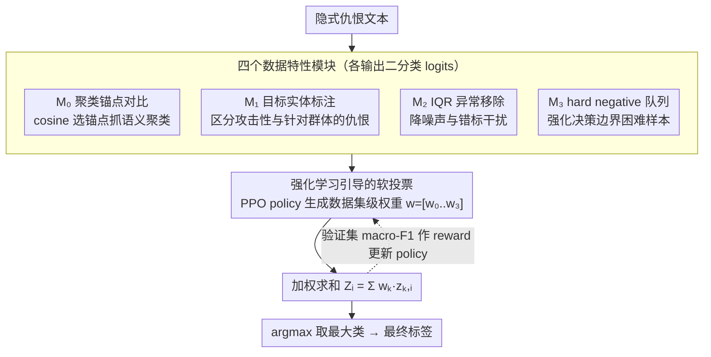

# RV-HATE: Reinforced Multi-Module Voting for Implicit Hate Speech Detection

**会议**: ACL2026  
**arXiv**: [2510.10971](https://arxiv.org/abs/2510.10971)  
**代码**: https://github.com/leeyejin1231/RV-HATE  
**领域**: 强化学习 / 内容安全 / 隐式仇恨言论检测  
**关键词**: 隐式仇恨言论检测, 多模块集成, PPO, 软投票, 对比学习

## 一句话总结
RV-HATE 把隐式仇恨言论检测拆成四个面向不同数据特性的 BERT 对比学习模块，再用 PPO 学习数据集特定的软投票权重，在五个 benchmark 上把平均 macro-F1 提升到 84.47%，比 SharedCon 平均高 1.8 个百分点。

## 研究背景与动机
**领域现状**：隐式仇恨言论检测比显式攻击更难，因为它往往依赖语境、目标指称、文化背景和隐含立场。已有方法包括交叉熵分类、监督对比学习、SharedCon 的聚类锚点对比学习，以及利用 hard negative 的 LAHN。

**现有痛点**：不同仇恨言论数据集来自不同平台和标注规范，语言风格、隐式程度、目标边界、噪声和错标比例都不同。许多方法采用固定训练策略，默认同一个模型能处理所有数据集特性，导致在某些数据集上收益有限。

**核心矛盾**：检测隐式仇恨需要同时关注上下文语义、目标实体、数据噪声和边界样本，但任何单一模块都可能偏向某类特征。把所有模块硬合成一个模型又会损失专业化。

**本文目标**：作者希望保留多个专门模块的互补性，并让系统根据具体数据集自动决定每个模块在最终预测中的权重。

**切入角度**：RV-HATE 将模块组合视为一个策略优化问题。四个分类器分别学习不同数据特性，PPO policy 生成满足非负且和为 1 的模块权重，验证集 macro-F1 作为 reward。

**核心 idea**：与其设计一个固定检测器，不如训练多个偏好的检测器，再让强化学习在数据集级别学习如何加权它们。

## 方法详解

### 整体框架
RV-HATE 想解决的问题是：不同隐式仇恨数据集的错误来源各不相同，单一模型照顾不过来。它的做法是先准备四个各有偏好的 BERT-base 对比学习模块，再用强化学习按数据集学一组软投票权重，把四个模块的二分类 logits 加权融合成最终预测。流程分三个阶段：第一阶段对每个数据集分别训练 $M_0$ 到 $M_3$ 四个模块；第二阶段在验证集上训练一个轻量 PPO policy，让它产生满足非负且和为 1 的权重 $w=[w_0,w_1,w_2,w_3]$；第三阶段推理时四个模块各自输出 logits，系统按权重求加权平均再取最大类作为标签。论文只从检测和数据集分析角度讨论仇恨言论识别，不提供生成、规避或放大有害内容的操作指导。

### 关键设计

**1. 四个数据特性模块：让每个专家盯住一种错误来源**

隐式仇恨数据集并不共享同一种失败模式——IHC 更依赖目标指称，Hateval 更受噪声影响，Toxigen 更依赖边界样本，所以与其用一个模型硬扛全部特性，不如让四个模块各自专精。$M_0$ 沿用 SharedCon 的聚类锚点对比学习，但改用 cosine similarity 选锚点来抓语义聚类；$M_1$ 在训练数据里标注群体、组织、地区等目标实体，帮助把“单纯有攻击性”和“针对某群体的仇恨”区分开；$M_2$ 用 IQR 把聚类中远离中心的异常样本移除，降低噪声和错标的干扰；$M_3$ 维护一个 hard negative queue，专门强化决策边界附近的困难样本。四者的错误模式互不重叠，正是后面投票能互补的前提。

**2. 强化学习引导的软投票：按数据集自动分配模块权重**

四个模块单看不一定都强，固定平均或手工调权又没法适配每个数据集的特性，于是 RV-HATE 把“怎么组合模块”本身建模成一个策略优化问题。每个模块对样本 $i$ 输出二分类 logits $z_{k,i}^{(h)}$，最终 logit 为加权和 $Z_i^{(h)}=\sum_{k=0}^{3}w_k z_{k,i}^{(h)}$。PPO policy 根据当前状态生成权重向量 $w$，soft voting 之后以验证集 macro-F1 作为 reward，用 clipped objective 稳定更新。因为权重是数据集级别学出来的，系统能在保留各模块专业化的同时，让噪声重的数据集多倚重 $M_2$、边界样本多的多倚重 $M_3$，把互补的视角组合起来。

**3. 可解释的数据集特性分析：用权重当诊断信号**

内容安全场景里，“模型为什么在某个数据集上有效”和 F1 本身一样重要。RV-HATE 不只报最终分数，还系统比较单模块、去掉某模块、等权投票、欧氏距离版本和 PPO 权重版本，并对照各数据集的实体标注比例、outlier 移除比例和错误类型分布。学出来的模块权重加上去模块实验，提供了一种粗粒度但可读的诊断：某个数据集如果更依赖目标实体或 outlier 清理，权重分布和掉点幅度就会把这种依赖暴露出来。

### 损失函数 / 训练策略
四个检测模块使用 BERT-base-uncased，SimCSE-BERT 作为文本 embedding 模型，训练 6 个 epoch。学习率从 $2e^{-5}$ 和 $3e^{-5}$ 中选择，温度为 0.3，聚类数从 20、75、125 中选择。强化学习阶段运行 10,000 steps，初始权重为 `[0.25, 0.25, 0.25, 0.25]`，约束权重为正且和为 1。所有实验用 3 个随机种子，报告 macro-F1，因为数据集类别不平衡。

## 实验关键数据

### 主实验
论文在 IHC、SBIC、DYNA、Hateval、Toxigen 五个数据集上对比 CE、SCL、SharedCon、LAHN 和 RV-HATE。

| 方法 | IHC | SBIC | DYNA | Hateval | Toxigen | 平均 macro-F1 |
|------|-----|------|------|---------|---------|---------------|
| CE | 77.70 | 83.80 | 78.80 | 81.11 | 90.06 | 82.29 |
| SCL | 77.81 | 82.92 | 80.39 | 81.28 | 90.75 | 82.63 |
| SharedCon | 78.50 | 84.30 | 79.10 | 80.24 | 91.21 | 82.67 |
| LAHN | 78.40 | 83.98 | 79.64 | 80.42 | 90.42 | 82.57 |
| RV-HATE | 79.07 | 84.62 | 81.82 | 83.44 | 93.41 | 84.47 |

相较 SharedCon，RV-HATE 平均提升 1.8 个百分点；在 Hateval 上比 CE 高 2.33 个百分点，在 Toxigen 上比 SharedCon 高 2.2 个百分点。考虑到该任务常在 80% 左右进入平台期，这个幅度有实际意义。

### 消融实验

| 配置 | IHC | SBIC | DYNA | Hateval | Toxigen | 平均 | 说明 |
|------|-----|------|------|---------|---------|------|------|
| combined modules | 77.32 | 81.31 | 76.50 | 81.26 | 92.02 | 81.64 | 单模型融合所有模块，专业化丢失 |
| equal weights | 78.58 | 84.06 | 81.07 | 82.52 | 92.69 | 83.78 | 固定 0.25 权重 |
| 欧氏距离版本 | 78.90 | 82.95 | 81.64 | 83.19 | 93.36 | 84.01 | 用 L2 替代 cosine |
| RV-HATE | 79.07 | 84.62 | 81.82 | 83.44 | 93.41 | 84.47 | PPO 权重 + cosine |

| 模块设置 | 平均 macro-F1 | 关键信息 |
|----------|---------------|----------|
| $M_0$ 单独 | 82.68 | cosine 聚类对比学习基础模块 |
| $M_1$ 单独 | 82.43 | 目标实体标注不是所有数据集都收益 |
| $M_2$ 单独 | 82.89 | outlier 处理对噪声数据有帮助 |
| $M_3$ 单独 | 83.00 | hard negative 边界建模最强单模块 |
| RV-HATE 全模块 | 84.47 | 模块互补后最佳 |
| 去掉 $M_3$ | 83.99 | 平均下降最大，说明困难负样本最关键 |

### 关键发现
- 把四个模块训练成一个 combined model 反而平均降到 81.64，说明“模块专业化 + 投票组合”比“硬塞进一个模型”更适合该任务。
- PPO 权重相比等权投票平均提升 0.68 个百分点，说明不同数据集确实需要不同模块组合。
- cosine similarity 比 Euclidean distance 平均高 0.46 个百分点，符合高维语义 embedding 更看重方向的直觉。
- 计算开销主要来自四个 BERT forward，PPO policy 只有约 4.8K 参数，训练额外耗时约 5-10 分钟；推理延迟约为单模型的线性倍数。

## 亮点与洞察
- 论文没有把“泛化到所有数据集”当作唯一目标，而是承认数据集差异本身很重要。这个观点对内容安全很现实，因为标注标准和平台语境经常决定模型行为。
- 强化学习在这里不是用来生成文本，而是用来学习 ensemble 权重，风险低且目标明确。PPO 的 action space 很小，reward 也直接对应验证集 macro-F1。
- 模块消融给出了可解释性：某个数据集如果更依赖目标实体或 outlier 清理，权重和去模块实验能暴露这种依赖。
- 对实际系统的启发是，内容安全分类器可以设计成“多专家 + 数据集/域自适应权重”，而不是在所有平台上部署同一个静态分类器。

## 局限与展望
- $M_1$ 目标标注模块在机器生成样本上并不稳定，说明实体标注策略对风格和数据分布敏感。
- 推理时需要四个 BERT-base 前向，虽然可以并行，但对低延迟内容审核系统仍是额外成本。
- 权重是数据集级优化，不是逐样本动态路由。对于同一数据集中不同子社区或话题，可能还需要 finer-grained routing。
- 数据集本身包含标注歧义和错标，macro-F1 提升不能完全解决“标签是否合理”的问题。未来可以把不确定性、人类分歧和跨文化标注差异纳入训练目标。

## 相关工作与启发
- **vs SharedCon**: SharedCon 通过聚类锚点学习共享语义模式，RV-HATE 继承这个方向但改用 cosine similarity，并增加目标、outlier、hard negative 等专门模块。
- **vs LAHN**: LAHN 强调 hard negative，RV-HATE 把 hard negative 作为一个专家模块，再用投票和其他模块互补。
- **vs 单模型多功能训练**: combined modules 结果较差，说明隐式仇恨检测中模块专业化很重要，统一训练会让特征偏好相互冲突。
- **vs 常规 ensemble**: 等权投票已经有效，但 PPO 权重进一步捕捉数据集差异，使 ensemble 更可解释也更强。

## 评分
- 新颖性: ⭐⭐⭐⭐☆ 把 PPO 用在模块权重学习上不复杂，但与数据集特性分析结合得很贴合。
- 实验充分度: ⭐⭐⭐⭐☆ 五个数据集、多个 baseline、变体和模块消融较完整，但跨语言和跨文化外推还需更多验证。
- 写作质量: ⭐⭐⭐⭐☆ 方法拆解清晰，模块贡献解释充分；个别附录错误样例不适合在高层应用场景中过度展开。
- 价值: ⭐⭐⭐⭐☆ 对内容安全检测系统的模块化和域自适应设计有实际参考价值，尤其适合隐式、边界模糊的分类任务。

<!-- RELATED:START -->

## 相关论文

- [\[ACL 2025\] ImpliHateVid: Implicit Hate Speech Detection in Videos](../../ACL2025/social_computing/implihatevid_video_hate.md)
- [\[ACL 2026\] Explain the Flag: Contextualizing Hate Speech Beyond Censorship](explain_the_flag_contextualizing_hate_speech_beyond_censorship.md)
- [\[ACL 2026\] Confident, Calibrated, or Complicit: Safety Alignment and Ideological Bias in LLM Hate Speech Detection](confident_calibrated_or_complicit_safety_alignment_and_ideological_bias_in_llm_h.md)
- [\[ACL 2026\] PSK@EEUCA 2026: Fine-Tuning Large Language Models with Synthetic Data Augmentation for Multi-Class Toxicity Detection in Gaming Chat](pskeeuca_2026_fine-tuning_large_language_models_with_synthetic_data_augmentation.md)
- [\[ACL 2026\] MM-StanceDet: Retrieval-Augmented Multi-modal Multi-agent Stance Detection](mm-stancedet_retrieval-augmented_multi-modal_multi-agent_stance_detection.md)

<!-- RELATED:END -->
