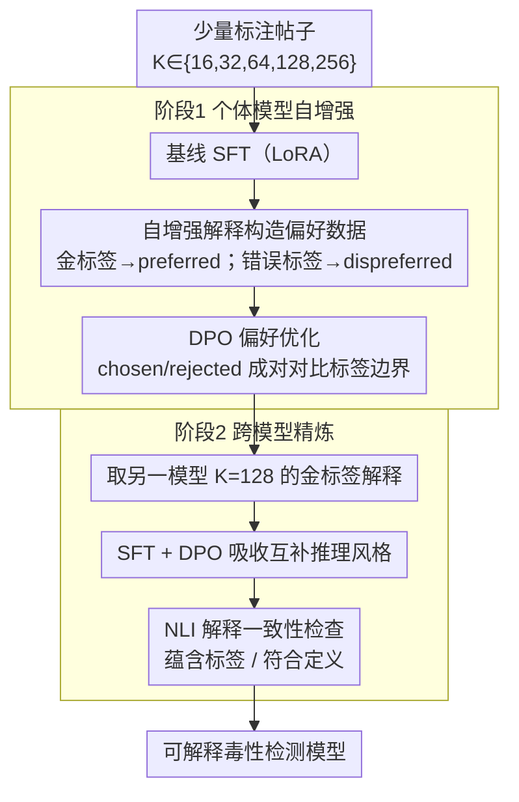

# SMARTER: A Data-efficient Framework to Improve Toxicity Detection with Explanation via Self-augmenting Large Language Models

**会议**: ACL2026  
**arXiv**: [2509.15174](https://arxiv.org/abs/2509.15174)  
**代码**: https://github.com/hnghiem-nlp/hate_dpo_public  
**领域**: 社会计算 / 内容审核 / 可解释 NLP  
**关键词**: 毒性检测, 可解释分类, 自增强训练, DPO, 跨模型精炼

## 一句话总结
SMARTER 用少量标注样本让 LLM 为正确和错误标签分别生成解释，再用偏好优化和跨模型训练提升可解释毒性检测，在 3 个数据集上以 6%-57% 的训练数据达到全量训练 86%-100% 的性能。

## 研究背景与动机
**领域现状**：社交平台需要检测仇恨、冒犯和隐性有害表达等内容。传统分类器能给出标签，但往往缺少可读解释；LLM 可以同时输出分类和解释，因此更适合需要透明度和人工复核的内容审核场景。

**现有痛点**：毒性检测标签空间细、边界模糊，尤其隐性有害表达依赖语境和定义。高质量标注数据昂贵，且不同平台的标准会随语言趋势变化。商业 LLM 零样本或少样本调用虽方便，但成本高、可控性弱、结果方差大，也不一定能稳定产出合规解释。

**核心矛盾**：低资源场景既需要高准确率，又需要人能理解的解释。直接 SFT 少量样本容易过拟合，纯 prompting 又不稳定；如何让模型利用自己已有的生成能力，在少量监督下构造更有用的训练信号，是本文的核心问题。

**本文目标**：作者提出一个两阶段框架，先让单个模型通过自增强解释和 DPO 提升分类，再让不同架构模型互相学习解释风格与推理模式，从而在少量数据下获得可解释、可部署的内容审核模型。

**切入角度**：论文利用“给定正确标签的解释应优于给定错误标签的解释”这一结构化偏好。对每条有标签帖子，模型不仅生成金标签解释，也为其他错误标签生成反例解释，由此自然形成 chosen/rejected 数据。

**核心 idea**：把 LLM 自己为正确/错误标签生成的解释转化为偏好优化数据，再通过跨模型精炼吸收互补模型的解释能力。

## 方法详解

### 整体框架
SMARTER 分两阶段。第一阶段是个体模型自增强（individual self-augmentation）：在每个任务上采样 $K \in \{16,32,64,128,256\}$ 的少量训练样本，先用这些样本 SFT 模型，再让模型基于正确标签和错误标签分别生成解释，最后用 DPO 或 KTO 做偏好优化。第二阶段是跨模型精炼（cross-model refinement）：选取一个模型在 $K=128$ 时生成的解释，训练另一个模型，让弱模型吸收强模型或互补模型的推理风格，并用 NLI 检查解释与标签是否一致。

实验使用 3 个任务：HateXplain、Latent Hate 和 Implicit Hate。模型包括 Llama-3.1-8B-Instruct 与 COT-T5-XL。评价指标为 macro-F1，因为类别不平衡和多类语义边界都很重要。

### 关键设计

**1. 自增强解释构造偏好数据：把"错误标签下的解释"也变成训练信号**

低资源场景下高质量标注昂贵，直接 SFT 少量样本又容易过拟合，于是 SMARTER 不去扩充人工标注，而是让模型自己造对比数据。对每个帖子，模型根据金标签生成一条 preferred explanation，同时根据每个错误标签各生成一条 dispreferred explanation。DPO 把正确标签解释与错误标签解释配成 chosen/rejected 对，KTO 则把正确解释当正样本、错误解释当负样本。这样做的关键直觉是：内容审核解释天然依附标签定义，错误标签下的解释恰恰会暴露类别之间的混淆点，用它们做对比能逼模型去学类别边界，而不是死记那几条正例。

**2. DPO 优先于 KTO：用成对对比突出细粒度的标签边界**

毒性检测的难点往往是相邻标签之间的细微语义差别，所以偏好优化方式的选择直接影响效果。DPO 用成对的 preferred/rejected 解释，直接回答"同一个帖子下哪个标签解释更合理"；KTO 用 listwise 的接受/拒绝信号，粒度更粗，只判断单条解释好不好。正因为成对对比更能把类别边界顶出来，实验中 DPO 在 $K=256$ 时仍持续提升，而 KTO 经常无效甚至拖累性能——这印证了对该任务而言"两个相近标签谁更贴合定义"比"单条解释像不像话"更重要。

**3. 跨模型精炼与解释一致性检查：迁移互补优点，同时审计解释漂移**

不同架构模型不只是性能有差，解释风格也不同——Llama 的解释在部分类别更受人工偏好，T5 的 encoder-decoder 又可能更稳定。SMARTER 让 Llama 与 T5 在 held-out 的 128-shot 数据上互相生成金标签解释，再用对方的解释对自己做 SFT 与 DPO，让弱模型吸收强模型的推理风格。但跨模型迁移可能带来解释与标签不一致，因此它额外用 NLI 检查解释是否蕴含预测标签、是否符合标签定义，把这种漂移监控起来，避免"学了风格却丢了一致性"。

### 损失函数 / 训练策略
基础 SFT 使用 LoRA，rank 为 64、alpha 为 128、dropout 为 0.05，目标模块为投影层中的 q 和 v。Base SFT 训练 3 个 epoch，学习率 $3 \times 10^{-4}$。DPO 默认使用 TRL 的 sigmoid loss，$\beta=0.1$；KTO 也使用 $\beta=0.1$。推理温度为 0，带解释分类最大 512 tokens，不带解释分类最大 20 tokens。

## 实验关键数据

### 主实验
K=256 的结果显示，SMARTER 在少量数据下已能超过商业模型 zero-shot 和 16-shot ICL，并在 Latent Hate 上超过全量训练基线。

| 方法 | HateXplain F1 / 数据比例 | Latent Hate F1 / 数据比例 | Implicit Hate F1 / 数据比例 | 观察 |
|------|--------------------------|----------------------------|------------------------------|------|
| Llama_DPO-256 | 0.64 / 6% | 0.69 / 7% | 0.60 / 57% | 三个任务中综合最强，Latent Hate 达到该表最佳 |
| T5_DPO-256 | 0.62 / 6% | 0.65 / 7% | 0.59 / 57% | 弱于 Llama，但数据效率同样明显 |
| Llama_Full | 0.72 / 100% | 0.62 / 100% | 0.67 / 100% | 全量训练在 HateXplain 和 Implicit Hate 最强 |
| ModernBERT | 0.70 / 100% | 0.61 / 100% | 0.64 / 100% | 强分类器，但不生成解释 |
| GPT-5-chat zero-shot | 0.56 / - | 0.51 / - | 0.58 / - | 商业模型零样本并不稳定领先 |
| GPT-5-chat 16-shot ICL | 0.62±0.01 / - | 0.60±0.06 / - | 0.40±0.11 / - | 少样本 ICL 在复杂任务上方差大 |

作者还做了贡献拆解：HateXplain 上 off-the-shelf Llama 为 0.52，加入 HateCOT 预训练后的 K=256 baseline 到 0.58，SMARTER 的 DPO 自增强进一步到 0.64，说明收益不只是来自通用预训练或种子解释。

### 消融实验
跨模型精炼表明，T5 能明显从 Llama 的解释中受益，而 Llama 反向学习 T5 时经常受损。这说明“互学”不是无条件有效，需要验证集选择。

| 设置 | HateXplain F1 | Latent Hate F1 | Implicit Hate F1 | 结论 |
|------|---------------|----------------|------------------|------|
| T5 单模型 DPO-256 | 0.62 | 0.65 | 0.59 | T5 自增强后的基线 |
| T5 + Llama 输出 SFT+DPO | 0.66 | 0.66 | 0.61 | 全面超过 T5 单模型，也超过部分 Llama 单模型结果 |
| Llama 单模型 DPO-256 | 0.64 | 0.69 | 0.60 | Llama 自增强后的基线 |
| Llama + T5 输出 | 未超过单模型 | 部分任务短暂提升 | 未形成稳定增益 | T5 输出不一定适合增强 Llama |

解释质量方面，人工评测在 HateXplain 342 个样本上比较 T5 与 Llama。Normal 类中 Llama 解释被偏好 73 次、T5 25 次；Offensive 和 Hate 类两者接近。NLI 一致性检查显示，多数解释与预测标签和定义保持一致，Entail 基本超过 96%，但跨模型训练会让 Contradiction 略升 2%-3%。

| 数据集/模型 | 训练方式 | 标签一致性 Entail↑ | 标签矛盾 Contra.↓ | 定义一致性 Entail↑ | 定义矛盾 Contra.↓ |
|-------------|----------|-------------------|-------------------|--------------------|--------------------|
| HateXplain T5 | DPO | 99.2 | 0.8 | 98.2 | 1.5 |
| HateXplain T5 | XMOD | 96.7 | 1.5 | 99.0 | 0.9 |
| Latent Hate Llama | DPO | 97.3 | 2.7 | 97.3 | 2.3 |
| Latent Hate Llama | XMOD | 96.8 | 3.2 | 97.5 | 2.5 |
| Implicit Hate T5 | DPO | 99.6 | 0.4 | 99.0 | 1.0 |
| Implicit Hate T5 | XMOD | 98.3 | 1.4 | 97.5 | 2.0 |

### 关键发现
- DPO 自增强在 K≤64 时也能带来提升，低资源价值明显；T5 在 Latent Hate 和 Implicit Hate 上能缩小与 Llama 的差距。
- K=256 时 DPO 仍继续提升，而 KTO 在 HateXplain 上基本无效，在 Latent Hate 和 Implicit Hate 上还会拖累性能。
- 商业模型 16-shot ICL 不一定优于 zero-shot，例如 GPT-4o-mini 在 HateXplain 从 0.50 降到 0.29，说明少样本提示在细粒度有害内容任务上可能很脆弱。
- 跨模型训练可以让弱模型吸收强模型推理风格，但也会引入轻微解释不一致，因此部署中需要周期性人工或 NLI 审核。

## 亮点与洞察
- 论文最巧妙的地方是把“错误标签解释”也变成训练资源。它不是简单数据增强，而是把同一输入下的类别边界显式对比出来。
- DPO 优于 KTO 的结果很符合任务直觉：内容审核常常不是判断解释是否“像话”，而是比较两个相近标签下哪种解释更贴合定义。
- 跨模型精炼揭示了模型之间不只是性能差异，也有解释风格差异。T5 可以吸收 Llama 的推理模式，但 Llama 不一定受益于 T5。
- 论文没有只追求 F1，还用人工偏好和 NLI 一致性检查解释质量，这对可解释内容审核非常关键。

## 局限与展望
- 数据全部是英文，跨语言毒性表达、文化语境和平台规范都可能显著改变标签边界。
- 只比较了 Llama 和 T5 两个模型，跨模型精炼的结论不一定推广到更多架构或更大模型。
- 人工解释偏好只在 HateXplain 上做，且预算有限；其他两个更细粒度任务缺少同等人工验证。
- 自增强依赖模型先生成解释，若模型初始偏差强，错误标签解释可能强化错误边界或偏见。
- 内容审核本身有滥用风险，模型输出必须与人类审核、申诉机制和偏见审计配套，不能作为自动压制表达的唯一依据。

## 相关工作与启发
- **vs 传统毒性分类器**: ModernBERT 等分类器性能强但解释能力有限，SMARTER 更适合需要透明理由和人工复核的流程。
- **vs commercial ICL**: 商业模型调用部署简单，但 few-shot 方差大、成本高、可控性弱；SMARTER 用开源模型提供更稳定可控的本地方案。
- **vs Self-Instruct / Self-Refine**: 这些方法通常生成更多正向数据，SMARTER 的特色是同时生成正确与错误标签解释，形成偏好对。
- **启发**: 对其他细粒度社会计算任务，如谣言分类、立场检测和政策违规判断，也可以把 label definition 下的“反事实解释”作为低资源对齐信号。

## 评分
- 新颖性: ⭐⭐⭐⭐☆ 自增强解释加 DPO 的想法不复杂，但用于可解释毒性检测的偏好数据构造很实用。
- 实验充分度: ⭐⭐⭐⭐☆ 三个任务、两类模型、商业基线、跨模型训练和解释一致性分析较完整；跨语言和更多人工评估仍不足。
- 写作质量: ⭐⭐⭐⭐☆ 方法线清楚，实验表格信息量大；部分 figure 结果需要结合正文解读。
- 价值: ⭐⭐⭐⭐⭐ 对低资源、可解释、可控的内容审核模型训练有直接应用价值，也给“用错误解释做偏好优化”提供了可迁移范式。

<!-- RELATED:START -->

## 相关论文

- [\[ACL 2026\] PSK@EEUCA 2026: Fine-Tuning Large Language Models with Synthetic Data Augmentation for Multi-Class Toxicity Detection in Gaming Chat](pskeeuca_2026_fine-tuning_large_language_models_with_synthetic_data_augmentation.md)
- [\[ICML 2026\] Self-Debias: Self-correcting for Debiasing Large Language Models](../../ICML2026/social_computing/self-debias_self-correcting_for_debiasing_large_language_models.md)
- [\[ACL 2026\] Inertia in Moral and Value Judgments of Large Language Models](inertia_in_moral_and_value_judgments_of_large_language_models.md)
- [\[ACL 2026\] ToxiTrace: Gradient-Aligned Training for Explainable Chinese Toxicity Detection](toxitrace_gradient-aligned_training_for_explainable_chinese_toxicity_detection.md)
- [\[ACL 2026\] ClaimDB: A Fact Verification Benchmark over Large Structured Data](claimdb_a_fact_verification_benchmark_over_large_structured_data.md)

<!-- RELATED:END -->
