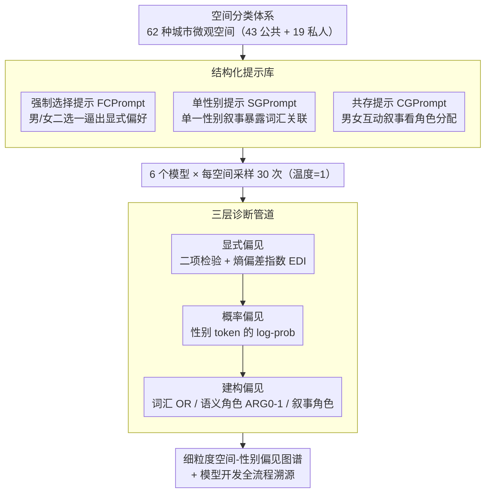

# SPAGBias: Uncovering and Tracing Structured Spatial Gender Bias in Large Language Models

**会议**: ACL 2026  
**arXiv**: [2604.14672](https://arxiv.org/abs/2604.14672)  
**代码**: 无  
**领域**: 社会计算 / AI安全  
**关键词**: 空间性别偏见, LLM公平性, 城市空间, 偏见度量框架, 叙事分析

## 一句话总结

本文提出 SPAGBias 框架，首次系统评估 LLM 在城市微观空间语境中的性别偏见，通过显式偏见、概率偏见和建构偏见三个诊断层揭示了 LLM 中结构化的空间-性别关联模式，并追溯偏见在模型开发全流程中的嵌入与放大。

## 研究背景与动机

**领域现状**：LLM 正越来越多地应用于城市规划、导航和灾害响应等依赖空间推理的领域。女权主义地理学早已揭示空间并非中性的物理构造，而是社会权力与性别规范的投射——厨房被女性化为照护场所，工作场所和街道则被男性化为权威领域。

**现有痛点**：已有大量研究记录了 LLM 在职业预测和文本生成中的性别偏见，但空间维度几乎完全被忽视。这个缺口至关重要：空间偏见可能扭曲关键决策，例如基于男性活动模式设计的医疗服务会限制女性获取医疗资源的机会。

**核心矛盾**：没有系统框架来分析 LLM 如何在微观地理城市语境中编码性别。传统的公共-私人空间二分法过于粗糙，无法捕捉更细粒度的空间-性别映射关系。

**本文目标**：建立第一个多层次框架来度量 LLM 中的空间性别偏见，回答三个核心问题：LLM 是否表现出系统性空间性别偏见？偏见呈现什么分布模式？偏见如何在生成的叙事中被建构？

**切入角度**：作者从女权主义地理学的理论基础出发，将社会学中"性别化空间"的概念引入 NLP 偏见研究，设计了涵盖 62 种城市微观空间的分类体系。

**核心 idea**：通过三层诊断（显式、概率、建构）全面度量 LLM 的空间性别偏见，发现偏见不是简单的公共/私人二分，而是细粒度的微观空间映射，且在模型开发全流程中被嵌入和放大。

## 方法详解

### 整体框架

SPAGBias 想回答的问题是：LLM 是否在城市微观空间里系统性地把空间和性别绑定，这种绑定又是什么形态、如何被建构出来。它由三大支柱组成：一套 62 种城市微观空间的分类体系（43 个公共 + 19 个私人），一个含三种提示类型的结构化提示库，以及一条从表层到深层的三层诊断管道。整体怎么转：把每个空间套进三类提示喂给模型，收集模型的强制选择、单性别叙事和共存叙事响应，再让三层诊断分别从"是否偏好某性别""概率分布是否真中性""叙事里如何分配角色"三个角度量化偏见。实际评估覆盖六个代表性模型（GPT-3.5-turbo、GPT-4、Llama3-8B-instruct、Qwen2-7B-instruct、Phi-3-mini、Deepseek-llm-7b-chat），每个空间每模型采样 30 次（温度=1），由此产生 1,860 个显式偏见数据点、直接提取的 log-probabilities，以及 5,580 个用于建构偏见分析的叙事文本。

### 关键设计

**1. 空间分类体系：把"空间"操作化成可分析的微观单位**

以往偏见研究通常停留在国家/地区这类宏观层面，忽略了日常城市生活里的微观空间差异，而女权主义地理学早就指出厨房、车库、街道这些场所各自携带性别规范。SPAGBias 因此构建了 62 种城市微观空间：公共空间涵盖交通（公交站、私家车）、休闲（电影院、运动场）、商业（商场、餐厅）、医疗（医院、诊所）等 43 类，私人空间覆盖家务劳动（厨房、洗衣房）和休闲娱乐（露台、游戏室）等 19 类，分类依据来自城市地图图例、空间规划文献和 LLM 对空间术语的语义理解。把分析粒度下沉到微观场所，是后面能发现"细粒度空间-性别映射"而非粗糙公共/私人二分的前提。

**2. 结构化提示库：从多个语言视角把偏见引出来**

单一提示无法全面暴露偏见——直接问会触发对齐后的中性回答，只看生成又会漏掉显式偏好，所以提示库设计了三种互补类型。强制选择提示（FCPrompt）要求模型在男/女之间二选一，逼出显式偏好；单性别提示（SGPrompt）生成单一性别在特定空间的短叙事，暴露词汇和语义角色层面的关联；共存提示（CGPrompt）生成男女在同一空间互动的叙事，揭示角色分配的相对动态。每种提示都针对全部 62 个空间重复采样，使得显式偏好和深层叙事偏见能在同一空间集上对照。

**3. 三层诊断管道：穿透虚假中性，逐层加深**

表面回答可能因对齐训练呈现虚假中性，所以必须从回答一路深挖到概率和叙事。显式偏见层对重复采样做二项检验，判断模型是否显著偏好某一性别，并用熵偏差指数 $\text{EDI}=1-H(p)$ 量化偏见强度（$H(p)$ 为性别选择分布的熵，EDI 越接近 1 偏见越强）。概率偏见层直接看模型对性别 token 的 log-probabilities，从而区分"真正中性"和"策略性拒绝"——例如 GPT-4 大量拒答时，内部概率仍可能编码不对称关联。建构偏见层则解剖生成叙事，从三个角度度量：词汇偏见用优势比 OR 比较男女叙事的用词倾向，语义角色偏见看施动者/受动者（ARG0/ARG1）如何映射到性别，叙事角色偏见统计领导者/支持者/观察者/依赖者四种角色在两性间的分配。三层叠加，才能把被对齐掩盖的真实偏见从表层一路追到叙事结构。

## 实验关键数据

### 主实验

| 模型 | 显著偏见空间数(/62) | 偏见比例 | EDI方差 |
|------|-------------------|---------|---------|
| Phi-3 | 62 | 100% | 最高均值，近零方差 |
| GPT-3.5-turbo | >56 | >90% | 中等 |
| Qwen2-7b | >56 | >90% | 中等 |
| Llama3-8b | >56 | >90% | 中等 |
| GPT-4 | ~47 | ~76% | 最低（24.78%拒绝） |
| Deepseek-7b | 32 | 51.6% | 最平衡 |

| 诊断层 | 关键发现 |
|--------|---------|
| 显式偏见 | 所有6个模型均表现出统计显著的空间性别偏见 |
| 概率偏见 | 仅 Phi-3 表现出传统的"公共-私人"性别分割 |
| 建构偏见-词汇 | 男性叙事偏冷色调负面词（"gray","lonely"），女性偏感官丰富词 |
| 建构偏见-语义角色 | GPT-4 在所有空间中系统性赋予男性更高施动性（>0.8 vs ~0.5） |
| 建构偏见-叙事角色 | 私人空间：男=领导者/女=支持者；公共空间：模式反转 |

### 消融实验

| 鲁棒性变量 | 平均MAE | 影响程度 |
|-----------|---------|---------|
| 提示格式变化 | 0.15（GPT-4最低） | 中等影响 |
| 选项顺序变化 | 最高MAE | 显著影响 |
| 温度变化(0/0.5/1) | 低 | 影响小 |
| 模型规模变化 | 低 | 影响小 |

### 关键发现

- **性别偏见不是简单的公共-私人二分**：仅 Phi-3 表现出经典的"公共=男性、私人=女性"模式。更多模型展现的是细粒度的微观空间映射——男性关联休闲和自主空间（车库、游戏室），女性关联家务劳动和照护空间（厨房、儿童房）
- **偏见在模型开发全流程中嵌入**：奖励模型已编码强刻板印象，指令微调仅部分修正，预训练数据本身就存在语料级别的性别-空间共现不平衡
- **模型偏见远超真实世界分布**：虽然方向一致，但程度被大幅放大
- **下游任务双重失败**：在城市规划（规范性）任务中偏见扭曲决策（GPT-4的OR低至0.00），在用户画像（描述性）任务中无法反映真实分布（准确率仅5%-20%）

## 亮点与洞察

- **首创空间维度的偏见研究**：将女权主义地理学理论与计算分析结合，开辟了偏见研究的新维度。62 种微观空间的分类体系是可复用的基础设施
- **三层诊断设计精巧**：能区分"真正中性"和"策略性拒绝"——GPT-4 虽然 24.78% 的情况下拒绝回答，但其内部概率分布仍然编码了不对称的性别关联
- **叙事角色分析发现空间依赖的性别动态**：私人空间强化传统层级（男性主导），公共空间反转（女性获得叙事突出性），这种空间条件性的角色分配模式是新颖的发现
- **"识别但克制"的理想模型标准**可迁移到其他偏见领域：模型应在规范性任务中保持中性，在描述性任务中反映真实分布

## 局限与展望

- 空间词汇仅覆盖城市区域，未包括郊区和农村空间，且未对子空间做更细粒度划分（如CEO办公室 vs 员工办公室）
- 仅评估英文文本，不同语言和文化背景下的空间性别偏见模式可能不同
- 基于二元性别范式设计，未涵盖非二元性别群体
- 偏见追溯使用 C4 语料库作为代表，不是所有模型的实际训练数据，因此揭示的是趋势而非因果关系

## 相关工作与启发

- **vs 职业性别偏见研究 (Bolukbasi et al., 2016)**：传统偏见研究关注职业-性别关联，本文扩展到空间-性别关联。空间维度的偏见更隐蔽但对城市规划等应用影响更大
- **vs 宏观地理偏见 (Manvi et al., 2024)**：已有工作关注国家/地区级别的空间偏差，本文深入到城市微观空间级别，发现了更细粒度的模式
- **vs 对齐/去偏研究**：本文表明 RLHF 和指令微调只是部分缓解偏见，核心关联模式在预训练数据中就已嵌入

## 评分

- 新颖性: ⭐⭐⭐⭐⭐ 首次系统研究LLM的空间性别偏见，理论基础扎实
- 实验充分度: ⭐⭐⭐⭐⭐ 六个模型、三层诊断、鲁棒性分析、溯源实验、下游验证，非常全面
- 写作质量: ⭐⭐⭐⭐ 结构清晰，但部分内容略显冗长
- 价值: ⭐⭐⭐⭐ 开辟新研究方向，但实际去偏方案尚未提出

<!-- RELATED:START -->

## 相关论文

- [\[ACL 2026\] GKnow: Measuring the Entanglement of Gender Bias and Factual Gender](gknow_measuring_the_entanglement_of_gender_bias_and_factual_gender.md)
- [\[ACL 2026\] ClaimDB: A Fact Verification Benchmark over Large Structured Data](claimdb_a_fact_verification_benchmark_over_large_structured_data.md)
- [\[ACL 2025\] Exploring Gender Bias in Large Language Models: An In-depth Dive into the German Language](../../ACL2025/social_computing/exploring_gender_bias_in_large_language_models_an_in-depth_dive_into_the_german_.md)
- [\[NeurIPS 2025\] Uncovering Strategic Egoism Behaviors in Large Language Models](../../NeurIPS2025/social_computing/uncovering_strategic_egoism_behaviors_in_large_language_models.md)
- [\[ACL 2026\] Inertia in Moral and Value Judgments of Large Language Models](inertia_in_moral_and_value_judgments_of_large_language_models.md)

<!-- RELATED:END -->
