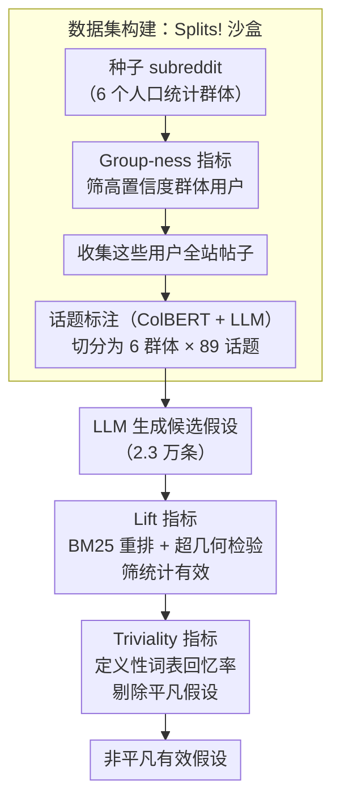

# Splits! Flexible Sociocultural Linguistic Investigation at Scale

**会议**: ACL 2026  
**arXiv**: [2504.04640](https://arxiv.org/abs/2504.04640)  
**代码**: [GitHub](https://github.com/ecaplan/splits) (代码+数据+demo)  
**领域**: 社会语言学 / 计算社会科学  
**关键词**: 社会文化语言现象, Reddit数据集, 假设过滤, 词汇分析, 人口统计学

## 一句话总结
提出构建社会语言学"沙盒"的方法，从 Reddit 构建了按人口统计群体和讨论话题双重切分的 970 万帖子数据集 Splits!，并设计了基于 lift 和 triviality 的两阶段过滤流程，从 2.3 万条 LLM 生成的候选假设中高效筛选出值得深入研究的社会文化语言现象。

## 研究背景与动机

**领域现状**：计算社会科学通过社交媒体数据研究不同群体的语言使用差异（如 AAVE 代码切换、犹太英语中的意第绪语词汇等），但这类研究通常需要针对特定群体/话题进行定制化数据收集和实验设计，成本高且难以快速原型化。

**现有痛点**：研究者需要大量前期投入来验证一个社会语言学假设。自动化假设生成（如 LLM）可以产生大量候选假设，但关键瓶颈在于：如何从成千上万的机器生成假设中高效找到真正值得深入研究的那些？很多统计显著的假设实际上是平凡的（如"犹太人更多提到犹太教"）。

**核心矛盾**：统计显著性 ≠ 研究价值。大量平凡假设可以通过数据验证获得高显著性，但对社会科学没有洞察价值。需要一种区分"统计上有效"和"学术上有趣"的自动化方法。

**本文目标**：(1) 构建一个灵活的社会语言学探索"沙盒"数据集；(2) 设计自动化过滤流程区分有趣假设和平凡假设。

**切入角度**：将社会语言现象（SLP）形式化为"群体 A 在讨论话题 t 时比群体 B 更多使用词汇集 L"，用 BM25 检索 + lift 指标量化统计有效性，用语义相似度量化平凡度。

**核心 idea**：用人口统计 × 话题的双重切分构建沙盒，用 lift + triviality 两阶段过滤从大量候选假设中筛选出非平凡的有效假设。

## 方法详解

### 整体框架
分为两大部分：(1) 数据集构建——通过 seed subreddit → seed user → 全站帖子收集 → 话题标注的流水线构建 Splits! 数据集，按 6 个人口统计群体 × 89 个话题切分；(2) 假设过滤——对候选假设计算 lift（数据支持度）和 triviality（平凡度），双重过滤筛选有价值假设。

### 关键设计

**1. Group-ness 指标：从嘈杂的 subreddit 成员关系里筛出高置信度的群体用户**

仅凭"某人在某个 subreddit 发过帖"就断定他属于某群体，会混进大量路人和反串，污染后续的群体对比。本文为每个用户打一个 group-ness 分：$\text{group-ness}(u) = \sum_{s \in SD} \log(1 + c_{u,s})$，其中 $c_{u,s}$ 是用户 $u$ 在 seed subreddit $s$ 中的发帖数，$SD$ 是该群体的 seed subreddit 集合。对数项让指标同时奖励"发帖总量大"和"跨多个相关 subreddit 都活跃"，单点刷帖的用户拿不到高分。

为验证这个分数真的对应群体身份，作者用自我认同短语（如 "I am Catholic"）去检查高 group-ness 用户——结果确认他们确实集中表达目标群体身份，说明用定量阈值代替"凭成员关系拍脑袋"能显著降低噪声。

**2. Lift 指标：用检索重排的视角量化"一个词汇集到底多能区分两个群体"**

要判断词汇集 $L$（如某些意第绪语词）是不是真能把群体 A 和 B 分开，简单比频率不够稳。本文把两个群体在同一话题下的帖子合并建 BM25 索引，再用 $L$ 当查询做重排序，看排在前列的帖子里目标群体占比相对整体占比抬高了多少：

$$\text{lift}@p\% = \frac{\#A \text{ posts}@p\% / \# \text{posts}@p\%}{\#A \text{ posts overall} / \# \text{posts overall}}$$

$\text{lift} > 1$ 意味着 $L$ 成功把群体 A 的帖子顶到了前面，再配超几何检验确保这种抬升统计显著。Lift 是数据挖掘里成熟的关联度量，比裸频率对比更 robust，而且调节 $p\%$ 就能在不同粒度上捕捉现象——看 top 1% 还是 top 50%，对应的是极端用法还是普遍倾向。

**3. Triviality 指标：把"统计显著但学术无趣"的平凡假设自动剔掉**

实验里作者发现一个关键陷阱：统计显著性和平凡度正相关（Spearman 0.32），像"犹太人更多提到犹太教"这种废话假设反而最容易通过显著性检验，会把真正有洞察的假设淹没。为此他们给每个群体手写一个 5–10 词的"定义性词汇表" $\ell_A$，再算假设词汇集 $L$ 与 $\ell_A$ 在嵌入子空间里的回忆率 $R_{subspace}(L, \ell_A)$：得分越高说明 $L$ 越贴近群体的定义性词，越平凡。这个分与人类"意外性"评分的 Spearman 相关系数为 $\rho = -0.38$（越平凡越不意外），证明它确实抓住了"有不有趣"这件难以形式化的事，从而能在显著性之外加一道过滤把废话假设挡在外面。

### 损失函数 / 训练策略
无模型训练。数据集构建使用 ColBERT 检索模型和 LLM 辅助话题分类。假设过滤使用 BM25 和 BERT 嵌入空间的语义相似度计算。

## 实验关键数据

### 主实验
已知社会语言现象的复现验证：

| 现象 | 目标群体 | 话题 | 使用率（目标） | 使用率（对照） | p 值 |
|------|---------|------|---------------|---------------|------|
| AAVE 使用 | Black | Hip-Hop | 3.16% | 2.00% | <0.001 |
| AAVE 代码切换 | Black | 职业→嘻哈 | 0.33%→3.16% | - | <0.001 |
| 意第绪语使用 | Jewish | 犹太教 | 0.19% | 0.07% | <0.001 |
| 舞蹈认同 | Hindu/Sikh/Jain | 文化认同 | 0.44% | 0.36% | <0.001 |

### 消融实验
两阶段过滤效率分析：

| Triviality 百分位阈值 | 精确率 | 召回率 | F1 | 效率提升 |
|---------------------|-------|-------|-----|---------|
| 基线 (仅 p 值) | 0.270 | 1.000 | 0.425 | 1.00× |
| 0.3 | 0.447 | 0.496 | 0.470 | 1.65× |
| 0.5 | 0.398 | 0.741 | 0.518 | 1.47× |

### 关键发现
- 两阶段过滤实现了 15-18× 的总体效率提升：第一阶段统计过滤减少 10×，第二阶段 triviality 过滤再减少 1.5-1.8×
- 来自学术文献的假设具有显著更低的 triviality 分布（均值 0.585 vs LLM 生成的 0.810），验证了指标与"学术有趣性"的对齐
- 一个有趣的非平凡发现：犹太用户讨论医疗时更多使用"预防性护理"、"早期检测"相关词汇，可能反映了文化中对现世关注的价值取向

## 亮点与洞察
- "统计显著性 ≠ 研究价值"的洞察虽然直觉上显而易见，但本文首次用定量实验证明了两者之间的正相关（Spearman 0.32），并提供了系统化的解决方案。这个问题在计算社会科学中普遍存在
- 沙盒概念的设计非常实用——研究者可以零边际成本地测试新假设，只需提供一个词汇集就能立即获得跨群体、跨话题的分析结果
- Group-ness 指标 + 自我认同验证的方法论为社交媒体人口统计推断提供了一个可复现的范式

## 局限与展望
- 数据仅来自 Reddit 2012-2018，存在平台偏差和时间偏差
- 仅覆盖 6 个人口统计群体，且以英语为主
- Group-ness 方法偏向于在身份社区中高度活跃的用户，可能放大群体间语言差异
- 仅分析词汇级别的差异，未涉及句法、语义框架或语用特征
- 交叉身份（如既是黑人又是天主教徒）未被分析

## 相关工作与启发
- **vs 传统社会语言学**: 传统方法依赖田野调查和深度民族志，成本高但洞察深；Splits! 提供大规模假设筛选作为互补
- **vs LLM 假设生成**: Yang et al. (2024) 等关注用 LLM 生成假设，但缺少过滤有价值假设的机制；本文填补了这一空白

## 评分
- 新颖性: ⭐⭐⭐⭐ 沙盒概念和 triviality 过滤是创新贡献
- 实验充分度: ⭐⭐⭐⭐ 5 个已知现象复现 + 2.3 万候选假设过滤 + 人工标注验证
- 写作质量: ⭐⭐⭐⭐ 方法论描述清晰，但论文较长需要耐心阅读
- 价值: ⭐⭐⭐⭐ 为计算社会科学提供了可复用的方法论和数据资源

<!-- RELATED:START -->

## 相关论文

- [\[CVPR 2025\] As Language Models Scale, Low-order Linear Depth Dynamics Emerge](../../CVPR2025/social_computing/as_language_models_scale_low-order_linear_depth_dynamics_emerge.md)
- [\[ACL 2026\] SPAGBias: Uncovering and Tracing Structured Spatial Gender Bias in Large Language Models](spagbias_uncovering_and_tracing_structured_spatial_gender_bias_in_large_language.md)
- [\[ACL 2026\] Beyond the Crowd: LLM-Augmented Community Notes for Governing Health Misinformation](beyond_the_crowd_llm-augmented_community_notes_for_governing_health_misinformati.md)
- [\[ACL 2026\] Is this chart lying to me? Automating the detection of misleading visualizations](is_this_chart_lying_to_me_automating_the_detection_of_misleading_visualizations.md)
- [\[ACL 2026\] Inertia in Moral and Value Judgments of Large Language Models](inertia_in_moral_and_value_judgments_of_large_language_models.md)

<!-- RELATED:END -->
