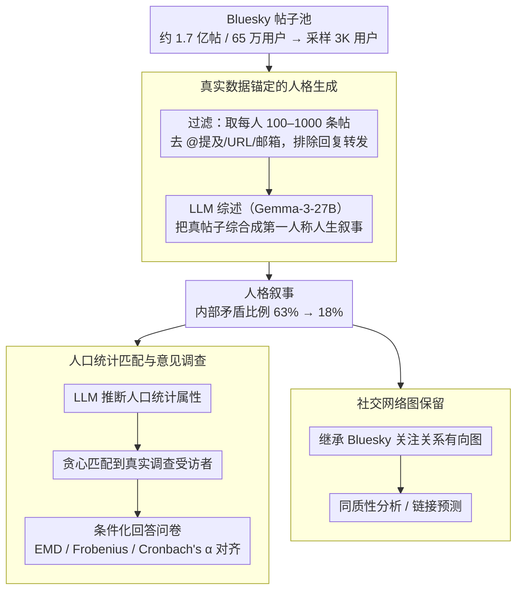

# Synthia: Scalable Grounded Persona Generation from Social Media Data

**会议**: ACL 2026  
**arXiv**: [2507.14922](https://arxiv.org/abs/2507.14922)  
**代码**: 无  
**领域**: 计算社会科学 / 人格建模  
**关键词**: 人格生成, 虚拟人口, 社交媒体, 社会调查模拟, 公平性分析

## 一句话总结
提出 Synthia 框架，基于真实社交媒体帖子（Bluesky）生成有根据的 LLM 人格叙事，在社会调查对齐度上比 SOTA 提升最高 11.6%，同时使用更小的模型，并保留社交网络拓扑结构支持网络感知分析。

## 研究背景与动机

**领域现状**：人格驱动的 LLM 模拟在计算社会科学中日益广泛应用，用于模拟人口级别的态度和行为。人格构建方法从简单人口统计描述到丰富的人生叙事不等。

**现有痛点**：构建既真实又可扩展的虚拟人口是核心挑战。基于访谈的方法（如 Park et al. 2024）真实性高但资源密集难以扩展；完全合成的方法（如 Anthology）可扩展但常引入系统性伪影降低真实性，且叙事内部常含自相矛盾的事实（63% 的人格有矛盾）。

**核心矛盾**：真实性与可扩展性之间的 trade-off。无约束的 LLM 生成虽然可扩展，但缺乏真实世界锚定会导致幻觉和叙事不一致。

**本文目标**：设计一个将真实社交媒体内容作为锚定、LLM 负责叙事构建的人格生成框架，兼顾真实性、可扩展性和公平性。

**切入角度**：利用 Bluesky 平台的公开帖子作为真实数据源，通过 LLM 将用户帖子综合为第一人称人生叙事，保留原始社交网络图结构。

**核心 idea**：人格叙事应锚定于真实用户生成内容而非凭空合成，真实数据的锚定能显著减少叙事内部矛盾，从而提升人口意见分布的对齐度。

## 方法详解

### 整体框架
三阶段流程：(1) 从 Bluesky 收集和过滤用户帖子池（约 1.7 亿帖子，65 万用户），采样 3K 用户；(2) 用 LLM（Gemma-3-27B）将每个用户的帖子综合为第一人称人格叙事；(3) 通过人口统计匹配将合成人口与真实调查受访者对齐，比较模拟意见分布与真实分布。同时，每个人格继承对应用户的 Bluesky 关注关系图，使生成的虚拟人口保留真实社交网络拓扑。

### 关键设计

**1. 真实数据锚定的人格生成：让 LLM 综述真帖子，而不是凭空编人生**

完全合成的人格（如 Anthology）虽然可扩展，但缺乏真实世界锚点，叙事内部常自相矛盾——多达 63% 的人格存在前后打架的事实。Synthia 的做法是把"创作"换成"综述"：收集每个用户 100–1000 条真实帖子（太少上下文不足、太多撑爆上下文窗口），去掉 @提及、URL、邮箱等社交标识符并排除回复/转发，再让 LLM 把这些帖子综合成一份第一人称的生活背景故事。

关键在于真实帖子充当了约束锚点，LLM 只能在用户真说过的内容范围内组织叙事，没法天马行空地脑补——矛盾人格比例因此从 63% 降到 18%。而且这种"有锚点的综述"对模型能力要求不高：不仅 Gemma-3-27B 能生成高质量人格，连 Phi-4-mini（4B）也行，说明真正起作用的是数据锚定而非模型规模。

**2. 人口统计匹配与意见调查：把评估锚在真人调查上，而不是 LLM 自评**

要验证合成人口"像不像真人群体"，得有可靠的对照。Synthia 先让 LLM 从每份人格叙事里推断人口统计属性（年龄、性别、种族等），再用贪心匹配算法把每个真实调查受访者配对到最接近的人格上，使两边的人口统计分布对齐。随后让 LLM 条件化在人格叙事上去回答调查问卷，用 EMD、Frobenius 范数、Cronbach's α 三个指标比较模拟意见分布与真实分布。这样评估的参照系是人类调查数据而非 LLM 判断，结论更可信。

**3. 社交网络图保留：人格不只是孤立文本，还带着原始社交拓扑**

现有方法生成的人格都是一盘散沙，只有文本没有彼此关系，做不了社会网络层面的分析。Synthia 让每个人格直接继承对应用户在 Bluesky 上的关注关系有向图，把社交拓扑和人格内容绑在一起。这是它独有的特性——既有丰富叙事又有真实网络结构，使虚拟人口成为有社会关系的社区，支持同质性分析、链接预测等网络感知研究，填补了"只给文本不给结构"的空白。

### 损失函数 / 训练策略
Synthia 无需训练，直接使用预训练 LLM 进行人格生成和调查回答。在意见调查阶段使用非指令微调模型（因先前研究表明其比指令微调模型在调查模拟中表现更好）。

## 实验关键数据

### 主实验

| 方法 | EMD↓ | Frob.↓ | Cron.α↑ | 说明 |
|------|------|--------|---------|------|
| Synthia (Gemma-27B) | **0.35** | **2.30** | **0.39** | W34 最优 |
| Anthology (LLaMA-70B) | 0.35 | 2.46 | 0.34 | 使用 2.6 倍大的模型 |
| Anthology (Gemma-27B) | 0.34 | 2.65 | 0.32 | 同模型下 Synthia 全面领先 |
| PChat (人工) | 0.35 | 2.76 | 0.29 | 真人标注但波动大 |
| Synthia (Phi-4B) | 0.38 | 2.43 | 0.38 | 6 倍小的模型仍可比 |

### 消融实验

| 分析维度 | Synthia | Anthology | 说明 |
|----------|---------|-----------|------|
| 矛盾人格比例 | 18% | 63% | 锚定大幅减少内部矛盾 |
| 平均每人格错误数 | 0.221 | 0.959 | 减少 77% 的叙事矛盾 |
| 跨波次 Frob. 波动 | 0.04 | 0.20 | Synthia 更稳定 |

### 关键发现
- 叙事内部一致性是对齐人口意见的关键因素——Synthia 通过真实数据锚定将矛盾减少 77%
- 即使使用 4B 模型（Phi-4-mini），Synthia 仍可与 70B 模型生成的 Anthology 匹敌
- 公平性分析显示 Synthia 在最佳和最差人口统计子组之间的准确率差距减少高达 25%
- 链接预测准确率提升 8.3%，嵌入空间可分离性提升 46%，证明网络结构的有效性

## 亮点与洞察
- 用真实社交媒体帖子锚定人格生成这一思路既简单又有效。核心洞察是：人格叙事的内部一致性比叙事的丰富度更重要。Anthology 用大模型高温采样生成丰富叙事，但因无锚定导致矛盾频发，反而降低了下游任务质量
- 保留社交网络拓扑结构是独特贡献，使得虚拟人口不再是孤立个体的集合，而是有社会关系的社区。这为社会网络模拟打开了新的可能性
- 用更小模型达到或超过更大模型的效果，说明数据质量（锚定于真实内容）比模型规模更重要

## 局限与展望
- 仅使用英语 Bluesky 数据，其用户群体可能不代表一般人口
- 去除社交标识符可能丢失部分有用上下文
- 人口统计推断依赖 LLM 的准确性，可能引入偏差
- 仅在美国社会调查（ATP）上评估，跨文化泛化性待验证
- 未来可探索多语言多平台的人格生成

## 相关工作与启发
- **vs Anthology (Moon et al. 2024)**: 无锚定高温采样，可扩展但矛盾多；Synthia 用真实帖子锚定，一致性更好
- **vs Park et al. 2024**: 基于访谈数据，真实但不可扩展；Synthia 用社交媒体帖子实现可扩展替代
- **vs PChat (Zhang et al. 2018)**: 人工编写人格，质量参差不齐且不可扩展

## 评分
- 新颖性: ⭐⭐⭐⭐ 真实数据锚定+网络拓扑保留是有意义的创新
- 实验充分度: ⭐⭐⭐⭐⭐ 54 种实验配置，多维度评估，公平性分析，网络案例研究
- 写作质量: ⭐⭐⭐⭐ 结构清晰，分析深入
- 价值: ⭐⭐⭐⭐ 对计算社会科学的人口模拟有直接应用价值

<!-- RELATED:START -->

## 相关论文

- [\[ACL 2026\] Persona-E2: A Human-Grounded Dataset for Personality-Shaped Emotional Responses to Textual Events](persona-e2_a_human-grounded_dataset_for_personality-shaped_emotional_responses_t.md)
- [\[ACL 2026\] Content Fuzzing for Escaping Information Cocoons on Social Media](content_fuzzing_for_escaping_information_cocoons_on_digital_social_media.md)
- [\[ACL 2026\] The Proxy Presumption: From Semantic Embeddings to Valid Social Measures](the_proxy_presumption_from_semantic_embeddings_to_valid_social_measures.md)
- [\[ACL 2026\] Bayesian Social Deduction with Graph-Informed Language Models](bayesian_social_deduction_with_graph-informed_language_models.md)
- [\[ACL 2026\] ClaimDB: A Fact Verification Benchmark over Large Structured Data](claimdb_a_fact_verification_benchmark_over_large_structured_data.md)

<!-- RELATED:END -->
