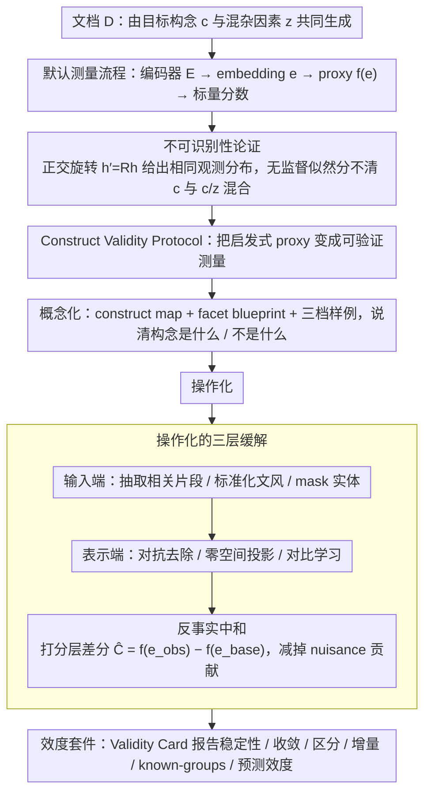

# The Proxy Presumption: From Semantic Embeddings to Valid Social Measures

**会议**: ACL 2026  
**arXiv**: [2605.07409](https://arxiv.org/abs/2605.07409)  
**代码**: 无  
**领域**: 因果推断 / 计算社会科学 / 表征测量  
**关键词**: 构念效度、语义嵌入、因果表征、反事实中和、社会测量  

## 一句话总结
这篇论文指出 NLP 中把 embedding 几何距离直接命名为“创造力、偏见、创新性”等社会构念是一种 Proxy Presumption，并提出 Construct Validity Protocol 与 Counterfactual Neutralization 来把启发式 proxy 变成可验证的测量工具。

## 研究背景与动机
**领域现状**：NLP 正在从单纯的预测工具变成计算社会科学的测量工具。很多工作会用句向量、文档向量或 LLM embedding 来度量抽象社会概念，例如论文新颖性、文本创造力、政治偏见、社会规范或毒性。

**现有痛点**：这些工作经常默认“embedding 空间里的余弦距离就是某个社会构念”。问题在于，embedding 本身同时编码主题、风格、作者、长度、语域、时间和机构等大量 nuisance factors，几何距离并不天然等于理论变量。

**核心矛盾**：研究者想测量的是潜在构念 $C$，但模型实际看到的是由 $C$ 和混杂因素 $Z$ 共同生成的文本 $D$。如果没有显式假设、干预或验证，那么从 $D$ 的无监督表征反推出 $C$ 是不可识别的。

**本文目标**：论文不是要否定 embedding-based measurement，而是要给这类测量建立一套“先定义构念、再设计工具、最后报告效度证据”的最低方法学标准。

**切入角度**：作者把社会科学中的 construct validity、心理测量学中的 validity card、因果表征学习中的 non-identifiability 放在同一个框架里，说明 NLP proxy 的核心问题不是模型不够大，而是测量目标没有被识别。

**核心 idea**：用因果识别和心理测量的语言重写 NLP 社会测量流程，把“embedding 相似度”从一个被默认相信的 proxy，转化为需要经过反事实、区分效度和增量效度检验的测量仪器。

## 方法详解
这是一篇 position-and-synthesis 论文，方法贡献主要是理论形式化、操作协议和取证式文献分析。它的主线很清楚：先证明为什么无监督 embedding 不能自动识别社会构念，再给出如何削弱混杂的干预点，最后把这些干预点组织成 Construct Validity Protocol。

### 整体框架
论文把一个文档视为由目标构念 $c$ 和 nuisance vector $z$ 共同生成：$p_{\theta}(D \mid c, z)$。标准 NLP 测量流程先用 encoder $E$ 把文本映射到 embedding $e$，再用 proxy function $f(e)$ 输出一个标量分数。作者指出，如果 $E$ 是无监督学到的，那么 $e$ 的坐标系可以发生任意旋转，某个维度或距离函数未必对应 $c$。

在单文档场景中，这意味着一个“毒性分数”可能同时混入方言、语域和主题。在双文档场景中，这意味着“论文新颖性”的 cosine distance 可能只是主题差异、术语变化或写作风格变化，而不是概念贡献本身。

为此，作者提出三层缓解路径。第一层在输入端做 disentanglement，比如只抽取与构念相关的文本片段、标准化文风、mask 实体。第二层在表示端做 disentanglement，比如 adversarial removal、iterative nullspace projection 或 contrastive learning。第三层在 scoring function 端做反事实中和，即把观测文本的得分减去一个保留 nuisance 但削弱目标构念的中性版本得分。

这些技术手段被进一步放进 Construct Validity Protocol。CVP 有三阶段：概念化、操作化、效度套件。它要求研究者先说清楚构念是什么、不是什么、可能被哪些 nuisance 混淆；再设计减少混杂的测量仪器；最后用稳定性、收敛效度、区分/增量效度、known-groups、预测效度等证据报告 proxy 是否真的在测目标构念。

### 关键设计
**1. 不可识别性论证：从数学上说清"无监督 embedding 自动分离社会构念"为何站不住**

很多工作默认 embedding 空间里随手切一刀就对应某个社会构念，本文要做的是把这个经验批评升级成识别问题。作者令潜变量 $h=[c;z]$（目标构念 $c$ 拼上 nuisance 向量 $z$）服从各向同性高斯先验，然后指出：对任意正交旋转矩阵 $R$，旋转后的潜空间 $h'=Rh$ 与原潜空间会给出完全相同的观测分布。

这意味着无监督似然目标根本无法区分"真实构念坐标"和"构念与 nuisance 的线性混合"——两者在数据上不可分辨。所以即使现实世界里 $c$ 与 $z$ 真的独立，模型学到的 embedding 也可能把二者搅在一起，这不是语料更大、encoder 更深就能自动修好的，而是测量目标在原理上就没被识别。

**2. 反事实中和（Counterfactual Neutralization）：在打分函数层把主题、风格、实体等 nuisance 的贡献减掉**

承接上一点，既然 embedding 距离里混了一堆 nuisance，那直接报告 $f(e_{obs})$ 就不可信。作者的对策不是重训 embedding，而是构造一个反事实中性文本——移除 stance、novelty claim 或情绪表达，但尽量保留主题内容——再算差分分数 $\hat{C}=f(e_{obs})-f(e_{base})$，期望留下的就是目标构念变化贡献的那部分。

这个设计的好处是它是 text-native intervention：很多场景拿不到完整 nuisance label、也不方便重训模型，而文本天然可以被 LLM 重写、抽取、匿名化。于是反事实重写把"文本可干预"这个 NLP 独有的特性变成了显式操控构念强度的工具，比图像或结构化表格里的构念操作灵活得多。

**3. Construct Validity Protocol：给 embedding 社会测量配一套可报告、可复现、可审计的效度流程**

问题的根子是论文往往只证明 proxy"有用"或"相关"，却没证明它不是另一个 nuisance 的替身。CVP 把测量拆成三阶段来补这一课：Phase 1（概念化）产出 construct map、facet blueprint 和三档 exemplar set，先说清构念是什么、不是什么、可能被哪些 nuisance 混淆；Phase 2（操作化）说明输入端、表示端、scoring function 端各自怎么控制 nuisance；Phase 3 报告一张 Validity Card，覆盖可靠性/稳定性、收敛效度、区分与增量效度、known-groups validity 和 criterion-related evidence。

其中作者特别强调区分效度和增量效度，因为它们最能戳破 topic/style surrogacy——一个 proxy 可能既稳定又"有用"，但区分效度会暴露它其实主要在测主题，增量效度则检验它在 nuisance 之外是否还带独立信号。把"测得准不准"拆成这些互补证据，proxy 才从被默认相信的启发式变成经得起审计的测量仪器。

### 损失函数 / 训练策略
本文没有提出一个需要端到端训练的新模型，而是提出测量协议和可插拔的干预策略。若在表示层操作，可以使用 adversarial removal 或 nullspace projection 来压制 nuisance label；若在输入和打分层操作，可以使用 LLM 抽取、风格标准化、实体匿名化与反事实中和。核心优化目标不是提高分类 accuracy，而是提高 proxy 对目标构念的可解释性、稳定性和独立于 nuisance 的增量信号。

## 实验关键数据

### 主实验
论文的实证部分包含一个 GoEmotions worked example 和一个 17 篇社会测量论文的取证式文献审计。GoEmotions 例子用于展示 CVP 可操作，文献审计用于说明当前社区确实普遍缺少最关键的效度证据。

| 验证环节 | 设置 | 关键结果 | 含义 |
|----------|------|----------|------|
| 稳定性 Card 1 | GoEmotions gratitude 维度，2 个 encoder × 2 种 pooling × 2 种文本标准化，共 8 个 proxy 变体，n=2000 | 各变体 AUC 为 0.9407-0.9662，ICC(2,1)=0.8467，ICC(2,k)=0.9779 | proxy 在相近实现下相当稳定，稳定性达标但不等于构念已被识别 |
| 区分效度 Step 1 | 用长度/风格特征、TF-IDF+SVD topic block 预测 proxy | 长度/风格 $R^2=0.0245$，topic $R^2=0.7762$，完整 nuisance block $R^2=0.7768$ | 该 embedding proxy 很大程度可由主题恢复，存在明显 surrogacy 风险 |
| 增量效度 Step 2 | 在 nuisance-only 模型基础上加入 proxy 预测人工 gratitude label | AUC 从 0.9658 提升到 0.9831，$\beta_{inc}>0$ | proxy 虽然被 topic 强烈解释，但仍有额外信号，需要同时报告风险与收益 |

### 消融实验
这里的“消融”更接近方法学诊断：作者不是移除模型模块，而是审计现有社会测量论文是否报告不同类型的效度证据。

| 效度维度 | Yes | Partial | No | 解读 |
|----------|-----|---------|----|------|
| Construct Validity | 10 | 7 | 0 | 多数论文会定义构念，但严格程度不一 |
| Face/Content Validity | 6 | 11 | 0 | 通常有样例或专家直觉，但系统化不足 |
| Reliability / Stability | 11 | 4 | 2 | 可靠性是报告最多的维度，常见于标注一致性或扰动稳定性 |
| Convergent Validity | 1 | 12 | 4 | 很少有独立同构念测量工具作为参照 |
| Discriminant Validity | 0 | 11 | 6 | 没有论文完整证明 proxy 不只是 topic/style 等 nuisance |
| Predictive Validity | 1 | 3 | 13 | 外部 criterion evidence 明显不足 |
| Handling Confounders | 0 | 14 | 3 | 多数只是启发式控制或回归协变量，不构成识别策略 |

### 关键发现
- 最核心的实证证据是 GoEmotions 中 topic block 能解释 proxy 的 77% 左右方差，这非常直观地说明 embedding proxy 可能主要追踪主题结构。
- 稳定性不是充分条件。一个 proxy 可以跨 encoder 和 pooling 很稳定，但仍然稳定地测错东西。
- 现有文献最缺的是 discriminant validity 和 confound isolation，这正好对应作者所说的 Proxy Presumption。
- Counterfactual Neutralization 的价值在于它把“文本可干预”这一 NLP 特性变成测量工具，而不是只做后验相关性分析。

## 亮点与洞察
- 论文把一个常见但模糊的问题命名为 Proxy Presumption，并用因果表征学习给出清晰解释：embedding 几何不是社会理论变量，只是混合表征上的运算。
- CVP 的强点是把社会科学中成熟的 construct validity 语言带回 NLP，让论文写作从“我定义了一个分数”升级到“我证明这个分数在合理边界内测到了目标”。
- 反事实中和很适合 NLP，因为文本可以被 LLM 重写、抽取、匿名化；这比图像或结构化表格中的构念操作更灵活。
- 这篇论文对下游因果推断很重要。即使后面的 causal ML 再精致，如果输入变量本身不是有效测量，因果结论依然没有可解释性。

## 局限与展望
- 论文主要是方法学框架和立场陈述，没有在一个新社会测量任务上完整跑完 CVP，因此尚不能量化 CVP 的成本、收益和失败模式。
- Counterfactual Neutralization 依赖 LLM 重写质量。若 LLM 在“保留 nuisance、改变 construct”时同时改变了主题或语体，差分分数仍会被污染。
- Validity Card 会增加论文和工程流程成本，尤其是需要专家样本、独立 gold instrument 或 external criterion 时，小团队可能难以完整执行。
- 后续可以做一批标准化 benchmark：同一构念、同一 nuisance set、不同 embedding 与反事实策略，系统比较哪类 proxy 最容易通过区分效度和增量效度检验。

## 相关工作与启发
- **vs WEAT / embedding bias 测量**: WEAT 等工作用 embedding association 测偏见，本文并不否定这类工具，而是指出 association 分数需要证明不是词频、语域或语料结构的替身。
- **vs causal representation learning**: 传统因果表征强调潜因子不可识别，本文把这个结论迁移到社会测量，说明 embedding-based proxy 必须引入结构假设或干预。
- **vs psychometrics**: 心理测量学长期区分 construct 与 measure，本文把可靠性、收敛效度、区分效度和 criterion evidence 翻译成 NLP 可执行的检查清单。
- **对后续研究的启发**: 任何用 LLM/embedding 生成“社会变量”的论文，都应至少报告 nuisance blocks、proxy 可被 nuisance 预测的程度，以及加入 proxy 后是否有 out-of-sample 增量解释力。

## 评分
- 新颖性: ⭐⭐⭐⭐☆ 把已有的测量理论、因果表征和 NLP proxy 批评整合得很有穿透力，虽然不是新模型但概念贡献强。
- 实验充分度: ⭐⭐⭐☆☆ GoEmotions 案例和 17 篇文献取证能支撑论点，但缺少完整前瞻式实证 pipeline。
- 写作质量: ⭐⭐⭐⭐☆ 结构清楚，概念命名准确，尤其是 Proxy Presumption 和 Validity Card 很利于社区传播。
- 价值: ⭐⭐⭐⭐⭐ 对计算社会科学、embedding 测量、LLM-based evaluation 和下游因果推断都有直接方法学价值。

<!-- RELATED:START -->

## 相关论文

- [\[ACL 2025\] Measuring Social Biases in Masked Language Models by Proxy of Prediction Quality](../../ACL2025/social_computing/measuring_social_biases_in_masked_language_models_by_proxy_of_prediction_quality.md)
- [\[ACL 2026\] Bayesian Social Deduction with Graph-Informed Language Models](bayesian_social_deduction_with_graph-informed_language_models.md)
- [\[ACL 2026\] Synthia: Scalable Grounded Persona Generation from Social Media Data](synthia_scalable_grounded_persona_generation_from_social_media_data.md)
- [\[ICML 2026\] ObjEmbed: Towards Universal Multimodal Object Embeddings](../../ICML2026/social_computing/objembed_towards_universal_multimodal_object_embeddings.md)
- [\[ACL 2026\] Content Fuzzing for Escaping Information Cocoons on Social Media](content_fuzzing_for_escaping_information_cocoons_on_digital_social_media.md)

<!-- RELATED:END -->
