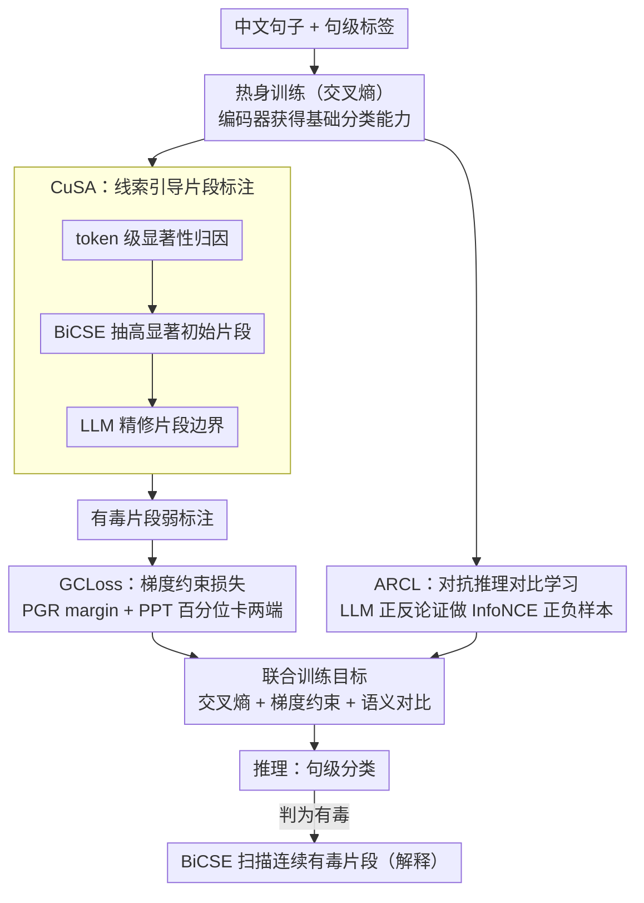

# ToxiTrace: Gradient-Aligned Training for Explainable Chinese Toxicity Detection

**会议**: ACL 2026 Findings  
**arXiv**: [2604.12321](https://arxiv.org/abs/2604.12321)  
**代码**: [https://huggingface.co/ArdLi/ToxiTrace](https://huggingface.co/ArdLi/ToxiTrace)  
**领域**: 社会计算  
**关键词**: 中文有毒内容检测, 可解释性, 梯度约束, 细粒度证据抽取, 对比学习

## 一句话总结

ToxiTrace 提出了一种面向 BERT 类编码器的可解释中文毒性检测方法，通过 CuSA（LLM 引导的弱标注）、GCLoss（梯度约束损失）和 ARCL（对抗推理对比学习）三个组件，在保持高效编码器推理的同时实现了句级分类准确率和连续有毒片段提取的双重提升。

## 研究背景与动机

**领域现状**：现有中文毒性检测方法主要针对句级分类任务，已通过预训练语言模型（如 RoBERTa、MacBERT）和大语言模型取得了较好的分类性能。

**现有痛点**：
- 大多数方法只做句级分类，无法指出句中哪些具体片段是有毒的，缺乏可解释性
- 中文采用字级分词，梯度/注意力等归因信号在单个字上碎片化，难以形成人类可读的连续片段
- LLM 虽然解释能力强，但直接分类性能不如编码器且推理开销大

**核心矛盾**：编码器模型分类准确但解释性差（归因碎片化），LLM 解释性好但分类弱且推理慢，二者优势无法兼得。

**本文目标**：在保持编码器高效推理的前提下，让模型既能准确分类，又能提取连续、可读的有毒片段作为解释。

**切入角度**：通过训练阶段对梯度信号进行显式约束，使编码器的 token 级归因自然聚焦在有毒证据上，推理时直接从显著性图中提取连续片段。

**核心 idea**：将梯度归因从"事后解释"提升为"训练目标"——用 LLM 生成弱标注指导梯度集中于有毒 token，同时用对比学习锐化毒性/非毒性语义边界。

## 方法详解

### 整体框架

ToxiTrace 想要的是一个"既能准判、又能指出哪几个字有毒"的中文编码器。它的整条链路分四步：先用交叉熵热身训练，让 BERT 类编码器拿到基础分类能力；再用 CuSA 把编码器自己的归因线索喂给 LLM 精修，反过来给出有毒片段的弱标注；有了弱标注后，GCLoss 在训练阶段直接约束梯度分布，把有毒 token 的梯度顶上去、非毒 token 压下来；ARCL 则在句间层面用对比学习锐化毒/非毒的语义边界。推理时先判句子是否有毒，若有毒就用 BiCSE 算法从显著性图里扫出连续片段当作解释。

### 关键设计

**1. CuSA（线索引导片段标注）：用编码器的归因当线索，让 LLM 只做精修**

中文毒性数据集大多只有句级粗标签，模型根本不知道"哪几个字"有毒；可要是直接让 LLM 去标，它又缺少定位线索、容易标偏。CuSA 把这两端的短板互补起来：先热身训练编码器拿到基础分类能力，再算出 token 级显著性分数，用 **BiCSE（双向悬崖扫描）** 算法从显著性图里抓出高显著的初始片段作为线索，最后把这些候选区域连同句子喂给 LLM（Gemini 2.5 Pro）去精修片段边界。编码器提供"大概在哪"，LLM 补上"精确到哪"，于是在没有任何细粒度人工标注的前提下，就能产出可用的有毒片段弱监督信号。

**2. GCLoss（梯度约束损失）：把"事后归因"提前成"训练目标"**

只用分类损失训出来的模型，token 级归因往往分散又不准，推理时根本扫不出干净的连续片段。GCLoss 干脆在训练时直接对梯度动刀，由两部分组成：PGR Loss 强制有毒 token 与非毒 token 的梯度之间保持一个 margin；PPT Loss 用样本内的统计量分别卡两端——以 15 百分位约束非毒 token 的梯度上界、以 $\alpha\cdot\max$ 约束有毒 token 的梯度下界。这样训练收敛后，有毒证据天然就是显著性图上的高峰，推理阶段 BiCSE 提取片段自然更可靠。消融里它对提取 F1 的贡献最大（去掉后掉 12.75%），印证了"塑形梯度"正是这套方法的核心闸门。

**3. ARCL（对抗推理对比学习）：让 LLM 辩论，给对比学习造高质量正负样本**

GCLoss 管的是句内 token 级的梯度关系，却看不到句子之间的语义差异。ARCL 在这一层补位：让 LLM（Gemini 2.5 Flash）就同一段文本生成正反两面的推理论证——"假设它有毒，给出支持理由"和"假设它无毒，给出支持理由"，再把这两类推理当成正负样本做自适应 InfoNCE 对比学习。相比随机扰动式的数据增强，LLM 辩论生成的内容更贴着毒性语义的真实边界，因此能更有针对性地把毒/非毒的表示拉开。

### 损失函数 / 训练策略

总体训练目标：$\mathcal{L} = \mathcal{L}_{CE} + \lambda_{grad}(\mathcal{L}_{PGR} + \mathcal{L}_{PPT}) + \lambda_{sem}\mathcal{L}_{con}$

训练流程：先热身 3 个 epoch（仅交叉熵）→ 再引入 GCLoss + ARCL 联合训练。热身步数过多或过少都会拖累最终性能。

## 实验关键数据

### 主实验（分类）

| 数据集 | 指标 | 本文 (RoBERTa+ToxiTrace) | 之前SOTA (RoBERTa) | 提升 |
|--------|------|------|----------|------|
| COLD | Macro-F1 | **83.68%** | 82.56% | +1.12% |
| COLD | Acc | **83.84%** | 82.68% | +1.16% |
| ToxiCN | Macro-F1 | **83.83%** (MacBERT) | 82.81% | +1.02% |

### 片段提取（CNTP）

| 模型 | Overlap F1 | Character F1 | IoU | 推理时间 |
|------|-----------|-------------|-----|---------|
| RoBERTa+ToxiTrace* | **77.90%** | **77.63%** | **61.56%** | 1m 58s |
| Qwen3-8B | 77.87% | 74.74% | 59.67% | 14m 33s |
| Gemini 2.5 Pro | 80.39% | 79.67% | 66.22% | ~1.5h |

### 消融实验

| 配置 | 分类 Macro-F1 | 提取 F1 | 说明 |
|------|-------------|---------|------|
| Full model | 83.68% | 77.90% | 完整模型 |
| w/o CuSA | 82.90% | 71.96% | 弱标注退化为原始 BiCSE，提取 Recall 大降 |
| w/o ARCL | 83.12% | 75.16% | 语义对比缺失，分类和提取均下降 |
| w/o GCLoss | 83.36% | 65.15% | **提取 F1 下降最大（-12.75%）** |
| RoBERTa baseline | 82.76% | 65.08% | 基线 |

### 关键发现
- GCLoss 对片段提取的贡献远大于 ARCL（-12.75% vs -2.74%），是方法的核心组件
- 编码器+ToxiTrace 在 ~1/7 推理时间内达到与最强 LLM（Qwen3-8B）可比的片段提取 F1
- BiCSE 算法比传统 top-k 选择显著提升了提取性能（RoBERTa 52.34→65.08 F1）
- 掩码有毒片段后模型置信度大幅下降，验证了梯度归因的因果忠实性

## 亮点与洞察
- 将梯度归因从被动分析工具提升为主动训练目标的思路很新颖，打通了"训练时塑形梯度→推理时提取片段"的闭环
- 巧妙利用 LLM 的两个角色：CuSA 中做弱标注精修器、ARCL 中做对抗推理生成器——都不是直接做分类，避免了 LLM 分类弱的短板
- BiCSE 双向悬崖扫描算法解决了中文字级分词下归因碎片化的实际问题
- 效率优势明显：编码器推理 ~2min vs LLM ~15min，片段提取质量相当

## 局限与展望
- 未处理同音字替换、拼音混淆等"隐形有毒表达"
- 仅在中文上验证，对日语、韩语等其他字级语言的适用性需进一步研究
- LoRA 方式迁移到解码器 LLM 效果有限，可能需要更深度的参数高效梯度塑形策略
- CuSA 依赖外部 LLM 做标注精修，引入了额外成本

## 相关工作与启发
- **vs 传统归因方法（LIME/IG/Attention）**: 传统方法是事后解释，选出的 token 分散；ToxiTrace 在训练中塑形梯度，提取连续片段
- **vs LLM 直接检测**: LLM 解释强但分类弱且慢；ToxiTrace 让编码器兼具两者优势
- **vs CRF 序列标注**: CRF 需要显式标注训练，ToxiTrace 通过弱监督 + 梯度约束实现

## 评分
- 新颖性: ⭐⭐⭐⭐ 梯度归因作为训练目标 + LLM 辩论对比学习的组合很有创意
- 实验充分度: ⭐⭐⭐⭐ 多数据集、多模型对比、消融、忠实性验证均完备
- 写作质量: ⭐⭐⭐⭐ 框架清晰，动机推导逻辑性强

<!-- RELATED:START -->

## 相关论文

- [\[ACL 2025\] STATE ToxiCN: A Benchmark for Span-level Target-Aware Toxicity Extraction in Chinese Hate Speech Detection](../../ACL2025/social_computing/state_toxicn_a_benchmark_for_span-level_target-aware_toxicity_extraction_in_chin.md)
- [\[ACL 2026\] Probing Multimodal Large Language Models on Cognitive Biases in Chinese Short-Video Misinformation](probing_multimodal_large_language_models_on_cognitive_biases_in_chinese_short-vi.md)
- [\[ACL 2026\] Estimating the Black-box LLM Uncertainty with Distribution-Aligned Adversarial Distillation](estimating_the_black-box_llm_uncertainty_with_distribution-aligned_adversarial_d.md)
- [\[ACL 2026\] SMARTER: A Data-efficient Framework to Improve Toxicity Detection with Explanation via Self-augmenting Large Language Models](smarter_a_data-efficient_framework_to_improve_toxicity_detection_with_explanatio.md)
- [\[ACL 2026\] PSK@EEUCA 2026: Fine-Tuning Large Language Models with Synthetic Data Augmentation for Multi-Class Toxicity Detection in Gaming Chat](pskeeuca_2026_fine-tuning_large_language_models_with_synthetic_data_augmentation.md)

<!-- RELATED:END -->
