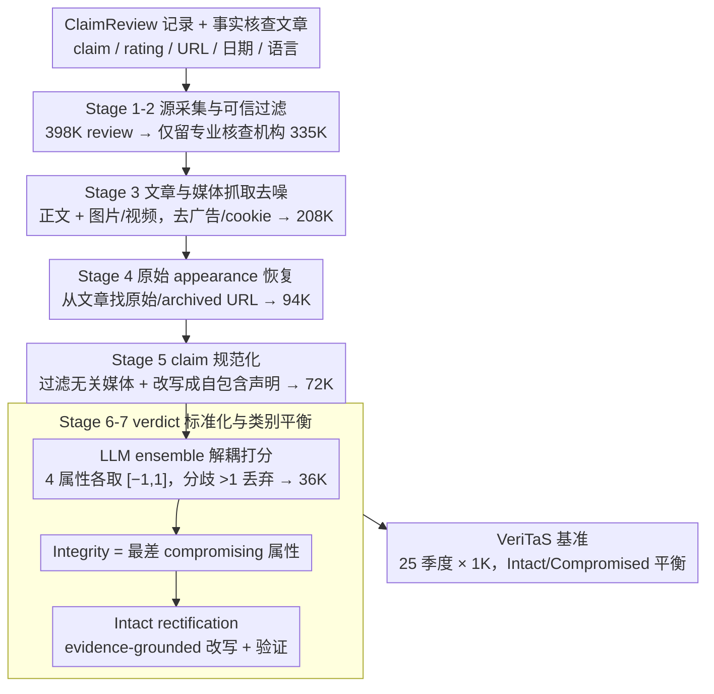

# VeriTaS: The First Dynamic Benchmark for Multimodal Automated Fact-Checking

**会议**: ACL2026  
**arXiv**: [2601.08611](https://arxiv.org/abs/2601.08611)  
**代码**: https://veritas.mai.informatik.tu-darmstadt.de  
**领域**: audio_speech  
**关键词**: 多模态事实核查, 动态基准, 数据泄漏, ClaimReview, 事实核查评估

## 一句话总结
VeriTaS 用一个季度更新的七阶段自动化流水线，把专业事实核查机构的真实多语种图文视频声明转成标准化、可解释、可评测的多模态事实核查基准，并显示当前最强多模态模型离可靠 AFC 仍有明显距离。

## 研究背景与动机
**领域现状**：自动化事实核查已经从纯文本声明验证扩展到图像、视频、社交媒体帖子和跨语言传播场景。现实中的误导信息往往不是单句文本，而是文字、图片、视频、发布日期、原始出处和上下文共同构成的 claim package，因此评测系统也需要覆盖多模态证据、真实传播链路和专业事实核查 verdict。

**现有痛点**：已有 AFC 基准多数是静态的，模型预训练语料一旦覆盖这些公开声明和 verdict，测试集就可能变成记忆题。另一个问题是标签过粗：许多数据集只给 true/false/NEI 这类单标签，无法区分图片是否被篡改、图片是否被放到错误语境、文字陈述是否真实、是否缺少关键上下文等不同错误来源。

**核心矛盾**：事实核查评测需要最新、真实、可解释的数据，但人工构建此类数据成本极高；如果只依赖旧数据，评测会被知识截止日期和数据泄漏污染；如果只依赖合成数据，真实性和伦理风险又难以保证。

**本文目标**：作者要同时解决四件事：构建会持续更新的动态基准；覆盖文本、图像、视频和多语言声明；把异构事实核查 verdict 统一到细粒度评分；验证自动标注与人类判断的一致性，并用最新模型做真实能力测量。

**切入角度**：论文抓住 ClaimReview 这个现实世界事实核查的结构化入口，再用 LLM 负责文章抽取、原始 appearance 检索、claim 改写、verdict 标准化和完好声明 rectification。这样既保留专业 fact-checker 的证据基础，又能将规模扩展到季度级更新。

**核心 idea**：用自动化流水线把真实 fact-checking 生态转化为一个持续更新、细粒度可解释、对知识泄漏更鲁棒的多模态 AFC 评测基准。

## 方法详解
VeriTaS 不是一个新的 fact-checking 模型，而是一个面向模型评估的数据与标注体系。论文最关键的地方在于，它把现实世界中混乱的事实核查材料拆成可自动处理的阶段：先从 ClaimReview 找到专家声明，再恢复原始传播内容和媒体，再把声明重写成自包含形式，最后把不同机构的 verdict 映射为统一的连续评分。

### 整体框架
输入端是公开的 ClaimReview 结构化记录和事实核查文章，包含 claim 文本、rating、review URL、发布日期、语言和部分 appearance URL。流水线先过滤可信发布者并抓取原文，再补全原始社交媒体 appearance 和媒体文件。随后，系统用多模态 LLM 把原始 claim 规范化成简洁、自包含、不会泄露 verdict 的声明，并保留必要媒体。

输出端是按季度组织的 VeriTaS benchmark。每条样本包含 claim、媒体、日期、语言、appearance 信息、Integrity 总分、底层属性分数和文字 justification。当前版本发布 25K 条声明，覆盖 Q1 2020 到 Q1 2026 的 25 个季度，每季度 1K 条，并保持 Intact 与 Compromised 平衡。

### 关键设计

**1. 七阶段动态构建流水线：把"持续涌现的真实核查"变成可评测样本**

动态性最大的麻烦在于，它不是简单地往数据集里追加新文件，而是要从真实的事实核查生产链路里稳定地抽出干净、可用的样本。VeriTaS 用七个阶段把这件事拆开做：Stage 1 从 ClaimReview 收集约 398K 条 review；Stage 2 识别 848 个发布者、只保留专业 fact-checking 组织，得到 335K 条可信 review；Stage 3 抓取文章正文和媒体并去掉广告、cookie 提示等噪声；Stage 4 从文章里恢复原始 appearance URL 和 archived URL；Stage 5 过滤无关媒体、把 claim 改写成约 72K 条自包含声明；Stage 6 做 verdict 标准化；Stage 7 生成并验证 Intact 版本以平衡数据。这套设计的关键是把可信度、上下文、媒体和标签全部塞进一条自动流水线，使得"按季度继续扩展"不再依赖昂贵的人工维护，而是可以稳定复跑。

**2. 解耦式 verdict 与 Integrity 评分：让评测知道模型到底错在哪**

现实里的错误很少是干脆的"真/假"二选一——图片可能是真的但被放进错误语境，文字可能基本正确却省略了关键上下文。如果只压成一个粗糙真假标签，benchmark 就完全看不出模型错在媒体、文本还是上下文。VeriTaS 把判断拆成四个底层属性：Media Authenticity、Media Contextualization、Veracity、Context Coverage，再用 Integrity 表示 claim 作为整体是否可接受。每个属性取连续分数 $[-1, 1]$，小于 $-1/3$ 记为 Negative、大于 $1/3$ 记为 Positive，而 Integrity 由属性 (2)–(4) 中最差的那个 compromising property 决定。模型评测主指标用 MSE，因为它会狠狠惩罚 True 与 False 的反向翻转、同时又允许"近似正确"，比离散准确率更贴合这种连续、可解释的判断结构。

**3. LLM ensemble 标注、过滤与 rectification：不靠人工也拿到高一致性且类别平衡的标签**

专业核查库里真实的错误声明远多于真实正确声明，直接采样必然类别失衡；但凭空合成正确声明又会脱离现实、引入伦理风险。VeriTaS 在 Stage 6 用 GPT-5.2、Gemini 2.5 Pro、Claude Sonnet 4.5 和 Llama 4 Maverick 组成 ensemble，对每个属性分别打分并生成 justification，按均值聚合；只要成员间分歧超过 1 就直接丢弃该 claim，以此换来高一致性。针对类别失衡，Stage 7 不是无条件造正例，而是依据 compromising property 的 justification 做 evidence-grounded 的 Intact 改写，再回头验证 shareability、一致性和 Integrity。这种"基于证据的修正"在真实性和平衡性之间做了折中——既补足了正确声明，又尽量不脱离真实来源。

> ⚠️ 注记中的 GPT-5.2、Gemini 2.5 Pro、Claude Sonnet 4.5、Llama 4 Maverick 等模型名以原文为准。

### 损失函数 / 训练策略
本文没有训练新的模型。构建侧主要依赖多模态 LLM 的分工调用、ensemble 聚合和严格过滤；评测侧把模型输出映射到 Integrity 及底层属性的连续分数，主指标为 MSE，辅以 MAE 和 3-bin/7-bin accuracy。所有基线评测还要求排除 claim 发布日期之后的证据，避免检索式系统偷看未来信息。

## 实验关键数据

### 主实验
论文的实验分为三类：数据规模统计、人工验证、模型基线评测。最重要的结论是：自动流水线的人类一致性很高，但当前 AFC 模型和通用多模态模型在最新季度上仍然不可靠。

| 阶段 / 数据切片 | 数量或指标 | 说明 | 结论 |
|--------|------|------|----------|
| ClaimReview discovery | 约 398K reviews | 2016-01 到 2026-03 的结构化事实核查记录 | 原始事实核查生态规模足够大 |
| 可信发布者过滤 | 335K reviews | 848 个发布者中保留专业事实核查组织，丢弃约 64K | 用发布者可信度控制源质量 |
| 文章清洗 | 208K reviews | 抽取事实核查文章正文和媒体 | 为 justification 与 claim 改写提供上下文 |
| appearance 恢复 | 94K reviews | 仅 13.3% ClaimReview 自带 appearance，LLM 额外从文章中找 URL | 原始传播出处恢复是关键瓶颈 |
| claim 规范化 | 72K claims | 去掉 verdict 泄漏、补足媒体引用、限制长度 | 得到自包含声明 |
| verdict 标准化 | 36K claims | ensemble 分歧过大者过滤 | 保留高一致性细粒度标签 |
| 最终发布 | 25K claims | 25 个季度，每季度 1K，Intact/Compromised 平衡 | 可做动态与纵向评测 |
| 媒体与语言 | 8,692 图像、5,334 视频、54 语言 | 英语 39.0%，西语 10.9%，印地语 5.8% | 覆盖明显超过纯英文纯文本基准 |

| 设置 | MSE↓ | MAE↓ | 7-bin Acc↑ | 3-bin Acc↑ | 解读 |
|--------|------|------|----------|------|------|
| VeriTaS 完整流水线 | 0.034 | 0.102 | 69.1 | 97.5 | 与人类 Integrity 判断高度一致 |
| ensemble 但不做分歧过滤 | 0.035 | 0.105 | 68.6 | 97.6 | 过滤贡献不大但能提高稳健性 |
| GPT-5.2 单模型 | 0.076 | 0.184 | 51.2 | 95.7 | 单模型误差明显更高 |
| Gemini 3.1 Pro 单模型 | 0.071 | 0.099 | 73.4 | 95.7 | 7-bin 高但 MSE 仍劣于 ensemble |
| Claude Sonnet 4 单模型 | 0.048 | 0.091 | 72.5 | 97.1 | 接近 ensemble 但不如完整流程 |
| Llama 4 Maverick 单模型 | 0.042 | 0.103 | 66.7 | 97.1 | 开源模型可用，但 ensemble 更稳 |

在最新 Q1 2026 split 上，强模型依然有明显误差。无检索时 Claude Opus 4.6 的 MSE 为 0.453，是通用模型中最强；加 web search 后 Claude Opus 4.6 降到 0.183，Gemini 3 Flash 为 0.275，Qwen 3.5 397B 为 0.318。DEFAME 使用 Claude Opus 4.6 backbone 时为 0.282，而 Loki 在多个 backbone 上反而明显变差，说明“专门系统”并不自动优于强通用多模态模型。

### 消融实验

| 分析项 | 关键指标 | 说明 |
|------|---------|------|
| 知识截止日期影响 | 纵向 split 中无检索 MSE 平均从约 0.6 升到 0.8 以上 | 模型在 cutoff 后 claim 上明显变差，静态基准会高估能力 |
| 最新季度 + 检索 | Claude Opus 4.6 MSE 0.183，Gemini 3 Flash 0.275，Qwen 3.5 0.318 | 检索有帮助，但距离作者认为可接受的 0.1 仍很远 |
| 媒体子集 | 多数模型在视频 claim 上 MSE 更高 | 视频事实核查仍是薄弱环节 |
| Integrity 子集 | 很多模型倾向把 claim 判为 Compromised | 类别偏置会让 Intact 样本错误增多 |
| rectified claim 质量 | 人工评估约 5.1% 样本有质量疑虑 | evidence-grounded 改写总体可信，但仍需持续审查 |

### 关键发现
- 动态基准的必要性被实验证实：模型知识 cutoff 后的 MSE 上升，说明旧事实核查样本很可能被参数记忆污染。
- 人工验证显示完整流水线的 Integrity MSE 只有 0.034，说明 LLM ensemble 加过滤可以把专业 fact-checker verdict 映射得相当可靠。
- 检索增强不是万能解。即使有 search tool，最强结果 MSE 仍为 0.183，且评测必须按 claim 日期限制证据来源。
- 视频、多语言和 Intact 样本是主要难点；很多模型对“错误声明”有先验偏置，容易把真实或修正后的 claim 判成 Compromised。

## 亮点与洞察
- 最大亮点是把数据泄漏问题作为 benchmark 设计的一等公民。作者不是只说“未来会更新”，而是给出季度更新流水线和纵向 cutoff 实验，直接证明静态 AFC 评测会越来越失真。
- Verdict 设计很有复用价值。把 Integrity 建立在媒体语境、文本真实性和上下文覆盖之上，比单一真假标签更适合多模态信息污染，也更容易迁移到新闻核查、医疗声明核查或科学声明核查。
- Rectification 的定位比较巧妙。它不是凭空生成正例，而是根据事实核查文章中的证据把错误声明改成可分享的正确声明，既缓解类别失衡，又尽量不牺牲现实来源。
- 评测协议对“时间”很敏感。要求检索证据不能晚于 claim 发布日，这一点对所有带工具的 AFC/agent 评测都很重要，否则系统会用未来事实倒推答案。

## 局限与展望
- VeriTaS 依赖 ClaimReview、Data Commons、Google Fact Check Tools 和专业 fact-checking 组织的持续可访问性；如果平台政策变化或 fact-checking 生态萎缩，动态更新会受影响。
- Rectified Intact claim 虽然经过验证，但仍可能带有 LLM 改写风格，未来模型可能学习到这类风格捷径。
- 跨语言去重还不充分，同一事实核查事件可能以多语种形式进入数据，尽管这也反映了真实传播。
- 当前主要覆盖文本、图像和视频；如果音频-only misinformation 增多，流水线需要扩展音频下载、转写、语音伪造检测和语境判断。
- Benchmark 评测 verdict 分数，不评估模型提交证据的质量。未来可以增加 evidence retrieval、justification factuality 和证据充分性评测。

## 相关工作与启发
- **vs 静态 AFC benchmarks**: 旧基准通常一次性发布，适合横向比较但容易被预训练污染；VeriTaS 用季度更新和 cutoff 分析把“新出现声明”的评测能力放在中心。
- **vs synthetic misinformation datasets**: 纯合成声明可控但真实性弱；VeriTaS 的声明来自真实 fact-checking 文章，rectified 样本也由 evidence grounding 约束。
- **vs 单标签真假分类**: 单标签任务简单易评，但解释力弱；VeriTaS 将媒体真实性、媒体语境、文本真实性和上下文覆盖拆开，更接近专业事实核查流程。
- **对后续工作的启发**: 任何面向现实世界的长周期基准都应显式记录样本时间、知识 cutoff 和工具可用证据时间，否则模型能力和记忆能力会混在一起。

## 评分
- 新颖性: ⭐⭐⭐⭐⭐ 动态、多模态、多语言 AFC benchmark 与连续 Integrity 评分结合得很完整。
- 实验充分度: ⭐⭐⭐⭐⭐ 数据统计、人工验证、最新季度基线、纵向 cutoff 分析都比较扎实。
- 写作质量: ⭐⭐⭐⭐ 论文结构清楚，但数据构建阶段信息量很大，读者需要在主文和附录之间来回对照。
- 价值: ⭐⭐⭐⭐⭐ 对事实核查评测、工具增强 VLM 评测和时序防泄漏 benchmark 都有很强参考价值。

<!-- RELATED:START -->

## 相关论文

- [\[ICML 2025\] DEFAME: Dynamic Evidence-based FAct-checking with Multimodal Experts](../../ICML2025/social_computing/defame_dynamic_evidence-based_fact-checking_with_multimodal_experts.md)
- [\[ACL 2026\] LiveFact: A Dynamic, Time-Aware Benchmark for LLM-Driven Fake News Detection](livefact_a_dynamic_time-aware_benchmark_for_llm-driven_fake_news_detection.md)
- [\[ACL 2026\] ClaimDB: A Fact Verification Benchmark over Large Structured Data](claimdb_a_fact_verification_benchmark_over_large_structured_data.md)
- [\[ACL 2026\] Decide less, communicate more: On the construct validity of end-to-end fact-checking in medicine](decide_less_communicate_more_on_the_construct_validity_of_end-to-end_fact-checki.md)
- [\[AAAI 2026\] Fact2Fiction: Targeted Poisoning Attack to Agentic Fact-checking System](../../AAAI2026/social_computing/fact2fiction_targeted_poisoning_attack_to_agentic_fact-check.md)

<!-- RELATED:END -->
