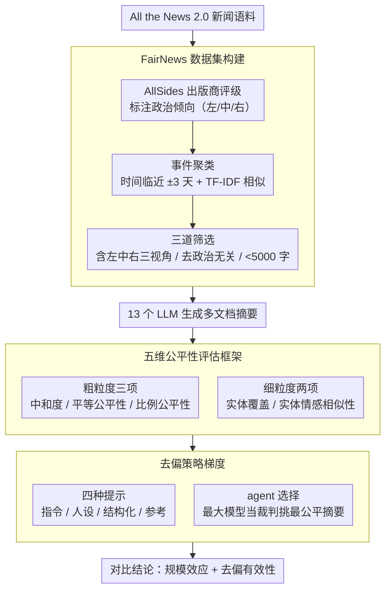

# When Bigger Isn't Better: A Comprehensive Fairness Evaluation of Political Bias in Multi-News Summarisation

**会议**: ACL 2026  
**arXiv**: [2604.21309](https://arxiv.org/abs/2604.21309)  
**代码**: [https://github.com/nii-yamagishilab-visitors/fair_multi_news_summ](https://github.com/nii-yamagishilab-visitors/fair_multi_news_summ)  
**领域**: AI 公平性 / 新闻摘要  
**关键词**: 政治偏见, 多文档摘要, 公平性评估, 去偏方法, 模型规模

## 一句话总结

本文构建了首个带政治倾向标签的多文档新闻摘要数据集 FairNews，并通过五维公平性评估框架对 13 个 LLM 进行评估，发现中等规模模型在公平性和效率上优于大模型，且实体情感相似性是最难通过提示去偏的维度。

## 研究背景与动机

**领域现状**：多文档新闻摘要系统日益普及，帮助读者快速理解多源信息。现有研究已发现摘要中的位置偏见、实体偏见、性别偏见等问题，但多文档场景中政治偏见的系统性评估仍然空白。

**现有痛点**：(1) 现有多文档摘要数据集缺乏文章级别的政治倾向标签，无法系统评估跨政治光谱的公平性；(2) 现有评估方法缺乏同时评估多个公平性维度的框架；(3) 去偏技术（如提示工程）在多文档新闻摘要中的有效性未被探索。

**核心矛盾**：人们普遍假设"更大的模型更公平"，但公平性与模型规模的关系实际上更复杂——大模型在某些维度可能更差。

**本文目标**：(1) 构建带政治标签的多文档摘要数据集；(2) 建立多维公平性评估框架；(3) 评估模型规模与公平性的关系；(4) 评估各种去偏策略的效果。

**切入角度**：使用 AllSides 的出版商偏见评级为新闻文章标注政治倾向（左/中/右），通过五个互补指标从粗粒度和细粒度两个层面评估公平性。

**核心 idea**：公平性是多维的——中和度、平等公平性、比例公平性、实体覆盖和实体情感相似性各捕捉不同方面，没有单一模型或去偏策略能同时优化所有维度。

## 方法详解

### 整体框架

这篇工作要回答"LLM 在多文档新闻摘要里到底有多偏、规模和去偏能不能解决"这个问题，为此搭了一条从数据到评估到干预的完整链路。先构建带政治标签的 FairNews 数据集，再用一套五维公平性框架（三个粗粒度 + 两个细粒度指标）量化每个摘要的偏向，最后在这套指标上系统比较不同规模模型以及四种提示去偏 + 一种 agent 选择策略的效果。整条链路本身不训练模型，全部是对预训练模型的推理 + 度量。

### 关键设计

**1. FairNews 数据集：补上"文章级政治标签"这块缺口**

现有多文档摘要数据集要么只给摘要不给完整文章，要么干脆没有政治倾向标签，没法系统评估跨政治光谱的公平性。FairNews 从 All the News 2.0 出发，用 AllSides 的出版商偏见评级给每篇文章打上政治倾向（合并为左/中/右三类），再按时间临近性（同一事件文章发布间隔 ±3 天）和 TF-IDF 语义相似度把文章聚成"事件簇"。筛选上卡了三道：每个事件必须同时含左/中/右三种视角的文章（保证能测跨光谱公平性）、排除娱乐体育等政治无关内容、总字数 <5000 以塞进 LLM 上下文窗口。这样得到的每条样本天然是一组立场互补的真实新闻，可以直接拿来看模型摘要会不会偏向某一侧。

**2. 五维公平性评估框架：用互补指标把"公平"拆开度量**

单一指标抓不住公平性的多个侧面，所以框架从粗到细给了五个互补维度。粗粒度三项：中和度（Neutralisation）= 摘要里中性情感句子占比；平等公平性（Equal Fairness）= 左/中/右三种观点在摘要中占比的最大-最小差，越小越平衡；比例公平性（Ratio Fairness）= 输出政治分布与输入分布之间的 Wasserstein 距离，衡量是否保持了输入的立场比例。细粒度两项落到实体层面：实体覆盖（Entity Coverage）= 源文档实体在摘要中的保留率；实体情感相似性（Entity Sentiment Similarity）= 源文档与摘要中对同一实体的情感分布差异。五项各管一块（句级中性、立场配比、实体保留、实体情感），合起来才构成对一个摘要是否"政治公平"的完整画像——后面也正是靠它们发现"没有单一模型能五项全高"。

**3. 去偏策略：从简单指令到 agent 选择测一条干预梯度**

为了看偏见能不能靠提示压下去，作者排了一条由浅入深的干预梯度：四种提示策略——(a) 去偏指令，直接要求公平摘要；(b) 去偏人设，给模型套一个"公平摘要者"角色；(c) 结构化提示，分步指南逐条覆盖五个公平性维度；(d) 去偏参考，把出版商的政治倾向信息显式喂给模型。除提示外还测了一种 judge-based agent 选择：用家族里最大的模型当裁判，从同家族各成员的输出里挑出"最公平"的那条摘要。这条梯度的意义在于横向看哪种干预真有效——结果发现结构化提示最稳，而把出版商标签全喂进去（信息最全的 (d)）反而可能更差。

### 损失函数 / 训练策略

本文是评估工作，不涉及模型训练。所有实验都是用预训练模型在 baseline 和去偏提示下做推理，再用上面五维框架度量输出。

## 实验关键数据

### 主实验

**基线公平性（中等规模模型，归一化到 [0,1]，越高越好）**

| 模型 | Neutralisation | Equal Fairness | Ratio Fairness | Entity Coverage | Entity Sentiment |
|------|---------------|---------------|---------------|----------------|-----------------|
| Gemma-3 12B | 高 | 中 | 中 | **最高** | 中 |
| Llama-3 8B | 中 | 中 | **最高** | 中 | **最高** |
| Qwen2.5 7B | 不均衡 | 高 | 中 | 中 | 中 |

### 模型规模效应

| 模型家族 | 最佳公平性规模 | 最大规模表现 |
|---------|-------------|------------|
| Gemma-3 | 12B | 27B 不如 12B |
| Llama-3 | 3B-8B | 70B 不如 8B |
| Qwen2.5 | 7B | 32B/72B 不如 7B |

### 关键发现

- **中等规模模型一致性最优**：Gemma-3 12B、Llama-3 8B、Qwen2.5 7B 在各自家族中展现最平衡的公平性表现
- 五个公平性指标之间存在固有权衡——没有任何模型能在所有维度上同时获得高分
- **实体情感相似性对所有干预策略最为抵抗**——无论使用何种提示去偏或 agent 选择，该维度几乎不变。原因可能是实体情感深度编码在模型表示中，提示级别的干预无法触及
- 结构化提示是最稳定的去偏方法，不会出现其他提示的剧烈波动
- 提供详尽信息（如出版商偏见标签）反而可能降低性能——策略性引导优于穷举信息
- 输入文档顺序对公平性无显著影响（t-test 不显著）
- 所有模型存在固有的极化偏见——系统性地低估中间派观点，过度表示党派内容

## 亮点与洞察

- "更大不一定更好"的发现对 LLM 部署决策有直接实践意义——中等规模模型是公平性-效率-性能的最优平衡点
- 五维评估框架的设计非常全面且可复用——每个指标捕捉公平性的不同层面，可迁移到其他多源摘要场景
- 实体情感相似性对提示干预的抵抗暗示了一个深层机制：情感态度可能作为线性方向编码在模型表示中，需要表示级别的干预

## 局限与展望

- 仅使用英语新闻和美国政治光谱，跨文化/跨语言适用性未知
- 政治标签来自出版商级别而非文章级别，可能存在噪声
- 最大 Gemma-3 仅 27B，不如 Llama/Qwen 的 70B+，跨家族比较受限
- 未测试闭源模型（GPT-4、Claude），这些模型可能有不同的公平性特征

## 相关工作与启发

- **vs 现有公平性研究**: 首次在多文档新闻摘要中系统评估政治偏见，提供了多维评估框架
- **vs 去偏提示工作**: 揭示了提示去偏在细粒度情感保留上的根本局限性

## 评分

- 新颖性: ⭐⭐⭐⭐ FairNews 数据集和五维框架填补了重要空白，但方法论不算突破
- 实验充分度: ⭐⭐⭐⭐⭐ 13 个模型、五个指标、四种去偏策略、agent 选择、消融分析，非常全面
- 写作质量: ⭐⭐⭐⭐ 结构清晰，发现表述有力，略显冗长
- 价值: ⭐⭐⭐⭐⭐ 对 LLM 公平性评估和部署决策有重要实践价值

<!-- RELATED:START -->

## 相关论文

- [\[AAAI 2026\] SceneJailEval: A Scenario-Adaptive Multi-Dimensional Framework for Jailbreak Evaluation](../../AAAI2026/social_computing/scenejaileval_a_scenario-adaptive_multi-dimensional_framework_for_jailbreak_eval.md)
- [\[ICML 2026\] MIND: Multi-Rationale Integrated Discriminative Reasoning Framework for Multi-Modal Fake News](../../ICML2026/social_computing/mind_multi-rationale_integrated_discriminative_reasoning_framework_for_multi-mod.md)
- [\[ACL 2026\] MM-StanceDet: Retrieval-Augmented Multi-modal Multi-agent Stance Detection](mm-stancedet_retrieval-augmented_multi-modal_multi-agent_stance_detection.md)
- [\[ACL 2026\] LiveFact: A Dynamic, Time-Aware Benchmark for LLM-Driven Fake News Detection](livefact_a_dynamic_time-aware_benchmark_for_llm-driven_fake_news_detection.md)
- [\[ICLR 2026\] When Agents Persuade: Propaganda Generation and Mitigation in LLMs](../../ICLR2026/social_computing/when_agents_persuade_propaganda_generation_and_mitigation_in_llms.md)

<!-- RELATED:END -->
